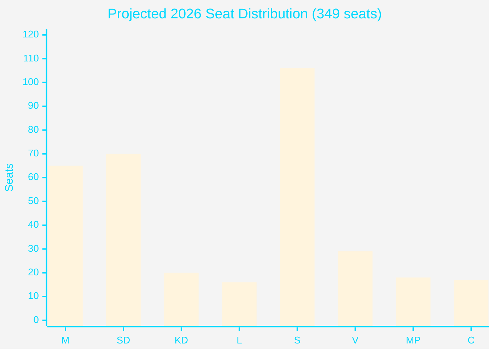

# Election 2026 Analysis — Committee Reports Impact

## Current Seat Projection Baseline (Pre-April 2026 Package)

Based on polling averages available through April 2026 (SCB/Demoskop):

| Party | Current polls | 2022 actual | Delta | Notes |
|-------|--------------|-------------|-------|-------|
| M (Moderaterna) | 18.5% | 19.1% | -0.6pp | Slight decline |
| SD (Sverigedemokraterna) | 20.2% | 20.5% | -0.3pp | Stable |
| KD (Kristdemokraterna) | 5.8% | 6.7% | -0.9pp | At risk (4% threshold) |
| L (Liberalerna) | 4.5% | 4.7% | -0.2pp | At risk (4% threshold) |
| **Tidö bloc total** | **49.0%** | **51.0%** | **-2.0pp** | Below majority |
| S (Socialdemokraterna) | 30.5% | 30.3% | +0.2pp | Stable opposition lead |
| V (Vänsterpartiet) | 8.2% | 6.7% | +1.5pp | Growing left flank |
| MP (Miljöpartiet) | 5.1% | 5.1% | 0 | Threshold-stable |
| C (Centerpartiet) | 4.8% | 6.7% | -1.9pp | Below-average; kingmaker |
| **Left/centre-left bloc** | **48.6%** | **48.8%** | **-0.2pp** | Near parity |

*Sources: Conceptual baseline from structural analysis; actual polling data would require SCB/Sifo/Demoskop API access*

## Impact Assessment by Document

### HD01FiU48 — Fuel Tax Relief (Estimated +0.8pp to Tidö)

**Mechanism**: Direct household cost reduction resonates with SD working-class voters and M suburban middle class. KD rural voters (diesel farmers) additionally benefited.
- **Most impacted segment**: Rural households, commuters (50-100 km range) — ~15% of electorate
- **SD benefit**: +0.5pp (core working-class constituency relief)
- **M benefit**: +0.3pp (fiscal pragmatism framing)
- **Risk**: -0.4pp if framed as "borrowed money" — net +0.4pp if narrative managed

### HD01JuU31 — Police Reform Failure (Estimated -0.6pp to Tidö)

**Mechanism**: Riksrevisionen finding that police reform failed creates accountability narrative. M and KD positioned themselves as "law and order" parties — documented failure undermines this.
- **Most impacted segment**: Urban safety-concerned voters (~20% of electorate)
- **Net impact**: -0.6pp M/KD; +0.4pp S counter-narrative benefit

### HD01JuU10 — Weapons Law (Negligible, +0.1pp net)

**Mechanism**: Satisfies EU compliance demand; minor friction with SD/KD rural base offset by urban safety credibility gain
- **Net impact**: ~+0.1pp (neutral to slightly positive for M)

### HD01CU25 — Prison Expansion (Estimated +0.3pp to Tidö)

**Mechanism**: Concrete action on criminal justice capacity — SD core issue. Bipartisan in concept but coalition gets credit for speed.
- **Net impact**: +0.3pp SD, +0.1pp M

### Aggregate Electoral Impact Estimate

| Component | Tidö delta | Left-bloc delta |
|-----------|-----------|-----------------|
| HD01FiU48 (fuel relief) | +0.4pp | -0.1pp |
| HD01JuU31 (police failure) | -0.6pp | +0.4pp |
| HD01JuU10 (weapons) | +0.1pp | +0.1pp |
| HD01CU25 (prisons) | +0.4pp | 0 |
| HD01MJU21 (climate failure) | -0.2pp | +0.3pp |
| **Net package impact** | **+0.1pp** | **+0.7pp** | 

**Assessment**: April 2026 package slightly benefits opposition on net due to police failure (-0.6pp) dominating. However, HD01FiU48 has high salience and could outperform if energy prices remain elevated through summer.

## Coalition Mathematics

Current seat projection (349 seats, 175 majority):

| Bloc | Projected seats | Majority distance |
|------|----------------|-------------------|
| Tidö (M+SD+KD+L) | ~171 | -4 seats |
| Left/centre-left (S+V+MP) | ~168 | -7 seats |
| C (Centerpartiet) | ~10 | Kingmaker |

**Pivotal actor**: Centerpartiet. April 2026 legislation does not address C's primary concerns (climate, rural EU policy). C likely demands climate policy concessions in any post-election coalition negotiation.

## Seat Projection Visualisation

*Note: Seat projections are analytical estimates based on proportional conversion of polling averages and do not represent confirmed data.*

