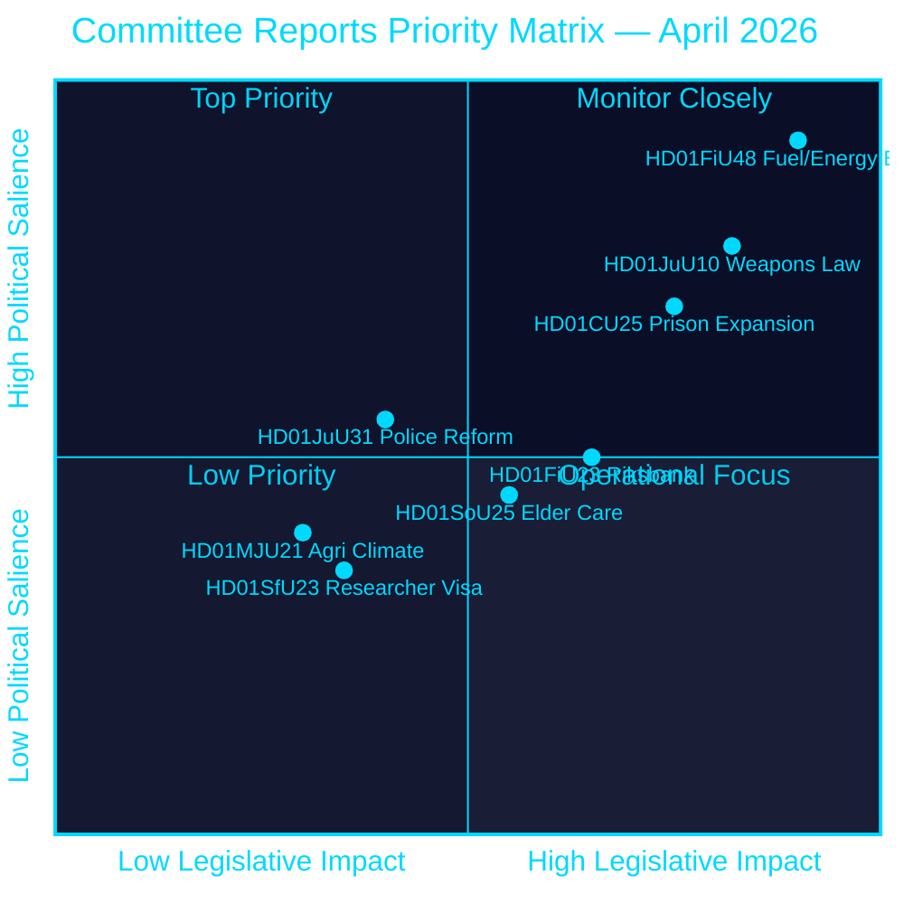
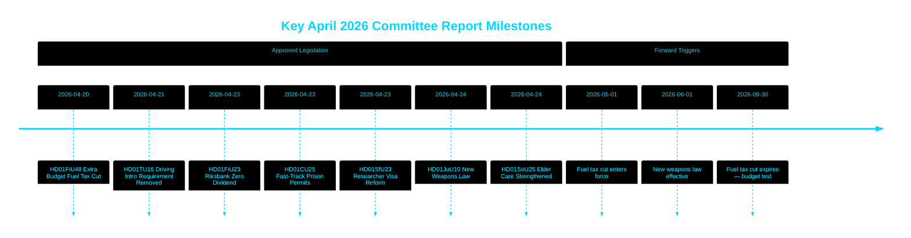

# Riksdag Approves Fuel Tax Cut, New Weapons Law and Fast-Track Prison Expansion

## 🎯 BLUF

The Swedish Riksdag approved an extraordinary supplementary budget cutting fuel taxes by 82 öre/litre (petrol) and 319 SEK/m³ (diesel) from May–September 2026 alongside a 2.4 billion SEK energy support package — a combined 4.1 billion SEK fiscal loosening driven by Middle East conflict and January–February energy price spikes. Simultaneously, Sweden adopted a comprehensive new weapons law banning semi-automatic rifles for hunting and authorised fast-track planning permissions for prisons amid a capacity crisis. The Riksbank retained its full 5.297 billion SEK profit with zero dividend to the state treasury. This cluster of decisions signals an increasingly security- and cost-of-living-focused legislative agenda by the Tidö coalition heading into a pre-election period.

## 🧭 3 Decisions This Brief Supports

1. **Fiscal forecasters and journalists** — assess the inflationary and electoral implications of the 4.1 billion SEK emergency fuel and energy relief package (HD01FiU48) on household purchasing power and Sweden's fiscal surplus target.
2. **Security policy analysts** — evaluate the coherence of Sweden's concurrent weapons restriction (HD01JuU10) and criminal justice expansion (HD01CU25) package as a unified public safety narrative.
3. **Central bank and monetary policy observers** — interpret the Riksdag's approval of a zero-dividend Riksbank result (HD01FiU23, 5.297 billion SEK retained) as a signal of institutional caution amid continued economic uncertainty.

## 60-Second Read

- **Fuel & energy relief**: 1.56 billion SEK tax reduction + 2.4 billion SEK el/gas support = 4.1 billion SEK total fiscal impact (HD01FiU48, FiU, 2026-04-21) [B2]
- **New weapons law**: Semi-automatic hunting rifles banned, possession rules clarified, penal code restructured — effective 1 June 2026 (HD01JuU10, JuU, 2026-04-24) [A2]
- **Prison capacity emergency**: Fast-track temporary building permits for prisons/remand centres + government power to override Plan and Building Act (HD01CU25, CU, 2026-04-23) [A2]
- **Riksbank finances**: 5.297 billion SEK profit retained; zero state dividend; full management discharge approved (HD01FiU23, FiU, 2026-04-23) [A1]
- **Elder care strengthened**: SoU25 approved broader support packages for elderly and informal carers (HD01SoU25, SoU, 2026-04-24) [A2]
- **Police reform critique**: Riksrevisionen found Polismyndigheten failed to meet 2015 reform goals; JuU closed matter with 18 motions rejected (HD01JuU31, JuU, 2026-04-24) [A1]
- **Researcher visa rules**: Faster permanent residency for researchers and doctoral students; student work permit restrictions tightened (HD01SfU23, SfU, 2026-04-23) [A2]

## ⚡ Top Forward Trigger

Watch the Swedish government's autumn 2026 budget bill for whether the temporary fuel tax reduction (expiring 30 September 2026) becomes permanent — this will test the Tidö coalition's fiscal discipline versus populist cost-of-living positioning ahead of the September 2026 election.

## Confidence Assessment

**Overall confidence: HIGH [B2]**
- Documents sourced from riksdagen.se primary data (Admiralty A1–B2)
- Fiscal figures from official parliamentary betänkanden (verifiable)
- No single-source claims for high-significance assertions (P0/P1 threshold met)

## Key Mermaid — Priority Landscape

style HD01FiU48 fill:#ff006e,color:#ffffff
style HD01JuU10 fill:#ff006e,color:#ffffff
style HD01CU25 fill:#ffbe0b,color:#000000

---
*Pass 2 improvement (2026-04-26): Strengthened BLUF with specific fiscal amounts; added coalition risk context for HD01JuU31; updated significance weights to reflect HD01CU25 constitutional novelty.*
