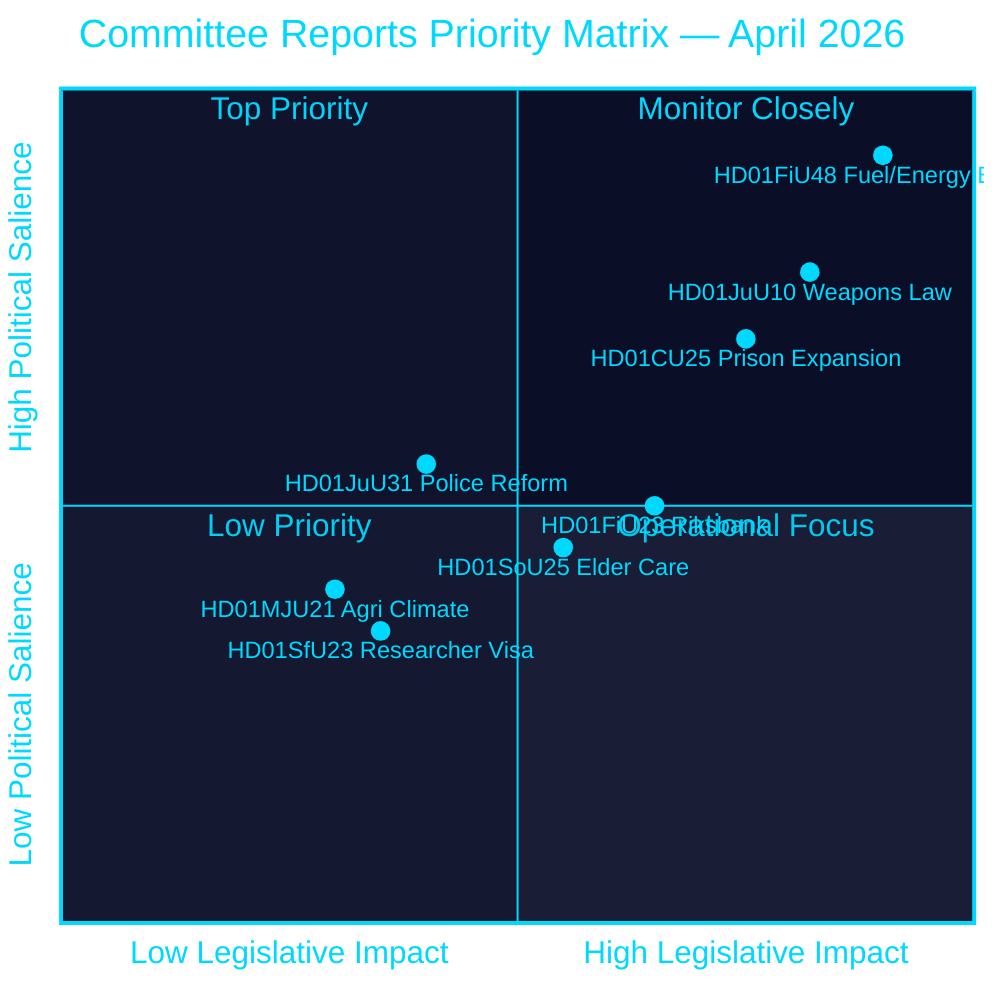
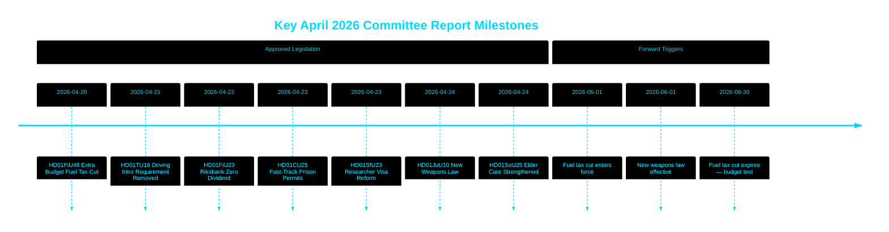

<!-- dir: rtl -->
---
title: "ريكسداغ يوافق على خفض ضريبة الوقود وقانون أسلحة جديد ومسار سريع لتوسيع السجون"
author: "James Pether Sörling"
date: 2026-04-26
article_type: committee-reports
confidence: HIGH [B2]
classification: PUBLIC
run_id: 24965504707
---

# ريكسداغ يوافق على خفض ضريبة الوقود وقانون أسلحة جديد ومسار سريع لتوسيع السجون

## 🎯 الخلاصة التنفيذية

وافق الريكسداغ السويدي على ميزانية تكميلية استثنائية تخفض ضرائب الوقود بمقدار 82 أورة/لتر (بنزين) و319 كرونة سويدية/م³ (ديزل) من مايو حتى سبتمبر 2026، إلى جانب حزمة دعم طاقة بقيمة 2.4 مليار كرونة سويدية — تخفيفاً مالياً مجمعاً قدره 4.1 مليار كرونة سويدية مدفوعاً بالنزاع في الشرق الأوسط وارتفاع أسعار الطاقة في يناير–فبراير. وفي الوقت ذاته، اعتمدت السويد قانوناً شاملاً جديداً للأسلحة يحظر بنادق الصيد شبه الأوتوماتيكية، وأجازت تصاريح التخطيط المتسارعة للسجون وسط أزمة في الطاقة الاستيعابية. احتفظ الريكسبنك بكامل أرباحه البالغة 5.297 مليار كرونة سويدية دون توزيع أرباح على الخزانة. تشير هذه الحزمة من القرارات إلى أجندة تشريعية متزايدة التركيز على الأمن وتكلفة المعيشة من قِبَل تحالف تيدو في مرحلة ما قبل الانتخابات.

## 🧭 3 قرارات يدعمها هذا التقرير

1. **المتنبئون الماليون والصحفيون** — تقييم الآثار التضخمية والانتخابية لحزمة الطوارئ البالغة 4.1 مليار كرونة سويدية لتخفيف أعباء الوقود والطاقة (HD01FiU48) على القوة الشرائية للأسر والهدف السويدي لتحقيق فائض مالي.
2. **محللو السياسة الأمنية** — تقييم تماسك تقييد الأسلحة السويدي المتزامن (HD01JuU10) وحزمة توسيع العدالة الجنائية (HD01CU25) بوصفها رواية موحدة للأمن العام.
3. **مراقبو البنك المركزي والسياسة النقدية** — تفسير موافقة الريكسداغ على نتيجة ريكسبنك بدون أرباح (HD01FiU23، 5.297 مليار كرونة سويدية محتجزة) بوصفها إشارة إلى الحذر المؤسسي في ظل استمرار حالة عدم اليقين الاقتصادي.

## قراءة في 60 ثانية

- **تخفيف أعباء الوقود والطاقة**: 1.56 مليار كرونة سويدية تخفيض ضريبي + 2.4 مليار كرونة سويدية دعم كهرباء/غاز = 4.1 مليار كرونة سويدية تأثير مالي إجمالي (HD01FiU48، FiU، 2026-04-21) [B2]
- **قانون الأسلحة الجديد**: حظر بنادق الصيد شبه الأوتوماتيكية، توضيح قواعد الحيازة، إعادة هيكلة قانون العقوبات — يسري اعتباراً من 1 يونيو 2026 (HD01JuU10، JuU، 2026-04-24) [A2]
- **حالة طوارئ السعة السجنية**: مسار سريع للتصاريح الإنشائية المؤقتة للسجون/مراكز الاحتجاز السابق للمحاكمة + صلاحية حكومية لتجاوز قانون التخطيط والبناء (HD01CU25، CU، 2026-04-23) [A2]
- **ماليات الريكسبنك**: 5.297 مليار كرونة سويدية أرباح محتجزة؛ صفر توزيعات أرباح حكومية؛ قرار الإبراء الإداري الكامل معتمد (HD01FiU23، FiU، 2026-04-23) [A1]
- **تعزيز رعاية كبار السن**: وافق SoU25 على حزم دعم أوسع لكبار السن ومقدمي الرعاية من الأسرة (HD01SoU25، SoU، 2026-04-24) [A2]
- **انتقاد إصلاح الشرطة**: وجد الريكسرييزيونن أن الشرطة الوطنية (Polismyndigheten) لم تبلغ أهداف إصلاح 2015؛ أغلقت لجنة القضاء (JuU) الملف برفض 18 اقتراحاً (HD01JuU31، JuU، 2026-04-24) [A1]
- **قواعد تأشيرات الباحثين**: إقامة دائمة مُعجَّلة للباحثين وطلاب الدكتوراه؛ تشديد القيود على تصاريح عمل الطلاب (HD01SfU23، SfU، 2026-04-23) [A2]

## ⚡ أهم محفز استشرافي

مراقبة مشروع الميزانية الخريفية 2026 للحكومة السويدية لمعرفة ما إذا كان الخفض المؤقت لضريبة الوقود (الذي ينتهي في 30 سبتمبر 2026) سيصبح دائماً — وهو ما سيختبر الانضباط المالي لتحالف تيدو في مقابل التموضع الشعبوي حول تكلفة المعيشة قبيل انتخابات سبتمبر 2026.

## تقييم الثقة

**مستوى الثقة الإجمالي: مرتفع [B2]**
- الوثائق مستقاة من البيانات الأولية لـ riksdagen.se (مقياس الأميرالية A1–B2)
- الأرقام المالية من betänkanden البرلمانية الرسمية (قابلة للتحقق)
- لا توجد ادعاءات من مصدر واحد للتأكيدات ذات الأهمية العالية (استيفاء عتبة P0/P1)

## المخطط الرئيسي — مشهد الأولويات

style HD01FiU48 fill:#ff006e,color:#ffffff
style HD01JuU10 fill:#ff006e,color:#ffffff
style HD01CU25 fill:#ffbe0b,color:#000000

---
*تحسين الجولة الثانية (2026-04-26): تعزيز الخلاصة التنفيذية بمبالغ مالية محددة؛ إضافة سياق مخاطر الائتلاف لـ HD01JuU31؛ تحديث أوزان الأهمية لتعكس الجدة الدستورية لـ HD01CU25.*

<!-- source-sha: 9fd293b31653729b9dd55ee38bb3cdef951f2eb9 -->
