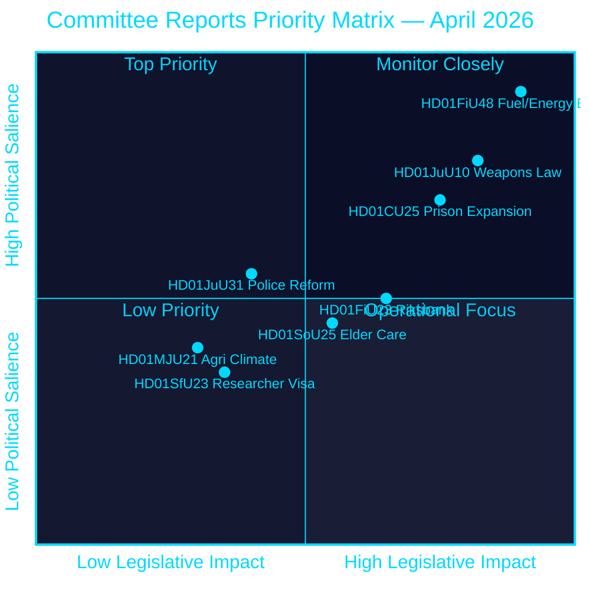
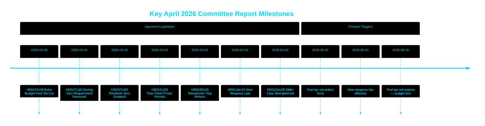

# Riksdag godkender brændstofskattenedsættelse, ny våbenlov og hurtigspor for fængselsudvidelse

## 🎯 BLUF

Den svenske Riksdag godkendte et ekstraordinært tillægsbudget, der skærer brændstofafgifter med 82 øre/liter (benzin) og 319 SEK/m³ (diesel) fra maj–september 2026 sammen med en energistøttepakke på 2,4 mia. SEK — en samlet finanspolitisk lempelse på 4,1 mia. SEK drevet af Mellemøsten-konflikten og energiprisstigning i januar–februar. Samtidig vedtog Sverige en omfattende ny våbenlov, der forbyder halvautomatiske rifler til jagt, og bemyndigede hurtigsporstilladelser til fængsler midt i en kapacitetskrise. Riksbanken beholdt sit fulde overskud på 5,297 mia. SEK med nulududbytte til statskassen. Denne beslutningsklynge signalerer en stadig mere sikkerheds- og leveomkostningsfokuseret lovgivningsdagsorden fra Tidö-koalitionen op til en førvalgperiode.

## 🧭 3 beslutninger dette PM understøtter

1. **Finansielle prognostikere og journalister** — vurder de inflationsmæssige og valgrelaterede implikationer af nødpakken på 4,1 mia. SEK til brændstof og energilempelse (HD01FiU48) for husholdningernes købekraft og Sveriges finanspolitiske overskudsmål.
2. **Sikkerhedspolitiske analytikere** — evaluer sammenhængen i Sveriges samtidige våbenbegrænsning (HD01JuU10) og strafferetlige udvidelsespakke (HD01CU25) som en samlet fortælling om offentlig sikkerhed.
3. **Centralbank- og pengepolitiske observatører** — fortolk Riksdagens godkendelse af et nulududbytte-Riksbank-resultat (HD01FiU23, 5,297 mia. SEK tilbageholdt) som et signal om institutionel forsigtighed midt i fortsatt økonomisk usikkerhed.

## 60-sekunders læsning

- **Brændstof- og energilempelse**: 1,56 mia. SEK skattelettelse + 2,4 mia. SEK el/gasstøtte = 4,1 mia. SEK samlet finanspolitisk virkning (HD01FiU48, FiU, 2026-04-21) [B2]
- **Ny våbenlov**: Halvautomatiske jagt rifler forbudt, besiddelsesregler præciseret, straffelov omstruktureret — træder i kraft 1. juni 2026 (HD01JuU10, JuU, 2026-04-24) [A2]
- **Fængselskapacitetsnødsituation**: Hurtigspor for midlertidige bygningstilladelser til fængsler/varetægtsfængsler + regjeringens beføjelse til at tilsidesætte plan- og byggeloven (HD01CU25, CU, 2026-04-23) [A2]
- **Riksbankens økonomi**: 5,297 mia. SEK overskud tilbageholdt; nul statsudbytte; fuld bestyrelsesansvarsbeslutning godkendt (HD01FiU23, FiU, 2026-04-23) [A1]
- **Ældrepleje styrket**: SoU25 godkendte bredere støttepakker til ældre og pårørendeplejer (HD01SoU25, SoU, 2026-04-24) [A2]
- **Politireformkritik**: Riksrevisionen fandt, at Polismyndigheten ikke nåede 2015-reformens mål; JuU lukkede sagen med 18 afviste motioner (HD01JuU31, JuU, 2026-04-24) [A1]
- **Forskervisumregler**: Hurtigere permanent opholdstilladelse for forskere og ph.d.-studerende; begrænsninger for studerendes arbejdstilladelse strammes (HD01SfU23, SfU, 2026-04-23) [A2]

## ⚡ Vigtigste fremadrettede udløsende faktor

Følg den svenske regerings efterårsbudgetproposition 2026 for at se, om den midlertidige brændstofskattenedsættelse (udløber 30. september 2026) gøres permanent — dette tester Tidö-koalitionens finansdisciplin over for populistisk leveomkostningspositionering op til valget i september 2026.

## Konfidensvurdering

**Samlet konfidensgrad: HØJ [B2]**
- Dokumenter hentet fra riksdagen.se primærdata (Admiralty A1–B2)
- Regnskabstal fra officielle parlamentariske betænkninger (verificerbare)
- Ingen enkeltkildeafgørelser for påstande med høj signifikans (P0/P1-tærskel opfyldt)

## Nøglediagram — prioritetslandskab

style HD01FiU48 fill:#ff006e,color:#ffffff
style HD01JuU10 fill:#ff006e,color:#ffffff
style HD01CU25 fill:#ffbe0b,color:#000000

---
*Pass 2-forbedring (2026-04-26): Styrket BLUF med specifikke regnskabsbeløb; tilføjet koalitionsrisikokontekst for HD01JuU31; opdaterede signifikansvægte for at afspejle HD01CU25 konstitutionelle nyhed.*

<!-- source-sha: 9fd293b31653729b9dd55ee38bb3cdef951f2eb9 -->
