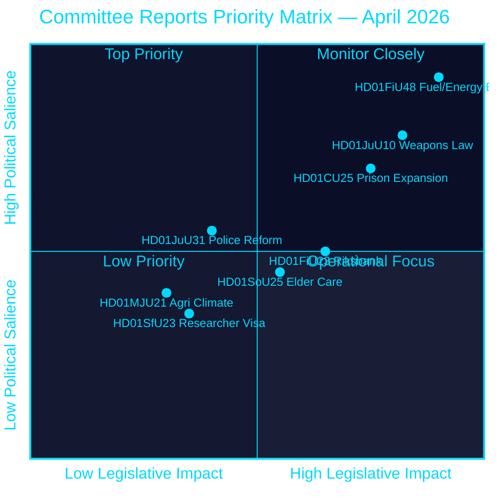
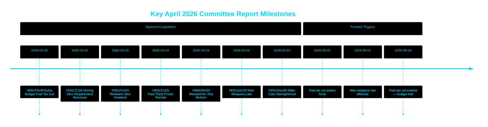

# Riksdag billigt Kraftstoffsteuersenkung, neues Waffengesetz und Schnellspur für Gefängnisausbau

## 🎯 BLUF

Der schwedische Riksdag bewilligte einen außerordentlichen Nachtragshaushalt, der die Kraftstoffsteuer um 82 Öre/Liter (Benzin) und 319 SEK/m³ (Diesel) von Mai bis September 2026 senkt, zusammen mit einem Energieunterstützungspaket von 2,4 Mrd. SEK — eine kombinierte fiskalische Entlastung von 4,1 Mrd. SEK, angetrieben durch den Nahost-Konflikt und die Energiepreisanstiege im Januar–Februar. Gleichzeitig verabschiedete Schweden ein umfassendes neues Waffengesetz, das halbautomatische Jagdgewehre verbietet, und erteilte Schnellspurgenehmigungen für Gefängnisse inmitten einer Kapazitätskrise. Die Riksbank behielt ihren vollen Gewinn von 5,297 Mrd. SEK mit null Dividende an den Staatshaushalt. Dieses Entscheidungsbündel signalisiert eine zunehmend sicherheits- und lebenshaltungskostenfokussierte Gesetzgebungsagenda der Tidö-Koalition im Vorfeld der Vorwahlperiode.

## 🧭 3 Entscheidungen, die dieses PM unterstützt

1. **Finanzielle Prognostiker und Journalisten** — beurteilen Sie die inflationären und wahlbezogenen Implikationen des Notfallpakets von 4,1 Mrd. SEK für Kraftstoff und Energieentlastung (HD01FiU48) auf die Kaufkraft der Haushalte und Schwedens fiskalisches Überschussziel.
2. **Sicherheitspolitische Analysten** — bewerten Sie die Kohärenz von Schwedens gleichzeitiger Waffenbeschränkung (HD01JuU10) und dem strafrechtlichen Erweiterungspaket (HD01CU25) als einheitliche öffentliche Sicherheitserzählung.
3. **Zentralbank- und geldpolitische Beobachter** — interpretieren Sie die Genehmigung des Riksdag für ein nulldividende Riksbank-Ergebnis (HD01FiU23, 5,297 Mrd. SEK einbehalten) als Signal institutioneller Vorsicht inmitten anhaltender wirtschaftlicher Unsicherheit.

## 60-Sekunden-Lektüre

- **Kraftstoff- und Energieentlastung**: 1,56 Mrd. SEK Steuersenkung + 2,4 Mrd. SEK Strom-/Gasunterstützung = 4,1 Mrd. SEK fiskalische Gesamtwirkung (HD01FiU48, FiU, 2026-04-21) [B2]
- **Neues Waffengesetz**: Halbautomatische Jagdgewehre verboten, Besitzregeln klargestellt, Strafgesetzbuch umstrukturiert — in Kraft ab 1. Juni 2026 (HD01JuU10, JuU, 2026-04-24) [A2]
- **Gefängniskapazitätsnotstand**: Schnellspur für vorübergehende Baugenehmigungen für Gefängnisse/Untersuchungshafthäuser + Regierungsbefugnis zur Außerkraftsetzung des Bau- und Planungsgesetzes (HD01CU25, CU, 2026-04-23) [A2]
- **Riksbank-Finanzen**: 5,297 Mrd. SEK Gewinn einbehalten; null Staatsdividende; vollständige Verwaltungsentlastungsentscheidung genehmigt (HD01FiU23, FiU, 2026-04-23) [A1]
- **Altenpflege gestärkt**: SoU25 genehmigte breitere Unterstützungspakete für ältere Menschen und pflegende Angehörige (HD01SoU25, SoU, 2026-04-24) [A2]
- **Polizeireformkritik**: Riksrevisionen stellte fest, dass die Polismyndigheten die Ziele der Reform von 2015 nicht erreicht hat; JuU schloss die Angelegenheit mit 18 abgelehnten Motionen (HD01JuU31, JuU, 2026-04-24) [A1]
- **Forschervisumregeln**: Schnelleres dauerhaftes Aufenthaltsrecht für Forscher und Doktoranden; Beschränkungen für Studentenarbeitsgenehmigungen werden verschärft (HD01SfU23, SfU, 2026-04-23) [A2]

## ⚡ Wichtigster vorausschauender Auslöser

Beobachten Sie den schwedischen Regierungshaushalt für den Herbst 2026, ob die vorübergehende Kraftstoffsteuersenkung (läuft am 30. September 2026 aus) dauerhaft wird — dies testet die Haushaltsdisziplin der Tidö-Koalition gegenüber populistischer Lebenshaltungskostenpositionierung vor der Wahl im September 2026.

## Vertrauensbewertung

**Gesamtvertrauensgrad: HOCH [B2]**
- Dokumente aus riksdagen.se-Primärdaten bezogen (Admiralty A1–B2)
- Finanzzahlen aus offiziellen parlamentarischen Ausschussberichten (verifizierbar)
- Keine Einzelquellenentscheidungen für Aussagen mit hoher Bedeutung (P0/P1-Schwelle erfüllt)

## Schlüsseldiagramm — Prioritätslandschaft

style HD01FiU48 fill:#ff006e,color:#ffffff
style HD01JuU10 fill:#ff006e,color:#ffffff
style HD01CU25 fill:#ffbe0b,color:#000000

---
*Pass-2-Verbesserung (2026-04-26): BLUF mit spezifischen Finanzzahlen gestärkt; Koalitionsrisikokontekt für HD01JuU31 hinzugefügt; Bedeutungsgewichte aktualisiert, um die verfassungsrechtliche Neuheit von HD01CU25 widerzuspiegeln.*

<!-- source-sha: 9fd293b31653729b9dd55ee38bb3cdef951f2eb9 -->
