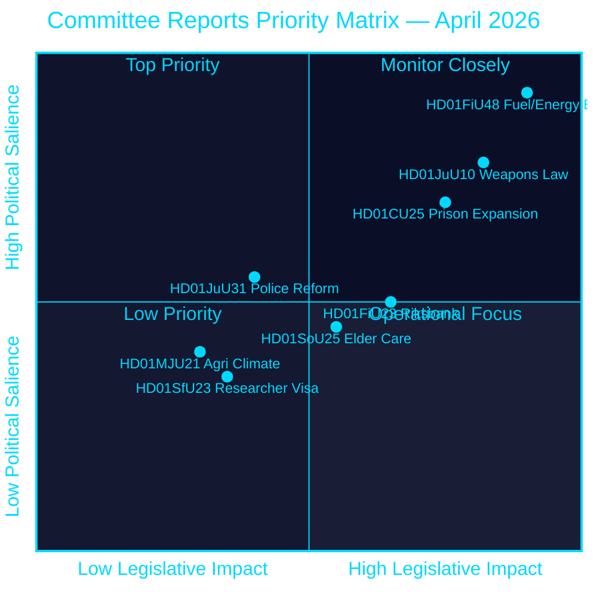
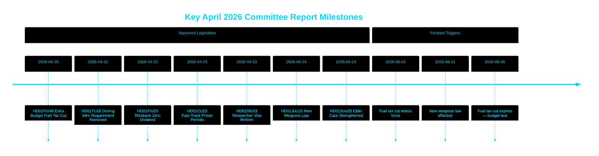

# El Riksdag aprueba el recorte fiscal al combustible, una nueva ley de armas y la vía rápida para la expansión de prisiones

## 🎯 BLUF

El Riksdag sueco aprobó un presupuesto suplementario extraordinario que recorta los impuestos sobre el combustible en 82 öre/litro (gasolina) y 319 SEK/m³ (diésel) de mayo a septiembre de 2026, junto con un paquete de apoyo energético de 2.400 millones de SEK — un relajamiento fiscal combinado de 4.100 millones de SEK impulsado por el conflicto en Oriente Medio y los picos de precios energéticos de enero–febrero. Simultáneamente, Suecia adoptó una nueva ley integral de armas que prohíbe los rifles de caza semiautomáticos y autorizó permisos de planificación rápidos para prisiones en medio de una crisis de capacidad. El Riksbank retuvo la totalidad de su beneficio de 5.297 millones de SEK con dividendo cero al Tesoro. Este conjunto de decisiones señala una agenda legislativa cada vez más centrada en la seguridad y el coste de la vida por parte de la coalición Tidö de cara a un período preelectoral.

## 🧭 3 decisiones que apoya este informe

1. **Pronosticadores financieros y periodistas** — evaluar las implicaciones inflacionarias y electorales del paquete de emergencia de 4.100 millones de SEK para el alivio de combustible y energía (HD01FiU48) sobre el poder adquisitivo de los hogares y el objetivo de superávit fiscal de Suecia.
2. **Analistas de política de seguridad** — evaluar la coherencia de la simultánea restricción de armas en Suecia (HD01JuU10) y el paquete de expansión de justicia penal (HD01CU25) como una narrativa unificada de seguridad pública.
3. **Observadores de banca central y política monetaria** — interpretar la aprobación del Riksdag de un resultado Riksbank con dividendo cero (HD01FiU23, 5.297 millones de SEK retenidos) como una señal de cautela institucional en medio de la persistente incertidumbre económica.

## Lectura en 60 segundos

- **Alivio de combustible y energía**: 1.560 millones de SEK reducción fiscal + 2.400 millones de SEK ayuda electricidad/gas = 4.100 millones de SEK impacto fiscal total (HD01FiU48, FiU, 2026-04-21) [B2]
- **Nueva ley de armas**: Rifles de caza semiautomáticos prohibidos, normas de posesión aclaradas, código penal reestructurado — vigente desde el 1 de junio de 2026 (HD01JuU10, JuU, 2026-04-24) [A2]
- **Emergencia de capacidad penitenciaria**: Vía rápida para permisos de construcción temporal para prisiones/centros de prisión preventiva + potestad gubernamental para anular la Ley de Planificación y Construcción (HD01CU25, CU, 2026-04-23) [A2]
- **Finanzas del Riksbank**: 5.297 millones de SEK de beneficio retenido; dividendo estatal cero; decisión de descargo de gestión completa aprobada (HD01FiU23, FiU, 2026-04-23) [A1]
- **Atención a personas mayores reforzada**: SoU25 aprobó paquetes de apoyo más amplios para personas mayores y cuidadores informales (HD01SoU25, SoU, 2026-04-24) [A2]
- **Crítica de la reforma policial**: El Riksrevisionen halló que la Polismyndigheten no había alcanzado los objetivos de la reforma de 2015; JuU cerró el asunto con 18 mociones rechazadas (HD01JuU31, JuU, 2026-04-24) [A1]
- **Normas de visado para investigadores**: Residencia permanente acelerada para investigadores y doctorandos; restricciones para permisos de trabajo de estudiantes se endurecen (HD01SfU23, SfU, 2026-04-23) [A2]

## ⚡ Principal factor desencadenante prospectivo

Observar el proyecto de ley de presupuestos de otoño de 2026 del gobierno sueco para ver si la reducción temporal del impuesto sobre el combustible (que expira el 30 de septiembre de 2026) se convierte en permanente — esto pondrá a prueba la disciplina fiscal de la coalición Tidö frente al posicionamiento populista sobre el coste de la vida de cara a las elecciones de septiembre de 2026.

## Evaluación de confianza

**Confianza general: ALTA [B2]**
- Documentos obtenidos de los datos primarios de riksdagen.se (Admiralty A1–B2)
- Cifras fiscales de betänkanden parlamentarios oficiales (verificables)
- No hay afirmaciones de fuente única para aserciones de alta significación (umbral P0/P1 cumplido)

## Diagrama clave — panorama de prioridades

style HD01FiU48 fill:#ff006e,color:#ffffff
style HD01JuU10 fill:#ff006e,color:#ffffff
style HD01CU25 fill:#ffbe0b,color:#000000

---
*Mejora del Paso 2 (2026-04-26): BLUF reforzado con importes fiscales específicos; contexto de riesgo para la coalición añadido para HD01JuU31; ponderaciones de significación actualizadas para reflejar la novedad constitucional de HD01CU25.*

<!-- source-sha: 9fd293b31653729b9dd55ee38bb3cdef951f2eb9 -->
