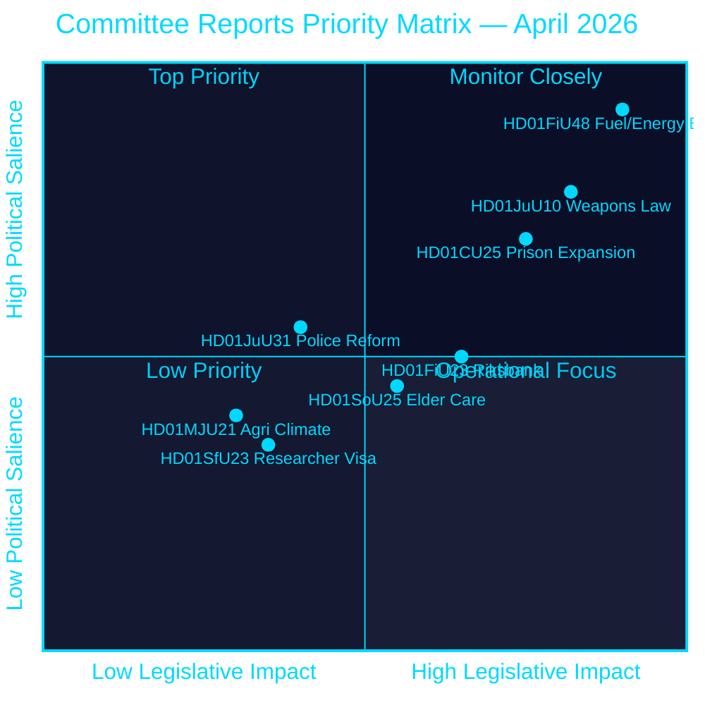
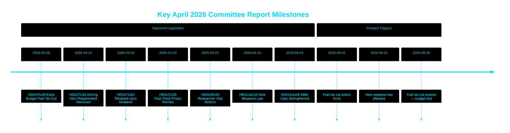

# Riksdag hyväksyy polttoaineveroleikkauksen, uuden aselain ja pikakaistaohjelman vankiloiden laajentamiselle

## 🎯 BLUF

Ruotsin Riksdag hyväksyi ylimääräisen lisätalousarvion, joka alentaa polttoaineveroja 82 äyriä/litra (bensiini) ja 319 SEK/m³ (diesel) toukokuusta syyskuuhun 2026, sekä 2,4 miljardin SEK energiatukipaketin — yhteensä 4,1 miljardin SEK finanssipoliittinen kevennys, jonka taustalla ovat Lähi-idän konflikti ja tammi–helmikuun energiahintojen nousu. Samalla Ruotsi hyväksyi kattavan uuden aselain, joka kieltää puoliautomaattiset metsästyskiväärit, ja valtuutti pikakaista-rakennusluvat vankiloille kapasiteettikriisin keskellä. Riksbank pidätti koko 5,297 miljardin SEK voittonsa ilman osinkoa valtiovarainministeriölle. Tämä päätösklusteri viestii yhä enemmän turvallisuus- ja elinkustannuslähtöisestä lainsäädäntöagendasta Tidö-koalitiolta ennen vaalijaksoa.

## 🧭 3 päätöstä, joita tämä tiedote tukee

1. **Taloudelliset ennustajat ja toimittajat** — arvioi 4,1 miljardin SEK hätäpaketin (HD01FiU48) inflaatio- ja vaali-implikaatioita kotitalouksien ostovoimalle ja Ruotsin finanssipoliittiselle ylijäämätavoitteelle.
2. **Turvallisuuspoliittiset analyytikot** — arvioi Ruotsin samanaikaisen aseen rajoittamisen (HD01JuU10) ja rikosasioiden laajentamispaketin (HD01CU25) koherenssia yhtenäisenä yleisen turvallisuuden narratiivina.
3. **Keskuspankki- ja rahapolitiikan tarkkailijat** — tulkitse Riksdagin hyväksyntä nollaosinko-Riksbank-tulokselle (HD01FiU23, 5,297 miljardia SEK pidätetty) institutionaalisen varovaisuuden merkkinä jatkuvan taloudellisen epävarmuuden keskellä.

## 60 sekunnin lukeminen

- **Polttoaine- ja energiahuojennus**: 1,56 miljardia SEK verohelpotus + 2,4 miljardia SEK sähkö/kaasutuki = 4,1 miljardia SEK kokonaisvaikutus (HD01FiU48, FiU, 2026-04-21) [B2]
- **Uusi aselaki**: Puoliautomaattiset metsästyskiväärit kielletty, hallussapitosäännöt selvennetty, rikoslaki uudelleen jäsennetty — voimaan 1. kesäkuuta 2026 (HD01JuU10, JuU, 2026-04-24) [A2]
- **Vankilakapasiteetin hätätilanne**: Pikakaista väliaikaisille rakennusluvalle vankiloille/tutkintovankeustiloille + hallituksen valtuudet ohittaa maankäyttö- ja rakennuslaki (HD01CU25, CU, 2026-04-23) [A2]
- **Riksbankin talous**: 5,297 miljardia SEK voitto pidätetty; nolla valtion osinkoa; täysi hallinnon vastuuvapauspäätös hyväksytty (HD01FiU23, FiU, 2026-04-23) [A1]
- **Vanhustenhoito vahvistettu**: SoU25 hyväksyi laajemmat tukipaketit ikääntyneille ja omaishoitajille (HD01SoU25, SoU, 2026-04-24) [A2]
- **Poliisiuudistuksen kritiikki**: Riksrevisionen havaitsi, että Polismyndigheten ei saavuttanut vuoden 2015 uudistuksen tavoitteita; JuU sulki asian 18 hylätyllä motiolla (HD01JuU31, JuU, 2026-04-24) [A1]
- **Tutkijaviisumisäännöt**: Nopeampi pysyvä oleskelulupa tutkijoille ja tohtorikoulutettaville; opiskelijoiden työlupien rajoituksia tiukennetaan (HD01SfU23, SfU, 2026-04-23) [A2]

## ⚡ Tärkein ennakoiva laukaiseva tekijä

Seuraa Ruotsin hallituksen syysbudjettiesitystä 2026, onko väliaikainen polttoaineverovähennys (päättyy 30. syyskuuta 2026) muuttumassa pysyväksi — tämä testaa Tidö-koalition finanssikuria populistista elinkustannusasettelua vastaan ennen syyskuun 2026 vaalia.

## Luottamusarviointi

**Kokonaisluottamusaste: KORKEA [B2]**
- Asiakirjat hankittu riksdagen.se-primääridatasta (Admiralty A1–B2)
- Talousluvut virallisista parlamentaarisista mietinnöistä (todennettavissa)
- Ei yksittäislähdepäätöksiä korkean merkittävyyden väittämille (P0/P1-kynnys täyttyy)

## Avainkaavio — prioriteettimaasto

style HD01FiU48 fill:#ff006e,color:#ffffff
style HD01JuU10 fill:#ff006e,color:#ffffff
style HD01CU25 fill:#ffbe0b,color:#000000

---
*Kierros 2 parannus (2026-04-26): Vahvistettu BLUF tietyillä talousarvoluvuilla; lisätty koalitioriskikonteksti HD01JuU31:lle; päivitetyt merkittävyyspainot heijastamaan HD01CU25 perustuslaillista uutuutta.*

<!-- source-sha: 9fd293b31653729b9dd55ee38bb3cdef951f2eb9 -->
