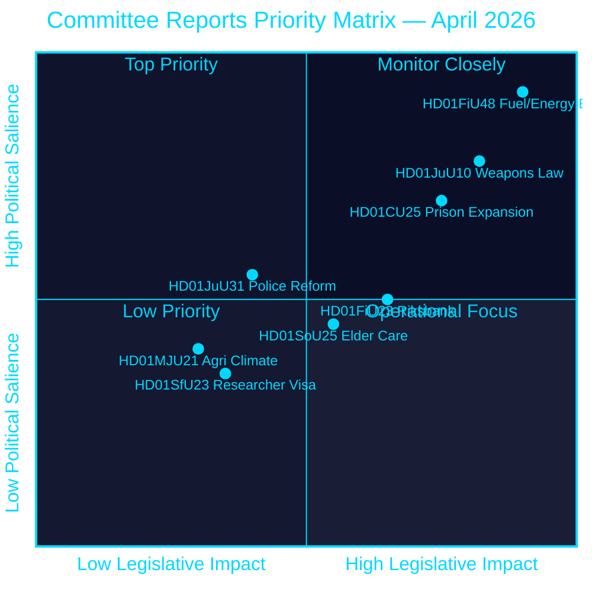
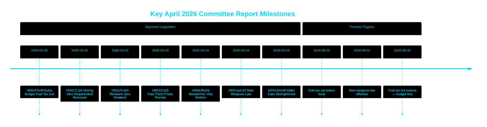

# Le Riksdag approuve la baisse de la taxe sur les carburants, une nouvelle loi sur les armes et la voie rapide pour l'expansion des prisons

## 🎯 BLUF

Le Riksdag suédois a approuvé un budget supplémentaire extraordinaire réduisant les taxes sur les carburants de 82 öre/litre (essence) et 319 SEK/m³ (diesel) de mai à septembre 2026, accompagné d'un package de soutien énergétique de 2,4 milliards de SEK — un assouplissement fiscal combiné de 4,1 milliards de SEK motivé par le conflit au Moyen-Orient et les pics de prix de l'énergie de janvier–février. Parallèlement, la Suède a adopté une nouvelle loi complète sur les armes interdisant les fusils de chasse semi-automatiques et autorisé des permis de planification accélérés pour les prisons au beau milieu d'une crise de capacité. La Riksbank a conservé l'intégralité de son bénéfice de 5,297 milliards de SEK sans dividende au Trésor. Cette grappe de décisions signale un agenda législatif de plus en plus axé sur la sécurité et le coût de la vie de la coalition Tidö à l'approche d'une période pré-électorale.

## 🧭 3 décisions que ce PM soutient

1. **Prévisionnistes financiers et journalistes** — évaluer les implications inflationnistes et électorales du package d'urgence de 4,1 milliards de SEK pour le carburant et l'allégement énergétique (HD01FiU48) sur le pouvoir d'achat des ménages et l'objectif d'excédent fiscal de la Suède.
2. **Analystes de politique de sécurité** — évaluer la cohérence de la restriction simultanée des armes en Suède (HD01JuU10) et du package d'expansion judiciaire pénale (HD01CU25) comme un récit de sécurité publique unifié.
3. **Observateurs de la banque centrale et de la politique monétaire** — interpréter l'approbation par le Riksdag d'un résultat Riksbank à dividende zéro (HD01FiU23, 5,297 milliards de SEK retenus) comme un signal de prudence institutionnelle dans un contexte d'incertitude économique persistante.

## Lecture en 60 secondes

- **Allégement sur les carburants et l'énergie**: 1,56 milliard de SEK de réduction fiscale + 2,4 milliards de SEK d'aide électricité/gaz = 4,1 milliards de SEK d'impact fiscal total (HD01FiU48, FiU, 2026-04-21) [B2]
- **Nouvelle loi sur les armes**: Fusils de chasse semi-automatiques interdits, règles de possession précisées, code pénal restructuré — entrée en vigueur le 1er juin 2026 (HD01JuU10, JuU, 2026-04-24) [A2]
- **Urgence de capacité pénitentiaire**: Voie rapide pour les permis de construction temporaires pour les prisons/centres de détention provisoire + pouvoir gouvernemental de déroger à la loi sur l'aménagement du territoire et la construction (HD01CU25, CU, 2026-04-23) [A2]
- **Finances de la Riksbank**: 5,297 milliards de SEK de bénéfice retenu ; dividende d'État nul ; décharge complète de la gestion approuvée (HD01FiU23, FiU, 2026-04-23) [A1]
- **Soins aux personnes âgées renforcés**: SoU25 a approuvé des packages de soutien plus larges pour les personnes âgées et les aidants informels (HD01SoU25, SoU, 2026-04-24) [A2]
- **Critique de la réforme policière**: Le Riksrevisionen a constaté que la Polismyndigheten n'avait pas atteint les objectifs de la réforme de 2015 ; JuU a clôturé l'affaire avec 18 motions rejetées (HD01JuU31, JuU, 2026-04-24) [A1]
- **Règles relatives aux visas pour chercheurs**: Résidence permanente accélérée pour les chercheurs et doctorants ; les restrictions sur les permis de travail pour étudiants se durcissent (HD01SfU23, SfU, 2026-04-23) [A2]

## ⚡ Principal déclencheur prospectif

Surveiller le projet de loi de finances d'automne 2026 du gouvernement suédois pour voir si la réduction temporaire de la taxe sur les carburants (expirant le 30 septembre 2026) devient permanente — cela testera la discipline budgétaire de la coalition Tidö face à un positionnement populiste sur le coût de la vie avant les élections de septembre 2026.

## Évaluation de confiance

**Confiance globale : ÉLEVÉE [B2]**
- Documents provenant des données primaires de riksdagen.se (Admiralty A1–B2)
- Chiffres fiscaux issus des betänkanden parlementaires officiels (vérifiables)
- Aucune affirmation provenant d'une source unique pour les assertions à haute signification (seuil P0/P1 atteint)

## Diagramme clé — paysage de priorités

style HD01FiU48 fill:#ff006e,color:#ffffff
style HD01JuU10 fill:#ff006e,color:#ffffff
style HD01CU25 fill:#ffbe0b,color:#000000

---
*Amélioration Pass 2 (2026-04-26) : BLUF renforcé avec des montants fiscaux spécifiques ; contexte de risque pour la coalition ajouté pour HD01JuU31 ; pondérations de signification mises à jour pour refléter la nouveauté constitutionnelle de HD01CU25.*

<!-- source-sha: 9fd293b31653729b9dd55ee38bb3cdef951f2eb9 -->
