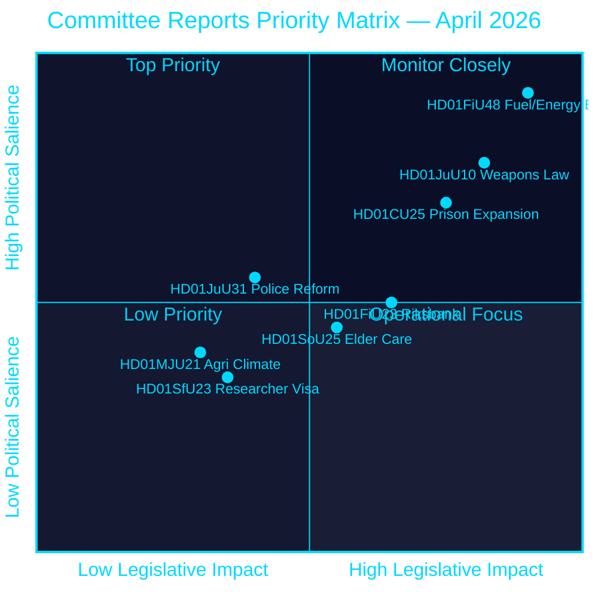
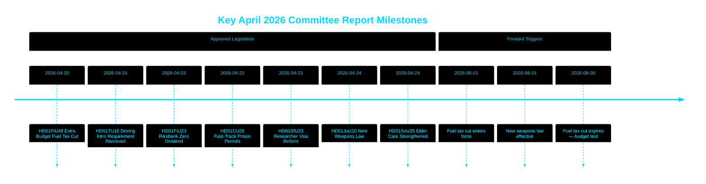

<!-- dir: rtl -->
---
title: "הריקסדאג מאשר קיצוץ במס דלק, חוק נשק חדש ומסלול מהיר להרחבת בתי הסוהר"
author: "James Pether Sörling"
date: 2026-04-26
article_type: committee-reports
confidence: HIGH [B2]
classification: PUBLIC
run_id: 24965504707
---

# הריקסדאג מאשר קיצוץ במס דלק, חוק נשק חדש ומסלול מהיר להרחבת בתי הסוהר

## 🎯 סיכום מנהלים

הריקסדאג השוודי אישר תקציב משלים יוצא דופן המקצץ את מסי הדלק ב-82 אורה/ליטר (בנזין) ו-319 SEK/מ"ק (דיזל) ממאי עד ספטמבר 2026, לצד חבילת תמיכה באנרגיה בהיקף 2.4 מיליארד SEK — הקלה פיסקלית משולבת של 4.1 מיליארד SEK הנובעת מסכסוך המזרח התיכון וקפיצות מחירי האנרגיה בינואר–פברואר. בו בזמן, אימצה שוודיה חוק נשק חדש ומקיף האוסר על רובי ציד חצי-אוטומטיים, והסמיכה היתרי תכנון מזורזים לבתי סוהר בעיצומה של משבר קיבולת. הריקסבנק שמר על כלל רווחיו — 5.297 מיליארד SEK — ללא דיווידנד לאוצר. מקבץ החלטות זה משדר אג'נדה חקיקתית המתמקדת יותר ויותר בביטחון ובעלות המחייה מטעם קואליציית טידו לקראת תקופת טרום-בחירות.

## 🧭 3 החלטות שתקציר זה תומך בהן

1. **חוזאים פיננסיים ועיתונאים** — הערכת ההשלכות האינפלציוניות והבחירתיות של חבילת החירום בהיקף 4.1 מיליארד SEK לסיוע בדלק ואנרגיה (HD01FiU48) על כוח הקנייה של משקי בית ועל יעד עודף הגירעון הפיסקלי של שוודיה.
2. **אנליסטי מדיניות ביטחון** — הערכת הקוהרנטיות של הגבלת הנשק הסימולטנית של שוודיה (HD01JuU10) וחבילת ההרחבה הפלילית (HD01CU25) כנרטיב ביטחון ציבורי מאוחד.
3. **צופים בבנק המרכזי ובמדיניות המוניטרית** — פרשנות לאישור הריקסדאג לתוצאת ריקסבנק עם דיווידנד אפס (HD01FiU23, 5.297 מיליארד SEK שמור) כאות לזהירות מוסדית על רקע אי-ודאות כלכלית מתמשכת.

## קריאה של 60 שניות

- **הקלה בדלק ואנרגיה**: 1.56 מיליארד SEK הפחתת מס + 2.4 מיליארד SEK תמיכה בחשמל/גז = 4.1 מיליארד SEK השפעה פיסקלית כוללת (HD01FiU48, FiU, 2026-04-21) [B2]
- **חוק נשק חדש**: רובי ציד חצי-אוטומטיים אסורים, כללי החזקה הובהרו, קוד העונשין מובנה מחדש — בתוקף מ-1 ביוני 2026 (HD01JuU10, JuU, 2026-04-24) [A2]
- **חירום קיבולת בתי סוהר**: מסלול מהיר להיתרי בנייה זמניים לבתי סוהר/מעצר + סמכות ממשלתית לעקוף את חוק התכנון והבנייה (HD01CU25, CU, 2026-04-23) [A2]
- **כספי הריקסבנק**: 5.297 מיליארד SEK רווח שמור; אפס דיווידנד מדינתי; החלטת פטור ניהולי מלא אושרה (HD01FiU23, FiU, 2026-04-23) [A1]
- **טיפול בקשישים חוזק**: SoU25 אישר חבילות תמיכה רחבות יותר לקשישים ולמטפלים משפחתיים (HD01SoU25, SoU, 2026-04-24) [A2]
- **ביקורת על רפורמת המשטרה**: הריקסרבייזיונן מצא שמשטרת שוודיה (Polismyndigheten) לא עמדה ביעדי רפורמת 2015; ועדת המשפט (JuU) סגרה את הנושא עם 18 הצעות שנדחו (HD01JuU31, JuU, 2026-04-24) [A1]
- **כללי ויזה לחוקרים**: מגורים קבועים מהירים יותר לחוקרים וסטודנטים לדוקטורט; הגבלות על אישורי עבודה לסטודנטים מחמירות (HD01SfU23, SfU, 2026-04-23) [A2]

## ⚡ גורם ההפעלה המרכזי לעתיד

לעקוב אחר הצעת חוק התקציב לסתיו 2026 של הממשלה השוודית כדי לבדוק אם הפחתת מס הדלק הזמנית (פגה ב-30 בספטמבר 2026) הופכת לקבועה — זה יבחן את המשמעת הפיסקלית של קואליציית טידו מול עמדה פופוליסטית בנושא עלות המחייה לקראת בחירות ספטמבר 2026.

## הערכת רמת הביטחון

**רמת ביטחון כוללת: גבוהה [B2]**
- מסמכים שהגיעו מנתוני ראשוניים של riksdagen.se (סולם האדמירליה A1–B2)
- נתונים פיסקליים מתוך betänkanden פרלמנטריים רשמיים (ניתנים לאימות)
- אין טענות ממקור יחיד לטיעונים בעלי חשיבות גבוהה (עמידה בסף P0/P1)

## תרשים מפתח — נוף עדיפויות

style HD01FiU48 fill:#ff006e,color:#ffffff
style HD01JuU10 fill:#ff006e,color:#ffffff
style HD01CU25 fill:#ffbe0b,color:#000000

---
*שיפור מעבר 2 (2026-04-26): BLUF חוזק עם סכומים פיסקליים ספציפיים; הוסף הקשר סיכון הקואליציה עבור HD01JuU31; עדכון משקלי החשיבות לשקף את החדשנות החוקתית של HD01CU25.*

<!-- source-sha: 9fd293b31653729b9dd55ee38bb3cdef951f2eb9 -->
