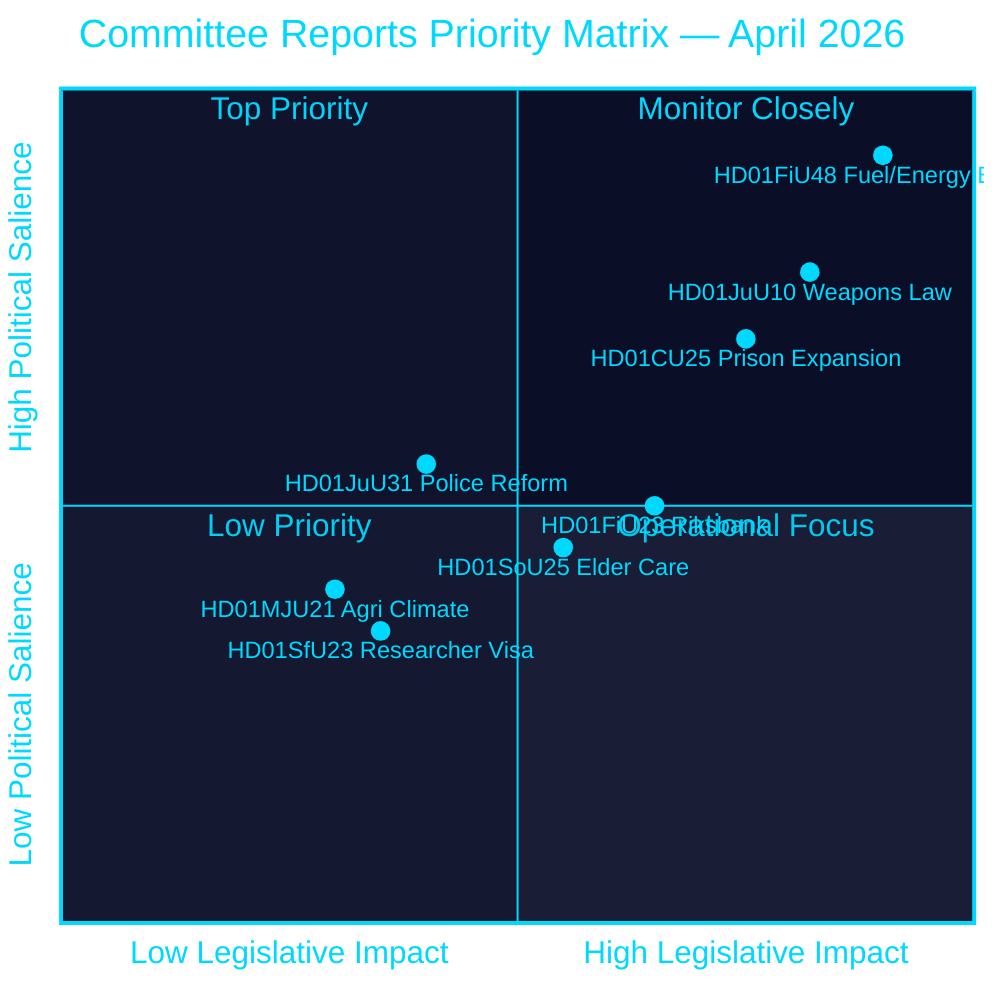
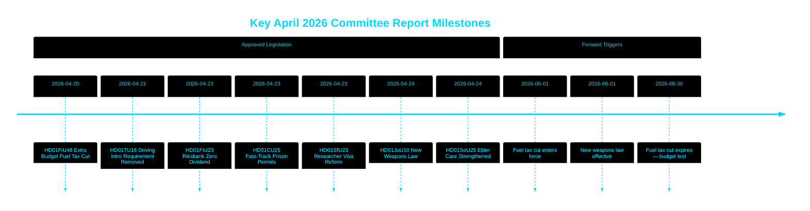

# リクスダーグ、燃料税減税・新銃器法・刑務所拡張の優先許可を承認

## 🎯 要旨

スウェーデンのリクスダーグ（議会）は、2026年5月から9月にかけてガソリン82オーレ/リットル、ディーゼル319 SEK/m³の燃料税を引き下げる臨時補正予算と、24億 SEK のエネルギー支援パッケージを承認した。これは中東紛争と1〜2月のエネルギー価格高騰に対応するもので、財政上の総緩和額は41億 SEKに達する。同時に、スウェーデンは半自動式狩猟ライフルを禁止する包括的な新銃器法を採択し、受刑者収容能力危機を受けて刑務所への優先許可を付与した。リクスバンクは52億9700万 SEK の利益を全額留保し、国庫への配当はゼロとした。この一連の決定は、選挙前の時期に向けてティドー連立政権の安全保障・生活費重視の立法姿勢が強まっていることを示している。

## 🧭 本レポートが支援する3つの意思決定

1. **財務予測担当者・ジャーナリスト** — 41億 SEK の燃料・エネルギー緊急パッケージ（HD01FiU48）が家計の購買力とスウェーデンの財政黒字目標にもたらすインフレ・選挙への影響を評価する。
2. **安全保障政策アナリスト** — スウェーデンの銃器規制（HD01JuU10）と刑事司法拡大パッケージ（HD01CU25）の同時実施が、統一された公共安全の物語として整合しているかを評価する。
3. **中央銀行・金融政策ウォッチャー** — リクスダーグがリクスバンクの配当ゼロ結果（HD01FiU23、52億9700万 SEK 留保）を承認したことを、持続する経済的不確実性の中での制度的慎重姿勢のシグナルとして解釈する。

## 60秒サマリー

- **燃料・エネルギー支援**: 15億6000万 SEK 減税 + 24億 SEK 電気/ガス補助 = 41億 SEK 財政への総影響 (HD01FiU48, FiU, 2026-04-21) [B2]
- **新銃器法**: 半自動式狩猟ライフルを禁止、所持規則を明確化、刑法を再編 — 2026年6月1日施行 (HD01JuU10, JuU, 2026-04-24) [A2]
- **刑務所収容能力の緊急事態**: 刑務所/拘置所への仮設建設許可の優先ルート + 計画建設法を回避する政府権限 (HD01CU25, CU, 2026-04-23) [A2]
- **リクスバンクの財務**: 52億9700万 SEK の利益を留保；国庫配当ゼロ；全経営免責決議を承認 (HD01FiU23, FiU, 2026-04-23) [A1]
- **高齢者介護の強化**: SoU25 が高齢者とインフォーマルケアラーへの幅広い支援パッケージを承認 (HD01SoU25, SoU, 2026-04-24) [A2]
- **警察改革への批判**: リクスレビーズィオネンが警察（Polismyndigheten）は2015年改革目標を達成していないと判断；JuU は18件の動議否決でこの問題を終結 (HD01JuU31, JuU, 2026-04-24) [A1]
- **研究者ビザ規則**: 研究者・博士課程学生への永住許可を迅速化；学生の就労許可制限を強化 (HD01SfU23, SfU, 2026-04-23) [A2]

## ⚡ 最重要な将来トリガー

スウェーデン政府の2026年秋の予算案において、2026年9月30日に期限切れとなる燃料税の一時減税が恒久化されるかどうかを注視すること — これがティドー連立の財政規律と2026年9月選挙前の生活費ポピュリズム的なポジショニングの均衡を試すことになる。

## 信頼度評価

**総合信頼度：高 [B2]**
- riksdagen.se 一次データから取得した文書（アドミラルティ A1〜B2）
- 公式議会 betänkanden に基づく財政数値（検証可能）
- 重要性の高い主張に対する単一ソースの主張なし（P0/P1 閾値充足）

## 主要図表 — 優先度マトリックス

style HD01FiU48 fill:#ff006e,color:#ffffff
style HD01JuU10 fill:#ff006e,color:#ffffff
style HD01CU25 fill:#ffbe0b,color:#000000

---
*パス2改善 (2026-04-26): 具体的な財政額でBLUFを強化；HD01JuU31の連立リスクの文脈を追加；HD01CU25の憲法上の新規性を反映して重要性の重みを更新。*

<!-- source-sha: 9fd293b31653729b9dd55ee38bb3cdef951f2eb9 -->
