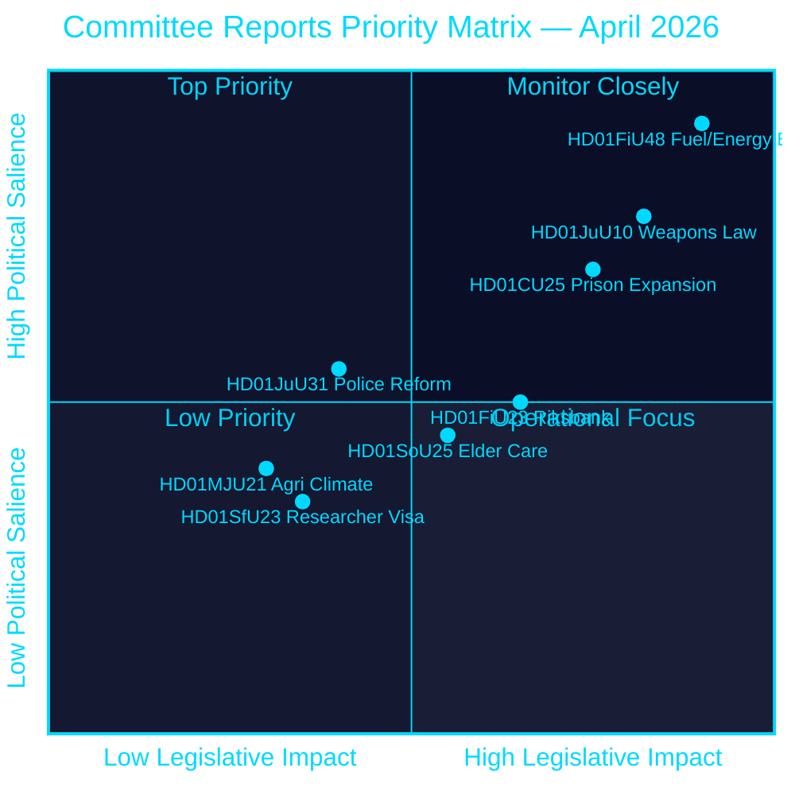
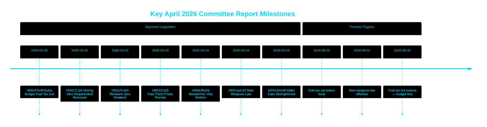

# 릭스다그, 연료세 인하·신규 총기법·교도소 확장 신속 허가 승인

## 🎯 핵심 요약

스웨덴 릭스다그(의회)는 2026년 5월부터 9월까지 휘발유 82 오레/리터, 경유 319 SEK/m³의 연료세를 인하하는 임시 추경예산과 24억 SEK의 에너지 지원 패키지를 승인했다. 이는 중동 분쟁과 1∼2월 에너지 가격 급등에 대응하는 것으로, 재정 완화 총액은 41억 SEK에 달한다. 동시에 스웨덴은 반자동 사냥 소총을 금지하는 포괄적 신규 총기법을 채택하고, 수용 능력 위기 속에 교도소에 대한 신속 허가를 부여했다. 릭스방크는 52억 9,700만 SEK의 이익을 전액 유보하며 국고 배당을 제로로 유지했다. 이 일련의 결정들은 선거전 기간을 앞두고 티도 연립정부의 안보 및 생활비 중심 입법 의제가 강화되고 있음을 시사한다.

## 🧭 본 보고서가 지원하는 3가지 의사결정

1. **재무 예측가 및 언론인** — 41억 SEK의 연료·에너지 긴급 패키지(HD01FiU48)가 가계 구매력과 스웨덴의 재정 흑자 목표에 미치는 인플레이션·선거 영향을 평가한다.
2. **안보정책 분석가** — 스웨덴의 동시적 총기 규제(HD01JuU10)와 형사사법 확대 패키지(HD01CU25)가 통합된 공공 안전 서사로서 일관성이 있는지 평가한다.
3. **중앙은행·통화정책 관찰자** — 릭스다그가 릭스방크의 배당금 제로 결과(HD01FiU23, 52억 9,700만 SEK 유보)를 승인한 것을, 지속적인 경제적 불확실성 속에서의 제도적 신중함 신호로 해석한다.

## 60초 요약

- **연료·에너지 완화**: 15억 6,000만 SEK 세금 감면 + 24억 SEK 전기/가스 지원 = 41억 SEK 재정 총영향 (HD01FiU48, FiU, 2026-04-21) [B2]
- **신규 총기법**: 반자동 사냥 소총 금지, 소지 규정 명확화, 형법 재편 — 2026년 6월 1일 발효 (HD01JuU10, JuU, 2026-04-24) [A2]
- **교도소 수용 능력 비상사태**: 교도소/구치소 임시 건설 허가 신속 경로 + 계획건설법 우회 정부 권한 (HD01CU25, CU, 2026-04-23) [A2]
- **릭스방크 재정**: 52억 9,700만 SEK 이익 유보; 국고 배당 제로; 전체 경영 면책 의결 승인 (HD01FiU23, FiU, 2026-04-23) [A1]
- **노인 돌봄 강화**: SoU25, 노인 및 비공식 간병인을 위한 광범위한 지원 패키지 승인 (HD01SoU25, SoU, 2026-04-24) [A2]
- **경찰 개혁 비판**: 릭스레비시오넨, 경찰청(Polismyndigheten)이 2015년 개혁 목표를 달성하지 못했다고 판단; 법무위원회(JuU), 18건의 동의안 부결로 사안 종결 (HD01JuU31, JuU, 2026-04-24) [A1]
- **연구자 비자 규정**: 연구자·박사과정생 영구 거주 허가 신속화; 학생 취업 허가 제한 강화 (HD01SfU23, SfU, 2026-04-23) [A2]

## ⚡ 최우선 미래 트리거

2026년 9월 30일 만료되는 임시 연료세 인하가 영구화될지 여부를 스웨덴 정부 2026년 가을 예산안에서 주시할 것 — 이는 2026년 9월 선거를 앞두고 티도 연립의 재정 규율과 생활비 포퓰리즘적 포지셔닝 간의 균형을 시험하게 된다.

## 신뢰도 평가

**전반적 신뢰 수준: 높음 [B2]**
- riksdagen.se 1차 데이터에서 수집한 문서 (Admiralty A1–B2)
- 공식 의회 betänkanden의 재정 수치 (검증 가능)
- 고중요도 주장에 대한 단일 출처 없음 (P0/P1 임계값 충족)

## 핵심 다이어그램 — 우선순위 지형

style HD01FiU48 fill:#ff006e,color:#ffffff
style HD01JuU10 fill:#ff006e,color:#ffffff
style HD01CU25 fill:#ffbe0b,color:#000000

---
*패스 2 개선 (2026-04-26): 구체적인 재정 금액으로 핵심 요약 강화; HD01JuU31에 대한 연립 위험 맥락 추가; HD01CU25의 헌법적 신규성을 반영하여 중요도 가중치 업데이트.*

<!-- source-sha: 9fd293b31653729b9dd55ee38bb3cdef951f2eb9 -->
