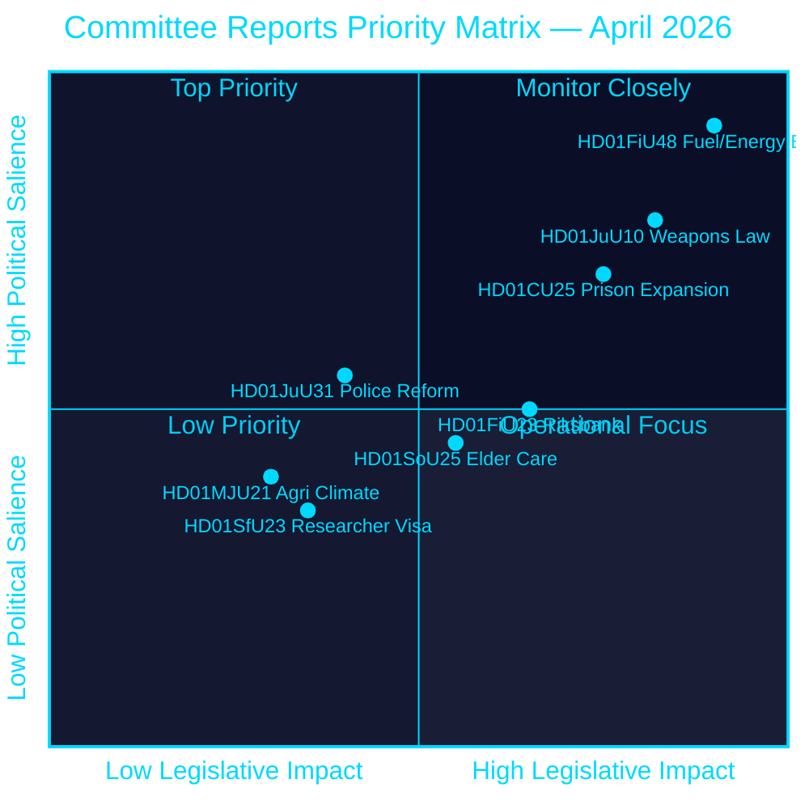
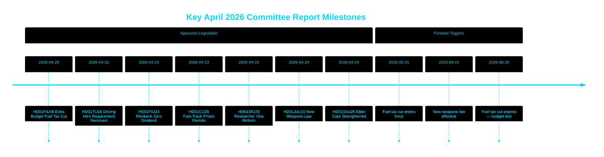

# De Riksdag keurt brandstofbelastingverlaging, nieuwe wapenwet en snelspoor voor gevangenisuitbreiding goed

## 🎯 BLUF

De Zweedse Riksdag keurde een buitengewone aanvullende begroting goed die brandstofbelastingen verlaagt met 82 öre/liter (benzine) en 319 SEK/m³ (diesel) van mei tot september 2026, samen met een energiesteunpakket van 2,4 miljard SEK — een gecombineerde fiscale versoepeling van 4,1 miljard SEK gedreven door het Midden-Oostenconflict en de energieprijspieken in januari–februari. Tegelijkertijd nam Zweden een uitgebreide nieuwe wapenwet aan die halfautomatische jachtgeweren verbiedt en verleende spoedvergunningen voor gevangenissen temidden van een capaciteitscrisis. De Riksbank behield haar volledige winst van 5,297 miljard SEK met nuldividend aan de schatkist. Dit besluitencluster signaleert een steeds veiligheidsen levensduurtegericht wetgevingsagenda van de Tidö-coalitie richting een voorverkiezingsperiode.

## 🧭 3 beslissingen die dit PM ondersteunt

1. **Financiële prognosemakers en journalisten** — beoordeel de inflationele en electorale implicaties van het noodpakket van 4,1 miljard SEK voor brandstof- en energieverlichting (HD01FiU48) op de koopkracht van huishoudens en Zwedens fiscale overschotsdoelstelling.
2. **Veiligheidsbeleidsanalisten** — evalueer de coherentie van Zwedens gelijktijdige wapenbegrenzing (HD01JuU10) en het strafrechtelijke uitbreidingspakket (HD01CU25) als een uniforme openbare veiligheidsnarratief.
3. **Centrale bank- en monetairbeleidswaarnemmers** — interpreteer de goedkeuring van de Riksdag voor een nuldividend Riksbank-resultaat (HD01FiU23, 5,297 miljard SEK ingehouden) als een signaal van institutionele voorzichtigheid te midden van aanhoudende economische onzekerheid.

## 60-secondenlezing

- **Brandstof- en energieverlichting**: 1,56 miljard SEK belastingverlaging + 2,4 miljard SEK elektriciteit/gassteun = 4,1 miljard SEK totale fiscale impact (HD01FiU48, FiU, 2026-04-21) [B2]
- **Nieuwe wapenwet**: Halfautomatische jachtgeweren verboden, bezitsregels verduidelijkt, wetboek van strafrecht geherstructureerd — van kracht per 1 juni 2026 (HD01JuU10, JuU, 2026-04-24) [A2]
- **Gevangeniscapaciteitsnoodgeval**: Snelspoor voor tijdelijke bouwvergunningen voor gevangenissen/voorlopige hechtenis + regeringsbevoegdheid om de Ruimtelijke Ordenings- en Bouwwet te overrulen (HD01CU25, CU, 2026-04-23) [A2]
- **Riksbank-financiën**: 5,297 miljard SEK winst ingehouden; nul staatsdividend; volledige kwijting van het bestuur goedgekeurd (HD01FiU23, FiU, 2026-04-23) [A1]
- **Ouderenzorg versterkt**: SoU25 keurde bredere steunpakketten goed voor ouderen en mantelzorgers (HD01SoU25, SoU, 2026-04-24) [A2]
- **Politiehervormingskritiek**: Riksrevisionen constateerde dat de Polismyndigheten de doelen van de 2015-hervorming niet had bereikt; JuU sloot de zaak met 18 verworpen moties (HD01JuU31, JuU, 2026-04-24) [A1]
- **Onderzoekersvisumregels**: Snellere vaste verblijfsvergunning voor onderzoekers en promovendi; beperkingen op werkvergunningen voor studenten worden aangescherpt (HD01SfU23, SfU, 2026-04-23) [A2]

## ⚡ Belangrijkste vooruitblikkende trigger

Volg de Zweedse regeringsautumnbegroting 2026 om te zien of de tijdelijke brandstofbelastingverlaging (verloopt op 30 september 2026) permanent wordt — dit test de begrotingsdiscipline van de Tidö-coalitie versus een populistische levensduurtepositie richting de verkiezingen van september 2026.

## Betrouwbaarheidsbeoordeling

**Algehele betrouwbaarheidsgraad: HOOG [B2]**
- Documenten afkomstig van riksdagen.se primaire gegevens (Admiralty A1–B2)
- Fiscale cijfers uit officiële parlementaire betänkanden (verifieerbaar)
- Geen enkele-bronbeweringen voor beweringen met hoge betekenis (P0/P1-drempel gehaald)

## Sleuteldiagram — prioriteitslandschap

style HD01FiU48 fill:#ff006e,color:#ffffff
style HD01JuU10 fill:#ff006e,color:#ffffff
style HD01CU25 fill:#ffbe0b,color:#000000

---
*Pass 2-verbetering (2026-04-26): BLUF versterkt met specifieke fiscale bedragen; coalitierisicocontext toegevoegd voor HD01JuU31; betekenisgewichten bijgewerkt om de constitutionele nieuwheid van HD01CU25 te weerspiegelen.*

<!-- source-sha: 9fd293b31653729b9dd55ee38bb3cdef951f2eb9 -->
