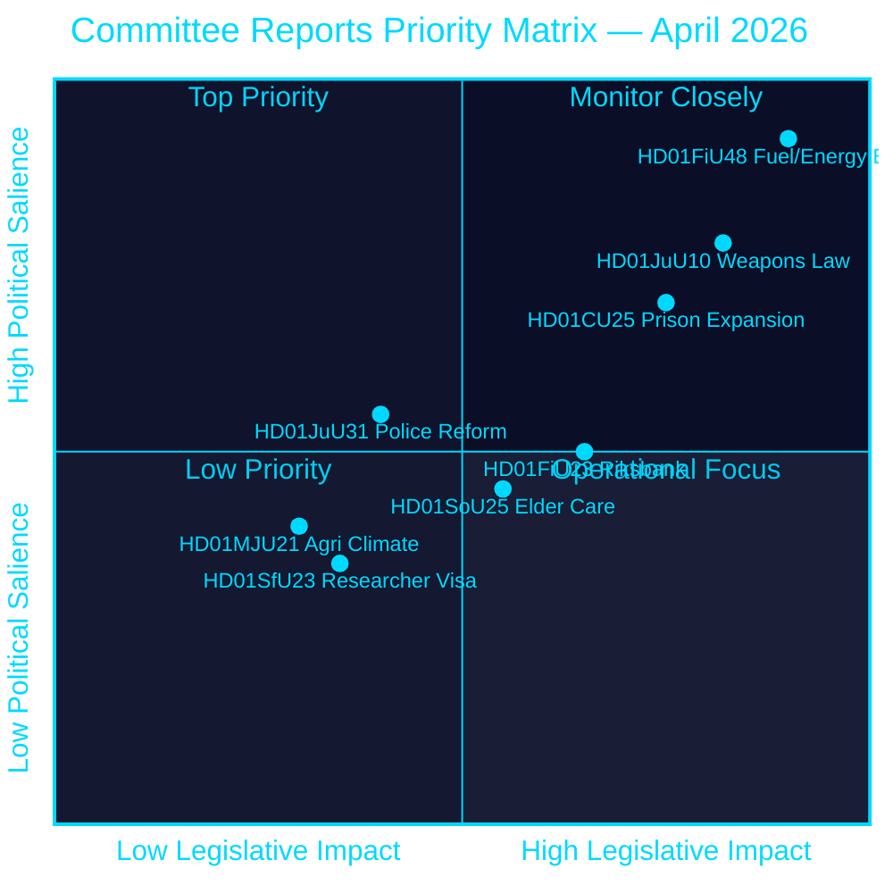
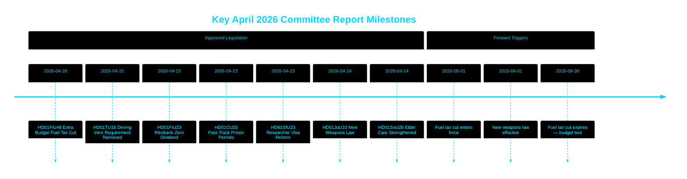

# Riksdag godkjenner drivstoffskattekutt, ny våpenlov og hurtigsporet fengselsutvidelse

## 🎯 BLUF

Den svenske Riksdag godkjente et ekstraordinært tilleggsbudsjett som kutter drivstoffavgifter med 82 øre/liter (bensin) og 319 SEK/m³ (diesel) fra mai–september 2026, sammen med en energistøttepakke på 2,4 mrd. SEK — en samlet finanspolitisk lettelse på 4,1 mrd. SEK drevet av Midtøsten-konflikten og energipristopper i januar–februar. Samtidig vedtok Sverige en helhetlig ny våpenlov som forbyr halvautomatiske jaktrifler og bemyndiget hurtigsporstillatelser for fengsler midt i en kapasitetskrise. Riksbanken beholdt sitt fulle overskudd på 5,297 mrd. SEK med nullutbytte til statskassen. Denne beslutningsklyngen signalerer en stadig mer sikkerhets- og levekostnadsfokusert lovgivningsagenda fra Tidö-koalisjonen inn i en forvalgperiode.

## 🧭 3 beslutninger dette PM støtter

1. **Finansielle prognosemakere og journalister** — vurder de inflasjonsmessige og valgrelaterte implikasjonene av den 4,1 mrd. SEK store nødpakken for drivstoff og energi (HD01FiU48) for husholdningenes kjøpekraft og Sveriges finanspolitiske overskuddsmål.
2. **Sikkerhetspolitiske analytikere** — evaluer sammenhengen i Sveriges parallelle våpenbegrensning (HD01JuU10) og strafferettslige utvidelsespakke (HD01CU25) som en enhetlig fortelling om offentlig sikkerhet.
3. **Sentralbank- og pengepolitiske observatører** — fortolk Riksdagens godkjenning av et nullutbytte-Riksbank-resultat (HD01FiU23, 5,297 mrd. SEK beholdt) som et signal om institusjonell forsiktighet midt i fortsatt økonomisk usikkerhet.

## 60-sekunders lesning

- **Drivstoff- og energilettelse**: 1,56 mrd. SEK skattelettelse + 2,4 mrd. SEK el/gassstøtte = 4,1 mrd. SEK samlet finanspolitisk effekt (HD01FiU48, FiU, 2026-04-21) [B2]
- **Ny våpenlov**: Halvautomatiske jaktrifler forbudt, besittelsesregler klarlagt, straffeloven omstrukturert — trer i kraft 1. juni 2026 (HD01JuU10, JuU, 2026-04-24) [A2]
- **Fengselskapasitetsnødsituasjon**: Hurtigspor for midlertidige byggetillatelser for fengsler/varetektsfengsler + regjeringens myndighet til å overstyre plan- og bygningsloven (HD01CU25, CU, 2026-04-23) [A2]
- **Riksbankens økonomi**: 5,297 mrd. SEK overskudd beholdt; nullt statsutbytte; fullstendig forvaltningsansvarsbeslutning godkjent (HD01FiU23, FiU, 2026-04-23) [A1]
- **Eldreomsorg styrket**: SoU25 godkjente bredere støttepakker for eldre og pårørendeomsorgsgivere (HD01SoU25, SoU, 2026-04-24) [A2]
- **Politireformkritikk**: Riksrevisionen fant at Polismyndigheten ikke nådde 2015-reformens mål; JuU lukket saken med 18 avslåtte motioner (HD01JuU31, JuU, 2026-04-24) [A1]
- **Forskervisumregler**: Raskere permanent oppholdstillatelse for forskere og doktorgradsstudenter; begrensninger for studenters arbeidstillatelse strammes inn (HD01SfU23, SfU, 2026-04-23) [A2]

## ⚡ Viktigste fremoverskuende utløsende faktor

Følg den svenske regjeringens høstbudsjettproposisjon 2026 for å se om den midlertidige drivstoffskattereduksjonen (utløper 30. september 2026) gjøres permanent — dette tester Tidö-koalisjonens finansdisiplin mot populistisk levekostnadsposisjonering foran valget i september 2026.

## Konfidensvurdering

**Samlet konfidensgrad: HØY [B2]**
- Dokumenter hentet fra riksdagen.se primærdata (Admiralty A1–B2)
- Regnskapstall fra offisielle parlamentariske betenkninger (verifiserbare)
- Ingen enkeltkildebestemmelser for påstander med høy signifikans (P0/P1-terskel oppfylt)

## Nøkkeldiagram — prioritetslandskap

style HD01FiU48 fill:#ff006e,color:#ffffff
style HD01JuU10 fill:#ff006e,color:#ffffff
style HD01CU25 fill:#ffbe0b,color:#000000

---
*Pass 2-forbedring (2026-04-26): Styrket BLUF med spesifikke regnskapsbeløp; lagt til koalisjonsrisikokontekst for HD01JuU31; oppdaterte signifikansvekter for å gjenspeile HD01CU25 konstitusjonelle nyhet.*

<!-- source-sha: 9fd293b31653729b9dd55ee38bb3cdef951f2eb9 -->
