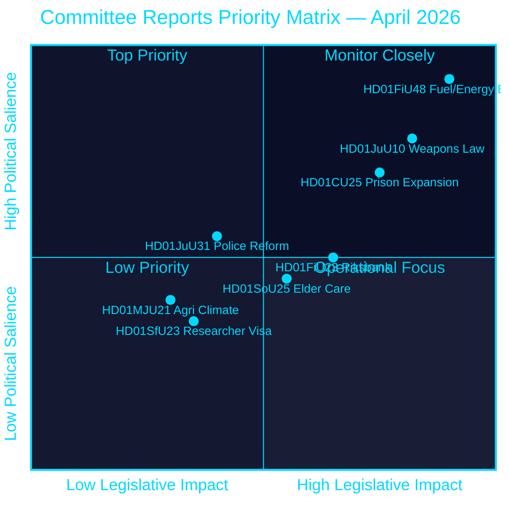
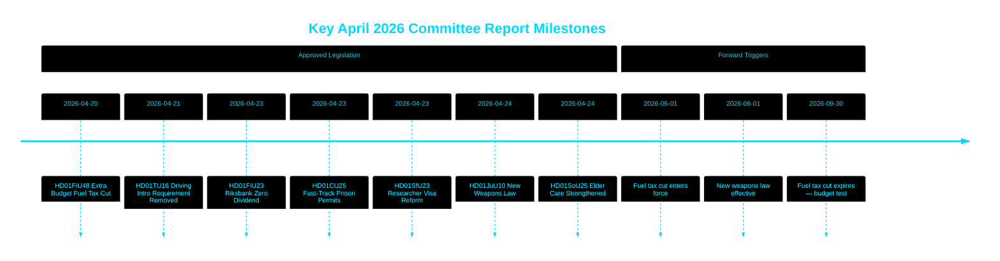

# Riksdag godkänner bränsleskatteminskning, ny vapenlag och snabbspår för fängelseexpansion

## 🎯 BLUF

Svenska Riksdagen godkände en extraordinär tilläggsbudget som sänker bränsleskatter med 82 öre/liter (bensin) och 319 SEK/m³ (diesel) från maj–september 2026 jämte ett energistödpaket på 2,4 miljarder SEK — en kombinerad finanspolitisk lättnad på 4,1 miljarder SEK driven av konflikten i Mellanöstern och energiprisstegringar i januari–februari. Samtidigt antog Sverige en heltäckande ny vapenlag som förbjuder halvautomatiska gevär för jakt och bemyndigade snabbspårsbeviljande av planlovstillstånd för fängelser mitt i en kapacitetskris. Riksbanken behöll sin fullständiga vinst på 5,297 miljarder SEK med nolldividend till statskassan. Det här beslutsklustret signalerar en alltmer säkerhets- och levnadskostnadsfokuserad lagstiftningsagenda från Tidökoalitionen inför en förvalsperiod.

## 🧭 3 beslut som detta PM stöder

1. **Finansiella prognosmakare och journalister** — bedöm de inflationsmässiga och valrelaterade implikationerna av nödpaket för bränsle och energi på 4,1 miljarder SEK (HD01FiU48) för hushållens köpkraft och Sveriges finanspolitiska överskottsmål.
2. **Säkerhetspolitiska analytiker** — utvärdera koherensen i Sveriges parallella vapenbegränsning (HD01JuU10) och straffrättsliga expansionspaket (HD01CU25) som en enhetlig folksäkerhetsberättelse.
3. **Centralbanks- och penningpolitiska observatörer** — tolka Riksdagens godkännande av ett nolldividend-Riksbanksresultat (HD01FiU23, 5,297 miljarder SEK behållet) som en signal om institutionell försiktighet mitt i fortsatt ekonomisk osäkerhet.

## 60-sekunders läsning

- **Bränsle- och energilättnad**: 1,56 miljarder SEK skattereduktion + 2,4 miljarder SEK el/gasstöd = 4,1 miljarder SEK total finanspolitisk effekt (HD01FiU48, FiU, 2026-04-21) [B2]
- **Ny vapenlag**: Halvautomatiska jaktgevär förbjuds, innehavsregler klarläggs, straffkoden omstruktureras — träder i kraft 1 juni 2026 (HD01JuU10, JuU, 2026-04-24) [A2]
- **Fängelsekapacitetsnödläge**: Snabbspår för tillfälliga bygglov för fängelser/häkten + regeringsmakt att åsidosätta plan- och bygglagen (HD01CU25, CU, 2026-04-23) [A2]
- **Riksbankens finanser**: 5,297 miljarder SEK vinst behållen; noll statsdividend; fullständigt förvaltningsansvarsbeslut godkänt (HD01FiU23, FiU, 2026-04-23) [A1]
- **Äldreomsorg stärkt**: SoU25 godkände bredare stödpaket för äldre och anhörigvårdare (HD01SoU25, SoU, 2026-04-24) [A2]
- **Polisreformkritik**: Riksrevisionen fann att Polismyndigheten inte uppnådde 2015 års reformmål; JuU stängde ärendet med 18 avslagna motioner (HD01JuU31, JuU, 2026-04-24) [A1]
- **Forskarvisumregler**: Snabbare permanent uppehållstillstånd för forskare och doktorander; restriktioner för studenters arbetstillstånd skärps (HD01SfU23, SfU, 2026-04-23) [A2]

## ⚡ Viktigaste framåtriktat utlösande faktor

Bevaka svenska regeringens höstbudgetproposition 2026 för att se om den tillfälliga bränsleskatteminskningen (upphör 30 september 2026) görs permanent — detta testar Tidökoalitionens finansdisciplin kontra populistisk levnadskostnadspositionering inför valet i september 2026.

## Konfidensutlåtande

**Övergripande konfidensgrad: HÖG [B2]**
- Dokument hämtade från riksdagen.se primärdata (Amiralskvadrant A1–B2)
- Räkenskapstal från officiella parlamentariska betänkanden (verifierbara)
- Inga enpåståendekällor för påståenden av hög signifikans (P0/P1-tröskel uppfylld)

## Nyckeldiagram — prioritetslandskap

style HD01FiU48 fill:#ff006e,color:#ffffff
style HD01JuU10 fill:#ff006e,color:#ffffff
style HD01CU25 fill:#ffbe0b,color:#000000

---
*Pass 2-förbättring (2026-04-26): Stärkt BLUF med specifika räkenskapsbelopp; lagt till koalitionsriskkontext för HD01JuU31; uppdaterade signifikansvikter för att spegla HD01CU25 konstitutionella nyhet.*

<!-- source-sha: 9fd293b31653729b9dd55ee38bb3cdef951f2eb9 -->
