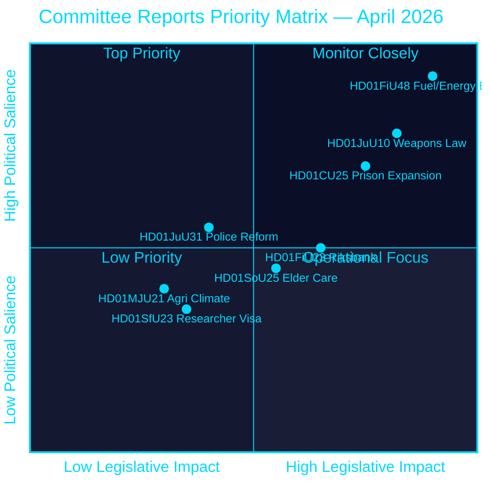
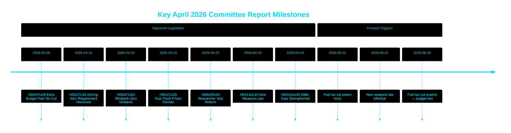

# 瑞典议会批准燃油税削减、新武器法及监狱扩张快速许可

## 🎯 核心摘要

瑞典议会（Riksdag）批准了一项特别补充预算，将2026年5月至9月期间的燃油税削减82奥尔/升（汽油）和319瑞典克朗/立方米（柴油），同时配套24亿瑞典克朗的能源支持方案——受中东冲突及1至2月能源价格上涨驱动，合计财政宽松额度达41亿瑞典克朗。与此同时，瑞典通过了一项全面新武器法，禁止半自动猎枪，并在监狱容量危机中授权为监狱建设开辟快速审批通道。瑞典央行（Riksbank）保留全部52.97亿瑞典克朗利润，向国库零分红。这一系列决定表明，提多联合政府在进入选前阶段时，立法议程日益聚焦于安全与生活成本。

## 🧭 本简报支持的3项决策

1. **财务预测人员与记者** — 评估41亿瑞典克朗燃油和能源紧急救助方案（HD01FiU48）对家庭购买力及瑞典财政盈余目标的通胀与选举影响。
2. **安全政策分析人员** — 评估瑞典同步推进武器限制（HD01JuU10）与刑事司法扩张方案（HD01CU25）作为统一公共安全叙事的内在一致性。
3. **央行与货币政策观察人士** — 将议会批准瑞典央行零分红结果（HD01FiU23，52.97亿瑞典克朗留存）解读为在持续经济不确定性背景下的机构审慎信号。

## 60秒速读

- **燃油与能源减负**：15.6亿瑞典克朗减税 + 24亿瑞典克朗电/气补贴 = 41亿瑞典克朗财政总影响 (HD01FiU48, FiU, 2026-04-21) [B2]
- **新武器法**：半自动猎枪被禁止，持有规则得到明确，刑法典重新整合——2026年6月1日起生效 (HD01JuU10, JuU, 2026-04-24) [A2]
- **监狱容量紧急状态**：为监狱/拘留所建设临时许可开辟快速通道 + 政府获权绕过规划建设法 (HD01CU25, CU, 2026-04-23) [A2]
- **瑞典央行财务**：52.97亿瑞典克朗利润留存；国库分红为零；全面经营免责决议获批 (HD01FiU23, FiU, 2026-04-23) [A1]
- **老年护理加强**：SoU25批准为老年人及非正式照护者提供更广泛的支持方案 (HD01SoU25, SoU, 2026-04-24) [A2]
- **警察改革批评**：瑞典国家审计署（Riksrevisionen）发现警察局（Polismyndigheten）未能达成2015年改革目标；司法委员会（JuU）以否决18项动议终结该议题 (HD01JuU31, JuU, 2026-04-24) [A1]
- **研究人员签证规则**：为研究人员和博士生加速办理永久居留；学生工作许可限制收紧 (HD01SfU23, SfU, 2026-04-23) [A2]

## ⚡ 最重要前瞻性触发因素

关注瑞典政府2026年秋季预算法案，看临时燃油税减税（2026年9月30日到期）是否将成为永久措施——这将考验提多联合政府在2026年9月大选前财政纪律与生活成本民粹主义定位之间的平衡。

## 可信度评估

**总体可信度：高 [B2]**
- 文件来源于 riksdagen.se 一手数据（海军上将评分 A1–B2）
- 财政数据来自官方议会 betänkanden（可核实）
- 无单一来源主张用于高重要性断言（已满足 P0/P1 阈值）

## 关键图表——优先事项全景

style HD01FiU48 fill:#ff006e,color:#ffffff
style HD01JuU10 fill:#ff006e,color:#ffffff
style HD01CU25 fill:#ffbe0b,color:#000000

---
*第二轮改进 (2026-04-26)：以具体财政金额强化核心摘要；为 HD01JuU31 添加联合政府风险背景；更新重要性权重以反映 HD01CU25 的宪法新颖性。*

<!-- source-sha: 9fd293b31653729b9dd55ee38bb3cdef951f2eb9 -->
