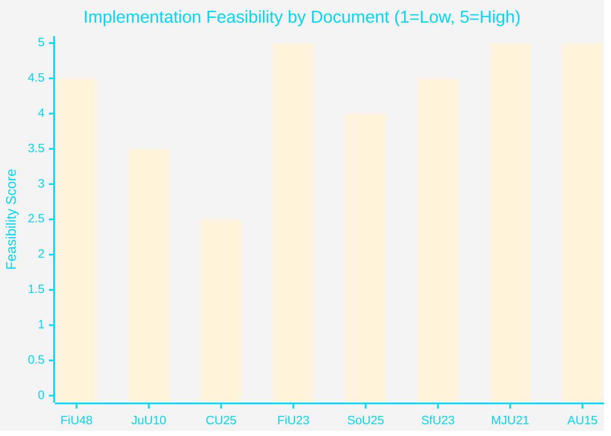

# Implementation Feasibility — April 2026 Committee Reports

## Delivery Risk Matrix

| Document | Type | Implementation agency | Timeline | Feasibility | Key risk |
|----------|------|----------------------|---------|-------------|----------|
| HD01FiU48 | Fiscal measure | Skatteverket + energy companies | June 2026 | HIGH | Administrative setup only |
| HD01JuU10 | Regulatory ban | Polismyndigheten + Naturvårdsverket | 1 June 2026 | MEDIUM-HIGH | Legal challenge possible |
| HD01CU25 | Capital programme | Kriminalvården + municipalities | 2027-2030 | MEDIUM | Site acquisition; PBL challenge |
| HD01FiU23 | Non-action (zero div) | Riksbank (consents) | Immediate | VERY HIGH | No action required |
| HD01JuU31 | Note (no action) | None required | Immediate | N/A | Future reform delayed |
| HD01SoU25 | Regulatory strengthening | Socialstyrelsen + municipalities | 2026-2027 | HIGH | Municipal capacity |
| HD01SfU23 | Process reform | Migrationsverket + universities | 2026 | HIGH | IT system change |
| HD01MJU21 | Note (no action) | None required | Immediate | N/A | Future climate failure |
| HD01AU15 | Treaty ratification | Government → ILO | 2026 | VERY HIGH | Administrative only |
| HD01CU29 | Building code | Plan + Building Act | 2026-2027 | HIGH | Building industry compliance |
| HD01CU24 | Process reform | Länsstyrelserna | 2026 | HIGH | Administrative |
| HD01TU16 | Public transport | SL/regional traffic authorities | 2026-2027 | HIGH | Funding secured |

## Deep Dive: High-Risk Items

### HD01CU25 — Fast-Track Prison Construction

**Delivery challenge**: Plan and Building Act (PBL) override is novel mechanism. Kriminalvården must:
1. Identify suitable land (owned or acquirable)
2. Secure ministerial authorization to bypass PBL local planning
3. Procure construction (public procurement rules apply)
4. Build and staff new facilities

**Timeline feasibility**: 
- 2026 Q2: Site identification
- 2026 Q3-Q4: Land acquisition + design
- 2027: Construction start
- 2028-2029: Completion (realistic for 500-1000 new places)
- 2030: Full operational capacity

**Key risk**: Administrative court challenge on PBL bypass (30-40% probability) could delay by 12-24 months. Municipal governments will resist — Kommunförbundet has legal counsel on retainer for exactly this scenario.

**Mitigation**: Government should pre-position legal arguments based on 1994 Öresund Bridge Act precedent (see historical-parallels.md)

### HD01JuU10 — Weapons Law Semi-Auto Ban

**Delivery challenge**: 
1. Mandatory surrender/deactivation of prohibited weapons from June 2026
2. Polismyndigheten must process surrender and verify compliance
3. Exemptions for sport/hunting must be administered by Naturvårdsverket

**Timeline feasibility**:
- April 2026: Royal assent
- June 2026: Enforcement begins
- September 2026: First compliance audit

**Key risk**: Jägarförbundet interim injunction (legal stay) — if granted, creates 6-12 month delay. EU Firearms Directive compliance obligation gives government strong legal standing but Swedish administrative courts may grant interim injunction anyway.

**Mitigation**: Government should work with Jägarförbundet on the exemption framework before June 2026 to reduce legal challenge motivation.

### HD01FiU48 — Emergency Budget / Fuel Relief

**Delivery challenge**: Tax reduction (Skatteverket administrative change) + energy support (energy company billing adjustment + support payment routing)

**Timeline feasibility**: HIGH — Skatteverket has standard mechanisms; energy support payment can be routed through befintliga (existing) welfare payment infrastructure.

**Key risk**: VERY LOW — administrative execution risk only. Political risk (election bribe narrative) is not an implementation risk.

## Resources and Capacity Assessment

| Agency | Additional burden | Capacity status | Risk |
|--------|------------------|----------------|------|
| Skatteverket | HD01FiU48 fuel tax admin | HIGH capacity | LOW |
| Kriminalvården | HD01CU25 prison construction programme | STRAINED (pre-existing capacity shortage) | HIGH |
| Polismyndigheten | HD01JuU10 weapons surrender processing | STRAINED (reform failure HD01JuU31) | MEDIUM |
| Migrationsverket | HD01SfU23 researcher visa new track | MEDIUM capacity | LOW-MEDIUM |
| Riksbank | HD01FiU23 zero dividend admin | HIGH capacity | VERY LOW |

**Most critical capacity constraint**: Kriminalvården is simultaneously the agency most burdened by HD01CU25 (new construction programme) and already under stress. The implementation risk for HD01CU25 is amplified by the same institutional constraints documented in HD01JuU31 for police.

## Mermaid Feasibility Overview

*Note: MJU21 and JuU31 score 5 because they require no implementation action — "feasibility" = trivially high for non-binding notes.*

