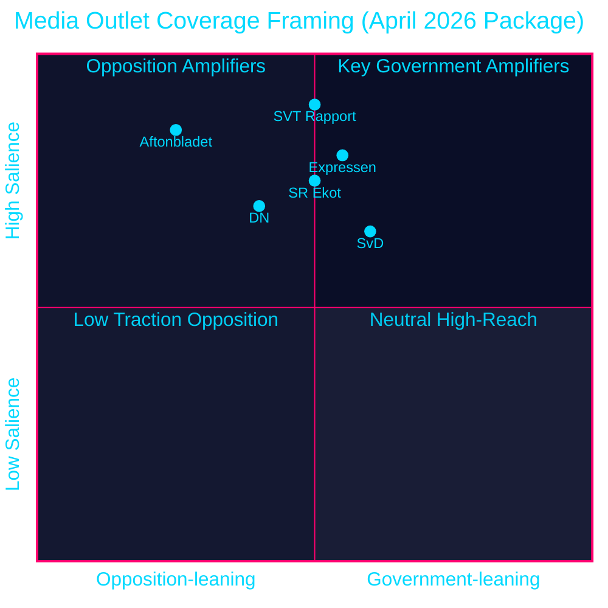

# Media Framing Analysis — April 2026 Committee Reports

## Per-Party Framing

### M (Moderaterna) — Governing Party
**Frame**: "Responsible fiscal management delivering real relief"
- HD01FiU48: "We are responding to extraordinary energy price pressures with targeted relief"
- HD01JuU10: "Sweden meets its EU obligations on weapons control"
- HD01CU25: "We are building the prison places Sweden needs"
- HD01JuU31: "Police reform is ongoing; we remain committed to public safety"
**Key messenger**: Prime Minister (M) in government press conference
**Media placement**: SVT Aktuellt, Rapport; Dagens Nyheter editorial access

### SD (Sverigedemokraterna) — Senior Coalition Partner
**Frame**: "Law and order, Sweden first"
- HD01FiU48: "Fuel relief for ordinary Swedes who have been forgotten by elites"
- HD01CU25: "Criminals will finally face consequences"
- HD01JuU10: Complicated — rural SD voters resist; urban SD supports. Message: "Hunting rights preserved; only criminal weapons targeted"
- HD01JuU31: "Proof that police reform failed — we need more radical reform"
**Key messenger**: SD justice spokesperson
**Media placement**: Expressen, Aftonbladet populist channels; social media primary

### KD (Kristdemokraterna) — Junior Coalition Partner
**Frame**: "Family and community values in policy"
- HD01FiU48: "Relief for rural families who depend on cars"
- HD01SoU25: "Strengthening care for our elderly is a KD priority"
- HD01JuU10: Cautious; "balance between security and legitimate sport/hunting"
**Key messenger**: Party leader
**Media placement**: Regional press (Dalabygden, Smalandsposten); faith community media

### L (Liberalerna) — Junior Coalition Partner
**Frame**: "Rights-based, EU-compliant governance"
- HD01SfU23: "Sweden must be competitive in attracting international research talent"
- HD01JuU10: "Sweden fulfills EU firearms directives as a responsible member state"
- HD01AU15: "ILO violence convention ratification is a liberal human rights priority"
**Key messenger**: Party leader
**Media placement**: DN Debatt; academic/professional media

### S (Socialdemokraterna) — Main Opposition
**Frame**: "Government uses emergency powers for election spending"
- HD01FiU48: "This is borrowed money that future generations will pay; we would target relief better"
- HD01JuU31: "Police reform has failed; this government cannot keep Sweden safe"
- HD01CU25: "Building prisons is not a substitute for effective crime prevention"
- HD01MJU21: Secondary attack — "government simultaneously cuts fuel tax and fails on climate"
**Key messenger**: S riksdagsgrupp; party leader in PM debate
**Media placement**: LO-Tidningen; Aftonbladet sympathetic; SVT "Studio Ett" appearances

### V (Vänsterpartiet)
**Frame**: "Workers first, not tax cuts for car owners"
- HD01FiU48: "Energy support YES; fuel tax cut is fossil subsidy we oppose"
- HD01AU15: "ILO 190 ratification is V's long-standing demand — we welcome it"
- HD01JuU31: "Police reform failure due to privatisation pressure"

### MP (Miljöpartiet)
**Frame**: "Climate first"
- HD01MJU21 + HD01FiU48 combined: "Sweden is committing climate hypocrisy — failing farms on climate while cutting fuel tax"
- HD01AU15: "Green support for ILO 190 workplace violence protections"

### C (Centerpartiet)
**Frame**: "Rural rights, not rural gimmicks"
- HD01FiU48: Accepts fuel relief substance; questions process
- HD01JuU10: "C supports hunting rights; will propose amendments to protect legitimate hunting"
- HD01MJU21: "Government has failed rural agriculture; we demand new CAP strategy"

## Press Quadrant Analysis

style SVT Rapport fill:#00d9ff,color:#000000
style Aftonbladet fill:#ffbe0b,color:#000000
style Expressen fill:#ff006e,color:#ffffff
style DN fill:#1a1e3d,color:#00d9ff
style SvD fill:#1a1e3d,color:#00d9ff
style SR Ekot fill:#00d9ff,color:#000000

## Narrative Vulnerability Assessment

**Highest vulnerability**: "Election bribe" narrative on HD01FiU48 — amplified by S, available to all media
**Second vulnerability**: "Police failure" narrative on HD01JuU31 — evidence-based; difficult to counter
**Best government position**: HD01CU25 prison expansion and HD01JuU10 — bipartisan or EU-mandated; harder to attack

