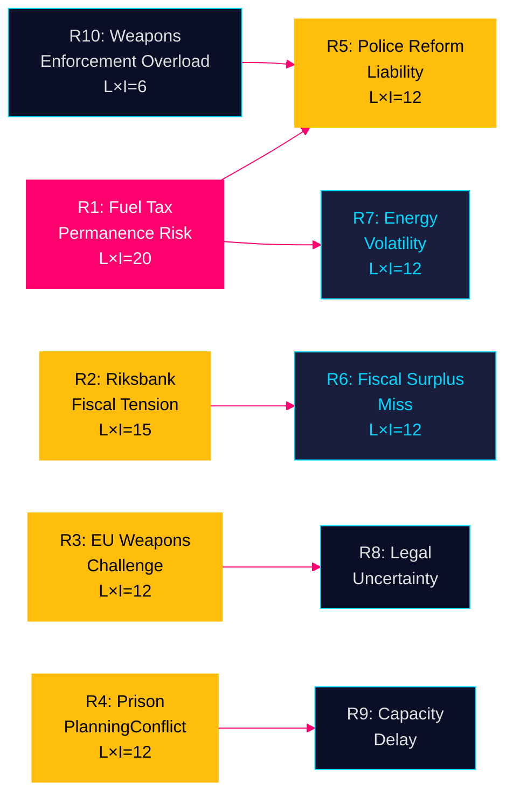

# Risk Assessment — April 2026 Committee Reports

## Risk Register

| ID | Risk | Dimension | Likelihood (1–5) | Impact (1–5) | L×I | Cascade Chain | Source |
|----|------|-----------|-----------------|--------------|-----|---------------|--------|
| R1 | Fuel tax cut becomes permanent pre-election commitment | Fiscal/Political | 4 | 5 | **20** | R1→R5→R7 | HD01FiU48, riksdagen.se [A2] |
| R2 | Riksbank must support state finances if deficit widens | Monetary/Fiscal | 3 | 5 | **15** | R2→R6 | HD01FiU23, riksdagen.se [A1] |
| R3 | Semi-auto weapons ban challenged in EU court | Legal/Political | 3 | 4 | **12** | R3→R8 | HD01JuU10, riksdagen.se [A2] |
| R4 | Prison expansion creates municipal-state conflict | Governance/Legal | 4 | 3 | **12** | R4→R9 | HD01CU25, riksdagen.se [A2] |
| R5 | Police reform failure escalates to political liability | Institutional | 3 | 4 | **12** | R5→R10 | HD01JuU31, riksdagen.se [A1] |
| R6 | Sweden's fiscal surplus target missed in 2026 | Fiscal/Credibility | 3 | 4 | **12** | R6→R11 | HD01FiU48 + WEO Apr-2026 [B2] |
| R7 | Energy price volatility continues post-September | Energy/Social | 4 | 3 | **12** | R7 | HD01FiU48, riksdagen.se [A2] |
| R8 | Agricultural sector misses climate targets legally | Environmental | 3 | 3 | **9** | R8 | HD01MJU21, riksdagen.se [A1] |
| R9 | Researcher visa reform fails to attract talent | Labour market | 2 | 3 | **6** | — | HD01SfU23, riksdagen.se [A2] |
| R10 | Weapons law compliance enforcement overloads police | Institutional | 2 | 3 | **6** | R10→R5 | HD01JuU10, riksdagen.se [A2] |

## Top Five Risks Detailed Analysis

### R1: Fuel Tax Cut Permanence [A2] — L×I: 20

**Description**: The temporary fuel tax reduction (HD01FiU48, riksdagen.se) is a 5-month measure (1 May – 30 September 2026). With September 2026 elections, the government faces an invidious choice at expiry: allow prices to rebound (political cost) or extend/make permanent (fiscal cost ≥1.56 billion SEK/year). The "special circumstances" invocation creates a negotiation floor for opposition demands.

**Cascade**: R1→R5 (fiscal deterioration reduces police reform budget available)→R7 (if permanent, reduces fiscal space for energy crisis management)

**Mitigants**: IMF fiscal consolidation pressure; EU energy price normalisation if Middle East tensions ease; autumn budget process providing formal channel for extension decision.

**Posterior probability of escalation**: ~55% [C2]

### R2: Riksbank–Government Fiscal Tension [A1] — L×I: 15

**Description**: Riksbank retained 5.297 billion SEK (HD01FiU23, riksdagen.se) rather than transferring to state. Combined with emergency budget deficit impact (4.1 billion SEK), total implicit fiscal gap vs. Riksbank expectations is ~9.4 billion SEK in 2026 alone. If government requires additional expenditure, pressure on Riksbank to provide extraordinary dividends may increase.

**Posterior probability**: ~30% [B2]

### R3: EU Weapons Law Challenge [A2] — L×I: 12

**Description**: Sweden's semi-automatic hunting rifle ban (HD01JuU10, riksdagen.se) must coexist with EU Firearms Directive (2017/853). Specific prohibition on new permits for certain half-automatic hunting rifles may conflict with the Directive's harmonisation intent. Finland and Estonia have broader hunting traditions that may prompt EU complaint.

**Posterior probability**: ~25% [C3]

### R4: Municipal Resistance to Prison Construction [A2] — L×I: 12

**Description**: The Plan and Building Act override (HD01CU25, riksdagen.se) gives government power to bypass local planning for prison construction. Swedish municipalities historically resist prison siting (NIMBY). Government override power may trigger administrative court challenges, delaying the urgently needed capacity expansion.

**Posterior probability**: ~40% [B2]

### R5: Police Reform Political Liability [A1] — L×I: 12

**Description**: Riksrevisionen's finding that Polismyndigheten failed its 2015 reform targets (HD01JuU31, riksdagen.se) without JuU mandating remediation creates a recurring vulnerability. Opposition parties (S, V, MP) may use this finding in September 2026 campaign to challenge the coalition's public safety competence narrative.

**Posterior probability of election impact**: ~45% [B2]

## Cascading Risk Model

