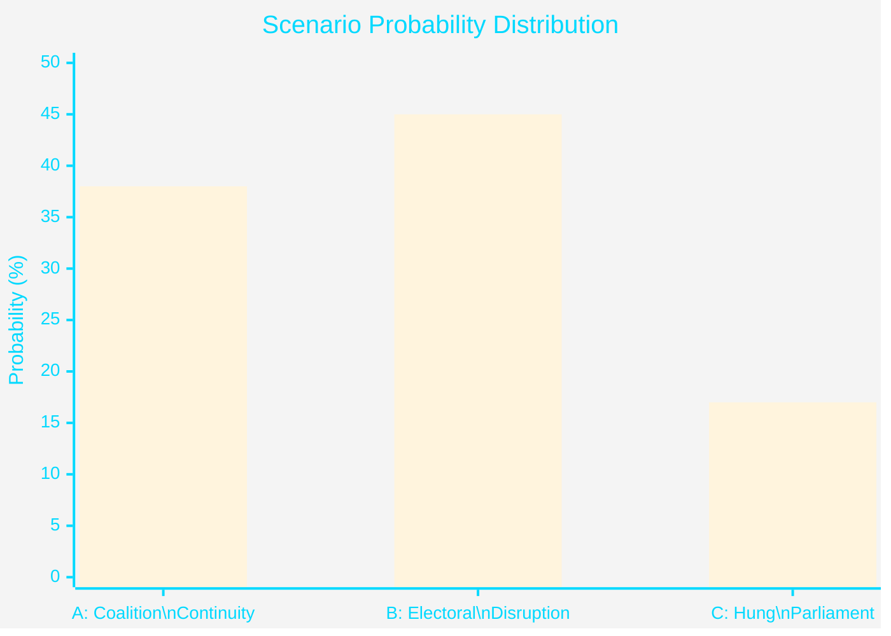

# Scenario Analysis — April 2026 Committee Reports

## Scenario Framework

Three mutually exclusive scenarios for Swedish political outcomes following the April 2026 committee reports wave, assessed across 6-month (pre-election) and 12-month (post-election) horizons.

---

## Scenario A: "Coalition Continuity" — Tidö Re-elected (Probability: 38%)

**Summary**: The April 2026 committee reports package — particularly HD01FiU48 fuel relief and HD01JuU10 weapons law — lands well with the coalition's core voters. HD01CU25 prison expansion signals decisive law-and-order action. Coalition wins September 2026 election with narrow majority.

**Enabling conditions**:
- Energy prices remain elevated through summer (HD01FiU48 remains salient and welcome)
- No major police incident that amplifies HD01JuU31 reform failure
- Opposition fragmented; S unable to consolidate left bloc
- IMF WEO Apr-2026 projects Sweden GDP +1.8% — economic story improves

**Leading indicators**:
- Coalition poll lead 2+ percentage points in June 2026
- Diesel prices stay >18 SEK/litre through August 2026
- No major court ruling against HD01JuU10 before election

**Downstream consequences**:
- HD01CU25 prison construction proceeds 2027-2030
- HD01JuU31 police reform remains unaddressed through next mandate
- HD01MJU21 climate contradiction deepens

---

## Scenario B: "Electoral Disruption" — Government loses, S-led bloc wins (Probability: 45%)

**Summary**: The emergency budget (HD01FiU48) framing as "election bribe" takes hold in media narrative. Police reform failure (HD01JuU31) undermines government's core law-and-order competence claim. S consolidates left bloc and wins narrow majority in September 2026.

**Enabling conditions**:
- HD01FiU48 attacked as "borrowed money for votes" by S leader in Prime Minister debate
- Police incident (shooting/gang violence) before election amplifies HD01JuU31 critique
- HD01MJU21 agricultural climate failure used by MP to draw voters from centre
- Economy softens — IMF WEO Oct-2026 revision downward

**Leading indicators**:
- S lead >3 pp in August polls (cross-party bloc calculation)
- Major criminal justice incident between July-August 2026
- Emergency budget framing dominates political TV coverage

**Downstream consequences**:
- HD01FiU48 partially reversed — fuel tax reinstated in S budget autumn 2026
- HD01JuU31 leads to Stage 2 police reform mandate
- HD01CU25 prison construction proceeds (bipartisan)
- HD01MJU21 used as basis for new agricultural climate strategy

---

## Scenario C: "Hung Parliament" — No majority, extended negotiations (Probability: 17%)

**Summary**: September 2026 produces no workable majority. Tidö parties cannot maintain coalition without C. S-led bloc is one seat short. Sweden faces minority government or coalition negotiation extending through November 2026.

**Enabling conditions**:
- SD and M diverge on HD01JuU10 (weapons law) — coalition cohesion frays before election
- C re-enters as "kingmaker" demanding reversal of some HD01FiU48 measures (climate deficit)
- Election produces 174-175 seat split with pivotal individual MPs

**Leading indicators**:
- Internal coalition dispute on HD01JuU10 in August 2026 media
- C party polls above 6% (survival threshold ensures kingmaker role)
- Three-way split in final polls (Tidö / S-bloc / uncertain)

**Downstream consequences**:
- HD01FiU23 Riksbank dividend issue re-opened as fiscal pressure increases
- HD01CU25 construction delays due to municipal legal challenges without political backing
- Researcher visa (HD01SfU23) implementation stalls in ministry transition

---

## Leading Indicators Table (Next 90 Days)

| Indicator | Scenario A signal | Scenario B signal | Scenario C signal | Source |
|-----------|------------------|------------------|------------------|--------|
| Coalition poll lead | +2pp | -3pp | <1pp either way | SVT/SCB polls |
| Diesel price (SEK/L) | >18 sustained | <17 (relief unnecessary) | Volatile | Statistics Sweden |
| Gang crime incidents | Stable or declining | Major incident | Fragmented pattern | BRÅ statistics |
| Court challenge to JuU10 | Dismissed | Granted interim injunction | Filed but pending | Förvaltningsrätten |
| IMF WEO revision | Sweden +1.5%+ | Sweden <1% | Mixed signals | IMF WEO Oct-2026 |

## Scenario Probability Calibration

*Note: Probabilities sum to 100%. Based on structural analysis of HD01FiU48, HD01JuU31, HD01JuU10 policy dynamics as of 2026-04-26.*

