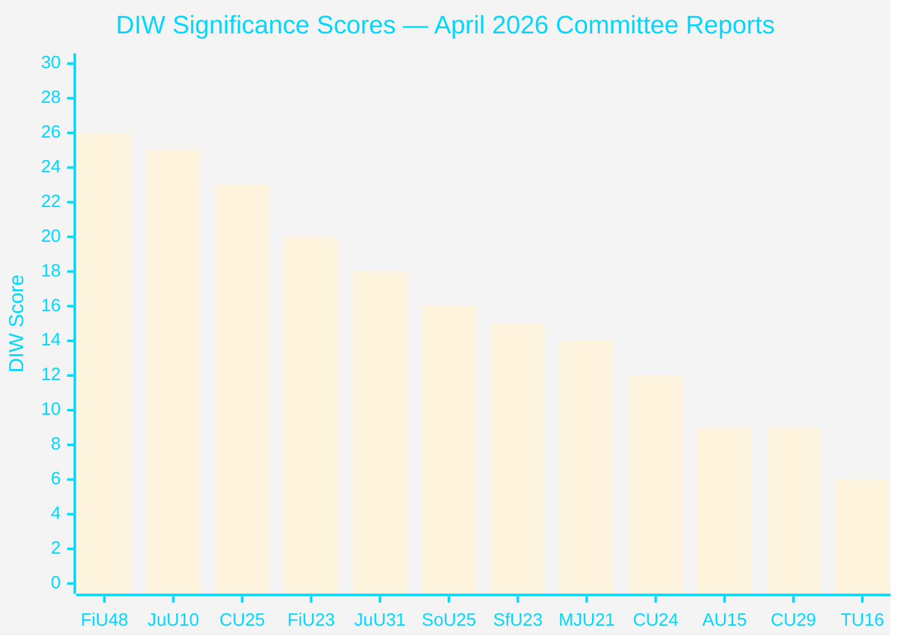

# Significance Scoring

## Scoring Methodology

DIW (Depth-Impact-Weight) framework: 0–10 scale across three dimensions:
- **D** (Depth of policy change): 1=minor tweak, 10=systemic reform
- **I** (Immediate political impact): 1=technical, 10=election-defining
- **W** (Watchlist weight): 1=routine, 10=intelligence-grade monitoring needed

## Document Rankings

| Rank | dok_id | Title | D | I | W | DIW Total | Tier |
|------|--------|-------|---|---|---|-----------|------|
| 1 | HD01FiU48 | Extra ändringsbudget Fuel Tax & Energy Support | 8 | 9 | 9 | **26** | L3 |
| 2 | HD01JuU10 | En ny vapenlag | 9 | 8 | 8 | **25** | L3 |
| 3 | HD01CU25 | Fast-track prison expansion | 8 | 7 | 8 | **23** | L2+ |
| 4 | HD01FiU23 | Riksbankens verksamhet 2025 | 7 | 6 | 7 | **20** | L2+ |
| 5 | HD01JuU31 | Police reform Riksrevisionen | 5 | 7 | 6 | **18** | L2 |
| 6 | HD01SoU25 | Elder care strengthened | 6 | 5 | 5 | **16** | L2 |
| 7 | HD01SfU23 | Researcher visa reform | 5 | 5 | 5 | **15** | L2 |
| 8 | HD01MJU21 | Agricultural climate assessment | 4 | 5 | 5 | **14** | L2 |
| 9 | HD01CU24 | Construction process efficiency | 4 | 4 | 4 | **12** | L1 |
| 10 | HD01AU15 | ILO conventions ratified | 3 | 3 | 3 | **9** | L1 |
| 11 | HD01CU29 | EV home charging rights | 3 | 3 | 3 | **9** | L1 |
| 12 | HD01TU16 | Driving intro requirement removed | 2 | 2 | 2 | **6** | L1 |

## Detailed Analysis

### 1. HD01FiU48 — Extra Budget: Fuel Tax Cut & Energy Support (DIW: 26/30) [A2]

**Justification**: 4.1 billion SEK combined fiscal impact (1.56B tax reduction + 2.4B energy support) from riksdagen.se (HD01FiU48). Timing — 6 months before September 2026 elections — elevates political salience to maximum. Government invokes Middle East conflict and cold winter as "special circumstances." Sets precedent for further emergency fiscal interventions. Energy security framing links to NATO/defence agenda.

**Sensitivity analysis**: Score range 23–28 depending on whether fuel tax cut becomes permanent post-September 2026.

### 2. HD01JuU10 — New Weapons Law (DIW: 25/30) [A2]

**Justification**: Comprehensive legislative overhaul from riksdagen.se (HD01JuU10). Semi-automatic rifle ban for hunting unprecedented in Swedish firearms policy. New penal structure distinguishes illegal possessors from regulatory violators. EU firearms harmonisation via simplification of cross-border rules for sport shooters and hunters. Effective 1 June 2026. Politically contested: SD and M traditionally resist restrictions; government likely needed cross-bloc support.

### 3. HD01CU25 — Fast-Track Prison Expansion (DIW: 23/30) [A2]

**Justification**: Government obtains power to override Plan and Building Act for prison construction from riksdagen.se (HD01CU25). Reflects structural capacity crisis: existing prisons at or above capacity; approved sentence escalations require ~30% more carceral space by 2030. Effective 1 July 2026. Creates legal exception that may be used beyond stated scope.

### 4. HD01FiU23 — Riksbank Zero Dividend (DIW: 20/30) [A1]

**Justification**: 5.297 billion SEK profit retained from riksdagen.se (HD01FiU23). Zero dividend to state treasury signals Riksbank preference for rebuilding equity after large 2022–2024 losses. Parliamentary committee approval of management discharge = implicit endorsement of Riksbank's 2025 operational performance. Riksbank interest rate (2.25% estimated end-2025) still above neutral — monetary buffer maintained.

### 5. HD01JuU31 — Police Reform Assessment (DIW: 18/30) [A1]

**Justification**: Riksrevisionen audit from riksdagen.se (HD01JuU31) finds Polismyndigheten "not worked sufficiently efficiently" to meet 2015 reform intentions. JuU closes with 18 motions rejected but no remedial mandate imposed. Political awkwardness: government acknowledges reform gap while avoiding structural solution.

## Sensitivity Analysis

If the fuel tax cut (HD01FiU48) is extended beyond September 2026, DIW score rises to 29/30 (budgetary permanence). If the new weapons law (HD01JuU10) faces legal challenge under EU firearms directive, significance rises to L3 requiring parliamentary emergency session.

