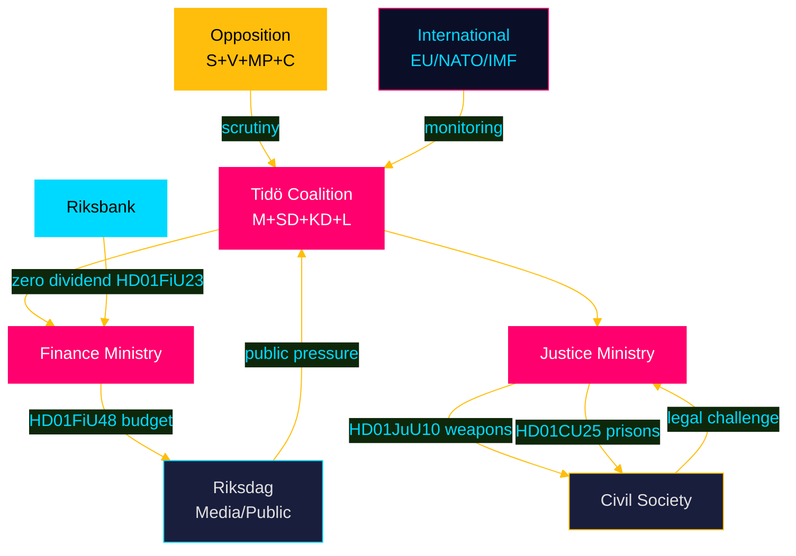

# Stakeholder Perspectives — April 2026 Committee Reports

## 6-Lens Stakeholder Matrix

### Lens 1: Governing Coalition (Tidö: M + SD + KD + L)

**Primary interests**: Re-election (September 2026); law-and-order credibility; cost-of-living relief
**Position on HD01FiU48 (fuel tax cut)**: Strong support — Moderaterna (fiscal pragmatism), SD (working class voters), KD (rural voters), L (market flexibility)
**Position on HD01JuU10 (weapons law)**: Internally split — KD and SD have rural/hunting constituencies; M urban; compromise achieved through semi-auto ban (not broad ban)
**Position on HD01CU25 (prisons)**: Unanimous — core criminal justice agenda
**Key actor**: Finance Minister (M) for HD01FiU48; Justice Minister (M) for JuU10/CU25
**Influence level**: Maximum (governing majority) [A2, riksdagen.se]

### Lens 2: Opposition (S + V + MP + C)

**S (Social Democrats)**:
- HD01FiU48: Will accept energy relief substance but challenge process and timing
- HD01JuU31: Use police reform failure to challenge government's public safety narrative
- Electoral positioning: "Government uses emergency powers for election spending"
- Key actor: Socialdemokraternas riksdagsgrupp [A2]

**V (Left Party)**:
- HD01FiU48: Support energy support component, oppose fuel tax cut as fossil subsidy
- HD01JuU10: Support weapons restrictions; demand broader scope
- Key actor: Vänsterpartiet riksdagsgrupp [A2]

**MP (Green Party)**:
- HD01MJU21: Use agricultural climate failure as attack vector
- HD01FiU48: Oppose fuel tax cut as direct contradiction of climate policy
- Key actor: Miljöpartiet riksdagsgrupp [A2]

**C (Centre Party)**:
- Split from coalition: May support some measures on rural policy grounds
- HD01JuU10: Likely opposed to semi-auto ban on rural/hunting grounds [B2]

### Lens 3: Civil Society and Interest Groups

**Jägarförbundet (Hunters' Association)**:
- HD01JuU10: Strong opposition to semi-automatic rifle ban; will pursue legal challenges
- Influence: Moderate-High (regional political network) [B2]

**Kommunförbundet (Municipal Federation)**:
- HD01CU25: Opposition to Plan and Building Act override for prison siting
- Influence: High (350 member municipalities) [B2]

**LO (Main Trade Union Confederation)**:
- HD01AU15: Strong support for ILO violence convention ratification
- HD01FiU48: Energy support welcomed; fuel tax cut seen as insufficient for workers

**Riksbank management (Governor Erik Thedéen)**:
- HD01FiU23: Retained profit signals institution's own preference for equity buffer
- Will resist pressure for extraordinary dividend in 2026 [A1]

### Lens 4: Business and Industry

**Swedish Industry Federation (Industriförbundet)**:
- HD01SfU23: Strong support for researcher visa reform — talent pipeline issue
- HD01FiU48: Diesel tax relief supports logistics and transport sector costs
- HD01CU24: Support for construction process efficiency

**Energy sector (Vattenfall, E.ON)**:
- HD01FiU48: Complex — el/gas price support increases consumption but reduces political risk of energy price volatility backlash

**Construction and Real Estate (Fastighetsägarna, byggbranschen)**:
- HD01CU24: Support for streamlined building process
- HD01CU29: Slight impact — EV charging mandate

### Lens 5: International Actors

**European Commission**:
- HD01JuU10: Monitoring for Firearms Directive compliance
- HD01FiU48: Watching for excessive deficit procedure implications (Sweden runs surplus; 4.1B SEK impact small)
- HD01SfU23: Welcoming EU research mobility rules transposition

**NATO/Allied partners**:
- HD01FiU48: Emergency budget framing references Middle East — geopolitical signal to NATO partners
- HD01CU25: Prison expansion aligns with broader law-and-order NATO "home front" security framing

**IMF (WEO Apr-2026 context)**:
- HD01FiU48: Mild concern about pre-election fiscal loosening; Sweden's fiscal position strong enough to absorb [B2]

### Lens 6: Media and Public Opinion

**Mainstream media (SVT, DN, SvD)**:
- HD01FiU48: High coverage — cost-of-living relief is audience-friendly; timing scrutiny
- HD01JuU10: Moderate coverage — weapons law editorially complex
- HD01JuU31: Medium coverage — institutional accountability story

**Social media / populist channels**:
- HD01FiU48: Viral potential — direct household impact; SD base mobilisation
- HD01CU25: Prison capacity = core SD/M voter concern

## Influence Network

