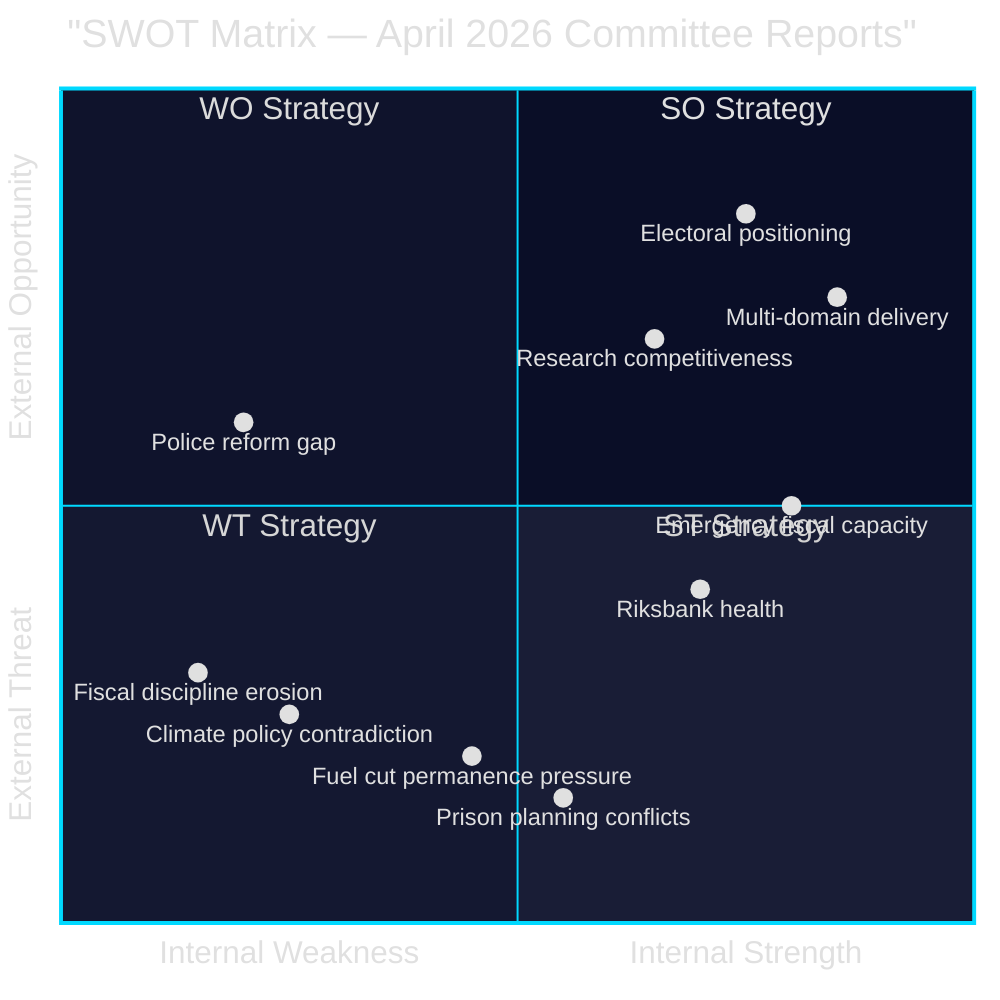

# SWOT Analysis — April 2026 Swedish Parliamentary Committee Reports

## Analytical Framework

SWOT analysis applied to the **Tidö coalition government's legislative position** as revealed by the April 2026 committee report cluster. Evidence citations from primary sources throughout.

---

### Strengths

- **Broad security-and-welfare agenda delivery**: The coalition simultaneously enacted weapons law (HD01JuU10, riksdagen.se), prison expansion (HD01CU25, riksdagen.se), elder care improvement (HD01SoU25, riksdagen.se), and researcher visa reform (HD01SfU23, riksdagen.se) — demonstrating multi-domain legislative competence [A2]
- **Emergency fiscal responsiveness**: Extra budget (HD01FiU48, riksdagen.se) shows ability to mobilise support for cost-of-living relief ahead of elections — "special circumstances" invocation accepted by Riksdag [A2]
- **Riksbank institutional health**: 5.297 billion SEK Riksbank profit (HD01FiU23, riksdagen.se) with full management discharge signals monetary credibility and institutional stability [A1]
- **EU harmonisation**: ILO conventions (HD01AU15), EV charging directive (HD01CU29), researcher visa EU rules (HD01SfU23) — all from riksdagen.se — demonstrate compliance with European agenda [A2]

### Weaknesses

- **Police reform failure unresolved**: Riksrevisionen found Polismyndigheten failed 2015 reform goals (HD01JuU31, riksdagen.se); JuU chose to close without remedial mandate — governance gap acknowledged, not addressed [A1]
- **Fiscal discipline erosion signal**: Extra budget (HD01FiU48, riksdagen.se) creates 4.1 billion SEK deficit deterioration; setting precedent for pre-election emergency spending undermines Sweden's traditionally conservative fiscal reputation (WEO Apr-2026 context) [A2]
- **Agricultural climate policy failure**: Riksrevisionen found government's climate steering of agriculture "not led to agriculture contributing to climate goals effectively" (HD01MJU21, riksdagen.se) — green credibility gap [A1]
- **Prison plan vs. Planning Law tension**: Using government override of Plan and Building Act for prisons (HD01CU25, riksdagen.se) sets a precedent for executive bypass of local democracy in spatial planning [A2]

### Opportunities

- **Electoral positioning**: Fuel/energy support (HD01FiU48), weapons protection (HD01JuU10), elder care (HD01SoU25) all from riksdagen.se — combined welfare + security + fiscal relief messaging ideal for September 2026 election campaign [A2]
- **Weapons law as EU model**: Sweden's semi-automatic ban (HD01JuU10, riksdagen.se) positions Sweden as EU leader in firearms regulation alongside France and Germany — potential soft-power gain [B2]
- **Research talent attraction**: Faster permanent residency for researchers/doctoral students (HD01SfU23, riksdagen.se) could boost Sweden's innovation competitiveness in a European talent war context [B2]
- **Riksbank profit reservoir**: 5.297 billion SEK retained Riksbank equity (HD01FiU23, riksdagen.se) provides buffer for future extraordinary costs or another extraordinary state support if needed [A1]

### Threats

- **Fuel tax cut permanence pressure**: If Middle East conflict persists, 82 öre/litre fuel relief expires 30 September 2026 (HD01FiU48, riksdagen.se) — government faces politically painful reversal or permanent fiscal commitment [A2]
- **Weapons law legal challenge**: EU firearms directive ambiguities may enable legal challenges to the semi-automatic ban (HD01JuU10, riksdagen.se) from hunting lobbies or via CJEU referral [B3]
- **Police reform accountability gap**: Riksrevisionen's critique of Polismyndigheten (HD01JuU31, riksdagen.se) without follow-up action risks recurrence and future audit escalation [A1]
- **Prison expansion planning conflicts**: Fast-track construction permits (HD01CU25, riksdagen.se) may generate municipal resistance, litigation, and NIMBYism — slowing the very expansion the law is designed to accelerate [B2]

## TOWS Matrix

| | Strengths | Weaknesses |
|---|---|---|
| **Opportunities** | **SO**: Use weapons law + elder care + researcher visas as unified "safe, ageing, innovative Sweden" election platform (HD01JuU10 + HD01SoU25 + HD01SfU23, riksdagen.se) | **WO**: Address police reform gap (HD01JuU31) by linking it to prison capacity solution (HD01CU25) — create unified criminal justice narrative |
| **Threats** | **ST**: Pre-announce autumn budget intention to make fuel relief permanent — convert temporary measure to structural reform before September 2026 elections (HD01FiU48) | **WT**: Commission independent review of Polismyndigheten (HD01JuU31) to neutralise Riksrevisionen critique before audit becomes election liability |

## Cross-SWOT Summary

The April 2026 committee cluster reveals a coalition in active pre-election legislative consolidation. Strengths in multi-domain delivery are partially offset by institutional failures (police reform) and fiscal risks (emergency budget precedent). The most significant strategic gap is the absence of a coherent climate-economy reconciliation: the fuel tax cut (HD01FiU48) directly contradicts the agricultural climate findings (HD01MJU21).

