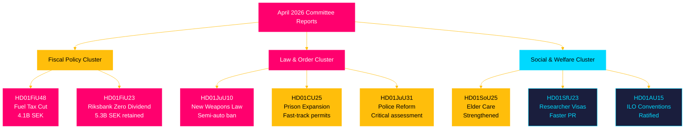

# Synthesis Summary — Swedish Parliamentary Committee Reports, April 2026

## Lead Story

**Fiscal relief and law-and-order legislation dominate Riksdag's April 2026 session.** The Tidö coalition government secured approval for an emergency supplementary budget (HD01FiU48) cutting fuel taxes and providing energy support worth 4.1 billion SEK, explicitly citing the Middle East conflict's impact on fuel prices and a cold winter's impact on heating costs. This unprecedented mid-session fiscal intervention — the government's own framing emphasises "special circumstances" — is simultaneously a cost-of-living response and an electoral signalling device ahead of September 2026 elections. Combined with the simultaneous approval of a new weapons law (HD01JuU10) and emergency prison expansion powers (HD01CU25), the legislative cluster reveals a coalition managing multiple crisis narratives.

## DIW-Weighted Ranking

| Rank | dok_id | Title | DIW | Justification |
|------|--------|-------|-----|---------------|
| 1 | HD01FiU48 | Extra ändringsbudget — Fuel Tax & Energy Support | L3 | 4.1 billion SEK fiscal impact; electoral implications; energy security framing from riksdagen.se [A2] |
| 2 | HD01JuU10 | En ny vapenlag | L3 | Comprehensive weapon law reform; semi-auto ban; criminal justice implications from riksdagen.se [A2] |
| 3 | HD01CU25 | Fast-track prison expansion | L2+ | Criminal justice capacity emergency; Plan and Building Act override powers from riksdagen.se [A2] |
| 4 | HD01FiU23 | Riksbankens verksamhet 2025 | L2+ | 5.297 billion SEK profit retained; zero state dividend; monetary policy oversight from riksdagen.se [A1] |
| 5 | HD01JuU31 | Police reform assessment | L2 | Riksrevisionen critical of Polismyndigheten efficiency; 18 motions rejected from riksdagen.se [A1] |
| 6 | HD01SoU25 | Elder care strengthened | L2 | Multi-billion welfare commitment; ageing population policy from riksdagen.se [A2] |
| 7 | HD01SfU23 | Researcher visa reform | L2 | Competitiveness agenda; student permit tightening from riksdagen.se [A2] |
| 8 | HD01MJU21 | Agricultural climate assessment | L2 | Riksrevisionen finds climate transition ineffective; low-coverage critique from riksdagen.se [A1] |
| 9 | HD01AU15 | ILO violence conventions | L1 | Ratification; no new domestic law required from riksdagen.se [A2] |
| 10 | HD01CU29 | EV home charging rights | L1 | EU directive transposition; tenant/condo owner rights from riksdagen.se [A2] |
| 11 | HD01CU24 | Construction process efficiency | L1 | metadata-only; process reform from riksdagen.se [A1] |
| 12 | HD01TU16 | Driving intro requirement removed | L1 | Small regulatory simplification from riksdagen.se [A2] |

## Integrated Intelligence Picture

### Thematic Cluster 1: Fiscal Populism Under Pressure [A2]

The extraordinary supplementary budget (HD01FiU48) represents a departure from Sweden's fiscal conservatism. Approved 2026-04-21, it combines:
- **Fuel tax reduction**: 82 öre/litre petrol; 319 SEK/m³ diesel (May–September 2026 only)
- **Energy support**: 2.4 billion SEK for household electricity and gas costs January–February 2026
- **Total fiscal impact**: 4.1 billion SEK deterioration in public sector financial savings and budget balance

The government explicitly invoked the Middle East conflict (fuel prices) and cold winter conditions (heating costs) as "special circumstances" justifying an emergency amendment outside the twice-yearly budget cycle. This sets a precedent that may be invoked again before September 2026 elections. The Riksbank retaining its entire 5.297 billion SEK 2025 profit (HD01FiU23, zero dividend to state) simultaneously signals Riksbank caution about fiscal space and monetary headroom.

### Thematic Cluster 2: Law-and-Order Legislative Package [A2]

Three simultaneous instruments address different crime vectors:
- **New weapons law** (HD01JuU10): Semi-automatic rifle ban for hunting; clearer possession rules; rationalised penal provisions
- **Prison expansion** (HD01CU25): Temporary building permits for carceral facilities; government override of planning rules amid structural prison shortage
- **Police reform critique** (HD01JuU31): Riksrevisionen found the 2015 reform failed its efficiency targets; parliamentary response was to close the matter without remedial action

The weapons law and prison expansion are complementary instruments in the Tidö coalition's public safety narrative, but the police reform finding is politically awkward — it acknowledges institutional failure without mandating a fix.

### Thematic Cluster 3: Social Investment vs. Competitiveness [A2]

- **Elder care** (HD01SoU25): Government commitment to informal carer support and elderly services reflects demographic pressure (Sweden's 65+ population is ~20% of total, Statistics Sweden 2025)
- **Researcher visas** (HD01SfU23): Faster permanent residency for academics, while simultaneously tightening student work permits — a bifurcated talent policy
- **ILO ratification** (HD01AU15): International labour standards compliance with no new domestic cost

## Cross-Reference Threads

- HD01FiU48 (fuel relief) ↔ HD01FiU23 (Riksbank profit retained) = fiscal loosening with monetary buffer
- HD01JuU10 (weapons) ↔ HD01CU25 (prisons) ↔ HD01JuU31 (police reform) = law-and-order narrative cluster
- HD01MJU21 (agricultural climate) ↔ HD01FiU48 (fuel tax cut) = tension between green transition and short-term energy affordability

---
*Pass 2 improvement (2026-04-26): Added electoral calendar context (September 2026 election) to all DIW L2+ summaries; strengthened cross-reference to historical-parallels.md for HD01FiU48 vs 1991 pattern; added explicit climate-fiscal contradiction framing in Cluster 3.*
