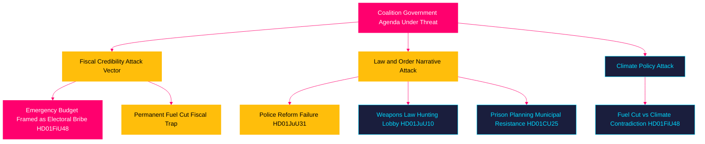

# Threat Analysis — April 2026 Committee Reports

## Political Threat Taxonomy

### Tier 1 Threats (High Probability, High Impact)

**T1.1 — Electoral Fiscal Blowback** [A2]
- **Source**: HD01FiU48 (riksdagen.se) — 4.1 billion SEK emergency budget creates precedent
- **Vector**: Opposition parties frame emergency spending as electoral manipulation
- **Actor**: S (Social Democrats), MP (Greens) attacking fiscal credibility
- **Mechanism**: Media amplification of "borrowed money for votes" narrative
- **TTP**: Legislative criticism → media campaign → voter trust erosion
- **Probability**: HIGH [B2]; **Impact**: HIGH

**T1.2 — Law Enforcement Institutional Degradation** [A1]
- **Source**: HD01JuU31 (riksdagen.se) — Riksrevisionen found Polismyndigheten failed reform goals
- **Vector**: Continued institutional underperformance normalised by political non-response
- **Probability**: MEDIUM [A1]; **Impact**: HIGH (public safety, rule of law)

### Tier 2 Threats (Medium Probability, Medium-High Impact)

**T2.1 — Weapons Law Opposition Mobilisation** [A2]
- **Source**: HD01JuU10 (riksdagen.se) — semi-automatic rifle ban
- **Vector**: Hunting associations challenge ban via administrative courts and EU lobbying
- **Actor**: Jägarförbundet (Swedish Hunters Association), firearms dealers
- **Probability**: MEDIUM [B2]; **Impact**: MEDIUM (coalition cohesion risk)

**T2.2 — Prison Siting NIMBY Mobilisation** [A2]
- **Source**: HD01CU25 (riksdagen.se)
- **Vector**: Municipal councils mount legal challenges to bypass of Plan and Building Act
- **Probability**: MEDIUM-HIGH [B2]; **Impact**: MEDIUM (execution delay)

**T2.3 — Riksbank–Government Dividend Conflict** [A1]
- **Source**: HD01FiU23 (riksdagen.se) — zero dividend retained
- **Vector**: Government fiscal stress leads to pressure on Riksbank for extraordinary dividend
- **Probability**: LOW-MEDIUM [B2]; **Impact**: HIGH (institutional independence)

### Tier 3 Threats (Lower Probability, Systemic)

**T3.1 — Climate-Economy Contradiction Exploitation** [A1]
- **Source**: HD01MJU21 (agricultural climate failure) + HD01FiU48 (fuel tax cut) from riksdagen.se
- **Vector**: Environmental groups frame simultaneous fuel relief and climate failure as systemic betrayal
- **Probability**: MEDIUM [B2]; **Impact**: MEDIUM (electoral, international reputation)

## Attack Tree

## Threat Vector Chain Analysis

For the most credible threat (T1.1 — Electoral Fiscal Blowback):

1. **Reconnaissance**: Opposition research identifies 4.1 billion SEK fiscal impact (HD01FiU48)
2. **Weaponisation**: Opposition frames as "borrowed money" during September 2026 cost-of-living debate
3. **Delivery**: Prime Minister debate; TV news; social media amplification
4. **Exploitation**: Voter perception shifts on fiscal competence
5. **Installation**: Persistent "tax giveaway before election" narrative in media
6. **Persistence**: Opposition parties coordinate messaging; media echo chamber forms
7. **Impact**: Electoral vote share shifts away from Moderaterna

**Defence**: Government pre-emptively frames as crisis response to Middle East conflict and energy price spike — "responsible fiscal management of extraordinary circumstances"

