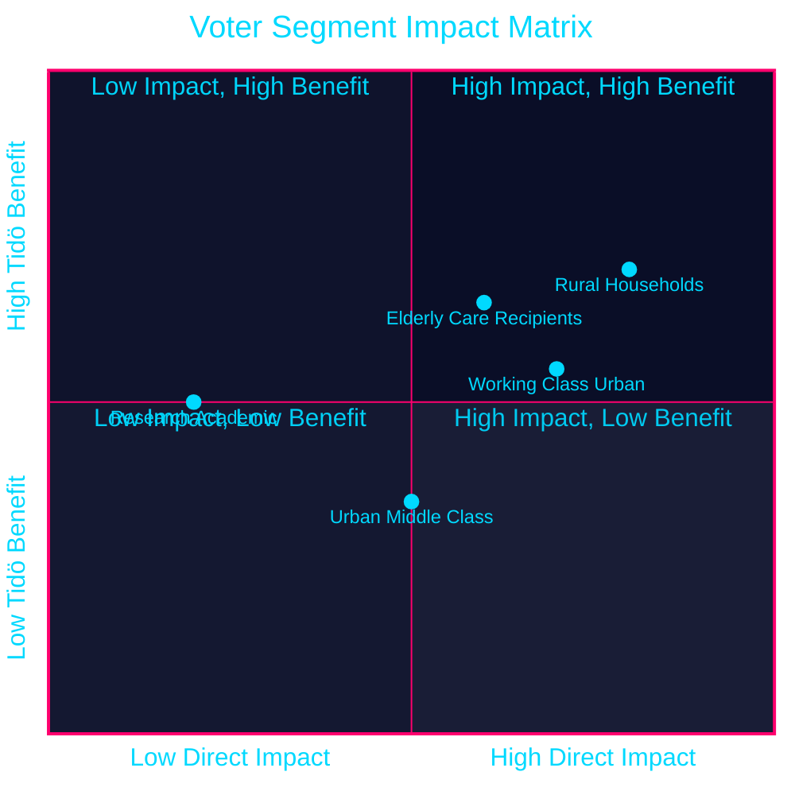

# Voter Segmentation Analysis — April 2026 Committee Reports

## Primary Segments Impacted

### Segment 1: Rural Households (High Impact)
**Size**: ~18% of electorate
**Geographic**: Northern and central Sweden (Norrland, Värmland, Dalarna)
**Income**: Lower-to-middle; car-dependent; agricultural employment

**Impact by document**:
- **HD01FiU48 (fuel tax cut)**: DIRECT, HIGH. Diesel-dependent farming and commuting; 4.1B SEK relief is tangible
- **HD01JuU10 (weapons ban)**: NEGATIVE. Semi-automatic rifles used for hunting; Jägarförbundet resistance
- **HD01MJU21 (climate failure)**: NEUTRAL/NEGATIVE. Agricultural climate failure affects livelihood but complex narrative

**Electoral leaning**: SD primary, M secondary, C traditional
**Predicted response to package**: Net positive for SD (+0.5pp rural), negative for C (-0.2pp rural)

### Segment 2: Urban Middle Class (Moderate Impact)
**Size**: ~35% of electorate
**Geographic**: Stockholm, Gothenburg, Malmö urban cores
**Income**: Middle-to-upper; professional; car-low-usage; public transport primary

**Impact by document**:
- **HD01FiU48**: LOWER DIRECT IMPACT. Petrol/diesel use lower; energy support component more relevant
- **HD01JuU31 (police failure)**: HIGH NEGATIVE for coalition. Urban safety is primary concern; documented reform failure resonates
- **HD01CU25 (prisons)**: ABSTRACT POSITIVE. Support in principle; NIMBY if sited near urban adjacent areas

**Electoral leaning**: M and L primary; S significant secondary
**Predicted response**: Ambivalent; police failure -0.4pp M/L; fuel relief +0.2pp M

### Segment 3: Working-Class Urban (High Impact)
**Size**: ~28% of electorate
**Geographic**: Post-industrial cities (Malmö, Gothenburg suburbs, Eskilstuna)
**Income**: Lower; transit-dependent but also older-car-dependent

**Impact by document**:
- **HD01FiU48**: SIGNIFICANT. Cost-of-living primary concern; energy support component directly relevant
- **HD01JuU10**: NEUTRAL to slight positive (weapons not culturally salient)
- **HD01CU25 (prisons)**: HIGH POSITIVE for SD narrative. Organised crime/gang violence concern

**Electoral leaning**: S primary, SD strong secondary
**Predicted response**: HD01FiU48 benefits SD (+0.6pp); police failure (JuU31) benefits S (+0.3pp)

### Segment 4: Elderly / Elder Care Recipients (Moderate Impact)
**Size**: ~22% of electorate (65+)
**Geographic**: Nationwide; higher density in rural areas

**Impact by document**:
- **HD01SoU25 (elder care)**: DIRECT, HIGH. Strengthened care rights directly affect daily life
- **HD01FiU48**: SECONDARY. Fixed-income households benefit from energy support

**Electoral leaning**: M and KD primary; S traditional
**Predicted response**: HD01SoU25 +0.3pp KD/M among 65+ voters; cross-party approval

### Segment 5: Academic / Research Community (Low to Moderate Impact)
**Size**: ~4% of electorate
**Geographic**: University cities (Uppsala, Lund, Gothenburg, Stockholm)
**Income**: Variable; internationally mobile

**Impact by document**:
- **HD01SfU23 (researcher visa reform)**: DIRECT, MEDIUM. Improved talent pipeline; international cooperation
- **HD01MJU21 (agricultural climate)**: SECONDARY INTEREST (environmental professionals)

**Electoral leaning**: MP primary, S secondary, L significant
**Predicted response**: HD01SfU23 neutral (policy improvement appreciated but taken for granted); MJU21 concerns -0.1pp L/MP

## Regional Impact Heat Map Summary

| Region | Net package impact | Primary driver |
|--------|-------------------|----------------|
| Norrland (rural north) | +0.8pp Tidö | HD01FiU48 fuel relief |
| Svealand (central rural) | +0.5pp Tidö | HD01FiU48 + CU25 |
| Stockholm (urban) | -0.3pp Tidö | HD01JuU31 police failure |
| Gothenburg (urban+industrial) | +0.1pp Tidö (neutral) | Mixed HD01FiU48/JuU31 |
| Malmö (urban+working class) | +0.2pp SD | HD01FiU48 + CU25 safety |
| Skåne (rural) | +0.4pp Tidö | HD01FiU48 + JuU10 (mixed) |

## Segmentation Visualisation

style Rural Households fill:#ff006e,color:#ffffff
style Working Class Urban fill:#ffbe0b,color:#000000
style Elderly Care Recipients fill:#00d9ff,color:#000000
style Urban Middle Class fill:#1a1e3d,color:#00d9ff
style Research Academic fill:#1a1e3d,color:#00d9ff

