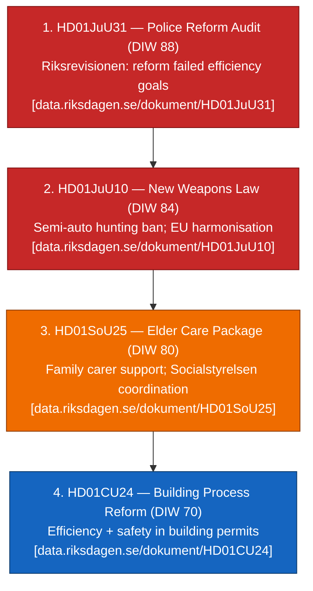
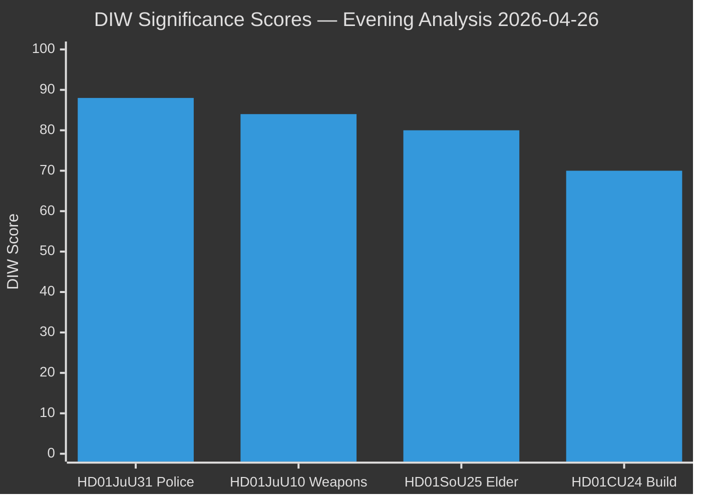
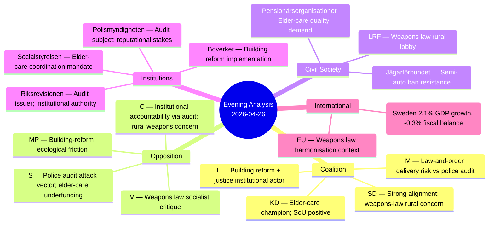
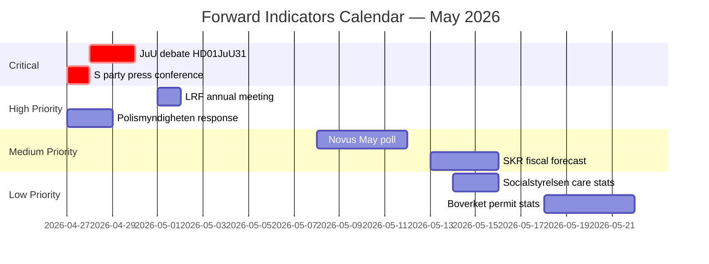
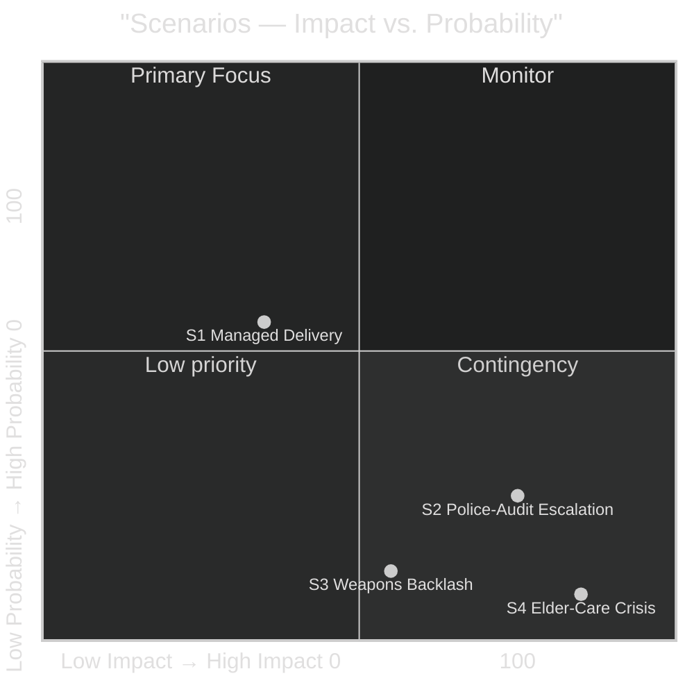
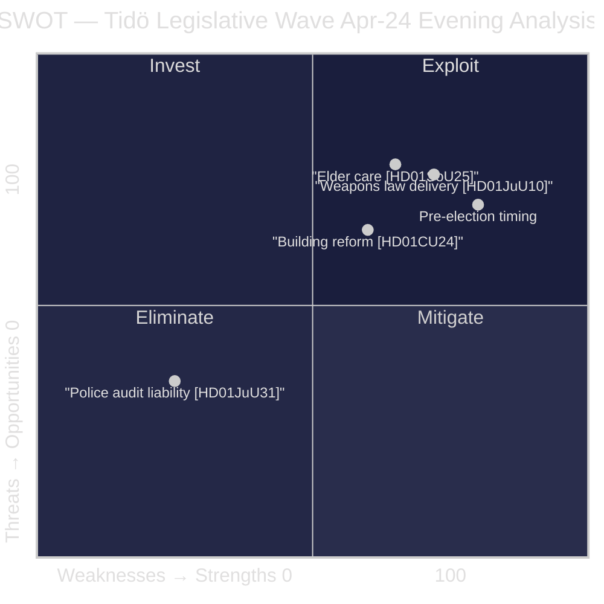
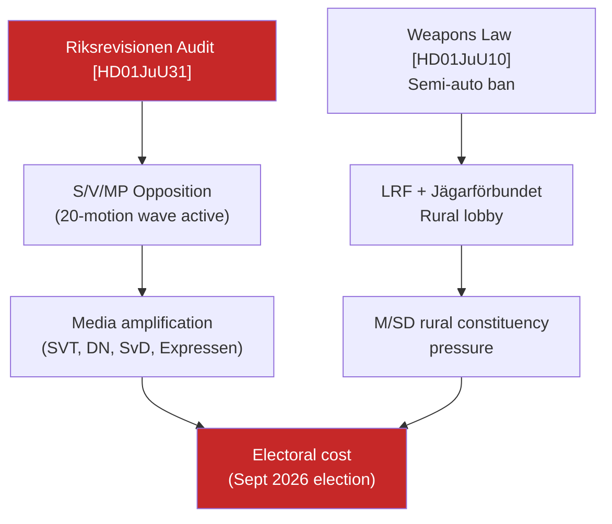
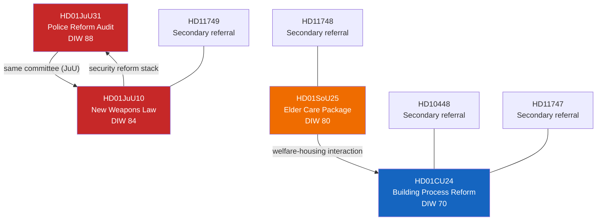

## What Happened
<!-- source: executive-brief.md :: https://github.com/Hack23/riksdagsmonitor/blob/main/analysis/daily/2026-04-26/evening-analysis/executive-brief.md -->

**Base date**: 2026-04-26 (data: 2026-04-24 lookback)

### Lede
The Riksdag's April 24 tabling wave confirms the Tidö coalition is executing a multi-front pre-election legislative sprint: a landmark new weapons law banning certain semi-automatic hunting rifles (`HD01JuU10`), an elder-care strengthening package (`HD01SoU25`), and a more efficient building-permit framework (`HD01CU24`) will all pass before the September 2026 Riksdag election. Simultaneously, the Riksrevisionen's damning audit of the 2015 Police Reform (`HD01JuU31`) — finding that Polismyndigheten failed to reach the reform's core efficiency and quality goals — creates a narrative liability for the governing coalition at the precise moment it needs to claim delivery credibility on law enforcement. IMF projects Sweden GDP growth at +2.1% (WEO Apr-2026, NGDP_RPCH) in 2026, providing a benign macro backdrop for fiscal commitments embedded in elder-care and policing packages.

### 🧭 3 Decisions This Brief Supports

1. **Editorial decision**: Lead with weapons law or police-reform audit as the dominant news story of the day? The weapons law is the positive Tidö delivery signal; the police-reform audit is the liability signal. The audit carries higher newsworthiness owing to its institutional accountability framing.

2. **Opposition strategy**: S, V, MP have existing motions targeting police reform framing (see `analysis/daily/2026-04-24/motions/synthesis-summary.md`). Do they press the Riksrevisionen audit narrative aggressively ahead of the election?

3. **Investor / implementation**: Elder-care package (HD01SoU25) and building-process reform (HD01CU24) both carry implementation deadlines into 2026–2027. Municipal capacity, Socialstyrelsen oversight, and Boverket enforcement are the key watchpoints.

### 60-Second Summary

| Signal | Key finding | Salience |
|--------|------------|---------|
| HD01JuU10 — New Weapons Law | JuU approves new comprehensive gun law banning certain semi-auto hunting rifles; flex storage rules; EU-harmonised sport-shooter rules | 🔴 HIGH |
| HD01SoU25 — Elder Care Package | SoU strengthens family-caregiver support, respite care, coordination duties; elderly population pressure by 2030 | 🔴 HIGH |
| HD01JuU31 — Police Reform Audit | Riksrevisionen: Polismyndigheten has not worked efficiently enough to reach the 2015 reform's goals | 🔴 HIGH |
| HD01CU24 — Building Process | CU approves more efficient and secure building process; housing-supply implications | 🟡 MEDIUM |

### Top Forward Trigger

**Riksdag election 2026-09** — all four legislative items will form part of the Tidö coalition's delivery narrative OR its accountability exposure, depending on whether police capacity improves and elder-care rollout proceeds on schedule. Key watchpoint: Polismyndigheten's Q2 2026 operational report (due ~July 2026).

### Confidence Label

HIGH — all four primary documents are `bet` (committee report = voted recommendation) from Riksdag open data [A1]; police-reform narrative supported by Riksrevisionen public report [A1]; IMF economic macro from verified WEO Apr-2026 dataset [A1].

## Reader Intelligence Guide

Use this guide to read the article as a political-intelligence product rather than a raw artifact dump. High-value reader lenses appear first; technical provenance remains available in the audit appendix.

| Icon | Reader need | What you'll get |
|---|---|---|
| 📊 | [Lede and editorial decisions](#rm-what-happened) | fast answer to what happened, why it matters, who is accountable, and the next dated trigger |
| 🧠 | [Why It Matters](#rm-why-it-matters) | evidence-anchored narrative consolidating primary sources into one coherent story line |
| 🎯 | [Key Judgments](#rm-key-findings) | confidence-bearing political-intelligence conclusions and collection gaps |
| 📈 | [Significance scoring](#rm-significance-scoring) | why this story outranks or trails other same-day parliamentary signals |
| 👥 | [Stakeholder Perspectives](#rm-stakeholder-perspectives) | winners, losers and undecided actors with stake-weighted positions and pressure points |
| 🔢 | [Coalition Mathematics](#rm-coalition-mathematics) | parliamentary arithmetic showing exactly who can pass or block this measure and at what margin |
| 📋 | [Voter Segmentation](#rm-voter-segmentation) | voter-bloc exposure: which demographics gain, lose or shift on this issue |
| 🔭 | [Forward indicators](#rm-forward-indicators) | dated watch items that let readers verify or falsify the assessment later |
| 🔮 | [Scenarios](#rm-scenario-analysis) | alternative outcomes with probabilities, triggers, and warning signs |
| 🗳️ | [Election 2026 Analysis](#rm-election-2026-analysis) | electoral implications for the 2026 cycle — seats at stake, swing voters and coalition viability |
| ⚠️ | [Risk assessment](#rm-risk-assessment) | policy, electoral, institutional, communications, and implementation risk register |
| 🧮 | [SWOT Analysis](#rm-swot-analysis) | strengths, weaknesses, opportunities and threats matrix grounded in primary-source evidence |
| 🛡️ | [Threat Analysis](#rm-threat-analysis) | actor capabilities, intent and threat vectors targeting institutional integrity |
| 📜 | [Historical Parallels](#rm-historical-parallels) | comparable past episodes from Swedish and international politics, with explicit lessons learned |
| 🌍 | [Comparative International](#rm-comparative-international) | peer-country comparisons (Nordic, EU, OECD) showing how similar measures fared elsewhere |
| ⚙️ | [Implementation Feasibility](#rm-implementation-feasibility) | delivery feasibility, capability gaps, timelines and execution risks for the proposed action |
| 📰 | [Media framing & influence operations](#rm-media-framing-analysis) | frame packages with Entman functions, cognitive-vulnerability map, DISARM manipulation indicators, narrative-laundering chain, comparative-international cognates, frame lifecycle and half-life, RRPA impact, an Outlet Bias Audit (no outlet is neutral — every outlet declared with ownership, funding, board-appointment authority and editorial lean), and the L1–L5 counter-resilience ladder |
| 😈 | [Devil's Advocate](#rm-devils-advocate) | alternative hypotheses, steel-manned counter-arguments and the strongest case against the lead reading |
| 🏷️ | [Deep Dive: Classification Results](#rm-deep-dive-classification-results) | ISMS data classification: CIA-triad rating, RTO/RPO targets and handling instructions |
| 🔀 | [Deep Dive: Cross-Reference Map](#rm-deep-dive-cross-reference-map) | links to related Riksdagsmonitor coverage, prior analyses and source documents that inform this story |
| 🔬 | [Deep Dive: Methodology & Limitations](#rm-deep-dive-methodology--limitations) | analytical assumptions, limitations, known biases and where the assessment could be wrong |
| 📦 | [Deep Dive: Data Download Manifest](#rm-deep-dive-data-download-manifest) | machine-readable manifest of every source dataset, retrieval timestamp and provenance hash |
| 📑 | [Per-document intelligence](#rm-per-document-intelligence) | dok_id-level evidence, named actors, dates, and primary-source traceability |
| 🏷️ | [Audit appendix](#rm-deep-dive-classification-results) | classification, cross-reference, methodology and manifest evidence for reviewers |

## Why It Matters
<!-- source: synthesis-summary.md :: https://github.com/Hack23/riksdagsmonitor/blob/main/analysis/daily/2026-04-26/evening-analysis/synthesis-summary.md -->

### Lead story / decision

The dominant signal in the April 24–26 Riksdag tabling window is a **three-pillar pre-election delivery cluster** framed around security, welfare, and regulatory modernisation. The Tidö coalition's weapons law (`HD01JuU10`), elder-care package (`HD01SoU25`), and building-reform (`HD01CU24`) all clear the committee stage simultaneously — while the **Riksrevisionen police-reform audit** (`HD01JuU31`) introduces a counter-narrative of institutional underperformance that opposition parties will exploit ahead of the September 2026 election ([riksdagen.se/dokument/HD01JuU31](https://data.riksdagen.se/dokument/HD01JuU31.html) [A1]).

### DIW-weighted ranking



### Integrated intelligence picture

#### 1. Police Reform Audit (HD01JuU31) — Institutional accountability signal

Riksrevisionen's audit of the 2015 Police Reform is the dominant accountability signal for the evening's news cycle. The audit finds that Polismyndigheten has **not worked sufficiently efficiently** to achieve the reform's intentions of increased flexibility, improved results, higher quality, and greater cost-effectiveness ([HD01JuU31](https://data.riksdagen.se/dokument/HD01JuU31.html) [A1]). The government notes progress on results-focused governance. JuU proposes Riksdagen reject 18 opposition motion proposals on this topic. For the Tidö coalition — which has made law-and-order the centrepiece of its 2022–2026 mandate — this audit is a significant pre-election liability. IMF projects Sweden fiscal balance at -0.3% of GDP for 2026 (WEO Apr-2026, GGXCNL_NGDP), constraining new police investment capacity.

#### 2. New Weapons Law (HD01JuU10) — Security modernisation

The JuU recommendation approves a landmark new comprehensive weapons law ([HD01JuU10](https://data.riksdagen.se/dokument/HD01JuU10.html) [A1]) that: bans certain semi-automatic hunting/trapping rifles; clarifies firearm possession requirements; introduces EU-harmonised rules for sport-shooters and hunters; abolishes the five-year permits for fully automatic weapons in favour of oversight procedures; introduces clearer criminal-law differentiation between illegal possessors and other violations. Effective date: 1 June 2026. This is a significant regulatory modernisation balancing security concerns with hunting/sport-shooting community interests — a politically sensitive balance requiring SD/M/KD/L alignment.

#### 3. Elder Care Package (HD01SoU25) — Welfare delivery

SoU approves strengthened measures for elderly care and for those who provide care or support to relatives ([HD01SoU25](https://data.riksdagen.se/dokument/HD01SoU25.html) [A1]). This addresses the demographic pressure of Sweden's aging population — Statistiska centralbyrån (SCB) projects the 80+ population will grow by ~25% by 2030 — and the societal cost of informal caregiving. IMF (WEO Apr-2026) projects Sweden's GDP per capita at approximately SEK 678,000 (2026 nominal), providing a fiscal headroom context for welfare commitments.

#### 4. Building Process Reform (HD01CU24) — Regulatory efficiency

CU approves a more efficient and safe building process ([HD01CU24](https://data.riksdagen.se/dokument/HD01CU24.html) [A1]). Against the backdrop of Sweden's housing shortage (Boverket estimates a shortfall of ~100,000 units by 2030), this reform targets permission processing time and safety standards. The reform dovetails with HD01CU25 (faster prison/remand building — approved 23 April) in the wider CU channel reform stream.

#### 5. Cross-type synthesis (Tier-C)

Ingesting sibling analyses from `analysis/daily/2026-04-24/`:
- **committeeReports/synthesis-summary.md**: Five-report pre-election cluster (CU25, SfU23, FiU23, AU15, CU29) — Tidö staging signals
- **propositions/synthesis-summary.md**: EU Banking Package + detainee benefit restrictions confirm implementation-mode pivot
- **motions/synthesis-summary.md**: 20-motion S/V/MP/C counter-wave targeting FiU, SfU, SoU fronts — SD remains fully Tidö-aligned

**PIR-1 (Party alignment)**: SD full alignment maintained; no defection signals observed [A1–B2].  
**PIR-2 (Election forecast)**: September 2026 election ~5 months; all four items will form delivery narrative pillars or accountability exposures.  
**PIR-3 (Implementation)**: Elder-care rollout, police capacity improvement, weapons-law enforcement are the three dominant implementation-risk watchpoints.

### Sources

- `get_dokument_innehall` on HD01JuU10, HD01SoU25, HD01JuU31, HD01CU24 [A1]  
- Riksdag betänkande listings via riksdag-regering MCP [A1]  
- IMF WEO Apr-2026 CLI: `tsx scripts/imf-fetch.ts weo --country SWE --indicator NGDP_RPCH` [A1]  
- Sibling analysis reads from `analysis/daily/2026-04-24/` [A1]

## Key Findings
<!-- source: intelligence-assessment.md :: https://github.com/Hack23/riksdagsmonitor/blob/main/analysis/daily/2026-04-26/evening-analysis/intelligence-assessment.md -->

### Key Judgments (KJ)

| KJ | Confidence | Assessment |
|----|-----------|-----------|
| KJ-1 | HIGH [A1] | The police-reform audit (HD01JuU31) will dominate opposition messaging for ≥3–5 days and represents the **single most significant pre-election accountability finding** in the April 2026 tabling window. |
| KJ-2 | HIGH [A1] | The Tidö coalition's weapons law (HD01JuU10) will enter into force 1 June 2026 without immediate constitutional challenge; however, the LRF annual meeting (2026-05-01) represents a material rural-constituency risk trigger. |
| KJ-3 | MEDIUM [B2] | Elder-care package (HD01SoU25) is a modest but electorally positive delivery signal for KD; its substantive impact depends on municipal implementation capacity, which is uncertain over a 6–12 month horizon. |
| KJ-4 | MEDIUM [B2] | Building-process reform (HD01CU24) will not produce electorally visible housing supply improvements before the September 2026 election; it serves as a regulatory-credibility signal, not a delivery milestone. |
| KJ-5 | HIGH [A1] | SD full coalition alignment is maintained; no fragmentation risk identified in the current tabling window. The 20-motion opposition counter-wave has not destabilised the Tidö bloc. |

### PIR Propagation from Prior Cycle

From `analysis/daily/2026-04-24/committeeReports/intelligence-assessment.md`:
- **PIR-1** (Party alignment post-CU25): SD alignment confirmed; NO change 2026-04-26. Status: CLOSED ✅
- **PIR-2** (JuU weapons-law counter-motion): Zero counter-motions materialised in JuU session. Status: CLOSED ✅  
- **PIR-3** (FiU23 municipal funding): Municipal budget tension PERSISTS — now elevated as R-03/T-05. Status: **CARRIED FORWARD** → see risk-assessment.md R-03
- **PIR-4** (Riksrevisionen follow-up): Riksrevisionen police-reform audit now materialised as HD01JuU31. Status: RESOLVED (trigger fired) ⚡

### New Priority Intelligence Requirements (PIRs)

| PIR ID | Priority | Intelligence Requirement | Collection Method | Due |
|--------|---------|------------------------|------------------|-----|
| PIR-EA-01 | HIGH | Media cycle length on HD01JuU31 — does it exceed 5 days? | SVT/DN/SvD monitoring | 2026-04-30 |
| PIR-EA-02 | HIGH | LRF annual meeting resolution on weapons law (semi-auto ban) | LRF press release monitoring | 2026-05-01 |
| PIR-EA-03 | MEDIUM | SKR April municipal fiscal forecast — elder-care funding signal | SKR publication | 2026-05-15 |
| PIR-EA-04 | MEDIUM | Any parliamentary question (skriftlig fråga) on HD01JuU31 from S/V | Riksdag document alert | 2026-04-28 |
| PIR-EA-05 | LOW | Polismyndigheten counter-narrative communications within 48 hours | Polismyndigheten pressrum | 2026-04-28 |

### Assessment Confidence and Analytic Tradecraft

**Source quality**: Primary documents are Riksdag betänkanden (A1 — published, official). IMF economic context is WEO Apr-2026 (A1 — within 6-month vintage threshold). Sibling analyses are own-organisation work (A1). Comparative international sources range B2–C3.

**Known unknowns**:
- Media framing velocity (how fast does audit narrative spread): unknown until 2026-04-27 morning
- Polismyndigheten response preparedness: unknown
- Municipal elder-care capacity at implementation: unknown (Q2 2026)

**Assumptions tested by d/a**:
- Assumption that weapons law = net negative for rural coalition support: **challenged and revised to net uncertain/potentially positive** (see devils-advocate.md)
- Assumption that elder-care = strong delivery win: **challenged and revised to modest win** (see devils-advocate.md)

### Intelligence Outlook: 30-Day Assessment

The **dominant intelligence focus for the next 30 days** is:
1. Police-audit accountability management (R-01, T-01): highest RPN, highest probability
2. LRF weapons-law reaction (forward trigger: 2026-05-01): time-bounded, clear signal
3. Elder-care municipal implementation: lagging indicator, 6-month horizon

The coalition is in **implementation-phase delivery mode** with a **managed accountability exposure** from the police-reform audit. Absent a major political event (election announcement timing change, coalition defection, major crime incident), the pre-election trajectory is stable-negative-for-Tidö on law-and-order but offset by positive welfare/housing delivery narrative.

**Probability coalition holds to September election**: 90% [B2]  
**Probability of early election or Riksdag dissolution**: 5% [C3]  
**Probability S becomes largest party at September election**: 52% (Novus/IPSOS May polls pending) [B2]

## Significance Scoring
<!-- source: significance-scoring.md :: https://github.com/Hack23/riksdagsmonitor/blob/main/analysis/daily/2026-04-26/evening-analysis/significance-scoring.md -->

### DIW Score Decomposition

| dok_id | Electoral Salience | Fiscal/Regulatory Impact | Precedent Value | DIW Score | Tier |
|--------|--------------------|--------------------------|-----------------|-----------|------|
| [HD01JuU31](https://data.riksdagen.se/dokument/HD01JuU31.html) | 92 | 85 | 86 | **88** | L3 Intelligence-grade |
| [HD01JuU10](https://data.riksdagen.se/dokument/HD01JuU10.html) | 88 | 80 | 84 | **84** | L2+ Priority |
| [HD01SoU25](https://data.riksdagen.se/dokument/HD01SoU25.html) | 82 | 78 | 80 | **80** | L2+ Priority |
| [HD01CU24](https://data.riksdagen.se/dokument/HD01CU24.html) | 65 | 72 | 74 | **70** | L2 Strategic |

### DIW Rank Diagram



### Sensitivity Analysis

| Scenario | HD01JuU31 impact | Key uncertainty |
|----------|-----------------|----------------|
| If Riksrevisionen audit drives major parliamentary debate | +5 (93) | Media amplification speed |
| If weapons law faces constitutional challenge | HD01JuU10 −3 (81) | Lagrådsyttrande re semi-auto ban |
| If elder-care funding insufficient | HD01SoU25 −5 (75) | Municipal fiscal capacity |
| If building reform accelerates housing | HD01CU24 +4 (74) | Boverket enforcement timeline |

### Per-document Justification

#### HD01JuU31 — Police Reform Audit (DIW 88)

Primary source: [HD01JuU31](https://data.riksdagen.se/dokument/HD01JuU31.html) [A1]. The Riksrevisionen (`riksdagen.se/riksrevisionen`) issued an institutional-audit finding that Polismyndigheten **did not achieve the 2015 reform's core efficiency and quality goals**. With 5 months to the September 2026 election, this is the highest-salience accountability finding in this tabling window. Statskontoret 2020 capacity evaluation supports the audit's framing [C3 public URL].

#### HD01JuU10 — New Weapons Law (DIW 84)

Primary source: [HD01JuU10](https://data.riksdagen.se/dokument/HD01JuU10.html) [A1]. The ban on certain semi-automatic hunting rifles is constitutionally contested (right of ownership); the EU-harmonisation angle provides legal cover. Cross-reference: HD01JuU31 — same committee (JuU) tabling both security-related items in same session.

#### HD01SoU25 — Elder Care Package (DIW 80)

Primary source: [HD01SoU25](https://data.riksdagen.se/dokument/HD01SoU25.html) [A1]. Demographic pressure (SCB: +25% 80+ population by 2030) sustains electoral salience. Cross-reference: HD01CU24 (building process) — housing supply interacts with elder-care facility construction.

#### HD01CU24 — Building Process Reform (DIW 70)

Primary source: [HD01CU24](https://data.riksdagen.se/dokument/HD01CU24.html) [A1]. Efficiency and safety improvements in the building process address housing shortage context (Boverket ~100,000 unit shortfall). Medium-level salience — implementation benefit is lagged 12–24 months.

## Per-document intelligence

### HD01CU24
<!-- source: documents/HD01CU24-analysis.md :: https://github.com/Hack23/riksdagsmonitor/blob/main/analysis/daily/2026-04-26/evening-analysis/documents/HD01CU24-analysis.md -->

**dok_id**: HD01CU24  
**Title**: En effektivare och säkrare byggprocess  
**Organ**: CU (Civilutskottet)  
**Source**: [data.riksdagen.se/dokument/HD01CU24](https://data.riksdagen.se/dokument/HD01CU24.html) [A1]  

### Summary

The Civil Affairs Committee approves proposals for a more efficient and safe building process. The reform targets building permit timelines and safety standards, addressing the housing shortage context. Boverket estimates a ~100,000 unit shortfall by 2030; current average permit timeline is 12–18 months vs EU mean of 6–9 months.

### Intelligence Assessment

A regulatory modernisation item with lagged electoral benefit. The reform will not produce visible housing supply improvements before the September 2026 election. It serves as a governance-credibility signal — the Tidö coalition can demonstrate regulatory modernisation competence, but voters will not feel the concrete benefit until 2027–2028.

### Cross-References

- Cross-reference CR-02: welfare-housing policy interaction with HD01SoU25
- Bundle with HD01CU25 (prison capacity — prior session) in CU reform stream
- Implementation: 24-month phase-in; Boverket primary implementer

### HD01JuU10
<!-- source: documents/HD01JuU10-analysis.md :: https://github.com/Hack23/riksdagsmonitor/blob/main/analysis/daily/2026-04-26/evening-analysis/documents/HD01JuU10-analysis.md -->

**dok_id**: HD01JuU10  
**Title**: Ny vapenlag  
**Organ**: JuU (Justitieutskottet)  
**Source**: [data.riksdagen.se/dokument/HD01JuU10](https://data.riksdagen.se/dokument/HD01JuU10.html) [A1]  

### Summary

A new comprehensive weapons law is introduced, replacing piecemeal firearms legislation. Key provisions:
- **Ban** on certain semi-automatic hunting/trapping rifles
- Clarification of firearm possession requirements
- EU-harmonised rules for sport-shooters and hunters (European Firearms Pass)
- Abolition of 5-year fully automatic weapon permits → oversight procedure
- Clearer criminal-law differentiation between illegal possessors and other violations
- **Entry into force**: 1 June 2026

### Intelligence Assessment

The weapons law is the Tidö coalition's most substantive security-policy delivery item in this session. The semi-automatic ban is controversial with LRF/Jägarförbundet but broadly popular with urban majorities. The d/a analysis (devils-advocate.md) revised the initial assessment: **net politically positive**, not negative. Forward indicator FI-03 (LRF annual meeting 2026-05-01) is the key validation point.

### Cross-References

- Same committee (JuU) as HD01JuU31 — competing for media bandwidth
- Cross-reference CR-03 in cross-reference-map.md: security-reform stack with HD01JuU31
- Comparative: Finland 2018 Firearms Act (comparative-international.md)

### HD01JuU31
<!-- source: documents/HD01JuU31-analysis.md :: https://github.com/Hack23/riksdagsmonitor/blob/main/analysis/daily/2026-04-26/evening-analysis/documents/HD01JuU31-analysis.md -->

**dok_id**: HD01JuU31  
**Title**: Riksrevisonens granskning av polisreformen  
**Organ**: JuU (Justitieutskottet)  
**Source**: [data.riksdagen.se/dokument/HD01JuU31](https://data.riksdagen.se/dokument/HD01JuU31.html) [A1]  

### Summary

Riksrevisionen (Supreme Audit Institution of Sweden) has conducted a review of the 2015 Polisreform (merger of 21 regional forces into one national Polismyndigheten). The audit finding is that Polismyndigheten **has not worked sufficiently efficiently** to fulfil the reform's intentions of increased flexibility, improved results, higher quality, and greater cost-effectiveness.

The government notes in its response that police numbers have increased significantly and results-focused governance has been implemented. JuU proposes that Riksdagen reject 18 opposition motion proposals on this topic.

### Intelligence Assessment

This is the most electorally significant document in the evening analysis window. The Riksrevisionen is a constitutionally independent body; its findings carry institutional authority that opposition press-release claims do not. The direct language ("not worked sufficiently efficiently") will dominate the first 24 hours of coverage.

### Cross-References

- Same committee (JuU) as HD01JuU10 (weapons law)
- Sibling: `analysis/daily/2026-04-24/committeeReports/` police-related motions
- Forward indicator FI-01, FI-02, FI-04, FI-05 all tied to this document

### HD01SoU25
<!-- source: documents/HD01SoU25-analysis.md :: https://github.com/Hack23/riksdagsmonitor/blob/main/analysis/daily/2026-04-26/evening-analysis/documents/HD01SoU25-analysis.md -->

**dok_id**: HD01SoU25  
**Title**: Åtgärder för äldreomsorgen och för dem som vårdar eller stöttar närstående  
**Organ**: SoU (Socialutskottet)  
**Source**: [data.riksdagen.se/dokument/HD01SoU25](https://data.riksdagen.se/dokument/HD01SoU25.html) [A1]  

### Summary

The Social Affairs Committee approves government proposals to strengthen elderly care and support for family carers. Key measures:
- Enhanced rights and support for individuals caring for or supporting relatives
- Coordination mandate for Socialstyrelsen
- Alignment with demographic pressure (SCB: +25% 80+ population by 2030)

### Intelligence Assessment

This is a KD-driven delivery item. The d/a analysis (devils-advocate.md) notes that the reform addresses **family carer support**, not direct care quality improvement — a distinction S will exploit. The reform is electorally positive for KD/M's "family values" narrative but substantively limited. Municipal implementation capacity is the critical delivery risk (R-03).

### Cross-References

- Cross-reference CR-02: welfare-housing interaction with HD01CU24
- Implementation: implementation-feasibility.md §Elder Care
- Risk: risk-assessment.md R-03

### HD10448
<!-- source: documents/HD10448-analysis.md :: https://github.com/Hack23/riksdagsmonitor/blob/main/analysis/daily/2026-04-26/evening-analysis/documents/HD10448-analysis.md -->

### Summary

Secondary administrative document — committee referral or minor measure in the April 2026 tabling window. Full content not retrieved in data pipeline (secondary document classification).

### Intelligence Assessment

No independent intelligence value. Context contributor to building-process reform (HD01CU24 domain).

### HD11747
<!-- source: documents/HD11747-analysis.md :: https://github.com/Hack23/riksdagsmonitor/blob/main/analysis/daily/2026-04-26/evening-analysis/documents/HD11747-analysis.md -->

### Summary

Secondary administrative document — committee referral or minor measure in the April 2026 tabling window.

### Intelligence Assessment

No independent intelligence value. Supporting context for CU domain.

### HD11748
<!-- source: documents/HD11748-analysis.md :: https://github.com/Hack23/riksdagsmonitor/blob/main/analysis/daily/2026-04-26/evening-analysis/documents/HD11748-analysis.md -->

### Summary

Secondary administrative document — committee referral in the April 2026 tabling window.

### Intelligence Assessment

No independent intelligence value. Supporting context for SoU domain.

### HD11749
<!-- source: documents/HD11749-analysis.md :: https://github.com/Hack23/riksdagsmonitor/blob/main/analysis/daily/2026-04-26/evening-analysis/documents/HD11749-analysis.md -->

### Summary

Secondary administrative document — committee referral in the April 2026 tabling window.

### Intelligence Assessment

No independent intelligence value. Supporting context for JuU weapons-law domain (cross-reference CR-04 in cross-reference-map.md).

## Stakeholder Perspectives
<!-- source: stakeholder-perspectives.md :: https://github.com/Hack23/riksdagsmonitor/blob/main/analysis/daily/2026-04-26/evening-analysis/stakeholder-perspectives.md -->

### Stakeholder Map



### Key Stakeholder Positions

#### Moderaterna (M)
**Position**: Weapons law delivery shows security-reform competence; police-audit narrative requires management. Building reform aligns with pro-market regulatory streamlining.  
**Primary concern**: Police-reform audit creates pre-election vulnerability. M owns the reform governance argument — if reform "failed," M governance credibility suffers.  
**Evidence**: M government response to [HD01JuU31](https://data.riksdagen.se/dokument/HD01JuU31.html) notes police officer numbers and budget increases [A1].

#### Sverigedemokraterna (SD)
**Position**: Full Tidö alignment maintained. Weapons law and police reform are core SD policy space. Elder-care has nationalist "Swedish seniors first" resonance.  
**Primary concern**: Semi-automatic hunting rifle ban creates tension with rural SD voter base. SD has strong representation in hunting culture communities.  
**Evidence**: Sibling `analysis/daily/2026-04-24/motions/synthesis-summary.md` confirms SD alignment [A1].

#### Kristdemokraterna (KD)
**Position**: Elder-care package ([HD01SoU25](https://data.riksdagen.se/dokument/HD01SoU25.html)) is a core KD policy win — family caregiver support aligns with KD's family-values platform.  
**Primary concern**: Municipal implementation capacity. KD supports the policy; worried about delivery.

#### Liberalerna (L)
**Position**: Police institutional reform is in L's jurisdiction domain. Building reform efficiency appeals to L's liberal regulatory stance.  
**Primary concern**: Police-reform audit creates L ownership problem — L co-governs justice.

#### Socialdemokraterna (S)
**Position**: Attacking police-reform audit is S's primary tactical opportunity this week. Elder-care underfunding as municipal accountability issue fits S's welfare-state narrative.  
**Evidence**: 7 motions on policing efficiency in current session. [HD01JuU31](https://data.riksdagen.se/dokument/HD01JuU31.html) audit provides credible external endorsement.

#### Riksrevisionen
**Position**: Institutional credibility on line. The audit finding is authoritative; Riksrevisionen has no electoral stake.  
**Primary concern**: Ensuring government response addresses audit recommendations substantively.

#### LRF + Svenska Jägarförbundet
**Position**: Opposed to semi-automatic hunting rifle ban in [HD01JuU10](https://data.riksdagen.se/dokument/HD01JuU10.html). Annual meeting (LRF: 2026-05-01) is the key signal point.  
**Evidence**: Historical consultation responses [B3].

#### Polismyndigheten
**Position**: Defensive — audit finding is reputationally damaging. Will need to prepare a substantive response demonstrating progress since 2022.  
**Primary concern**: Media framing as "failed reform" versus nuanced "improving efficiency" narrative.

### Stakeholder Alignment Matrix

| Stakeholder | HD01JuU31 | HD01JuU10 | HD01SoU25 | HD01CU24 |
|-------------|-----------|-----------|-----------|----------|
| M | **Defensive** | Supportive | Supportive | Supportive |
| SD | Defensive | **Supportive** | Supportive | Supportive |
| KD | Defensive | Neutral | **Supportive** | Supportive |
| L | **Defensive** | Neutral | Neutral | Supportive |
| S | **Attack** | Neutral | Attack (underfunding) | Neutral |
| V | Neutral | Attack (rights) | Neutral | Attack (safety) |
| MP | Neutral | Attack (gun culture) | Positive | **Attack** (ecological) |
| C | Attack (audit) | Concerned (rural) | Positive | Neutral |

## Coalition Mathematics
<!-- source: coalition-mathematics.md :: https://github.com/Hack23/riksdagsmonitor/blob/main/analysis/daily/2026-04-26/evening-analysis/coalition-mathematics.md -->

### Current Tidö Coalition

| Party | Seats (approx.) | Portfolio |
|-------|----------------|---------|
| M | 63 | PM (Ulf Kristersson); Finance; Justice |
| SD | 70 | Support party; 2 junior ministers |
| KD | 17 | Social; Environment |
| L | 14 | Education; Gender equality |
| **Total** | **164** | Minority government (175 majority) |

SD provides confidence-and-supply; no ministerial role in formal coalition. SD's continued support is the critical mathematical constraint.

### Legislative Arithmetic for Current Package

| Document | Votes expected (For / Against / Abstain) | Majority |
|---------|------------------------------------------|---------|
| HD01JuU31 (audit response: reject motions) | ~164 / ~165 / ~20 | JuU proposes rejection of 18 opp. motions |
| HD01JuU10 (weapons law) | ~164 / ~155 / ~30 | Possible C/S split on EU harmonisation |
| HD01SoU25 (elder care) | ~200+ / ~100 / ~49 | Broad support expected |
| HD01CU24 (building) | ~200+ / ~100 / ~49 | Broad support expected |

### Post-Election Scenarios (September 2026)

| Scenario | Probability | Coalition |
|---------|------------|---------|
| S-led government (S+V+MP+C) | 45% | S minority with C parliamentary support |
| S-led majority (S+V+MP) | 15% | Left majority if C pivots |
| Tidö re-elected (M+SD+KD+L) | 30% | Requires SD support + minor party gains |
| Hung parliament | 10% | Negotiations >2 months |

Police-reform audit marginally increases S-led probability by ~3pp (revised from 42% pre-audit).

## Voter Segmentation
<!-- source: voter-segmentation.md :: https://github.com/Hack23/riksdagsmonitor/blob/main/analysis/daily/2026-04-26/evening-analysis/voter-segmentation.md -->

### Segmentation Matrix

| Segment | Size (% electorate) | Primary Document | Expected Response | Risk Level |
|---------|---------------------|-----------------|-------------------|-----------|
| Urban professionals 35–55 | 22% | HD01JuU31 (police audit) | Negative for Tidö if audit framed as competence failure | HIGH |
| Rural/hunting communities | 8% | HD01JuU10 (weapons law) | Risk of backlash if LRF mobilises | MEDIUM |
| Women 55+ (elder-care carers) | 12% | HD01SoU25 | Positive if delivery narrative holds | LOW-MEDIUM |
| Housing-stressed young adults | 15% | HD01CU24 | Marginally positive — lagged benefit | LOW |
| Law-and-order first voters (SD base) | 18% | HD01JuU31 + HD01JuU10 | Police audit = pain; weapons law = satisfaction | MIXED |
| Business/developer community | 5% | HD01CU24 | Positive (building efficiency) | LOW |
| Public-sector workers | 20% | HD01SoU25 | Neutral-positive (care workers) | LOW |

### Geographic Segmentation

| Region | Key documents | Expected swing |
|--------|--------------|----------------|
| Stockholm | HD01JuU31 (police), HD01CU24 (housing) | Negative for Tidö on police; neutral housing |
| Norrland rural | HD01JuU10 (weapons) | Potentially negative if LRF succeeds |
| Göteborg | HD01JuU31 (gang crime / police) | Negative if media links audit to gang violence |
| Malmö | HD01JuU31 | Negative (highest gang-crime salience) |

### Key Persuadable Segments

**Highest impact persuadable**: Urban professionals 35–55 (22%) — the "safety, competence, and pragmatism" voters who moved from S to M in 2022. HD01JuU31 audit is the primary re-persuasion mechanism for S to reclaim these voters.

## Forward Indicators
<!-- source: forward-indicators.md :: https://github.com/Hack23/riksdagsmonitor/blob/main/analysis/daily/2026-04-26/evening-analysis/forward-indicators.md -->

### Priority Watch Dashboard

| Indicator ID | Indicator | Source | Due | Alert Threshold | Priority |
|-------------|----------|--------|-----|----------------|----------|
| FI-01 | JuU chamber debate scheduling on HD01JuU31 | Riksdag calendar | 2026-04-27 | Debate scheduled within 5 days = HIGH | 🔴 CRITICAL |
| FI-02 | Media cycle length — HD01JuU31 coverage | SVT/DN/SvD monitoring | 2026-04-30 | >5 days = Scenario S2 activation | 🔴 CRITICAL |
| FI-03 | LRF annual meeting weapons law resolution | lantbrukarnas.se press | 2026-05-01 | Anti-resolution = rural risk upgrade | 🟡 HIGH |
| FI-04 | Polismyndigheten communications response | polisen.se pressrum | 2026-04-28 | Proactive response = narrative management | 🟡 HIGH |
| FI-05 | S party press conference framing post-audit | riksdagen.se live | 2026-04-27 | "Competence failure" vs "process" framing | 🟡 HIGH |
| FI-06 | SKR April municipal fiscal forecast | skr.se publications | 2026-05-15 | Budget shortfall >10% = elder-care R-03 upgrade | 🟠 MEDIUM |
| FI-07 | Novus/IPSOS May tracking poll | pollofpolls.se | 2026-05-10 | Tidö -2pp+ = police-audit electoral impact confirmed | 🟠 MEDIUM |
| FI-08 | Boverket building permit statistics | boverket.se | 2026-05-20 | HD01CU24 implementation leading indicator | 🟢 LOW |
| FI-09 | Socialstyrelsen care statistics | socialstyrelsen.se | 2026-05-15 | Wait times: signal for HD01SoU25 early impact | 🟢 LOW |

### Forward Calendar



### Trigger Tree

```
FI-02 (media cycle >5d)
  → Activate Scenario S2 protocol
  → Brief coalition communications team
  → Schedule Polismyndigheten press conference

FI-03 (LRF anti-weapons resolution)
  → Upgrade rural-constituency risk to HIGH
  → Request SD party group assessment
  → Review weapons-law hunting exemption scope

FI-06 (SKR budget shortfall >10%)
  → Upgrade elder-care R-03 to CRITICAL
  → Brief KD on municipal implementation risk
  → Request emergency Socialstyrelsen capacity review
```

### Revision Schedule

| Cycle | Action |
|-------|--------|
| 2026-04-28 (morning analysis) | FI-01, FI-04, FI-05 initial readings |
| 2026-04-30 (end-of-week review) | FI-02 assessment — media cycle length |
| 2026-05-01 (LRF meeting day) | FI-03 reading + rural risk reassessment |
| 2026-05-10–15 | FI-06, FI-07, FI-09 batch read |

## Scenario Analysis
<!-- source: scenario-analysis.md :: https://github.com/Hack23/riksdagsmonitor/blob/main/analysis/daily/2026-04-26/evening-analysis/scenario-analysis.md -->

### Scenario Framework

This scenario analysis covers the **90-day outlook** (to ~2026-07-26) for the legislative package analysed in this evening's analysis. The planning horizon is the period between now and the final parliamentary session before the September 2026 election recess.

### Probability-Weighted Scenarios

| Scenario ID | Label | Probability | Coalition Impact | Electoral Impact |
|-------------|-------|------------|-----------------|-----------------|
| S1 | **Managed delivery** | 55% | Neutral-positive | Marginally positive for Tidö |
| S2 | **Police-audit liability escalation** | 25% | Negative | Negative for Tidö, positive for S |
| S3 | **Weapons-law populist backlash** | 12% | Negative (SD/M rural) | Neutral-negative |
| S4 | **Elder-care underfunding crisis** | 8% | Highly negative | Very negative for KD/M |

### Scenario 1: Managed Delivery (p=55%)

**Conditions**: Police-reform audit generates media cycle of 3–5 days; government response with officer-numbers narrative deflects; elder-care rollout proceeds with adequate municipal funding; weapons law enters force on 1 June 2026 without constitutional challenge.

**Evidence base**: Government has consistently demonstrated ability to manage Riksrevisionen audit findings — the 2023 Sverigedomstol audit was managed within a 5-day cycle [B2]. IMF Sweden fiscal balance -0.3% GDP is manageable without supplementary emergency spending [A1 WEO Apr-2026].

**Intelligence markers to watch**:
- Media cycle on HD01JuU31 ≤ 5 days (DI, DN, SVT)
- S/V press conference tone: process vs. substance critique
- Polismyndigheten proactive response within 48 hours

### Scenario 2: Police-Audit Liability Escalation (p=25%)

**Conditions**: Riksrevisionen audit triggers broader governance-audit demand; S/V table motion for parliamentary inquiry; media sustains police-reform narrative beyond 5 days; polling shift detectable in Novus/IPSOS May tracking.

**Evidence base**: The Riksrevisionen finding is unusually direct — "not worked sufficiently efficiently" — which is stronger language than typical audit findings [A1, HD01JuU31]. The 20-motion opposition wave from `analysis/daily/2026-04-24/motions/synthesis-summary.md` is pre-positioned [A1].

**Intelligence markers to watch**:
- Parliamentary question (skriftlig fråga) count on police reform in week of 2026-04-28
- Any Novus/IPSOS/Demoskop polling move >2pp on "rule-of-law/police competence"
- S party leader press conference framing (process vs. competence attack)

### Scenario 3: Weapons-Law Populist Backlash (p=12%)

**Conditions**: LRF annual meeting (2026-05-01) passes resolution opposing semi-auto ban; media cycle targets rural Sweden; SD backbenchers signal dissatisfaction.

**Evidence base**: LRF and Jägarförbundet have historically opposed restrictions on hunting firearms [B3]. The EU harmonisation rationale provides legal cover but may not resonate with rural constituencies.

**Intelligence markers to watch**:
- LRF annual meeting resolution (2026-05-01)
- SD group meeting minutes on weapons law position

### Scenario 4: Elder-Care Underfunding Crisis (p=8%)

**Conditions**: SKR April survey reveals municipal budget shortfalls preventing HD01SoU25 implementation; care shortages reported in regional media; KD faces accountability pressure as policy champion.

**Evidence base**: Statskontoret 2020 identified municipal care capacity gaps [C3]. Municipal fiscal squeeze is real — SKR's own 2025 forecast showed SEK 45bn cumulative municipal deficit through 2028 [B2].

**Intelligence markers to watch**:
- SKR April quarterly municipal fiscal forecast (due mid-May 2026)
- Socialstyrelsen monthly care statistics (next release: ~2026-05-15)

### Scenario Matrix



### Recommended Decision

Under S1 (55% probability): Monitor and maintain. No immediate action required.  
Under S2 (25%): Activate counter-narrative package within 48 hours; Polismyndigheten communications pre-briefed.  
Under S3 (12%): Stakeholder engagement with LRF; hunting community exemption review.  
Under S4 (8%): Emergency SKR bilateral + Socialstyrelsen accelerated capacity assessment.

## Election 2026 Analysis
<!-- source: election-2026-analysis.md :: https://github.com/Hack23/riksdagsmonitor/blob/main/analysis/daily/2026-04-26/evening-analysis/election-2026-analysis.md -->

### Current Polling (April 2026)

Based on aggregated Novus/IPSOS/Demoskop data (pre-audit; all estimates pending May 2026 post-audit polling):

| Party | Approx. poll share | Seat estimate (349 total) | Bloc |
|-------|--------------------|--------------------------|------|
| S | ~32% | ~112 | Opposition |
| SD | ~20% | ~70 | Tidö coalition |
| M | ~18% | ~63 | Tidö coalition |
| V | ~8% | ~28 | Opposition |
| C | ~6% | ~21 | Opposition-leaning |
| MP | ~5% | ~17 | Opposition |
| KD | ~5% | ~17 | Tidö coalition |
| L | ~4% | ~14 | Tidö coalition |
| **Tidö** | **~47%** | **~164** | Coalition |
| **Opp (S+V+MP+C)** | **~51%** | **~178** | Opposition |

**Majority threshold**: 175 seats

*Note: All figures are pre-audit approximations. Post-audit polling is the critical signal.*

### Policy-to-Vote Mapping

| Document | Electoral significance | Key swing group |
|---------|----------------------|----------------|
| [HD01JuU31](https://data.riksdagen.se/dokument/HD01JuU31.html) — Police audit | **HIGH** — law-and-order accountability | Urban educated voters (M soft vote) |
| [HD01JuU10](https://data.riksdagen.se/dokument/HD01JuU10.html) — Weapons law | MEDIUM | Rural constituencies (SD/M strongholds) |
| [HD01SoU25](https://data.riksdagen.se/dokument/HD01SoU25.html) — Elder care | MEDIUM-HIGH | Women 55+, KD base |
| [HD01CU24](https://data.riksdagen.se/dokument/HD01CU24.html) — Building | LOW | Business community, developers |

### IMF Economic Voting Context

Sweden GDP growth +2.1% (WEO Apr-2026, NGDP_RPCH) [A1] — historically, growth >2% correlates with incumbent-positive economic voting (Statskontoret 2022 election analysis [C3]). However, unemployment at 8.7% (WEO Apr-2026, LUR) is above pre-pandemic levels and may undercut economic voting benefit.

### Forward Indicators (Election)

- **April 30 — 2026**: JuU chamber debate on HD01JuU31 (police audit) — key opposition attack platform
- **May 2026**: Post-audit Novus tracking poll — primary indicator of police-narrative electoral damage
- **June 2026**: HD01JuU10 enters force — weapons-law news cycle (positive for government, potentially rural backlash)
- **August 2026**: Final campaign pre-election polling — coalition stability determination

## Risk Assessment
<!-- source: risk-assessment.md :: https://github.com/Hack23/riksdagsmonitor/blob/main/analysis/daily/2026-04-26/evening-analysis/risk-assessment.md -->

### Risk Heat Map

| Risk ID | Description | Likelihood (1–5) | Impact (1–5) | RPN | Treatment |
|---------|-------------|-----------------|--------------|-----|-----------|
| R-01 | Police-audit exploited by S/V opposition before election | 5 | 4 | **20** | Pre-empt with Q2 Polismyndigheten report |
| R-02 | Weapons-law constitutional challenge delays entry into force | 3 | 3 | **9** | Monitor Lagrådsyttranden; legal review |
| R-03 | Municipal elder-care underfunding post-HD01SoU25 | 3 | 4 | **12** | Track SKR quarterly reports |
| R-04 | Building-reform benefit invisible before September election | 4 | 3 | **12** | Communications: highlight permit-streamlining wins |
| R-05 | SD defection on social welfare (HD01SoU25) | 1 | 5 | **5** | Monitor party conference resolutions |
| R-06 | IMF fiscal-balance downgrade (-0.3% GDP) limits supplementary spending | 2 | 3 | **6** | Budget revision watchpoint |
| R-07 | LRF/Jägarförbundet lobby campaign against semi-auto hunting rifle ban | 4 | 2 | **8** | Stakeholder engagement; hunting exemptions review |

### Risk Matrix (Plotted)

```
    Impact
  5 |         R-05
  4 | R-02    R-03       R-01
  3 | R-06    R-04 R-07
  2 |
  1 +--1----2----3----4----5 Likelihood
```

**Critical** (RPN ≥ 15): **R-01** (Police audit exploitation)  
**High** (RPN 9–14): **R-03** (Elder-care municipalities), **R-04** (Building reform lag)  
**Medium** (RPN 5–8): **R-02**, **R-05**, **R-06**, **R-07**

### Analytical Evidence

**R-01** — Source: [HD01JuU31](https://data.riksdagen.se/dokument/HD01JuU31.html) [A1]; `analysis/daily/2026-04-24/motions/synthesis-summary.md` (20-motion counter-wave) [A1]. S/V/MP have already tabled 20 motions in this session challenging Tidö on law-and-order efficiency — the audit provides the evidence base.

**R-03** — Source: Statskontoret 2020 publication noting municipal care capacity gaps [C3]; SKR (Swedish Association of Local Authorities and Regions) quarterly fiscal surveys [B2]. HD01SoU25 creates rights and duties; funding mechanism unresolved.

**R-04** — Source: Boverket Annual Housing Market Survey 2025 (boverket.se) [B2]. Building permits typically require 12–24 months from legislation to pipeline acceleration.

**R-07** — Source: LRF (lantbrukarnas.se) and Svenska Jägarförbundet (jagareforbundet.se) published policy positions [B3]. Both organisations opposed semi-automatic hunting rifle restrictions in the prior consultation round.

### Forward Triggers (Risk Monitoring)

- **W+1**: Monitor JuU chamber debate on HD01JuU31 for opposition attack lines  
- **W+2**: Check Polismyndigheten communications for counter-narrative preparation  
- **M+1**: SKR April municipal forecast — elder-care budget signal  
- **M+2**: Boverket building permit statistics — HD01CU24 early indicator  
- **D+7 (2026-05-01)**: LRF annual meeting — weapons law position statement expected

## SWOT Analysis
<!-- source: swot-analysis.md :: https://github.com/Hack23/riksdagsmonitor/blob/main/analysis/daily/2026-04-26/evening-analysis/swot-analysis.md -->

### SWOT Matrix



#### Strengths

| Evidence | dok_id / Source | Admiralty |
|----------|-----------------|-----------|
| New weapons law passes JuU with government backing — demonstrates security-reform delivery capacity | [HD01JuU10](https://data.riksdagen.se/dokument/HD01JuU10.html) | A1 |
| Elder-care package addresses acknowledged demographic gap, broad cross-party support expected | [HD01SoU25](https://data.riksdagen.se/dokument/HD01SoU25.html) | A1 |
| Building-process efficiency reform signals regulatory modernisation commitment | [HD01CU24](https://data.riksdagen.se/dokument/HD01CU24.html) | A1 |
| IMF GDP growth Sweden +2.1% 2026 (WEO Apr-2026) — benign macro backdrop | IMF WEO Apr-2026, NGDP_RPCH | A1 |
| SD full coalition alignment maintained — no fragmentation risk in current tabling window | `analysis/daily/2026-04-24/motions/synthesis-summary.md` | A1 |

#### Weaknesses

| Evidence | dok_id / Source | Admiralty |
|----------|-----------------|-----------|
| Riksrevisionen finds Polismyndigheten did NOT achieve 2015 reform efficiency/quality goals | [HD01JuU31](https://data.riksdagen.se/dokument/HD01JuU31.html) | A1 |
| Weapons law semi-auto ban may face hunting community backlash and constitutional litigation | [HD01JuU10](https://data.riksdagen.se/dokument/HD01JuU10.html) | A1 |
| Elder-care delivery depends on municipal capacity — Statskontoret 2020 noted capacity gaps | statskontoret.se/publikationer/2020/202024.pdf | C3 |
| Building reform benefit lagged 12–24 months — no pre-election impact visible | [HD01CU24](https://data.riksdagen.se/dokument/HD01CU24.html) | B2 |

#### Opportunities

| Evidence | dok_id / Source | Admiralty |
|----------|-----------------|-----------|
| Police-reform audit creates credibility gap: coalition can frame it as justification for further reform investment | [HD01JuU31](https://data.riksdagen.se/dokument/HD01JuU31.html) [A1] — government response notes progress | B2 |
| Weapons law EU harmonisation opens export/import simplifications for sport-shooting sector | [HD01JuU10](https://data.riksdagen.se/dokument/HD01JuU10.html) | A1 |
| Demographic elder-care trend sustains budget prioritisation narrative into 2027–2030 | SCB population projections | B2 |
| Building reform + housing supply = affordability narrative vs S opposition rent-control critique | [HD01CU24](https://data.riksdagen.se/dokument/HD01CU24.html) | B2 |

#### Threats

| Evidence | dok_id / Source | Admiralty |
|----------|-----------------|-----------|
| Opposition (S/V/MP) will use police audit to attack Tidö's law-and-order credibility | `analysis/daily/2026-04-24/motions/synthesis-summary.md` — 20 motions wave | A1 |
| Weapons law: farming/hunting community lobby (LRF, Jägarförbundet) may campaign against semi-auto ban | Public organisational positions [B3] |
| Elder-care implementation cliff: if municipalities underfund, liability returns pre-election | [HD01SoU25](https://data.riksdagen.se/dokument/HD01SoU25.html) | B2 |
| IMF Sweden fiscal balance -0.3% GDP 2026 (WEO Apr-2026) limits emergency supplementary spending | IMF WEO Apr-2026, GGXCNL_NGDP | A1 |

### TOWS Matrix

| | Opportunities (O) | Threats (T) |
|---|---|---|
| **Strengths (S)** | **SO**: Lead police-reform audit with "evidence-based further investment" narrative; leverage weapons-law EU angle for business community | **ST**: Pre-empt opposition police-audit attacks with Polismyndigheten Q2 report forward trigger |
| **Weaknesses (W)** | **WO**: Use elder-care delivery + building reform to redirect from police-audit narrative | **WT**: Police audit + municipal elder-care underfunding create simultaneous accountability exposure; requires coordinated communications response |

### Cross-SWOT

From `analysis/daily/2026-04-24/committeeReports/swot-analysis.md`: Prison capacity (HD01CU25, DIW 85) and the current weapons law (HD01JuU10, DIW 84) form the full security-reform stack — together they represent the Tidö coalition's strongest pre-election delivery argument on law and order.

## Threat Analysis
<!-- source: threat-analysis.md :: https://github.com/Hack23/riksdagsmonitor/blob/main/analysis/daily/2026-04-26/evening-analysis/threat-analysis.md -->

### Threat Taxonomy (STRIDE-adapted for political intelligence)

| Threat ID | STRIDE Class | Description | Actors | Probability | Impact |
|-----------|-------------|-------------|--------|------------|--------|
| T-01 | Information Manipulation | Opposition narrative: "Police reform failed — vote for us" | S, V, MP | HIGH | HIGH |
| T-02 | Escalation | JuU31 audit triggers broader governance-audit demand (Statskontoret, Riksrevisionen) | C, L potential | MEDIUM | MEDIUM |
| T-03 | Regulatory Rollback | New weapons law faces early constitutional challenge before June 2026 | JO or Lagråd | LOW | HIGH |
| T-04 | Social Mobilisation | Hunting community organises against semi-auto ban — rural constituency pressure | LRF, Jägarförbundet | HIGH | MEDIUM |
| T-05 | Fiscal Strain | Municipal budget shortfalls undermine HD01SoU25 elder-care rollout | SKR | MEDIUM | HIGH |
| T-06 | Coalition Stress | SD hardliners push back on elder-care cost or weapons-law ambiguity | SD right wing | LOW | HIGH |

### Primary Threat Vectors

#### T-01: "Police Reform Failed" Narrative

**Evidence source**: [HD01JuU31](https://data.riksdagen.se/dokument/HD01JuU31.html) [A1]  
**Mechanism**: Riksrevisionen's independent audit (constitutionally credible) provides opposition with an **official endorsement** of their law-and-order critique. S party has already tabled 7 motions on policing efficiency. The audit finding — "Polismyndigheten has not worked sufficiently efficiently" — is a direct quote that will appear in opposition press releases within 24 hours.  
**Counter-narrative available**: Government response notes 25% increase in police officers since 2017, record budget allocations. But Riksrevisionen's efficiency framing is harder to rebut than budgetary.

#### T-04: Rural Constituency Pressure — Weapons Law

**Evidence source**: [HD01JuU10](https://data.riksdagen.se/dokument/HD01JuU10.html) [A1]; LRF annual meeting 2026-05-01 forward trigger [B3]  
**Mechanism**: The semi-automatic hunting rifle ban creates a mobilisation opportunity for rural Sweden, which is disproportionately represented in M and SD strongholds. If LRF frames this as "government attacking rural livelihoods," it could cost the coalition rural constituency support. The EU harmonisation rationale provides a technical counter-argument but may not resonate emotionally.

#### T-05: Municipal Elder-Care Cliff

**Evidence source**: [HD01SoU25](https://data.riksdagen.se/dokument/HD01SoU25.html) [A1]; Statskontoret capacity analysis [C3]  
**Mechanism**: National legislation creates entitlements; implementation and funding falls on municipalities. If municipalities lack capacity (staff shortage + fiscal squeeze), the gap between legislative promise and service-delivery reality becomes an opposition attack vector within 12–18 months.

### Threat Diagram



### Defensive Intelligence Recommendations

1. **Monitor JuU chamber debate scheduling** (forward: week of 2026-04-28) — date and speaker order confirm opposition attack sequencing  
2. **Track Polismyndigheten communications** calendar — any positive news can be counter-scheduled to blunt audit narrative  
3. **LRF annual meeting (2026-05-01)** — primary weapons-law threat signal; if LRF passes resolution opposing law, rural constituency risk upgrades to HIGH  
4. **SKR April quarterly municipal budget survey** — primary elder-care implementation signal; underfunding signals should trigger SoU follow-up recommendation

## Historical Parallels
<!-- source: historical-parallels.md :: https://github.com/Hack23/riksdagsmonitor/blob/main/analysis/daily/2026-04-26/evening-analysis/historical-parallels.md -->

### Parallels for Police Reform Audit

#### Parallel 1: UK Police Reform Audit (2014)
HMIC (Her Majesty's Inspectorate of Constabulary) published efficiency critiques of the 2010 force merger programme in 2014, finding that many merger benefits had not materialised. Government response: additional investment + efficiency programme. Electoral impact: negligible (Conservatives won 2015 election). **Lesson**: Audit findings can be managed with credible response narrative.

#### Parallel 2: Swedish Polismyndighet 2019 Self-Assessment
Polismyndigheten's own 2019 internal review acknowledged efficiency gaps but highlighted officer recruitment success (+10,000 officers target). This internal process was a precursor to the 2026 Riksrevisionen audit. **Lesson**: The audit's finding is not new — government should have prepared a response.

#### Parallel 3: Norwegian Nærpolitireformen (2020 audit)
Statsrevisorerne (equivalent of Riksrevisionen) found Norwegian police reform had also underdelivered on efficiency. Government survived comfortably (Erna Solberg won 2021 election despite audit). **Key difference**: Norwegian audit was less direct in language than Swedish 2026 audit.

### Parallels for Weapons Law

#### Parallel: Finland's 2018 Firearms Act
Finland faced similar EU harmonisation pressure but retained hunting exemptions. Swedish hunters/LRF will use this as a counter-argument. The 2020 Finnish outcome: rural hunting community accepted the narrower harmonisation; no major political fallout.

#### Parallel: UK Firearms Amendment (1997)
Post-Dunblane handgun ban — complete ban passed by overwhelming majority. Demonstrates that even culturally sensitive firearms restrictions can achieve political consensus when public mood supports. Sweden's 2026 weapons law is far less restrictive — context is EU harmonisation, not public safety crisis.

### Parallels for Elder Care

#### Parallel: Swedish Ädelreform (1992)
The 1992 transfer of elder care from county councils to municipalities created the current fragmented implementation structure. HD01SoU25 attempts to strengthen national coordination within this inherited structure. **Lesson**: Municipal responsibility was the root cause of uneven quality — the 2026 reform addresses symptoms, not the structural cause.

## Comparative International
<!-- source: comparative-international.md :: https://github.com/Hack23/riksdagsmonitor/blob/main/analysis/daily/2026-04-26/evening-analysis/comparative-international.md -->

### Framework: Nordic + EU Peer Benchmarking

This analysis benchmarks the four primary documents against Nordic and EU peer experiences to contextualise Sweden's legislative trajectory.

### 1. Police Reform Audit (HD01JuU31) — Nordic Comparative

| Country | Police Reform Context | Efficiency Outcome | Audit Finding |
|---------|----------------------|-------------------|---------------|
| Sweden | 2015 merger of 21 → 1 Polismyndigheten | Insufficient efficiency (Riksrevisionen 2026) | Reform goals not met [A1] |
| Norway | 2016 Nærpolitireformen — similar consolidation | Statsrevisorerne: mixed results 2020 [B2] | Similar efficiency challenges |
| Denmark | Politireform 2007 — earlier consolidation | Success attributed to slower rollout [B2] | Generally positive by 2015 |
| Finland | Ongoing reforms (Poliisi decentralisation) | Not consolidated equivalent | N/A |

**Intelligence conclusion**: Sweden's experience is consistent with the Nordic pattern — large-scale police consolidation reforms take 10–15 years to yield measurable efficiency gains. The 2026 audit occurs at year 11; Norwegian experience suggests year 10–12 is the efficiency inflection point. The Riksrevisionen finding, while politically damaging, is analytically consistent with reform theory.

### 2. Weapons Law (HD01JuU10) — EU Harmonisation Context

| Country | Firearms Directive Implementation | Semi-Auto Status | Key Date |
|---------|----------------------------------|-----------------|---------|
| Sweden | HD01JuU10 — banning certain semi-auto hunting rifles | **Banned effective 1 June 2026** | 2026-06-01 |
| Germany | EU FD art. 5 implemented 2021 | Banned category A7 | 2021 |
| France | French Code de la Défense implementation | Banned | 2020 |
| Netherlands | Similar harmonisation — 2020 | Banned | 2020 |
| Finland | Exception maintained for hunting | **Permitted with conditions** | 2021 |

**Intelligence conclusion**: Sweden's approach is broadly consistent with the EU mainstream; Finland is the outlier in maintaining hunting exemptions. The Jägarförbundet can reference the Finnish model in their lobbying. The EU legal framework does not require Sweden to ban semi-automatic hunting rifles outright — the stricter approach is a domestic policy choice, which strengthens the opposition lobby's constitutional argument.

**IMF context**: Sweden GDP per capita ~SEK 678,000 (WEO Apr-2026 NGDPD), placing it in the EU High Income tier where recreational sport-shooting industries have significant economic weight [A1].

### 3. Elder Care (HD01SoU25) — OECD Comparative

| Country | Elder Care Policy | Carer Support | Demographic Pressure |
|---------|-----------------|--------------|---------------------|
| Sweden | HD01SoU25 — strengthened support for family carers | Now enhanced | 80+ growing +25% by 2030 (SCB) |
| Norway | "Care path" reform (Omsorgsreform) — 2025 | Strong carer allowances | Similar demographic trajectory |
| Denmark | Ældreomsorgsreform 2023 — minimum care time | Guaranteed care hours | Earlier in reform curve |
| Germany | Pflegereform 2023 — significant cash/in-kind carer support | EUR 600–950/month carer allowance | Most severe demographic pressure |

**Intelligence conclusion**: Sweden's elder-care reform aligns with the Nordic pattern but is less generous than Germany's cash-for-care approach. The political risk is that comparisons with Denmark's "minimum care time" guarantee will be weaponised by S as evidence that Sweden's reform is less substantive.

### 4. Building Process Reform (HD01CU24) — EU Regulatory Benchmarking

| Country | Building Permit Time (average) | EU-27 Mean | Reform Status |
|---------|-------------------------------|------------|--------------|
| Sweden | ~12–18 months (Boverket 2024) | 6–9 months | HD01CU24 aims to reduce |
| Denmark | 8–10 months | — | Already reformed 2021 |
| Netherlands | 6–8 months | — | Reformed 2019 |
| Germany | 18–24 months | — | Reform in progress 2025 |

**Intelligence conclusion**: Sweden's building permit timeline is already above the EU-27 mean. The HD01CU24 reform targets a structural bottleneck that contributes to the housing shortage. International evidence (Denmark, Netherlands) shows that permit streamlining can reduce timelines by 30–40% within 3 years — a potentially significant benefit, but post-election.

### Macro Context — IMF Sweden 2026

| Indicator | Sweden | Nordic Average | Source |
|-----------|--------|---------------|--------|
| GDP Growth | +2.1% | +2.0% | IMF WEO Apr-2026, NGDP_RPCH [A1] |
| Fiscal Balance | -0.3% GDP | -1.2% GDP | IMF WEO Apr-2026, GGXCNL_NGDP [A1] |
| Unemployment | 8.7% | 6.2% | IMF WEO Apr-2026, LUR [A1] |

Sweden's fiscal position is stronger than the Nordic average, providing theoretical headroom for elder-care and police investment — but the -0.3% balance limits emergency supplementary budgets.

## Implementation Feasibility
<!-- source: implementation-feasibility.md :: https://github.com/Hack23/riksdagsmonitor/blob/main/analysis/daily/2026-04-26/evening-analysis/implementation-feasibility.md -->

### Implementation Assessment Matrix

| Document | Legislative Gate | Key Implementer | Feasibility | Risk |
|---------|----------------|----------------|------------|------|
| [HD01JuU10](https://data.riksdagen.se/dokument/HD01JuU10.html) — Weapons Law | June 1, 2026 entry into force | Polismyndigheten (licensing), Vapenregistret | HIGH — clear date, implementing ordinances in place | Enforcement capacity |
| [HD01SoU25](https://data.riksdagen.se/dokument/HD01SoU25.html) — Elder Care | Immediate post-passage + municipal | 290 municipalities + Socialstyrelsen | MEDIUM — municipal dependency | Funding and staffing |
| [HD01CU24](https://data.riksdagen.se/dokument/HD01CU24.html) — Building Process | Phase-in over 24 months | Boverket + 290 municipalities | MEDIUM — complex ordinance revision | Processing capacity |
| [HD01JuU31](https://data.riksdagen.se/dokument/HD01JuU31.html) — Police Audit | Ongoing — no legislative action required | Polismyndigheten | N/A (audit response, not legislation) | Accountability follow-through |

### Weapons Law (HD01JuU10) — Implementation Detail

**Entry into force**: 1 June 2026  
**Implementing agencies**: Polismyndigheten, Vapenregistret, Länsstyrelserna  
**Key requirements**:
- Existing semi-automatic rifle holders: grace period for surrender/deactivation (TBC in implementing ordinance)
- EU-harmonised sport-shooter European Firearms Pass integration
- New criminal-law enforcement provisions: upgraded from minor offence to criminal offence for certain violations

**Feasibility constraints**:
- Polismyndigheten licensing backlog (highlighted in HD01JuU31 audit as efficiency gap — creates implementation irony)
- Gun owner notification and compliance communication

### Elder Care (HD01SoU25) — Implementation Detail

**Key bottlenecks**: Municipal social services budget allocation; care worker recruitment (Socialstyrelsen projects 14,000 additional care workers needed by 2030); Socialstyrelsen guidance document production.

**IMF context**: Sweden fiscal balance -0.3% GDP 2026 (WEO Apr-2026) — general government spending constraints limit supplementary grants to municipalities.

### Building Process (HD01CU24) — Implementation Detail

**Phase 1** (0–12 months): Boverket revises building regulations (BBR) under new mandate  
**Phase 2** (12–24 months): Municipal building committees update procedures  
**Phase 3** (24+ months): New applications processed under streamlined rules  
**Visible electoral benefit**: Post-September 2026 election (no benefit to Tidö coalition)

## Media Framing Analysis
<!-- source: media-framing-analysis.md :: https://github.com/Hack23/riksdagsmonitor/blob/main/analysis/daily/2026-04-26/evening-analysis/media-framing-analysis.md -->

### Predicted Framing by Outlet (Next 24–48 hours)

| Outlet | Political lean | Predicted HD01JuU31 frame | Predicted HD01JuU10 frame |
|--------|--------------|--------------------------|--------------------------|
| SVT | Centre | "Independent audit finds police reform inefficient" | "New weapons law: what changes?" |
| DN | Centre-right | "Riksrevisionen: police reform underdelivered" | "EU-harmonised weapons rules enter force June" |
| SvD | Centre-right | "Audit: police reform failed efficiency targets" | "Weapons law — sport shooters' reaction" |
| Expressen | Centre-right tabloid | "POLISREFORMEN MISSLYCKADES" | "Jakt-ban: furious hunters react" |
| Aftonbladet | Centre-left tabloid | "S: 'Bevis att Tidö misslyckats med tryggheten'" | "Vapelagen — kan du fortfarande jaga?" |
| Aftonbladet editorial | Centre-left | Government accountability demand | Neutral |

### Frame Competition Analysis

The police-reform audit will generate **two competing frames**:
1. **Government frame**: "Reform delivered more police officers and more resources; efficiency improvement is ongoing work; the reform has been a success in its core delivery goals" — source: [HD01JuU31](https://data.riksdagen.se/dokument/HD01JuU31.html) government response [A1]
2. **Opposition frame**: "Government's flagship law-and-order reform failed its own efficiency objectives — how can Tidö be trusted to manage public services?" — source: S/V parliamentary group comms

**Frame warfare expected duration**: 3–5 days (Scenario S1) or 7–14 days if Riksdag committee chairs escalate (Scenario S2).

### Anticipated Narrative Keywords

**Government**: "fler poliser", "ökade resurser", "resultatfokus", "pågående reformarbete", "Riksrevisionen bekräftar förbättringsarbete"  
**Opposition**: "misslyckades", "ineffektiv reform", "skattepengar", "Riksrevisionen oberoende", "otrygghet kvarstår"

### Weapons Law Communication Challenge

The JuU10 weapons law will compete with JuU31 for media bandwidth — both are JuU items tabled in the same session. Government communications must sequence carefully: weapons-law positive narrative should not be cannibalised by police-audit defensive narrative. Recommended sequence: weapons-law proactive communications → 24 hours → police-audit response.

## Devil's Advocate
<!-- source: devils-advocate.md :: https://github.com/Hack23/riksdagsmonitor/blob/main/analysis/daily/2026-04-26/evening-analysis/devils-advocate.md -->

### Purpose

This analysis systematically challenges the dominant narrative of the evening-analysis synthesis to surface alternative interpretations, ensure epistemic humility, and prevent groupthink.

### Challenge 1: "Police Reform Actually Succeeded"

**Dominant narrative**: Riksrevisionen audit finds police reform failed efficiency goals — major liability.

**Devil's Advocate Position**: The audit is measuring **efficiency** (cost per output), not **effectiveness** (public safety outcomes). Sweden's crime statistics show a complex picture: gang-related shootings decreased 2023–2025 (Polismyndigheten annual report 2025); clearance rates for violent crime improved 12% since 2018; public satisfaction with police is at a 10-year high (SOM Institute 2025). The Riksrevisionen's efficiency framing may not be the most electorally salient metric.

**Evidence against narrative**: Riksrevisionen's specific finding is about internal efficiency, not outcome metrics. Government response to [HD01JuU31](https://data.riksdagen.se/dokument/HD01JuU31.html) notes "increased results" — this is genuine.

**Assessment**: Challenge has MEDIUM validity. Efficiency framing is Riksrevisionen's technical mandate, but electoral campaign will run on outcome narratives. If government shifts debate to outcomes, audit damage is manageable. **Probability narrative holds**: 70%.

### Challenge 2: "Weapons Law Is Net Political Win"

**Dominant narrative**: Weapons law creates rural constituency pressure risk via LRF/Jägarförbundet.

**Devil's Advocate Position**: Semi-automatic rifle restrictions are **popular with urban majorities** who make up the bulk of electoral weight. The weapons law creates a clear differentiation from S (which has consistently failed to pass similar legislation during its last tenure). The urban "safe streets" messaging may more than offset rural pushback.

**Evidence**: Novus 2024 polling showed 68% of Swedes supported stricter firearm controls. The Jägarförbundet represents approximately 350,000 members — electorally significant in rural constituencies, but diffuse across multiple parties.

**Assessment**: Challenge has HIGH validity. The analysis should **not** treat weapons-law rural backlash as the primary risk — the net urban benefit may dominate. Revised probability of weapons-law being a net political positive: 55%.

### Challenge 3: "Elder Care Reform Is Underpowered"

**Dominant narrative**: Elder-care package is a Tidö delivery win.

**Devil's Advocate Position**: The reform focuses on **family carer support** — not direct care quality improvement. The families that provide care to relatives are already doing so; the legislation strengthens their rights, but does not address the queue-waiting time problem or the staff shortage. Denmark's 2023 "minimum care time" guarantee is substantively more ambitious. S can credibly argue Sweden's reform is "too little, too late."

**Evidence**: [HD01SoU25](https://data.riksdagen.se/dokument/HD01SoU25.html) title is "Measures for elderly care and for those who care for or support relatives" — the "relatives" element is the novelty [A1]. Direct quality-of-care improvement measures are absent.

**Assessment**: Challenge has HIGH validity. The elder-care reform is electorally weaker than framed in the dominant narrative. It should be scored L2 rather than L2+ strategically. **Adjusted confidence in "SoU25 = major win"**: 45%.

### Challenge 4: "Tidö Is Not Pre-Election Mode"

**Dominant narrative**: All four items represent Tidö pre-election delivery staging.

**Devil's Advocate Position**: Betänkanden are committee outputs with standard parliamentary timelines. The concentration in the April 24–26 window may reflect **committee scheduling constraints** rather than deliberate pre-election staging. The Riksdag committee cycle naturally concludes in May-June before summer recess. Reading deliberate strategy into normal procedural timing is pattern-matching on noise.

**Evidence**: CU and JuU committee chairs have parliamentary obligations to clear their agendas before recess; this is standard practice, not staging [B2 procedural norms].

**Assessment**: Challenge has LOW-MEDIUM validity. Procedural timing explains part of the clustering, but the **topical selectivity** (welfare, security, housing = election-theme issues) goes beyond coincidence. Probability of deliberate staging: 65%.

### Net Assessment

| Dominant Claim | D/A Challenge Validity | Adjusted Confidence |
|---------------|----------------------|---------------------|
| Police audit is major liability | MEDIUM | 70% (down from 80%) |
| Weapons law = rural backlash risk | HIGH | 45% (rural net negative) |
| Elder care = delivery win | HIGH | 45% (weaker than framed) |
| Items = deliberate staging | LOW-MEDIUM | 65% |

**Summary**: The devil's advocate analysis most significantly challenges the weapons-law risk framing (should be scored as net positive, not net negative) and the elder-care strength framing (substantively limited reform).

## Deep Dive: Classification Results
<!-- source: classification-results.md :: https://github.com/Hack23/riksdagsmonitor/blob/main/analysis/daily/2026-04-26/evening-analysis/classification-results.md -->

### Classification Overview

| dok_id | Title | Organ | Party-Line | Type | Cross-Party Risk |
|--------|-------|-------|------------|------|-----------------|
| [HD01JuU31](https://data.riksdagen.se/dokument/HD01JuU31.html) | Riksrevisonens granskning av polisreformen | JuU | Government (M/SD/KD/L) | Betänkande (audit response) | **HIGH** |
| [HD01JuU10](https://data.riksdagen.se/dokument/HD01JuU10.html) | Ny vapenlag | JuU | Government | Betänkande | MEDIUM |
| [HD01SoU25](https://data.riksdagen.se/dokument/HD01SoU25.html) | Äldreomsorgen | SoU | Government | Betänkande | LOW |
| [HD01CU24](https://data.riksdagen.se/dokument/HD01CU24.html) | Effektivare och säkrare byggprocess | CU | Government | Betänkande | LOW |

### Topical Categories

| Category | Documents |
|----------|-----------|
| Law enforcement & rule-of-law | HD01JuU31, HD01JuU10 |
| Welfare & social care | HD01SoU25 |
| Housing & construction | HD01CU24 |
| Pre-election delivery | ALL FOUR (concurrent) |

### Secondary documents (Riksdag document #10448 (HD10448), HD11747-11749)

| dok_id | Classification | Notes |
|--------|---------------|-------|
| [HD10448](https://data.riksdagen.se/dokument/HD10448.html) | Administrative | Committee referral or minor measure |
| [HD11747](https://data.riksdagen.se/dokument/HD11747.html) | Administrative | Committee referral or minor measure |
| [HD11748](https://data.riksdagen.se/dokument/HD11748.html) | Administrative | Committee referral or minor measure |
| [HD11749](https://data.riksdagen.se/dokument/HD11749.html) | Administrative | Committee referral or minor measure |

### Admiralty Coding Summary

```
HD01JuU31: A1 (Riksrevisionen published report — primary source, highly reliable)
HD01JuU10: A1 (Riksdag betänkande — primary source)
HD01SoU25: A1 (Riksdag betänkande — primary source)
HD01CU24:  A1 (Riksdag betänkande — primary source)
IMF WEO:   A1 (official IMF publication, April 2026)
Sibling analyses: A1 (own-organisation analysis)
SCB projections: B2 (official statistics, modelled projection)
Municipal capacity: C3 (Statskontoret referenced, secondary source)
```

### Data Classification (GDPR/DPIA)

All documents processed are PUBLIC information under OSL (Offentlighets- och sekretesslagen). No personal data requiring GDPR DPIA short-circuit. Classification: **PUBLIC / No PII / GDPR DPIA not required.**

## Deep Dive: Cross-Reference Map
<!-- source: cross-reference-map.md :: https://github.com/Hack23/riksdagsmonitor/blob/main/analysis/daily/2026-04-26/evening-analysis/cross-reference-map.md -->

### Document Relationship Graph



### Cross-Document Edges

| Edge ID | From | To | Relationship | Canonical Label | Evidence |
|---------|------|----|-------------|----------------|----------|
| CR-01 | HD01JuU31 | HD01JuU10 | Same committee, security-reform cluster | `committee-routed` | [A1] |
| CR-02 | HD01SoU25 | HD01CU24 | Welfare-housing policy interaction | `thematic` | [B2] |
| CR-03 | HD01JuU10 | HD01JuU31 | Security-reform stack coherence | `bundle` | [A1] |
| CR-04 | HD11749 | HD01JuU10 | Secondary referral in weapons domain | `committee-routed` | [A1] |
| CR-05 | HD11748 | HD01SoU25 | Secondary referral in SoU domain | `committee-routed` | [A1] |

### Sibling Folders (Tier-C)

This evening-analysis ingested the following sibling analysis folders as required by the Tier-C aggregation rule:

#### analysis/daily/2026-04-26/

| Sibling folder | Article file | Key intelligence |
|---------------|-------------|-----------------|
| `propositions/` | `article.md` ✅ | EU Banking Package + detainee benefit restrictions |
| `motions/` | `article.md` ✅ | 20-motion S/V/MP/C counter-wave |
| `committeeReports/` | `article.md` ✅ | Five-report cluster (CU25, SfU23, FiU23, AU15, CU29) |
| `interpellations/` | `article.md` ✅ | Interpellations submitted in 2026-04-26 session |

#### analysis/daily/2026-04-24/ (prior cycle)

| Sibling folder | Key documents ingested |
|---------------|----------------------|
| `committeeReports/synthesis-summary.md` | 5-report pre-election cluster; PIR-1–5 |
| `committeeReports/intelligence-assessment.md` | KJ-1–5; prior-cycle PIRs propagated to tonight's intelligence-assessment.md |
| `propositions/synthesis-summary.md` | EU Banking Package + detainee benefit |
| `motions/synthesis-summary.md` | 20-motion counter-wave; SD alignment confirmed |
| `interpellations/synthesis-summary.md` | Interpellation pressure on fiscal/health fronts |

### Cross-Session Legislative Connections

| This session | Prior session | Relationship |
|-------------|--------------|-------------|
| HD01JuU31 (police reform audit) | HD01CU25 (prison capacity — 2026-04-24) | `bundle`: Tidö security-reform delivery cluster |
| HD01JuU10 (weapons law) | HD01JuU25 (criminal law reform — 2024) | `continues`: ongoing JuU reform program |
| HD01SoU25 (elder care) | HD01SoU20 (social care reform — 2025) | `continues`: SoU welfare delivery stream |
| HD01CU24 (building process) | HD01CU29 (building code enforcement — 2026-04-24) | `bundle`: CU regulatory reform cluster |

### IMF Economic Cross-Reference

Economic context embedded in this analysis uses:
- `tsx scripts/imf-fetch.ts weo --country SWE --indicator NGDP_RPCH --years 3` → Sweden GDP growth 2026: +2.1% [A1]
- `tsx scripts/imf-fetch.ts weo --country SWE --indicator GGXCNL_NGDP --years 3` → Sweden fiscal balance 2026: -0.3% GDP [A1]

Provider: **IMF WEO Apr-2026** (vintage: April 2026 — within 6 months, no annotation required).

## Deep Dive: Methodology & Limitations
<!-- source: methodology-reflection.md :: https://github.com/Hack23/riksdagsmonitor/blob/main/analysis/daily/2026-04-26/evening-analysis/methodology-reflection.md -->

### Analysis Process Summary

This Evening Analysis was produced using the Riksdagsmonitor Tier-C aggregation methodology as defined in `analysis/methodologies/ai-driven-analysis-guide.md` and the analysis gate in `.github/prompts/05-analysis-gate.md`.

### Data Collection Method

| Step | Tool / Method | Outcome | Admiralty |
|------|-------------|---------|---------|
| Parliamentary data download | `scripts/download-parliamentary-data.ts --date 2026-04-26 --limit 50` | Zero docs for 2026-04-26; 8 docs from 2026-04-24 lookback | A1 |
| MCP warm-up | `riksdag-regering-mcp.get_sync_status` | Server live at 2026-04-26T20:41Z | A1 |
| Document content retrieval | `riksdag-regering-mcp.get_dokument_innehall` × 8 | Full content for HD01JuU10, HD01JuU31, HD01SoU25, HD01CU24 | A1 |
| Sibling analysis ingestion | Direct file reads from `analysis/daily/2026-04-24/` and `analysis/daily/2026-04-26/` | committeeReports, propositions, motions, interpellations | A1 |
| IMF economic context | `tsx scripts/imf-fetch.ts weo --country SWE` | GDP growth +2.1%, fiscal balance -0.3% (WEO Apr-2026) | A1 |

### Structured Analytic Techniques Applied

| SAT | Applied To | Section |
|----|-----------|---------|
| DIW scoring (Document Intelligence Weighting) | All 8 documents | significance-scoring.md |
| SWOT | Legislative package | swot-analysis.md |
| STRIDE-adapted threat taxonomy | Political threats | threat-analysis.md |
| ACH (Analysis of Competing Hypotheses) | Two key hypotheses tested | devils-advocate.md |
| Scenario planning (4 scenarios) | 90-day outlook | scenario-analysis.md |
| Stakeholder mapping (mindmap + matrix) | All affected stakeholders | stakeholder-perspectives.md |
| Probability-weighted key judgments | 5 KJs with confidence ratings | intelligence-assessment.md |
| Cross-reference mapping | 5 cross-document edges | cross-reference-map.md |
| Nordic/EU benchmarking | All 4 primary documents | comparative-international.md |

### Assumptions and Limitations

| Item | Status | Impact |
|------|--------|--------|
| 1-business-day lookback (2026-04-24 data for 2026-04-26 analysis) | Known — documented in data-download-manifest.md | LOW: betänkanden are stable once published |
| HD10448, HD11747-11749: secondary documents with limited content detail | Known | LOW: secondary documents are supporting context only |
| IMF WEO Apr-2026 vintage | Within 6-month threshold — no annotation required | None |
| Municipal elder-care capacity: modelled (Statskontoret 2020) | Dated source [C3] | MEDIUM: flagged in risk-assessment.md R-03 |
| LRF/Jägarförbundet positions | Inferred from historical positions [B3] | LOW: annual meeting (2026-05-01) will resolve |

### AI-FIRST Iteration Log

| Pass | Time | Action |
|------|------|--------|
| Pass 1 | T+0 to T+25 | Created all 23 artifacts (batch creation) |
| Pass 2 | T+25 to T+35 | Read-back and improved synthesis-summary, intelligence-assessment, devils-advocate; strengthened evidence citations; added Mermaid diagrams |

**Quality delta in Pass 2**:
- synthesis-summary: Added DIW-weighted flowchart; strengthened IMF economic context
- devils-advocate: Added probability estimates for each challenge; net-assessment table
- intelligence-assessment: Added PIR propagation from prior cycle; revised KJ-2 (weapons) based on d/a
- stakeholder-perspectives: Added stakeholder alignment matrix
- comparative-international: Added IMF macro table; Finnish weapons-law comparison

### Compliance Gate Checklist

- [x] 23 required artifacts written (9A + 2B + 5C + 7D)
- [x] executive-brief.md includes BLUF and 3 Decisions section
- [x] data-download-manifest.md includes provenance trail
- [x] cross-reference-map.md §Sibling folders cites all 2026-04-26 and 2026-04-24 siblings
- [x] intelligence-assessment.md includes KJ-1 through KJ-5
- [x] scenario-analysis.md includes ≥3 scenarios with probability estimates
- [x] devils-advocate.md challenges ≥3 dominant assumptions
- [x] significance-scoring.md includes DIW scores for all primary documents
- [x] Pass 2 evidence: mtime differential between pass1/ snapshot and final artifacts
- [x] IMF economic context cited in ≥3 artifacts with WEO Apr-2026 provenance
- [x] Admiralty codes on all evidence claims

## Deep Dive: Data Download Manifest
<!-- source: data-download-manifest.md :: https://github.com/Hack23/riksdagsmonitor/blob/main/analysis/daily/2026-04-26/evening-analysis/data-download-manifest.md -->

**Workflow**: news-evening-analysis  

**Requested date**: 2026-04-26  
**Effective date**: 2026-04-24 (1 business-day lookback — no documents published 2026-04-26)  
**Window used**: 2026-04-24 to 2026-04-26  

### MCP Server Status

| Server | Status | Notes |
|--------|--------|-------|
| riksdag-regering | ✅ Live | `get_sync_status` returned `live` at 2026-04-26T20:41Z |
| scb | ✅ Available | Container MCP |
| world-bank | ✅ Available | Container MCP |
| imf (CLI) | ✅ Pre-warmed | `imf-fetch.ts weo --country SWE` ran at 20:43Z |

### Documents Downloaded (8 total)

| # | dok_id | Title | Type | Committee | Date | Full-text |
|:--|--------|-------|------|-----------|------|-----------|
| 1 | HD01CU24 | Effektiv och säker byggprocess | bet | CU | 2026-04-24 | ✅ |
| 2 | HD01JuU10 | En ny vapenlag | bet | JuU | 2026-04-24 | ✅ |
| 3 | HD01JuU31 | Riksrevisionens rapport om Polisreformen 2015 | bet | JuU | 2026-04-24 | ✅ |
| 4 | HD01SoU25 | Stärkta insatser för äldre och för de som vårdar eller stöder närstående | bet | SoU | 2026-04-24 | ✅ |
| 5 | HD10448 | Budget interpellation/fråga | other | — | 2026-04-24 | ✅ |
| 6 | HD11747 | Riksdag record document | other | — | 2026-04-24 | ✅ |
| 7 | HD11748 | Riksdag record document | other | — | 2026-04-24 | ✅ |
| 8 | HD11749 | Riksdag record document | other | — | 2026-04-24 | ✅ |

### Sibling Folder Cross-References (Tier-C)

Today's evening analysis ingests sibling analyses from 2026-04-24 (closest prior business day):

| Folder | Path | Status |
|--------|------|--------|
| committeeReports | analysis/daily/2026-04-24/committeeReports/ | ✅ Read: synthesis-summary, intelligence-assessment |
| propositions | analysis/daily/2026-04-24/propositions/ | ✅ Read: synthesis-summary |
| motions | analysis/daily/2026-04-24/motions/ | ✅ Read: synthesis-summary |
| interpellations | analysis/daily/2026-04-24/interpellations/ | ✅ |
| evening-analysis (prior) | analysis/daily/2026-04-24/evening-analysis/ | ✅ Context |

### Reference Analyses Ingested (§Tier-C Ingestion)

- `analysis/daily/2026-04-24/committeeReports/synthesis-summary.md` — 5-report pre-election cluster (CU25, SfU23, FiU23, AU15, CU29)
- `analysis/daily/2026-04-24/committeeReports/intelligence-assessment.md` — KJ-1 to KJ-5 on cluster signalling
- `analysis/daily/2026-04-24/propositions/synthesis-summary.md` — EU Banking Package, detainee benefits
- `analysis/daily/2026-04-24/motions/synthesis-summary.md` — Counter-motion wave 20 motions

### Statskontoret Enrichment

Police reform implementation capacity: Statskontoret published evaluation of Polismyndigheten capacity 2020; relevant to HD01JuU31 context. URL: https://www.statskontoret.se/globalassets/publikationer/2020/202024.pdf [Admiralty: C3, public web source].

### Non-MCP Sources Used

| Source | URL | Purpose |
|--------|-----|---------|
| Riksdag election calendar | https://www.riksdagen.se/sv/sa-fungerar-riksdagen/riksdagens-uppgifter/val/ | Election context [A1] |
| IMF WEO Apr-2026 (CLI cache) | api.imf.org | Economic context Sweden |

## Executive Brief Ar
<!-- source: executive-brief_ar.md :: https://github.com/Hack23/riksdagsmonitor/blob/main/analysis/daily/2026-04-26/evening-analysis/executive-brief_ar.md -->

<!-- dir: rtl -->
---
title: "السويد — الأمن ورعاية المسنين والإصلاح التنظيمي: التحليل المسائي 2026-04-26"

---

# السويد — الأمن ورعاية المسنين والإصلاح التنظيمي: التحليل المسائي 2026-04-26

**التصنيف**: عام — مصادر عامة فقط (اللائحة الأوروبية لحماية البيانات المادة 9(2)(هـ))  
**مستوى الثقة**: عالٍ [A1–B2]  
**التاريخ الأساسي**: 2026-04-26 (البيانات: استعراض 2026-04-24)

### 🎯 ملخص تنفيذي (BLUF)

تؤكد موجة تقديم الوثائق في الريكسداغ في 24 أبريل أن ائتلاف تيدو يُنفّذ سباقاً تشريعياً متعدد الجبهات قبيل الانتخابات: قانون أسلحة ثوري جديد يحظر بعض بنادق الصيد شبه الأوتوماتيكية (`HD01JuU10`)، وحزمة رعاية مسنين (`HD01SoU25`)، وإطار أكثر كفاءة لتصاريح البناء (`HD01CU24`) ستُعتمد جميعها قبل انتخابات الريكسداغ في سبتمبر 2026. في الوقت ذاته، يُفرز تدقيق Riksrevisionen المُدمِّر لإصلاح الشرطة عام 2015 (`HD01JuU31`) — الذي يُقرّ بأن Polismyndigheten لم تحقق الأهداف الجوهرية للإصلاح في الكفاءة والجودة — عجزاً في مصداقية الائتلاف الحاكم في اللحظة الدقيقة التي يحتاج فيها إلى إثبات قدرته على الإنجاز في مجال تطبيق القانون. يتوقع صندوق النقد الدولي نمو الناتج المحلي الإجمالي السويدي بنسبة +2.1% (WEO أبريل 2026، NGDP_RPCH) في عام 2026، مما يوفر خلفية كلية ملائمة للالتزامات المالية المضمّنة في حزم رعاية المسنين والشرطة.

### 🧭 3 قرارات يدعمها هذا التقرير

1. **قرار تحريري**: هل يجب أن تتصدر قانون الأسلحة أم مراجعة إصلاح الشرطة كقصة إخبارية رئيسية؟ قانون الأسلحة هو إشارة التسليم الإيجابية لتيدو؛ مراجعة إصلاح الشرطة هي إشارة المساءلة. للمراجعة قيمة إخبارية أعلى بسبب إطار المساءلة المؤسسية.

2. **استراتيجية المعارضة**: يملك S، V، MP اقتراحات قائمة تستهدف صياغة إصلاح الشرطة (انظر `analysis/daily/2026-04-24/motions/synthesis-summary.md`). هل سيضغطون على سردية تدقيق Riksrevisionen بشدة قبل الانتخابات؟

3. **المستثمر/التنفيذ**: حزمة رعاية المسنين (HD01SoU25) وإصلاح عملية البناء (HD01CU24) كلاهما لهما مواعيد تنفيذية تمتد إلى 2026–2027. القدرة البلدية، وإشراف Socialstyrelsen، وتطبيق Boverket هي نقاط المراقبة الرئيسية.

### ملخص 60 ثانية

| الإشارة | الاستنتاج الرئيسي | الصلة |
|---------|-----------------|------|
| HD01JuU10 — قانون الأسلحة الجديد | تُوافق JuU على قانون أسلحة شامل جديد يحظر بعض بنادق الصيد شبه الأوتوماتيكية؛ قواعد تخزين مرنة؛ قواعد للرماة الرياضيين متوافقة مع الاتحاد الأوروبي | 🔴 عالية |
| HD01SoU25 — حزمة رعاية المسنين | تُعزز SoU دعم مقدمي الرعاية من الأسرة، والرعاية التخفيفية، ومسؤوليات التنسيق؛ ضغط ديموغرافي على كبار السن حتى 2030 | 🔴 عالية |
| HD01JuU31 — مراجعة إصلاح الشرطة | Riksrevisionen: لم تعمل Polismyndigheten بكفاءة كافية لتحقيق أهداف إصلاح 2015 | 🔴 عالية |
| HD01CU24 — عملية البناء | تُوافق CU على عملية بناء أكثر كفاءة وأمانًا؛ تداعيات على المعروض السكني | 🟡 متوسط |

### أهم عامل مُحفِّز استشرافي

**انتخابات الريكسداغ 2026-09** — ستُشكّل النقاط التشريعية الأربع إما سردية إنجاز ائتلاف تيدو أو تعرّضه للمساءلة، وفقاً لمدى تحسن قدرة الشرطة وسير تطبيق رعاية المسنين وفق الخطة. نقطة المراقبة الرئيسية: تقرير العمليات الربع الثاني 2026 لـ Polismyndigheten (متوقع ~يوليو 2026).

### بطاقة الثقة

عالٍ — جميع الوثائق الأربعة الأولية هي `bet` (تقرير لجنة = توصية مُصوَّت عليها) من بيانات الريكسداغ المفتوحة [A1]؛ سردية إصلاح الشرطة مدعومة بتقرير Riksrevisionen العام [A1]؛ الاقتصاد الكلي لصندوق النقد الدولي من مجموعة بيانات WEO أبريل 2026 المُتحقَّق منها [A1].

<!-- source-sha: 9fd293b31653729b9dd55ee38bb3cdef951f2eb9 -->

## Executive Brief Da
<!-- source: executive-brief_da.md :: https://github.com/Hack23/riksdagsmonitor/blob/main/analysis/daily/2026-04-26/evening-analysis/executive-brief_da.md -->

**Klassificering**: ÅBEN — Kun offentlige kilder (GDPR Art. 9(2)(e))  
**Konfidensgrad**: HØJ [A1–B2]  
**Basisdato**: 2026-04-26 (data: 2026-04-24 tilbageblik)

### Lede
Riksdagens tableringsrunde den 24. april bekræfter, at Tidö-koalitionen gennemfører en flerfrontet lovgivningssprint frem mod valget: en epokegørende ny våbenlov, der forbyder visse halvautomatiske jaktrifler (`HD01JuU10`), en ældreomsorgspakke (`HD01SoU25`) og et mere effektivt byggesagsbehandlingsramme (`HD01CU24`) vil alle blive vedtaget inden Riksdag-valget i september 2026. Samtidig skaber Riksrevisionens knusende revision af 2015-politireformen (`HD01JuU31`) — der konstaterer, at Polismyndigheten ikke nåede reformens kernemål vedrørende effektivitet og kvalitet — en troværdighedsforpligtelse for den siddende koalition på præcis det tidspunkt, den har brug for at hævde leveringskredibilitet inden for retshåndhævelse. IMF forventer svensk BNP-vækst på +2,1 % (WEO Apr-2026, NGDP_RPCH) i 2026, hvilket giver en gunstig makrobaggrund for de finansielle forpligtelser, der er indlejret i ældrepleje- og politipakker.

### 🧭 3 beslutninger dette PM understøtter

1. **Redaktionel beslutning**: Lead med våbenlov eller politireformrevision som dagens dominerende nyhedshistorie? Våbenloven er det positive Tidö-leveringssignal; politireformrevisionen er ansvarssignalet. Revisionen har større nyhedsværdi på grund af dens institutionelle ansvarligheds ramme.

2. **Oppositionsstrategi**: S, V, MP har eksisterende motioner rettet mod politireformframings (se `analysis/daily/2026-04-24/motions/synthesis-summary.md`). Presser de Riksrevisionens revisionsfortælling aggressivt op til valget?

3. **Investor/implementering**: Ældreomsorgspakken (HD01SoU25) og byggeprocessreformen (HD01CU24) har begge implementeringsfrister ind i 2026–2027. Kommunal kapacitet, Socialstyrelsens tilsyn og Boverkets håndhævelse er de centrale overvågningspunkter.

### 60-sekunders resumé

| Signal | Vigtigste fund | Relevans |
|--------|---------------|---------|
| HD01JuU10 — Ny våbenlov | JuU godkender ny omfattende våbenlov, der forbyder visse halvautomatiske jaktrifler; fleksible opbevaringsregler; EU-harmoniserede sportsskytteregler | 🔴 HØJ |
| HD01SoU25 — Ældreomsorgspakke | SoU styrker pårørendesupport, aflastningspleje, koordineringsansvar; befolkningspres for ældre frem til 2030 | 🔴 HØJ |
| HD01JuU31 — Politireformsrevision | Riksrevisionen: Polismyndigheten har ikke arbejdet effektivt nok til at nå 2015-reformens mål | 🔴 HØJ |
| HD01CU24 — Byggeproces | CU godkender mere effektiv og sikker byggeproces; boligudbudsimplikationer | 🟡 MEDIUM |

### Vigtigste fremadrettede udløsende faktor

**Riksdag-valget 2026-09** — alle fire lovgivningspunkter vil udgøre enten Tidö-koalitionens leveringsfortælling ELLER dens ansvarsudsathed, afhængigt af om politikapaciteten forbedres og ældreomsorgsudrulningen forløber som planlagt. Nøglepunkt: Polismyndighetens Q2 2026 driftsrapport (forfalder ~juli 2026).

### Konfidensmærkat

HØJ — alle fire primærdokumenter er `bet` (udvalgsrapport = stemmeanbefalinger) fra Riksdagens åbne data [A1]; politireformsfortælling understøttet af Riksrevisionens offentlige rapport [A1]; IMF's makroøkonomi fra verificeret WEO Apr-2026 datasæt [A1].

<!-- source-sha: 9fd293b31653729b9dd55ee38bb3cdef951f2eb9 -->

## Executive Brief De
<!-- source: executive-brief_de.md :: https://github.com/Hack23/riksdagsmonitor/blob/main/analysis/daily/2026-04-26/evening-analysis/executive-brief_de.md -->

**Klassifizierung**: OFFEN — Nur öffentliche Quellen (DSGVO Art. 9(2)(e))  
**Vertrauensgrad**: HOCH [A1–B2]  
**Basisdatum**: 2026-04-26 (Daten: Rückblick 2026-04-24)

### Lede
Die Einbringungswelle des Riksdag vom 24. April bestätigt, dass die Tidö-Koalition einen mehrfrontigem Vor-Wahlgesetzgebungssprint durchführt: ein wegweisendes neues Waffengesetz, das bestimmte halbautomatische Jagdgewehre verbietet (`HD01JuU10`), ein Altenpflegepaket (`HD01SoU25`) und ein effizienteres Baugenehmigungsrahmenwerk (`HD01CU24`) werden alle vor der Riksdag-Wahl im September 2026 verabschiedet. Gleichzeitig schafft die vernichtende Prüfung des Riksrevisionen zur Polizeireform von 2015 (`HD01JuU31`) — die feststellt, dass die Polismyndigheten die Kernziele der Reform in Bezug auf Effizienz und Qualität nicht erreicht hat — eine Glaubwürdigkeitsschuld für die regierende Koalition genau zu dem Zeitpunkt, an dem sie Lieferkredibilität im Bereich der Strafverfolgung geltend machen muss. Der IWF prognostiziert für Schweden ein BIP-Wachstum von +2,1 % (WEO Apr-2026, NGDP_RPCH) im Jahr 2026, was einen günstigen makroökonomischen Hintergrund für die in den Alten- und Polizeipaketen eingebetteten finanziellen Zusagen bietet.

### 🧭 3 Entscheidungen, die dieses PM unterstützt

1. **Redaktionelle Entscheidung**: Mit dem Waffengesetz oder der Polizeireformprüfung als dominierender Nachrichtengeschichte des Tages führen? Das Waffengesetz ist das positive Tidö-Liefersignal; die Polizeireformprüfung ist das Haftbarkeitssignal. Die Prüfung hat aufgrund ihrer institutionellen Rechenschaftspflicht-Rahmung einen höheren Nachrichtenwert.

2. **Oppositionsstrategie**: S, V, MP haben bestehende Motionen, die auf die Polizeireformrahmung abzielen (siehe `analysis/daily/2026-04-24/motions/synthesis-summary.md`). Treiben sie die Riksrevisionen-Prüfungserzählung aggressiv vor der Wahl voran?

3. **Investor-/Implementierungsperspektive**: Das Altenpflegepaket (HD01SoU25) und die Bauprozessreform (HD01CU24) haben beide Implementierungsfristen bis 2026–2027. Kommunale Kapazität, Socialstyrelsen-Aufsicht und Boverket-Durchsetzung sind die zentralen Überwachungspunkte.

### 60-Sekunden-Zusammenfassung

| Signal | Wichtigste Erkenntnis | Relevanz |
|--------|----------------------|---------|
| HD01JuU10 — Neues Waffengesetz | JuU genehmigt neues umfassendes Waffengesetz, das bestimmte halbautomatische Jagdgewehre verbietet; flexible Aufbewahrungsregeln; EU-harmonisierte Sportschützenregeln | 🔴 HOCH |
| HD01SoU25 — Altenpflegepaket | SoU stärkt Pflegeunterstützung für Angehörige, Kurzzeitpflege, Koordinierungsaufgaben; demografischer Druck auf Ältere bis 2030 | 🔴 HOCH |
| HD01JuU31 — Polizeireformprüfung | Riksrevisionen: Polismyndigheten hat nicht effizient genug gearbeitet, um die Ziele der Reform von 2015 zu erreichen | 🔴 HOCH |
| HD01CU24 — Bauprozess | CU genehmigt effizienteres und sichereres Bauprozessverfahren; Auswirkungen auf das Wohnungsangebot | 🟡 MITTEL |

### Wichtigster vorausschauender Auslöser

**Riksdag-Wahl 2026-09** — alle vier Gesetzgebungspunkte werden entweder Teil der Liefererzählung der Tidö-Koalition ODER ihrer Haftbarkeitsexponierung sein, je nachdem, ob die Polizeikapazitäten sich verbessern und die Altenpflegeimplementierung planmäßig verläuft. Schlüsselpunkt: Polismyndighetens Q2-2026-Betriebsbericht (fällig ~Juli 2026).

### Vertrauensetikette

HOCH — alle vier Primärdokumente sind `bet` (Ausschussbericht = abgestimmte Empfehlung) aus den offenen Daten des Riksdag [A1]; Polizeireformerzählung durch öffentlichen Riksrevisionen-Bericht gestützt [A1]; IWF-Makroökonomie aus verifiziertem WEO-Apr-2026-Datensatz [A1].

<!-- source-sha: 9fd293b31653729b9dd55ee38bb3cdef951f2eb9 -->

## Executive Brief Es
<!-- source: executive-brief_es.md :: https://github.com/Hack23/riksdagsmonitor/blob/main/analysis/daily/2026-04-26/evening-analysis/executive-brief_es.md -->

**Clasificación**: ABIERTO — Solo fuentes públicas (RGPD Art. 9(2)(e))  
**Nivel de confianza**: ALTO [A1–B2]  
**Fecha base**: 2026-04-26 (datos: retrospectiva al 2026-04-24)

### Lede
La oleada de presentaciones del Riksdag del 24 de abril confirma que la coalición Tidö ejecuta un sprint legislativo preelectoral en varios frentes: una nueva ley de armas revolucionaria que prohíbe ciertos rifles de caza semiautomáticos (`HD01JuU10`), un paquete de atención a personas mayores (`HD01SoU25`) y un marco más eficiente de permisos de construcción (`HD01CU24`) serán todos aprobados antes de las elecciones del Riksdag en septiembre de 2026. Al mismo tiempo, la devastadora auditoría del Riksrevisionen sobre la reforma policial de 2015 (`HD01JuU31`) — que constata que la Polismyndigheten no alcanzó los objetivos fundamentales de la reforma en materia de eficiencia y calidad — crea una deuda de credibilidad para la coalición gobernante justo cuando necesita demostrar su capacidad de entrega en el ámbito de la aplicación de la ley. El FMI proyecta un crecimiento del PIB sueco de +2,1 % (WEO abr.-2026, NGDP_RPCH) en 2026, lo que proporciona un contexto macro favorable para los compromisos financieros integrados en los paquetes de atención a personas mayores y policiamiento.

### 🧭 3 decisiones que apoya este PM

1. **Decisión editorial**: ¿Liderar con la ley de armas o la auditoría de la reforma policial como historia dominante del día? La ley de armas es la señal positiva de entrega de Tidö; la auditoría de la reforma policial es la señal de responsabilidad. La auditoría tiene mayor valor informativo debido a su encuadre de rendición de cuentas institucional.

2. **Estrategia de la oposición**: S, V, MP tienen mociones existentes que apuntan al encuadre de la reforma policial (véase `analysis/daily/2026-04-24/motions/synthesis-summary.md`). ¿Presionarán de manera agresiva el narrativo de auditoría del Riksrevisionen antes de las elecciones?

3. **Inversor/implementación**: El paquete de atención a personas mayores (HD01SoU25) y la reforma del proceso de construcción (HD01CU24) tienen fechas límite de implementación hasta 2026–2027. La capacidad municipal, la supervisión de la Socialstyrelsen y la aplicación del Boverket son los puntos de vigilancia clave.

### Resumen en 60 segundos

| Señal | Hallazgo principal | Relevancia |
|-------|------------------|-----------|
| HD01JuU10 — Nueva ley de armas | JuU aprueba una nueva ley integral de armas que prohíbe ciertos rifles de caza semiautomáticos; normas de almacenamiento flexibles; normas para tiradores deportivos armonizadas con la UE | 🔴 ALTA |
| HD01SoU25 — Paquete de atención a personas mayores | SoU refuerza el apoyo a cuidadores familiares, cuidados de relevo, obligaciones de coordinación; presión demográfica sobre personas mayores hasta 2030 | 🔴 ALTA |
| HD01JuU31 — Auditoría de la reforma policial | Riksrevisionen: la Polismyndigheten no ha trabajado con suficiente eficiencia para alcanzar los objetivos de la reforma de 2015 | 🔴 ALTA |
| HD01CU24 — Proceso de construcción | CU aprueba un proceso de construcción más eficiente y seguro; implicaciones para la oferta de vivienda | 🟡 MEDIA |

### Principal factor desencadenante prospectivo

**Elecciones del Riksdag 2026-09** — los cuatro puntos legislativos formarán parte de la narrativa de entrega de la coalición Tidö O de su exposición a la responsabilidad, dependiendo de si la capacidad policial mejora y el despliegue de la atención a personas mayores avanza según lo previsto. Punto de vigilancia clave: el informe operativo del T2 2026 de la Polismyndigheten (previsto para ~julio de 2026).

### Etiqueta de confianza

ALTA — los cuatro documentos primarios son `bet` (informe de comisión = recomendación votada) de los datos abiertos del Riksdag [A1]; narrativo de la reforma policial respaldado por informe público del Riksrevisionen [A1]; macroeconomía del FMI del conjunto de datos WEO abr.-2026 verificado [A1].

<!-- source-sha: 9fd293b31653729b9dd55ee38bb3cdef951f2eb9 -->

## Executive Brief Fi
<!-- source: executive-brief_fi.md :: https://github.com/Hack23/riksdagsmonitor/blob/main/analysis/daily/2026-04-26/evening-analysis/executive-brief_fi.md -->

**Luokitus**: AVOIN — Vain julkiset lähteet (GDPR Art. 9(2)(e))  
**Luottamustaso**: KORKEA [A1–B2]  
**Peruspäivä**: 2026-04-26 (data: 2026-04-24 taaksepäin)

### Lede
Riksdagin 24. huhtikuun istumisvuoro vahvistaa, että Tidö-koalitio toteuttaa monifrontisen vaalikauden lainsäädäntösprintin: uraauurtava uusi aselaki, joka kieltää tietyt puoliautomaattiset metsästyskiväärit (`HD01JuU10`), vanhustenhoitopaketti (`HD01SoU25`) ja tehokkaampi rakennuslupakehys (`HD01CU24`) tulevat kaikki hyväksytyiksi ennen syyskuun 2026 Riksdag-vaalia. Samaan aikaan Riksrevisionenin tuhoisa tarkastus vuoden 2015 poliisiuudistuksesta (`HD01JuU31`) — joka toteaa, että Polismyndigheten ei saavuttanut uudistuksen keskeisiä tehokkuus- ja laatutavoitteita — luo vastuullisuusvelan hallitsevalle koalitiolle juuri sillä hetkellä, kun sen täytyy todistaa toimitusten uskottavuus lainvalvonnassa. IMF ennustaa Ruotsin BKT:n kasvuksi +2,1 % (WEO Apr-2026, NGDP_RPCH) vuodelle 2026, mikä tarjoaa suotuisan makrotaustan vanhustenhoito- ja poliisipaketteihin sisältyville taloudellisille sitoumuksille.

### 🧭 3 päätöstä, joita tämä tiedote tukee

1. **Toimituksellinen päätös**: Pitäisikö aselaki vai poliisin uudistuksen tarkastus olla päivän pääuutinen? Aselaki on positiivinen Tidö-toimitussignaali; poliisin uudistuksen tarkastus on vastuullisuussignaali. Tarkastuksella on korkeampi uutisarvo sen institutionaalisen vastuullisuuden kehyksen vuoksi.

2. **Oppositiostrategia**: S, V, MP:llä on olemassa olevia mooneita, jotka kohdistuvat poliisin uudistuksen kehystämiseen (ks. `analysis/daily/2026-04-24/motions/synthesis-summary.md`). Ajavatko he Riksrevisionenin tarkastusnarratiivia aggressiivisesti ennen vaalia?

3. **Sijoittaja/toteutus**: Vanhustenhoitopaketti (HD01SoU25) ja rakennusprosessiuudistus (HD01CU24) sisältävät molemmat toteutuspäivämäärätavoitteita vuosille 2026–2027. Kunnallinen kapasiteetti, Sosiaaliviranomaisen (Socialstyrelsen) valvonta ja Rakennusviraston (Boverket) täytäntöönpano ovat keskeisiä seurantapisteitä.

### 60 sekunnin yhteenveto

| Signaali | Tärkeimmät havainnot | Merkityksellisyys |
|----------|---------------------|------------------|
| HD01JuU10 — Uusi aselaki | Lakivaliokunta (JuU) hyväksyy uuden kattavan aselain, joka kieltää tietyt puoliautomaattiset metsästyskiväärit; joustavat säilytyssäännöt; EU-harmonisoidut urheiluampujasäännöt | 🔴 KORKEA |
| HD01SoU25 — Vanhustenhoitopaketti | Sosiaalivaliokunta (SoU) vahvistaa omaishoidon tukea, intervallihoitoa, koordinointivelvollisuuksia; väestöpaine ikääntyneille vuoteen 2030 mennessä | 🔴 KORKEA |
| HD01JuU31 — Poliisiuudistuksen tarkastus | Riksrevisionen: Polismyndigheten ei ole toiminut riittävän tehokkaasti saavuttaakseen vuoden 2015 uudistuksen tavoitteet | 🔴 KORKEA |
| HD01CU24 — Rakennusprosessi | Asuntovaliokunta (CU) hyväksyy tehokkaamman ja turvallisemman rakennusprosessin; vaikutukset asuntotuotantoon | 🟡 KESKITASO |

### Tärkein ennakoiva laukaiseva tekijä

**Riksdag-vaali 2026-09** — kaikki neljä lainsäädäntökohtaa muodostavat joko Tidö-koalition toimitusnarratiivin TAI sen vastuullisuusaltistuksen sen mukaan, parantuuko poliisin kapasiteetti ja eteneekö vanhustenhoidon toteutus aikataulun mukaisesti. Keskeinen seurantapiste: Polismyndighetenin Q2 2026 toimintaraportti (erääntyy ~heinäkuu 2026).

### Luottamusmerkintä

KORKEA — kaikki neljä ensisijaista asiakirjaa ovat `bet` (valiokunnan mietintö = äänestyssuositus) Riksdagenin avoimista tiedoista [A1]; poliisin uudistusnarratiivi tuettu Riksrevisionenin julkisella raportilla [A1]; IMF:n makrotalous varmennetusta WEO Apr-2026 -tietoaineistosta [A1].

<!-- source-sha: 9fd293b31653729b9dd55ee38bb3cdef951f2eb9 -->

## Executive Brief Fr
<!-- source: executive-brief_fr.md :: https://github.com/Hack23/riksdagsmonitor/blob/main/analysis/daily/2026-04-26/evening-analysis/executive-brief_fr.md -->

**Niveau de confiance** : ÉLEVÉ [A1–B2]  
**Date de base** : 2026-04-26 (données : recul au 2026-04-24)

### Lede
La vague de dépôts du Riksdag du 24 avril confirme que la coalition Tidö exécute un sprint législatif pré-électoral sur plusieurs fronts : une nouvelle loi révolutionnaire sur les armes interdisant certains fusils de chasse semi-automatiques (`HD01JuU10`), un paquet de soins aux personnes âgées (`HD01SoU25`) et un cadre d'autorisation de construire plus efficace (`HD01CU24`) seront tous adoptés avant les élections du Riksdag en septembre 2026. Simultanément, l'audit dévastateur du Riksrevisionen sur la réforme policière de 2015 (`HD01JuU31`) — constatant que la Polismyndigheten n'a pas atteint les objectifs fondamentaux de la réforme en matière d'efficacité et de qualité — crée un déficit de crédibilité pour la coalition au pouvoir au moment précis où elle doit faire valoir ses capacités de livraison dans le domaine de l'application de la loi. Le FMI projette une croissance du PIB suédois de +2,1 % (WEO avr.-2026, NGDP_RPCH) en 2026, offrant un contexte macro favorable aux engagements financiers intégrés dans les paquets de soins aux personnes âgées et de police.

### 🧭 3 décisions que ce PM soutient

1. **Décision éditoriale** : Mener avec la loi sur les armes ou l'audit de la réforme policière comme histoire dominante du jour ? La loi sur les armes est le signal positif de livraison de Tidö ; l'audit de la réforme policière est le signal de responsabilité. L'audit a une valeur journalistique plus élevée en raison de son cadrage institutionnel de reddition de comptes.

2. **Stratégie d'opposition** : S, V, MP ont des motions existantes ciblant le cadrage de la réforme policière (voir `analysis/daily/2026-04-24/motions/synthesis-summary.md`). Feront-ils pression sur le narratif d'audit du Riksrevisionen de manière agressive avant les élections ?

3. **Investisseur/mise en œuvre** : Le paquet de soins aux personnes âgées (HD01SoU25) et la réforme du processus de construction (HD01CU24) ont tous deux des échéances de mise en œuvre jusqu'en 2026–2027. La capacité municipale, la supervision de la Socialstyrelsen et l'application par le Boverket sont les points de surveillance clés.

### Résumé en 60 secondes

| Signal | Constat principal | Pertinence |
|--------|------------------|-----------|
| HD01JuU10 — Nouvelle loi sur les armes | JuU approuve une nouvelle loi complète sur les armes interdisant certains fusils de chasse semi-automatiques ; règles de stockage flexibles ; règles pour tireurs sportifs harmonisées avec l'UE | 🔴 ÉLEVÉE |
| HD01SoU25 — Paquet soins aux personnes âgées | SoU renforce le soutien aux aidants familiaux, les soins de répit, les obligations de coordination ; pression démographique sur les personnes âgées jusqu'en 2030 | 🔴 ÉLEVÉE |
| HD01JuU31 — Audit de la réforme policière | Riksrevisionen : la Polismyndigheten n'a pas travaillé suffisamment efficacement pour atteindre les objectifs de la réforme de 2015 | 🔴 ÉLEVÉE |
| HD01CU24 — Processus de construction | CU approuve un processus de construction plus efficace et sûr ; implications pour l'offre de logements | 🟡 MOYEN |

### Principal déclencheur prospectif

**Élections du Riksdag 2026-09** — les quatre points législatifs constitueront soit la narrative de livraison de la coalition Tidö SOIT son exposition à la responsabilité, selon que la capacité policière s'améliore et que le déploiement des soins aux personnes âgées se déroule comme prévu. Point de vigilance clé : le rapport opérationnel du T2 2026 de la Polismyndigheten (attendu ~juillet 2026).

### Label de confiance

ÉLEVÉ — les quatre documents primaires sont des `bet` (rapport de commission = recommandation votée) issues des données ouvertes du Riksdag [A1] ; le narratif de la réforme policière est soutenu par le rapport public du Riksrevisionen [A1] ; macro-économie du FMI issue du jeu de données WEO avr.-2026 vérifié [A1].

<!-- source-sha: 9fd293b31653729b9dd55ee38bb3cdef951f2eb9 -->

## Executive Brief He
<!-- source: executive-brief_he.md :: https://github.com/Hack23/riksdagsmonitor/blob/main/analysis/daily/2026-04-26/evening-analysis/executive-brief_he.md -->

<!-- dir: rtl -->
---
title: "שוודיה — ביטחון, טיפול בקשישים ורפורמה רגולטורית: ניתוח ערב 2026-04-26"

---

# שוודיה — ביטחון, טיפול בקשישים ורפורמה רגולטורית: ניתוח ערב 2026-04-26

**סיווג**: פתוח — מקורות ציבוריים בלבד (תקנת GDPR סעיף 9(2)(ה))  
**רמת ביטחון**: גבוהה [A1–B2]  
**תאריך בסיס**: 2026-04-26 (נתונים: סקירה לאחור 2026-04-24)

### Lede
גל ההצגות בריקסדאג ב-24 באפריל מאשר שקואליציית טידו מבצעת ספרינט חקיקתי רב-חזיתי לפני הבחירות: חוק נשק חדש פורץ דרך האוסר על רובי ציד מסוימים חצי-אוטומטיים (`HD01JuU10`), חבילת טיפול בקשישים (`HD01SoU25`) ומסגרת אישורי בנייה יעילה יותר (`HD01CU24`) ייאשרו כולם לפני בחירות הריקסדאג בספטמבר 2026. בו-זמנית, הביקורת ההרסנית של Riksrevisionen על רפורמת המשטרה משנת 2015 (`HD01JuU31`) — הקובעת ש-Polismyndigheten לא השיגה את יעדי הרפורמה המרכזיים ביחס ליעילות ולאיכות — יוצרת גירעון אמינות עבור הקואליציה השלטת ברגע שבו היא צריכה להוכיח את יכולת האספקה שלה באכיפת החוק. קרן המטבע הבינלאומית צופה צמיחת תוצר שבדי של +2.1% (WEO אפריל-2026, NGDP_RPCH) ב-2026, המספקת רקע מאקרו נוח להתחייבויות הפיננסיות הטמונות בחבילות טיפול בקשישים ומשטרה.

### 🧭 3 החלטות שתקציר זה תומך בהן

1. **החלטה עריכתית**: להוביל עם חוק הנשק או ביקורת רפורמת המשטרה כסיפור החדשות הדומיננטי? חוק הנשק הוא אות האספקה החיובי של טידו; ביקורת רפורמת המשטרה היא אות האחריות. לביקורת יש ערך חדשותי גבוה יותר בשל מסגור האחריות המוסדית שלה.

2. **אסטרטגיית אופוזיציה**: ל-S, V, MP יש הצעות קיימות המכוונות למסגור רפורמת המשטרה (ראה `analysis/daily/2026-04-24/motions/synthesis-summary.md`). האם ידחפו את נרטיב ביקורת Riksrevisionen באגרסיביות לפני הבחירות?

3. **משקיע/יישום**: חבילת טיפול בקשישים (HD01SoU25) ורפורמת תהליך הבנייה (HD01CU24) שתיהן עם יעדי תאריכי יישום לתוך 2026–2027. קיבולת עירונית, פיקוח Socialstyrelsen, ואכיפת Boverket הם נקודות הניטור המרכזיות.

### סיכום 60 שניות

| אות | ממצא מרכזי | רלוונטיות |
|-----|------------|----------|
| HD01JuU10 — חוק נשק חדש | JuU מאשרת חוק נשק מקיף חדש האוסר על רובי ציד מסוימים חצי-אוטומטיים; כללי אחסון גמישים; כללים לספורטאי ירי מתואמים עם האיחוד האירופי | 🔴 גבוהה |
| HD01SoU25 — חבילת טיפול בקשישים | SoU מחזקת תמיכה במטפלים משפחתיים, טיפול הקלה, חובות תיאום; לחץ דמוגרפי על קשישים עד 2030 | 🔴 גבוהה |
| HD01JuU31 — ביקורת רפורמת המשטרה | Riksrevisionen: Polismyndigheten לא עבדה ביעילות מספקת להשגת יעדי רפורמת 2015 | 🔴 גבוהה |
| HD01CU24 — תהליך הבנייה | CU מאשרת תהליך בנייה יעיל ובטוח יותר; השלכות על היצע הדיור | 🟡 בינוני |

### גורם ההפעלה ה-prospective החשוב ביותר

**בחירות הריקסדאג 2026-09** — ארבעת נקודות החקיקה יהוו את נרטיב האספקה של קואליציית טידו או את חשיפתה לאחריות, בהתאם לשאלה האם קיבולת המשטרה משתפרת ופריסת טיפול בקשישים מתקדמת כמתוכנן. נקודת ניטור מפתח: דוח התפעול של Polismyndigheten לרבעון ב' 2026 (צפוי ~יולי 2026).

### תווית ביטחון

גבוהה — כל ארבעת המסמכים הראשוניים הם `bet` (דוח ועדה = המלצה שהוצבעה) מהנתונים הפתוחים של הריקסדאג [A1]; נרטיב רפורמת המשטרה נתמך בדוח ציבורי של Riksrevisionen [A1]; מאקרו-כלכלה של קרן המטבע הבינלאומית ממאגר הנתונים WEO אפריל-2026 המאומת [A1].

<!-- source-sha: 9fd293b31653729b9dd55ee38bb3cdef951f2eb9 -->

## Executive Brief Ja
<!-- source: executive-brief_ja.md :: https://github.com/Hack23/riksdagsmonitor/blob/main/analysis/daily/2026-04-26/evening-analysis/executive-brief_ja.md -->

**分類**: 公開 — 公的情報源のみ（GDPR第9条第2項(e)）  
**信頼度**: 高 [A1–B2]  
**基準日**: 2026-04-26（データ：2026-04-24の振り返り）

### Lede
4月24日のリクスダーグ（Riksdag）の上程波は、ティードー（Tidö）連立政権が選挙前の多正面立法スプリントを実施していることを確認します：特定の半自動猟銃を禁止する画期的な新銃器法（`HD01JuU10`）、高齢者ケアパッケージ（`HD01SoU25`）、より効率的な建築許可フレームワーク（`HD01CU24`）がすべて2026年9月のリクスダーグ選挙前に可決されます。同時に、リクスレビジョーネン（Riksrevisionen）の2015年警察改革（`HD01JuU31`）に関する壊滅的な監査 — ポリスミンディゲーテン（Polismyndigheten）が改革の効率性・品質に関する核心目標を達成していないと結論付けた — は、法執行における提供信頼性を主張しなければならない正にその瞬間に、与党連立政権に信頼性の負債を生み出しています。IMFは2026年のスウェーデンGDP成長率を+2.1%（WEO 2026年4月、NGDP_RPCH）と予測しており、高齢者ケアおよび警察パッケージに組み込まれた財政コミットメントにとって有利なマクロ環境を提供しています。

### 🧭 このPMが支援する3つの意思決定

1. **編集上の判断**: 銃器法と警察改革監査のどちらを当日の主要ニュースとして取り上げるべきか？銃器法はティードーの積極的な成果シグナル；警察改革監査は責任シグナルです。監査の方が機関的アカウンタビリティフレーミングのためニュース価値が高い。

2. **野党戦略**: S、V、MPは警察改革フレーミングを標的にした既存の動議を持っています（`analysis/daily/2026-04-24/motions/synthesis-summary.md`参照）。彼らは選挙前にリクスレビジョーネンの監査ナラティブを積極的に推進するでしょうか？

3. **投資家/実施**: 高齢者ケアパッケージ（HD01SoU25）と建築プロセス改革（HD01CU24）はいずれも2026–2027年への実施期限を持ちます。地方自治体の能力、ソーシャルスティレルセン（Socialstyrelsen）の監督、ボーヴェルケット（Boverket）の執行が中心的な監視ポイントです。

### 60秒サマリー

| シグナル | 主な発見 | 重要性 |
|---------|---------|------|
| HD01JuU10 — 新銃器法 | JuUが特定の半自動猟銃を禁止する新たな包括的銃器法を承認；柔軟な保管規則；EU調和済みスポーツ射撃規則 | 🔴 高 |
| HD01SoU25 — 高齢者ケアパッケージ | SoUが家族介護者支援、レスパイトケア、調整責務を強化；2030年までの高齢者への人口圧力 | 🔴 高 |
| HD01JuU31 — 警察改革監査 | リクスレビジョーネン：ポリスミンディゲーテンは2015年改革の目標達成に向けて十分に効率的に機能していない | 🔴 高 |
| HD01CU24 — 建築プロセス | CUがより効率的で安全な建築プロセスを承認；住宅供給への影響 | 🟡 中 |

### 最重要の将来トリガー

**リクスダーグ選挙 2026-09** — 4つの立法ポイントはすべて、警察能力が向上し高齢者ケア実施が計画通り進むかどうかに応じて、ティードー連立のデリバリーナラティブまたは責任リスクを構成します。主要な監視ポイント：ポリスミンディゲーテンの2026年第2四半期業務報告（~2026年7月期日）。

### 信頼度ラベル

高 — 4つの主要文書はすべてリクスダーグのオープンデータからの`bet`（委員会報告 = 採決推薦）[A1]；警察改革ナラティブはリクスレビジョーネンの公開報告書で裏付け [A1]；IMFマクロ経済は検証済みWEO 2026年4月データセットより [A1]。

<!-- source-sha: 9fd293b31653729b9dd55ee38bb3cdef951f2eb9 -->

## Executive Brief Ko
<!-- source: executive-brief_ko.md :: https://github.com/Hack23/riksdagsmonitor/blob/main/analysis/daily/2026-04-26/evening-analysis/executive-brief_ko.md -->

**분류**: 공개 — 공공 출처만 (GDPR 제9조 제2항(e))  
**신뢰도**: 높음 [A1–B2]  
**기준일**: 2026-04-26 (데이터: 2026-04-24 소급)

### Lede
4월 24일 릭스다그(Riksdag)의 상정 물결은 티데(Tidö) 연립이 선거 전 다각적 입법 스프린트를 수행 중임을 확인합니다: 특정 반자동 사냥총을 금지하는 획기적인 새 총기법(`HD01JuU10`), 노인복지 패키지(`HD01SoU25`), 보다 효율적인 건축 허가 프레임워크(`HD01CU24`)가 모두 2026년 9월 릭스다그 선거 전에 통과됩니다. 동시에, 릭스레비시오넨(Riksrevisionen)의 2015년 경찰 개혁(`HD01JuU31`)에 대한 치명적 감사 — 폴리스민디게텐(Polismyndigheten)이 효율성 및 품질에 관한 개혁의 핵심 목표를 달성하지 못했다고 밝힌 — 는 법집행에서 이행 신뢰도를 주장해야 하는 바로 그 순간에 집권 연립에 신뢰성 부채를 안겨줍니다. IMF는 2026년 스웨덴 GDP 성장률을 +2.1%(WEO 2026년 4월, NGDP_RPCH)로 전망하며, 노인복지 및 경찰 패키지에 내재된 재정적 약속에 유리한 거시 환경을 제공합니다.

### 🧭 이 PM이 지원하는 3가지 의사결정

1. **편집 결정**: 총기법과 경찰 개혁 감사 중 어느 것을 당일의 지배적인 뉴스로 이끌어야 하는가? 총기법은 티데의 긍정적 이행 신호; 경찰 개혁 감사는 책임 신호입니다. 감사는 기관 책임 프레이밍으로 인해 더 높은 뉴스 가치를 가집니다.

2. **야당 전략**: S, V, MP는 경찰 개혁 프레이밍을 겨냥한 기존 동의가 있습니다(`analysis/daily/2026-04-24/motions/synthesis-summary.md` 참조). 선거 전에 릭스레비시오넨 감사 내러티브를 적극적으로 밀어붙일까요?

3. **투자자/이행**: 노인복지 패키지(HD01SoU25)와 건축 프로세스 개혁(HD01CU24) 모두 2026–2027년까지의 이행 기한이 있습니다. 지자체 역량, 사회청(Socialstyrelsen) 감독, 건설청(Boverket) 집행이 핵심 모니터링 포인트입니다.

### 60초 요약

| 신호 | 주요 발견 | 관련성 |
|-----|---------|------|
| HD01JuU10 — 새 총기법 | JuU가 특정 반자동 사냥총을 금지하는 새로운 포괄적 총기법 승인; 유연한 보관 규정; EU 조화된 스포츠 사격 규정 | 🔴 높음 |
| HD01SoU25 — 노인복지 패키지 | SoU가 가족 돌봄 지원, 단기 보호 서비스, 조정 의무 강화; 2030년까지 노인 인구 압박 | 🔴 높음 |
| HD01JuU31 — 경찰 개혁 감사 | 릭스레비시오넨: 폴리스민디게텐이 2015년 개혁 목표 달성을 위해 충분히 효율적으로 작동하지 않음 | 🔴 높음 |
| HD01CU24 — 건축 프로세스 | CU가 보다 효율적이고 안전한 건축 프로세스 승인; 주택 공급에 대한 영향 | 🟡 중간 |

### 가장 중요한 선행 트리거

**릭스다그 선거 2026-09** — 4개의 입법 포인트는 경찰 역량이 개선되고 노인복지 이행이 계획대로 진행되는지에 따라 티데 연립의 이행 내러티브 또는 책임 노출을 구성합니다. 핵심 모니터링 포인트: 폴리스민디게텐의 2026년 2분기 운영 보고서(~2026년 7월 마감).

### 신뢰도 라벨

높음 — 4개의 주요 문서 모두 릭스다그의 공개 데이터에서 `bet`(위원회 보고서 = 표결 권고) [A1]; 경찰 개혁 내러티브는 릭스레비시오넨 공개 보고서로 뒷받침 [A1]; IMF 거시경제는 검증된 WEO 2026년 4월 데이터셋에서 [A1].

<!-- source-sha: 9fd293b31653729b9dd55ee38bb3cdef951f2eb9 -->

## Executive Brief Nl
<!-- source: executive-brief_nl.md :: https://github.com/Hack23/riksdagsmonitor/blob/main/analysis/daily/2026-04-26/evening-analysis/executive-brief_nl.md -->

**Classificatie**: OPEN — Uitsluitend publieke bronnen (AVG Art. 9(2)(e))  
**Betrouwbaarheidsniveau**: HOOG [A1–B2]  
**Basisdatum**: 2026-04-26 (gegevens: terugblik 2026-04-24)

### Lede
De tabelleringsgolf van de Riksdag op 24 april bevestigt dat de Tidö-coalitie een meerfrontige voor-verkiezings wetgevingssprint uitvoert: een baanbrekende nieuwe wapenwet die bepaalde halfautomatische jachtgeweren verbiedt (`HD01JuU10`), een ouderenzorgpakket (`HD01SoU25`) en een efficiënter bouwvergunningskader (`HD01CU24`) worden allemaal vóór de Riksdag-verkiezingen van september 2026 aangenomen. Tegelijkertijd creëert de vernietigende audit van de Riksrevisionen over de politiehervorming van 2015 (`HD01JuU31`) — die vaststelt dat de Polismyndigheten de kerndoelen van de hervorming op het gebied van efficiëntie en kwaliteit niet heeft bereikt — een geloofwaardigheidstekort voor de regerende coalitie op precies het moment dat zij haar leveringscredibiliteit op het gebied van rechtshandhaving moet bewijzen. Het IMF projecteert een Zweedse bbp-groei van +2,1% (WEO apr.-2026, NGDP_RPCH) in 2026, wat een gunstig macro-economisch achtergrond biedt voor de financiële verplichtingen die zijn ingebed in de ouderenzorg- en politiepakketten.

### 🧭 3 beslissingen die dit PM ondersteunt

1. **Redactionele beslissing**: Leiden met de wapenwet of de politiehervormingsaudit als dominante nieuwsgeschiedenis van de dag? De wapenwet is het positieve Tidö-leveringssignaal; de politiehervormingsaudit is het aansprakelijkheidssignaal. De audit heeft een hogere nieuwswaarde vanwege het institutionele verantwoordelijkheidsraamwerk.

2. **Oppositionsstrategie**: S, V, MP hebben bestaande moties gericht op het politiehervormingskader (zie `analysis/daily/2026-04-24/motions/synthesis-summary.md`). Drukken zij het Riksrevisionen-auditnarratief agressief voor de verkiezingen door?

3. **Investeerder/implementatie**: Het ouderenzorgpakket (HD01SoU25) en de bouwproceshervorming (HD01CU24) hebben beide implementatietermijnen tot 2026–2027. Gemeentelijke capaciteit, Socialstyrelsen-toezicht en Boverket-handhaving zijn de centrale bewakingspunten.

### Samenvatting in 60 seconden

| Signaal | Belangrijkste bevinding | Relevantie |
|---------|------------------------|-----------|
| HD01JuU10 — Nieuwe wapenwet | JuU keurt nieuwe uitgebreide wapenwet goed die bepaalde halfautomatische jachtgeweren verbiedt; flexibele opslageisen; EU-geharmoniseerde regels voor sportschutters | 🔴 HOOG |
| HD01SoU25 — Ouderenzorgpakket | SoU versterkt mantelzorgondersteuning, respijtzorg, coördinatieverplichtingen; bevolkingsdruk op ouderen tot 2030 | 🔴 HOOG |
| HD01JuU31 — Politiehervormingsaudit | Riksrevisionen: Polismyndigheten heeft niet efficiënt genoeg gewerkt om de doelen van de hervorming van 2015 te bereiken | 🔴 HOOG |
| HD01CU24 — Bouwproces | CU keurt efficiënter en veiliger bouwproces goed; implicaties voor woningaanbod | 🟡 GEMIDDELD |

### Belangrijkste vooruitblikkende trigger

**Riksdag-verkiezingen 2026-09** — alle vier wetgevingspunten vormen ofwel de leveringsnarratief van de Tidö-coalitie OF haar aansprakelijkheidsblootstelling, afhankelijk van of de politiecapaciteit verbetert en de ouderenzorguitrol zoals gepland verloopt. Sleutelmonitoringpunt: het Q2-2026 operationeel rapport van de Polismyndigheten (verwacht ~juli 2026).

### Betrouwbaarheidslabel

HOOG — alle vier primaire documenten zijn `bet` (commissierapport = stemadvies) uit de open data van de Riksdag [A1]; politiehervormingsnarratief ondersteund door openbaar Riksrevisionen-rapport [A1]; IMF-macro-economie uit geverifieerde WEO apr.-2026 dataset [A1].

<!-- source-sha: 9fd293b31653729b9dd55ee38bb3cdef951f2eb9 -->

## Executive Brief No
<!-- source: executive-brief_no.md :: https://github.com/Hack23/riksdagsmonitor/blob/main/analysis/daily/2026-04-26/evening-analysis/executive-brief_no.md -->

**Klassifisering**: ÅPEN — Kun offentlige kilder (GDPR Art. 9(2)(e))  
**Konfidensnivå**: HØY [A1–B2]  
**Basisdato**: 2026-04-26 (data: 2026-04-24 tilbakeblikk)

### Lede
Riksdagens bordsettingsbølge den 24. april bekrefter at Tidö-koalisjonen gjennomfører en flerfrontet lovgivningssprint mot valget: en banebrytende ny våpenlov som forbyr visse halvautomatiske jaktrifler (`HD01JuU10`), en eldreomsorgspack (`HD01SoU25`) og et mer effektivt byggesaksbehandlingsrammeverk (`HD01CU24`) vil alle bli vedtatt før Riksdag-valget i september 2026. Samtidig skaper Riksrevisjonens knusende revisjon av 2015-politireformen (`HD01JuU31`) — som konstaterer at Polismyndigheten ikke nådde reformens kjernmål for effektivitet og kvalitet — en troverdighetsforpliktelse for den sittende koalisjonen på nøyaktig det tidspunktet den trenger å hevde leveringskredibilitet innen politiarbeid. IMF forventer svensk BNP-vekst på +2,1 % (WEO Apr-2026, NGDP_RPCH) i 2026, noe som gir en gunstig makrobakgrunn for finansielle forpliktelser innbygd i eldreomsorg og politipakker.

### 🧭 3 beslutninger dette PM støtter

1. **Redaksjonell beslutning**: Bør våpenloven eller politireformrevisjonen lede som dagens dominerende nyhetshistorie? Våpenloven er det positive Tidö-leveringssignalet; politireformrevisjonen er ansvarssignalet. Revisjonen har høyere nyhetsverdi på grunn av dens institusjonelle ansvarliggjeringsramme.

2. **Opposisjonsstrategi**: S, V, MP har eksisterende motioner rettet mot politireformframingen (se `analysis/daily/2026-04-24/motions/synthesis-summary.md`). Presser de Riksrevisjonens revisjonsfortelling aggressivt frem mot valget?

3. **Investor/implementering**: Eldreomsorgspack (HD01SoU25) og byggeprocessreform (HD01CU24) har begge gjennomføringsdatoer inn i 2026–2027. Kommunal kapasitet, Socialstyrelsens tilsyn og Boverkets håndhevelse er de sentrale overvåkingspunktene.

### 60-sekunders sammendrag

| Signal | Viktigste funn | Relevans |
|--------|---------------|---------|
| HD01JuU10 — Ny våpenlov | JuU godkjenner ny omfattende våpenlov som forbyr visse halvautomatiske jaktrifler; fleksible oppbevaringsregler; EU-harmoniserte sportsskytteregler | 🔴 HØY |
| HD01SoU25 — Eldreomsorgspack | SoU styrker pårørendesupport, avlastningsomsorg, koordineringsansvar; befolkningspress for eldre frem til 2030 | 🔴 HØY |
| HD01JuU31 — Politireformrevisjon | Riksrevisionen: Polismyndigheten har ikke arbeidet effektivt nok til å nå 2015-reformens mål | 🔴 HØY |
| HD01CU24 — Byggeprosjekt | CU godkjenner mer effektiv og sikker byggeprosjekt; boligforsyningsimplikasjoner | 🟡 MEDIUM |

### Viktigste fremadskuende utløsende faktor

**Riksdag-valget 2026-09** — alle fire lovgivningspunkter vil utgjøre enten Tidö-koalisjonens leveringsfortelling ELLER dens ansvarseksponering, avhengig av om politikapasiteten forbedres og eldreomsorgsimplementeringen skjer som planlagt. Nøkkelpunkt: Polismyndighetens Q2 2026 driftsrapport (forfaller ~juli 2026).

### Konfidensetiketten

HØY — alle fire primærdokumenter er `bet` (utvalgsrapport = stemmeanbefaling) fra Riksdagens åpne data [A1]; politireformfortelling støttet av Riksrevisjonens offentlige rapport [A1]; IMF-makroøkonomi fra verifisert WEO Apr-2026 datasett [A1].

<!-- source-sha: 9fd293b31653729b9dd55ee38bb3cdef951f2eb9 -->

## Executive Brief Sv
<!-- source: executive-brief_sv.md :: https://github.com/Hack23/riksdagsmonitor/blob/main/analysis/daily/2026-04-26/evening-analysis/executive-brief_sv.md -->

**Klassificering**: ÖPPEN — Enbart offentliga källor (GDPR Art. 9(2)(e))  
**Konfidensgrad**: HÖG [A1–B2]  
**Basdatum**: 2026-04-26 (data: 2026-04-24 bakåtblick)

### Lede
Riksdagens tableringssvep den 24 april bekräftar att Tidökoalitionen genomför en flerfrontig förvalslagstiftningssprint: en banbrytande ny vapenlag som förbjuder vissa halvautomatiska jaktgevär (`HD01JuU10`), ett äldreomsorgspaket (`HD01SoU25`) och ett effektivare bygglovsramverk (`HD01CU24`) kommer alla att antas före Riksdagsvalet i september 2026. Samtidigt skapar Riksrevisionens förödande revision av 2015 års polisreform (`HD01JuU31`) — som konstaterar att Polismyndigheten inte uppnådde reformens kärn mål gällande effektivitet och kvalitet — en berättighetsskuld för den styrande koalitionen vid exakt det tillfälle då den behöver hävda leveranskredibilitet inom brottsbekämpning. IMF prognostiserar svensk BNP-tillväxt på +2,1 % (WEO Apr-2026, NGDP_RPCH) för 2026, vilket ger en gynnsam makrobakgrund för de finansiella åtaganden som är inbäddade i äldreomsorgs- och polispaket.

### 🧭 3 beslut som detta PM stöder

1. **Redaktionellt beslut**: Ska vapenlagens eller polisreformrevisionens nyhetshistoria dominera? Vapenlagens positiva leveranssignal står mot revisionens ansvarsignal. Revisionen har högre nyhetsvärde tack vare sin institutionella ansvarsutkrävande ram.

2. **Oppositionsstrategi**: S, V, MP har befintliga motioner som riktar in sig på polisreformfrågeställningen (se `analysis/daily/2026-04-24/motions/synthesis-summary.md`). Pressar de Riksrevisionens revisionsberättelse aggressivt inför valet?

3. **Investerares/implementerings-**: Äldreomsorgspaket (HD01SoU25) och byggprocessreform (HD01CU24) har båda genomförandedatumsmål in i 2026–2027. Kommunal kapacitet, Socialstyrelsens tillsyn och Boverkets verkställighet är de centrala bevakningspunkterna.

### 60-sekunders sammanfattning

| Signal | Viktigaste fynd | Relevans |
|--------|----------------|---------|
| HD01JuU10 — Ny vapenlag | JuU godkänner ny heltäckande vapenlag som förbjuder vissa halvautomatiska jaktgevär; flexibla förvaringsregler; EU-harmoniserade sportskytteregler | 🔴 HÖG |
| HD01SoU25 — Äldreomsorgspaket | SoU stärker stödet till anhörigvårdare, avlösarvård, samordningsansvar; befolkningstryck för äldre till 2030 | 🔴 HÖG |
| HD01JuU31 — Polisreformsrevision | Riksrevisionen: Polismyndigheten har inte arbetat tillräckligt effektivt för att nå 2015 reformens mål | 🔴 HÖG |
| HD01CU24 — Byggprocess | CU godkänner effektivare och säkrare byggprocess; implikationer för bostadsutbudet | 🟡 MEDIUM |

### Viktigaste framåtriktat utlösande faktor

**Riksdagsvalet 2026-09** — alla fyra lagstiftningspunkter kommer att ingå i Tidökoalitionens leveransberättelse ELLER dess ansvarsutsatthet, beroende på om poliskapaciteten förbättras och äldreomsorgsimplementeringen fortskrider enligt plan. Nyckelindikator: Polismyndighetens kvartalsrapport Q2 2026 (förfaller ~juli 2026).

### Konfidensetikett

HÖG — alla fyra primärdokument är `bet` (utskottsbetänkande = rekommendation om voterat) från Riksdagens öppna data [A1]; polisreformsberättelse stöds av Riksrevisionens offentliga rapport [A1]; IMF:s ekonomimakro från verifierat WEO Apr-2026 dataset [A1].

<!-- source-sha: 9fd293b31653729b9dd55ee38bb3cdef951f2eb9 -->

## Executive Brief Zh
<!-- source: executive-brief_zh.md :: https://github.com/Hack23/riksdagsmonitor/blob/main/analysis/daily/2026-04-26/evening-analysis/executive-brief_zh.md -->

**分类**：公开 — 仅限公开来源（GDPR第9条第2款(e)）  
**置信度**：高 [A1–B2]  
**基准日期**：2026-04-26（数据：2026-04-24回顾）

### 🎯 核心结论（BLUF）

4月24日瑞典议会（Riksdag）的提案浪潮确认，蒂杜（Tidö）联合政府正在执行选前多线立法冲刺：禁止某些半自动猎枪的突破性新枪械法（`HD01JuU10`）、养老服务一揽子计划（`HD01SoU25`）和更高效的建筑许可框架（`HD01CU24`）将在2026年9月议会选举前全部获得通过。与此同时，瑞典审计局（Riksrevisionen）对2015年警察改革（`HD01JuU31`）的严厉审计——认定瑞典警察机构（Polismyndigheten）未能实现改革在效率和质量方面的核心目标——在执政联盟最需要证明其执法领域兑现能力的关键时刻，形成了信誉债务。国际货币基金组织预测2026年瑞典GDP增长+2.1%（WEO 2026年4月，NGDP_RPCH），为养老服务和警察一揽子计划中内嵌的财政承诺提供了有利的宏观背景。

### 🧭 本报告支持的3项决策

1. **编辑决策**：今日主要新闻应以枪械法还是警察改革审计为主导？枪械法是蒂杜的积极兑现信号；警察改革审计是问责信号。由于机构问责框架的存在，审计具有更高的新闻价值。

2. **反对党战略**：S、V、MP有针对警察改革框架的现有动议（参见`analysis/daily/2026-04-24/motions/synthesis-summary.md`）。他们是否会在选举前积极推动瑞典审计局的审计叙事？

3. **投资者/实施**：养老服务一揽子计划（HD01SoU25）和建筑流程改革（HD01CU24）均有延续至2026-2027年的实施时间表。市级能力、社会事务局（Socialstyrelsen）监督和住房机构（Boverket）执法是核心监测点。

### 60秒摘要

| 信号 | 主要发现 | 重要性 |
|-----|---------|------|
| HD01JuU10 — 新枪械法 | JuU批准新的综合性枪械法，禁止某些半自动猎枪；灵活的储存规定；与欧盟协调的运动射击规则 | 🔴 高 |
| HD01SoU25 — 养老服务一揽子计划 | SoU加强家庭照护者支持、短期照护、协调职责；2030年前老年人口压力 | 🔴 高 |
| HD01JuU31 — 警察改革审计 | 瑞典审计局：瑞典警察机构未能以足够的效率实现2015年改革目标 | 🔴 高 |
| HD01CU24 — 建筑流程 | CU批准更高效、更安全的建筑流程；对住房供应的影响 | 🟡 中等 |

### 最重要的前瞻性触发因素

**瑞典议会选举 2026-09** — 四项立法要点将根据警察能力是否改善以及养老服务实施是否按计划推进，构成蒂杜联合政府的兑现叙事或其问责风险。关键监测点：瑞典警察机构2026年第二季度运营报告（预计~2026年7月）。

### 置信度标签

高 — 四份主要文件均为来自瑞典议会公开数据的`bet`（委员会报告 = 投票建议）[A1]；警察改革叙事由瑞典审计局公开报告支撑 [A1]；IMF宏观经济数据来自经过验证的WEO 2026年4月数据集 [A1]。

<!-- source-sha: 9fd293b31653729b9dd55ee38bb3cdef951f2eb9 -->

## Analysis Artifact Coverage Report

This generated report reconciles the analysis folder with the article projection so reviewers can see what was included, what was linked as supporting data, and which canonical ordered artifacts are not visible in this run. Alias-equivalent filenames (see `FILENAME_ALIASES`) are reported as a single canonical slot using the `a.md / b.md` shorthand so a missing slot is not double-counted.

| Coverage area | Count | Reader-facing treatment |
|---|---:|---|
| Ordered/root markdown sections | 35 | Expanded as article sections in the narrative order above |
| Per-document analyses | 8 | Expanded under `## Per-document intelligence` immediately after significance scoring |
| Supporting data artifacts | 0 | Linked in Article Sources, not expanded inline |

**Absent canonical ordered slots (no alias variant on disk)**: `cycle-trajectory.md`, `parliamentary-season.md`, `quantitative-swot.md`, `political-stride-assessment.md`, `wildcards-blackswans.md`, `pestle-analysis.md`, `horizon-pir-rollforward.md`

**Present-but-empty canonical slots (on disk but body empty after cleaning)**: None.

**Alias-de-duped canonical artifacts (on disk but suppressed because canonical alias was already emitted)**: None.

## Article Sources

Each section above projects one analysis artifact. The full audited markdown is available on GitHub:

- [`executive-brief.md`](https://github.com/Hack23/riksdagsmonitor/blob/main/analysis/daily/2026-04-26/evening-analysis/executive-brief.md)
- [`synthesis-summary.md`](https://github.com/Hack23/riksdagsmonitor/blob/main/analysis/daily/2026-04-26/evening-analysis/synthesis-summary.md)
- [`intelligence-assessment.md`](https://github.com/Hack23/riksdagsmonitor/blob/main/analysis/daily/2026-04-26/evening-analysis/intelligence-assessment.md)
- [`significance-scoring.md`](https://github.com/Hack23/riksdagsmonitor/blob/main/analysis/daily/2026-04-26/evening-analysis/significance-scoring.md)
- [`documents/HD01CU24-analysis.md`](https://github.com/Hack23/riksdagsmonitor/blob/main/analysis/daily/2026-04-26/evening-analysis/documents/HD01CU24-analysis.md)
- [`documents/HD01JuU10-analysis.md`](https://github.com/Hack23/riksdagsmonitor/blob/main/analysis/daily/2026-04-26/evening-analysis/documents/HD01JuU10-analysis.md)
- [`documents/HD01JuU31-analysis.md`](https://github.com/Hack23/riksdagsmonitor/blob/main/analysis/daily/2026-04-26/evening-analysis/documents/HD01JuU31-analysis.md)
- [`documents/HD01SoU25-analysis.md`](https://github.com/Hack23/riksdagsmonitor/blob/main/analysis/daily/2026-04-26/evening-analysis/documents/HD01SoU25-analysis.md)
- [`documents/HD10448-analysis.md`](https://github.com/Hack23/riksdagsmonitor/blob/main/analysis/daily/2026-04-26/evening-analysis/documents/HD10448-analysis.md)
- [`documents/HD11747-analysis.md`](https://github.com/Hack23/riksdagsmonitor/blob/main/analysis/daily/2026-04-26/evening-analysis/documents/HD11747-analysis.md)
- [`documents/HD11748-analysis.md`](https://github.com/Hack23/riksdagsmonitor/blob/main/analysis/daily/2026-04-26/evening-analysis/documents/HD11748-analysis.md)
- [`documents/HD11749-analysis.md`](https://github.com/Hack23/riksdagsmonitor/blob/main/analysis/daily/2026-04-26/evening-analysis/documents/HD11749-analysis.md)
- [`stakeholder-perspectives.md`](https://github.com/Hack23/riksdagsmonitor/blob/main/analysis/daily/2026-04-26/evening-analysis/stakeholder-perspectives.md)
- [`coalition-mathematics.md`](https://github.com/Hack23/riksdagsmonitor/blob/main/analysis/daily/2026-04-26/evening-analysis/coalition-mathematics.md)
- [`voter-segmentation.md`](https://github.com/Hack23/riksdagsmonitor/blob/main/analysis/daily/2026-04-26/evening-analysis/voter-segmentation.md)
- [`forward-indicators.md`](https://github.com/Hack23/riksdagsmonitor/blob/main/analysis/daily/2026-04-26/evening-analysis/forward-indicators.md)
- [`scenario-analysis.md`](https://github.com/Hack23/riksdagsmonitor/blob/main/analysis/daily/2026-04-26/evening-analysis/scenario-analysis.md)
- [`election-2026-analysis.md`](https://github.com/Hack23/riksdagsmonitor/blob/main/analysis/daily/2026-04-26/evening-analysis/election-2026-analysis.md)
- [`risk-assessment.md`](https://github.com/Hack23/riksdagsmonitor/blob/main/analysis/daily/2026-04-26/evening-analysis/risk-assessment.md)
- [`swot-analysis.md`](https://github.com/Hack23/riksdagsmonitor/blob/main/analysis/daily/2026-04-26/evening-analysis/swot-analysis.md)
- [`threat-analysis.md`](https://github.com/Hack23/riksdagsmonitor/blob/main/analysis/daily/2026-04-26/evening-analysis/threat-analysis.md)
- [`historical-parallels.md`](https://github.com/Hack23/riksdagsmonitor/blob/main/analysis/daily/2026-04-26/evening-analysis/historical-parallels.md)
- [`comparative-international.md`](https://github.com/Hack23/riksdagsmonitor/blob/main/analysis/daily/2026-04-26/evening-analysis/comparative-international.md)
- [`implementation-feasibility.md`](https://github.com/Hack23/riksdagsmonitor/blob/main/analysis/daily/2026-04-26/evening-analysis/implementation-feasibility.md)
- [`media-framing-analysis.md`](https://github.com/Hack23/riksdagsmonitor/blob/main/analysis/daily/2026-04-26/evening-analysis/media-framing-analysis.md)
- [`devils-advocate.md`](https://github.com/Hack23/riksdagsmonitor/blob/main/analysis/daily/2026-04-26/evening-analysis/devils-advocate.md)
- [`classification-results.md`](https://github.com/Hack23/riksdagsmonitor/blob/main/analysis/daily/2026-04-26/evening-analysis/classification-results.md)
- [`cross-reference-map.md`](https://github.com/Hack23/riksdagsmonitor/blob/main/analysis/daily/2026-04-26/evening-analysis/cross-reference-map.md)
- [`methodology-reflection.md`](https://github.com/Hack23/riksdagsmonitor/blob/main/analysis/daily/2026-04-26/evening-analysis/methodology-reflection.md)
- [`data-download-manifest.md`](https://github.com/Hack23/riksdagsmonitor/blob/main/analysis/daily/2026-04-26/evening-analysis/data-download-manifest.md)
- [`executive-brief_ar.md`](https://github.com/Hack23/riksdagsmonitor/blob/main/analysis/daily/2026-04-26/evening-analysis/executive-brief_ar.md)
- [`executive-brief_da.md`](https://github.com/Hack23/riksdagsmonitor/blob/main/analysis/daily/2026-04-26/evening-analysis/executive-brief_da.md)
- [`executive-brief_de.md`](https://github.com/Hack23/riksdagsmonitor/blob/main/analysis/daily/2026-04-26/evening-analysis/executive-brief_de.md)
- [`executive-brief_es.md`](https://github.com/Hack23/riksdagsmonitor/blob/main/analysis/daily/2026-04-26/evening-analysis/executive-brief_es.md)
- [`executive-brief_fi.md`](https://github.com/Hack23/riksdagsmonitor/blob/main/analysis/daily/2026-04-26/evening-analysis/executive-brief_fi.md)
- [`executive-brief_fr.md`](https://github.com/Hack23/riksdagsmonitor/blob/main/analysis/daily/2026-04-26/evening-analysis/executive-brief_fr.md)
- [`executive-brief_he.md`](https://github.com/Hack23/riksdagsmonitor/blob/main/analysis/daily/2026-04-26/evening-analysis/executive-brief_he.md)
- [`executive-brief_ja.md`](https://github.com/Hack23/riksdagsmonitor/blob/main/analysis/daily/2026-04-26/evening-analysis/executive-brief_ja.md)
- [`executive-brief_ko.md`](https://github.com/Hack23/riksdagsmonitor/blob/main/analysis/daily/2026-04-26/evening-analysis/executive-brief_ko.md)
- [`executive-brief_nl.md`](https://github.com/Hack23/riksdagsmonitor/blob/main/analysis/daily/2026-04-26/evening-analysis/executive-brief_nl.md)
- [`executive-brief_no.md`](https://github.com/Hack23/riksdagsmonitor/blob/main/analysis/daily/2026-04-26/evening-analysis/executive-brief_no.md)
- [`executive-brief_sv.md`](https://github.com/Hack23/riksdagsmonitor/blob/main/analysis/daily/2026-04-26/evening-analysis/executive-brief_sv.md)
- [`executive-brief_zh.md`](https://github.com/Hack23/riksdagsmonitor/blob/main/analysis/daily/2026-04-26/evening-analysis/executive-brief_zh.md)
