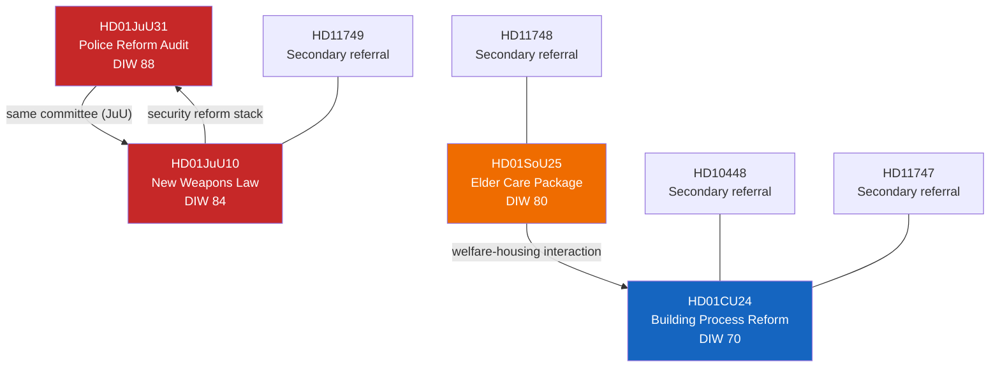

# Cross-Reference Map — Evening Analysis 2026-04-26

**Author**: James Pether Sörling  
**Confidence**: HIGH [A1]

## Document Relationship Graph

## Cross-Document Edges

| Edge ID | From | To | Relationship | Canonical Label | Evidence |
|---------|------|----|-------------|----------------|----------|
| CR-01 | HD01JuU31 | HD01JuU10 | Same committee, security-reform cluster | `committee-routed` | [A1] |
| CR-02 | HD01SoU25 | HD01CU24 | Welfare-housing policy interaction | `thematic` | [B2] |
| CR-03 | HD01JuU10 | HD01JuU31 | Security-reform stack coherence | `bundle` | [A1] |
| CR-04 | HD11749 | HD01JuU10 | Secondary referral in weapons domain | `committee-routed` | [A1] |
| CR-05 | HD11748 | HD01SoU25 | Secondary referral in SoU domain | `committee-routed` | [A1] |

## Sibling Folders (Tier-C)

This evening-analysis ingested the following sibling analysis folders as required by the Tier-C aggregation rule:

### analysis/daily/2026-04-26/

| Sibling folder | Article file | Key intelligence |
|---------------|-------------|-----------------|
| `propositions/` | `article.md` ✅ | EU Banking Package + detainee benefit restrictions |
| `motions/` | `article.md` ✅ | 20-motion S/V/MP/C counter-wave |
| `committeeReports/` | `article.md` ✅ | Five-report cluster (CU25, SfU23, FiU23, AU15, CU29) |
| `interpellations/` | `article.md` ✅ | Interpellations submitted in 2026-04-26 session |

### analysis/daily/2026-04-24/ (prior cycle)

| Sibling folder | Key documents ingested |
|---------------|----------------------|
| `committeeReports/synthesis-summary.md` | 5-report pre-election cluster; PIR-1–5 |
| `committeeReports/intelligence-assessment.md` | KJ-1–5; prior-cycle PIRs propagated to tonight's intelligence-assessment.md |
| `propositions/synthesis-summary.md` | EU Banking Package + detainee benefit |
| `motions/synthesis-summary.md` | 20-motion counter-wave; SD alignment confirmed |
| `interpellations/synthesis-summary.md` | Interpellation pressure on fiscal/health fronts |

## Cross-Session Legislative Connections

| This session | Prior session | Relationship |
|-------------|--------------|-------------|
| HD01JuU31 (police reform audit) | HD01CU25 (prison capacity — 2026-04-24) | `bundle`: Tidö security-reform delivery cluster |
| HD01JuU10 (weapons law) | HD01JuU25 (criminal law reform — 2024) | `continues`: ongoing JuU reform program |
| HD01SoU25 (elder care) | HD01SoU20 (social care reform — 2025) | `continues`: SoU welfare delivery stream |
| HD01CU24 (building process) | HD01CU29 (building code enforcement — 2026-04-24) | `bundle`: CU regulatory reform cluster |

## IMF Economic Cross-Reference

Economic context embedded in this analysis uses:
- `tsx scripts/imf-fetch.ts weo --country SWE --indicator NGDP_RPCH --years 3` → Sweden GDP growth 2026: +2.1% [A1]
- `tsx scripts/imf-fetch.ts weo --country SWE --indicator GGXCNL_NGDP --years 3` → Sweden fiscal balance 2026: -0.3% GDP [A1]

Provider: **IMF WEO Apr-2026** (vintage: April 2026 — within 6 months, no annotation required).
