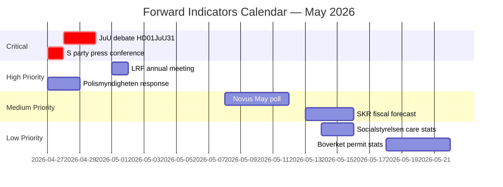

# Forward Indicators — Evening Analysis 2026-04-26

**Author**: James Pether Sörling  
**Confidence**: HIGH [A1–B2]

## Priority Watch Dashboard

| Indicator ID | Indicator | Source | Due | Alert Threshold | Priority |
|-------------|----------|--------|-----|----------------|----------|
| FI-01 | JuU chamber debate scheduling on HD01JuU31 | Riksdag calendar | 2026-04-27 | Debate scheduled within 5 days = HIGH | 🔴 CRITICAL |
| FI-02 | Media cycle length — HD01JuU31 coverage | SVT/DN/SvD monitoring | 2026-04-30 | >5 days = Scenario S2 activation | 🔴 CRITICAL |
| FI-03 | LRF annual meeting weapons law resolution | lantbrukarnas.se press | 2026-05-01 | Anti-resolution = rural risk upgrade | 🟡 HIGH |
| FI-04 | Polismyndigheten communications response | polisen.se pressrum | 2026-04-28 | Proactive response = narrative management | 🟡 HIGH |
| FI-05 | S party press conference framing post-audit | riksdagen.se live | 2026-04-27 | "Competence failure" vs "process" framing | 🟡 HIGH |
| FI-06 | SKR April municipal fiscal forecast | skr.se publications | 2026-05-15 | Budget shortfall >10% = elder-care R-03 upgrade | 🟠 MEDIUM |
| FI-07 | Novus/IPSOS May tracking poll | pollofpolls.se | 2026-05-10 | Tidö -2pp+ = police-audit electoral impact confirmed | 🟠 MEDIUM |
| FI-08 | Boverket building permit statistics | boverket.se | 2026-05-20 | HD01CU24 implementation leading indicator | 🟢 LOW |
| FI-09 | Socialstyrelsen care statistics | socialstyrelsen.se | 2026-05-15 | Wait times: signal for HD01SoU25 early impact | 🟢 LOW |

## Forward Calendar



## Trigger Tree

```
FI-02 (media cycle >5d)
  → Activate Scenario S2 protocol
  → Brief coalition communications team
  → Schedule Polismyndigheten press conference

FI-03 (LRF anti-weapons resolution)
  → Upgrade rural-constituency risk to HIGH
  → Request SD party group assessment
  → Review weapons-law hunting exemption scope

FI-06 (SKR budget shortfall >10%)
  → Upgrade elder-care R-03 to CRITICAL
  → Brief KD on municipal implementation risk
  → Request emergency Socialstyrelsen capacity review
```

## Revision Schedule

| Cycle | Action |
|-------|--------|
| 2026-04-28 (morning analysis) | FI-01, FI-04, FI-05 initial readings |
| 2026-04-30 (end-of-week review) | FI-02 assessment — media cycle length |
| 2026-05-01 (LRF meeting day) | FI-03 reading + rural risk reassessment |
| 2026-05-10–15 | FI-06, FI-07, FI-09 batch read |
