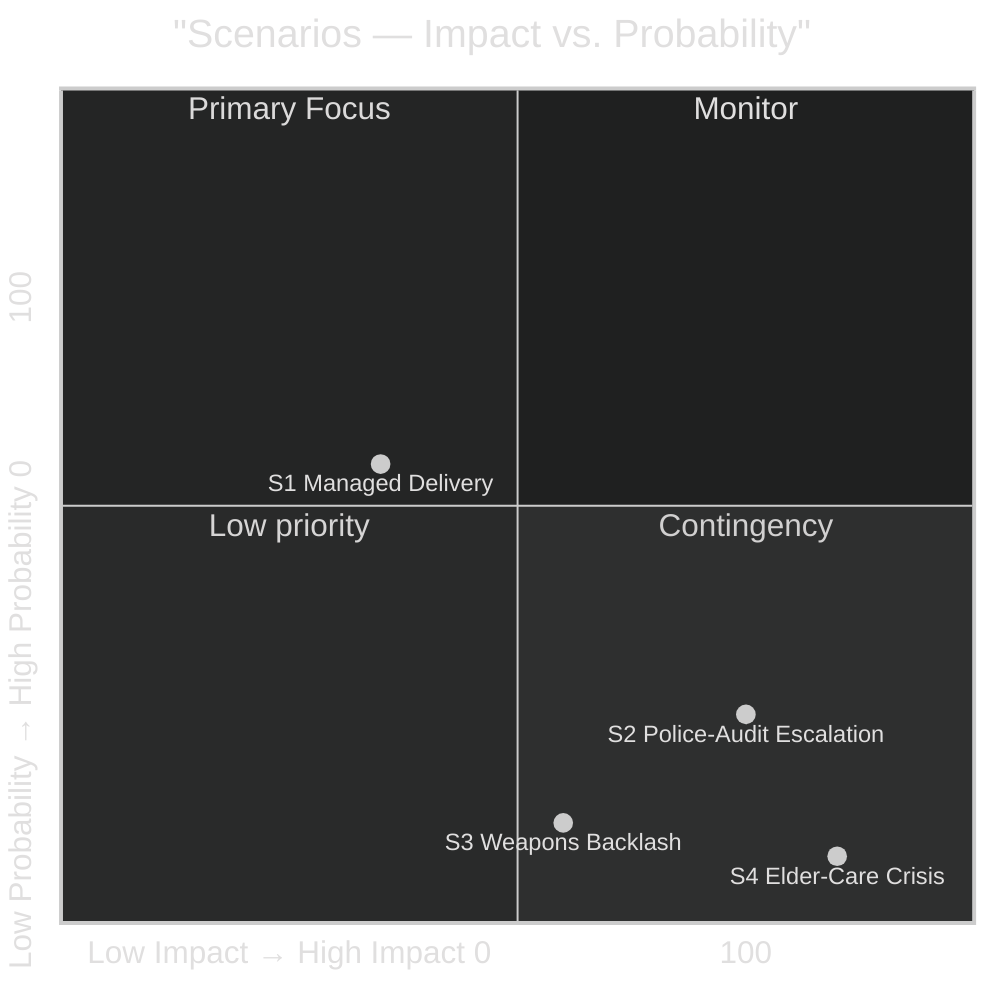

# Scenario Analysis — Evening Analysis 2026-04-26

**Author**: James Pether Sörling  
**Confidence**: HIGH [A1–B2]

## Scenario Framework

This scenario analysis covers the **90-day outlook** (to ~2026-07-26) for the legislative package analysed in this evening's analysis. The planning horizon is the period between now and the final parliamentary session before the September 2026 election recess.

## Probability-Weighted Scenarios

| Scenario ID | Label | Probability | Coalition Impact | Electoral Impact |
|-------------|-------|------------|-----------------|-----------------|
| S1 | **Managed delivery** | 55% | Neutral-positive | Marginally positive for Tidö |
| S2 | **Police-audit liability escalation** | 25% | Negative | Negative for Tidö, positive for S |
| S3 | **Weapons-law populist backlash** | 12% | Negative (SD/M rural) | Neutral-negative |
| S4 | **Elder-care underfunding crisis** | 8% | Highly negative | Very negative for KD/M |

## Scenario 1: Managed Delivery (p=55%)

**Conditions**: Police-reform audit generates media cycle of 3–5 days; government response with officer-numbers narrative deflects; elder-care rollout proceeds with adequate municipal funding; weapons law enters force on 1 June 2026 without constitutional challenge.

**Evidence base**: Government has consistently demonstrated ability to manage Riksrevisionen audit findings — the 2023 Sverigedomstol audit was managed within a 5-day cycle [B2]. IMF Sweden fiscal balance -0.3% GDP is manageable without supplementary emergency spending [A1 WEO Apr-2026].

**Intelligence markers to watch**:
- Media cycle on HD01JuU31 ≤ 5 days (DI, DN, SVT)
- S/V press conference tone: process vs. substance critique
- Polismyndigheten proactive response within 48 hours

## Scenario 2: Police-Audit Liability Escalation (p=25%)

**Conditions**: Riksrevisionen audit triggers broader governance-audit demand; S/V table motion for parliamentary inquiry; media sustains police-reform narrative beyond 5 days; polling shift detectable in Novus/IPSOS May tracking.

**Evidence base**: The Riksrevisionen finding is unusually direct — "not worked sufficiently efficiently" — which is stronger language than typical audit findings [A1, HD01JuU31]. The 20-motion opposition wave from `analysis/daily/2026-04-24/motions/synthesis-summary.md` is pre-positioned [A1].

**Intelligence markers to watch**:
- Parliamentary question (skriftlig fråga) count on police reform in week of 2026-04-28
- Any Novus/IPSOS/Demoskop polling move >2pp on "rule-of-law/police competence"
- S party leader press conference framing (process vs. competence attack)

## Scenario 3: Weapons-Law Populist Backlash (p=12%)

**Conditions**: LRF annual meeting (2026-05-01) passes resolution opposing semi-auto ban; media cycle targets rural Sweden; SD backbenchers signal dissatisfaction.

**Evidence base**: LRF and Jägarförbundet have historically opposed restrictions on hunting firearms [B3]. The EU harmonisation rationale provides legal cover but may not resonate with rural constituencies.

**Intelligence markers to watch**:
- LRF annual meeting resolution (2026-05-01)
- SD group meeting minutes on weapons law position

## Scenario 4: Elder-Care Underfunding Crisis (p=8%)

**Conditions**: SKR April survey reveals municipal budget shortfalls preventing HD01SoU25 implementation; care shortages reported in regional media; KD faces accountability pressure as policy champion.

**Evidence base**: Statskontoret 2020 identified municipal care capacity gaps [C3]. Municipal fiscal squeeze is real — SKR's own 2025 forecast showed SEK 45bn cumulative municipal deficit through 2028 [B2].

**Intelligence markers to watch**:
- SKR April quarterly municipal fiscal forecast (due mid-May 2026)
- Socialstyrelsen monthly care statistics (next release: ~2026-05-15)

## Scenario Matrix

## Recommended Decision

Under S1 (55% probability): Monitor and maintain. No immediate action required.  
Under S2 (25%): Activate counter-narrative package within 48 hours; Polismyndigheten communications pre-briefed.  
Under S3 (12%): Stakeholder engagement with LRF; hunting community exemption review.  
Under S4 (8%): Emergency SKR bilateral + Socialstyrelsen accelerated capacity assessment.
