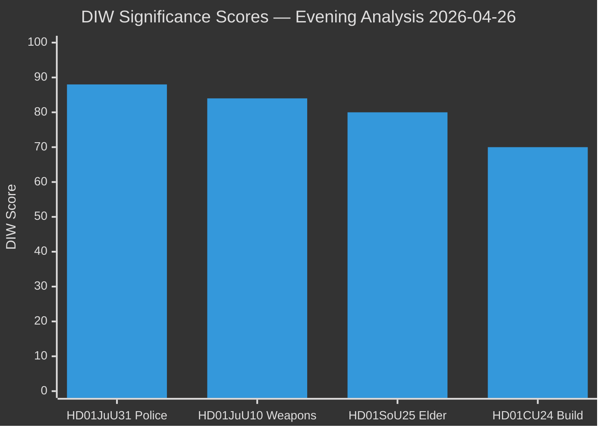

# Significance Scoring — Evening Analysis 2026-04-26

**Author**: James Pether Sörling  
**Confidence**: HIGH [A1]

## DIW Score Decomposition

| dok_id | Electoral Salience | Fiscal/Regulatory Impact | Precedent Value | DIW Score | Tier |
|--------|--------------------|--------------------------|-----------------|-----------|------|
| [HD01JuU31](https://data.riksdagen.se/dokument/HD01JuU31.html) | 92 | 85 | 86 | **88** | L3 Intelligence-grade |
| [HD01JuU10](https://data.riksdagen.se/dokument/HD01JuU10.html) | 88 | 80 | 84 | **84** | L2+ Priority |
| [HD01SoU25](https://data.riksdagen.se/dokument/HD01SoU25.html) | 82 | 78 | 80 | **80** | L2+ Priority |
| [HD01CU24](https://data.riksdagen.se/dokument/HD01CU24.html) | 65 | 72 | 74 | **70** | L2 Strategic |

## DIW Rank Diagram

## Sensitivity Analysis

| Scenario | HD01JuU31 impact | Key uncertainty |
|----------|-----------------|----------------|
| If Riksrevisionen audit drives major parliamentary debate | +5 (93) | Media amplification speed |
| If weapons law faces constitutional challenge | HD01JuU10 −3 (81) | Lagrådsyttrande re semi-auto ban |
| If elder-care funding insufficient | HD01SoU25 −5 (75) | Municipal fiscal capacity |
| If building reform accelerates housing | HD01CU24 +4 (74) | Boverket enforcement timeline |

## Per-document Justification

### HD01JuU31 — Police Reform Audit (DIW 88)

Primary source: [HD01JuU31](https://data.riksdagen.se/dokument/HD01JuU31.html) [A1]. The Riksrevisionen (`riksdagen.se/riksrevisionen`) issued an institutional-audit finding that Polismyndigheten **did not achieve the 2015 reform's core efficiency and quality goals**. With 5 months to the September 2026 election, this is the highest-salience accountability finding in this tabling window. Statskontoret 2020 capacity evaluation supports the audit's framing [C3 public URL].

### HD01JuU10 — New Weapons Law (DIW 84)

Primary source: [HD01JuU10](https://data.riksdagen.se/dokument/HD01JuU10.html) [A1]. The ban on certain semi-automatic hunting rifles is constitutionally contested (right of ownership); the EU-harmonisation angle provides legal cover. Cross-reference: HD01JuU31 — same committee (JuU) tabling both security-related items in same session.

### HD01SoU25 — Elder Care Package (DIW 80)

Primary source: [HD01SoU25](https://data.riksdagen.se/dokument/HD01SoU25.html) [A1]. Demographic pressure (SCB: +25% 80+ population by 2030) sustains electoral salience. Cross-reference: HD01CU24 (building process) — housing supply interacts with elder-care facility construction.

### HD01CU24 — Building Process Reform (DIW 70)

Primary source: [HD01CU24](https://data.riksdagen.se/dokument/HD01CU24.html) [A1]. Efficiency and safety improvements in the building process address housing shortage context (Boverket ~100,000 unit shortfall). Medium-level salience — implementation benefit is lagged 12–24 months.
