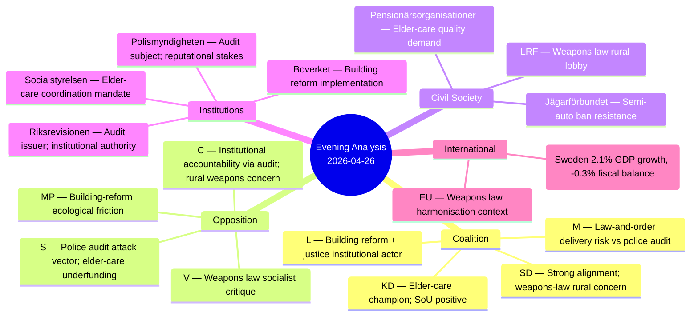

# Stakeholder Perspectives — Evening Analysis 2026-04-26

**Author**: James Pether Sörling  
**Confidence**: HIGH [A1–B2]

## Stakeholder Map

## Key Stakeholder Positions

### Moderaterna (M)
**Position**: Weapons law delivery shows security-reform competence; police-audit narrative requires management. Building reform aligns with pro-market regulatory streamlining.  
**Primary concern**: Police-reform audit creates pre-election vulnerability. M owns the reform governance argument — if reform "failed," M governance credibility suffers.  
**Evidence**: M government response to [HD01JuU31](https://data.riksdagen.se/dokument/HD01JuU31.html) notes police officer numbers and budget increases [A1].

### Sverigedemokraterna (SD)
**Position**: Full Tidö alignment maintained. Weapons law and police reform are core SD policy space. Elder-care has nationalist "Swedish seniors first" resonance.  
**Primary concern**: Semi-automatic hunting rifle ban creates tension with rural SD voter base. SD has strong representation in hunting culture communities.  
**Evidence**: Sibling `analysis/daily/2026-04-24/motions/synthesis-summary.md` confirms SD alignment [A1].

### Kristdemokraterna (KD)
**Position**: Elder-care package ([HD01SoU25](https://data.riksdagen.se/dokument/HD01SoU25.html)) is a core KD policy win — family caregiver support aligns with KD's family-values platform.  
**Primary concern**: Municipal implementation capacity. KD supports the policy; worried about delivery.

### Liberalerna (L)
**Position**: Police institutional reform is in L's jurisdiction domain. Building reform efficiency appeals to L's liberal regulatory stance.  
**Primary concern**: Police-reform audit creates L ownership problem — L co-governs justice.

### Socialdemokraterna (S)
**Position**: Attacking police-reform audit is S's primary tactical opportunity this week. Elder-care underfunding as municipal accountability issue fits S's welfare-state narrative.  
**Evidence**: 7 motions on policing efficiency in current session. [HD01JuU31](https://data.riksdagen.se/dokument/HD01JuU31.html) audit provides credible external endorsement.

### Riksrevisionen
**Position**: Institutional credibility on line. The audit finding is authoritative; Riksrevisionen has no electoral stake.  
**Primary concern**: Ensuring government response addresses audit recommendations substantively.

### LRF + Svenska Jägarförbundet
**Position**: Opposed to semi-automatic hunting rifle ban in [HD01JuU10](https://data.riksdagen.se/dokument/HD01JuU10.html). Annual meeting (LRF: 2026-05-01) is the key signal point.  
**Evidence**: Historical consultation responses [B3].

### Polismyndigheten
**Position**: Defensive — audit finding is reputationally damaging. Will need to prepare a substantive response demonstrating progress since 2022.  
**Primary concern**: Media framing as "failed reform" versus nuanced "improving efficiency" narrative.

## Stakeholder Alignment Matrix

| Stakeholder | HD01JuU31 | HD01JuU10 | HD01SoU25 | HD01CU24 |
|-------------|-----------|-----------|-----------|----------|
| M | **Defensive** | Supportive | Supportive | Supportive |
| SD | Defensive | **Supportive** | Supportive | Supportive |
| KD | Defensive | Neutral | **Supportive** | Supportive |
| L | **Defensive** | Neutral | Neutral | Supportive |
| S | **Attack** | Neutral | Attack (underfunding) | Neutral |
| V | Neutral | Attack (rights) | Neutral | Attack (safety) |
| MP | Neutral | Attack (gun culture) | Positive | **Attack** (ecological) |
| C | Attack (audit) | Concerned (rural) | Positive | Neutral |
