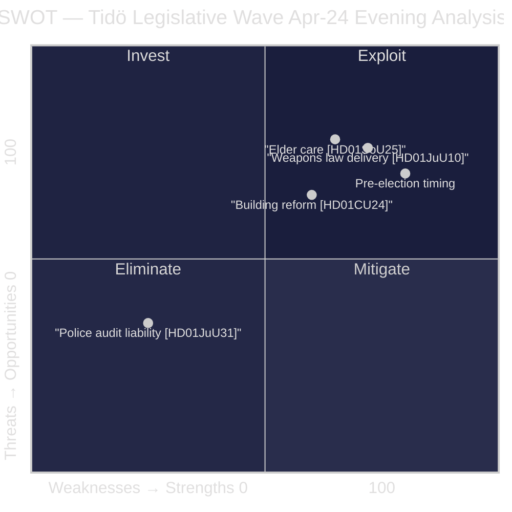

# SWOT Analysis — Evening Analysis 2026-04-26

**Author**: James Pether Sörling  
**Confidence**: HIGH [A1–B2]

## SWOT Matrix

### Strengths

| Evidence | dok_id / Source | Admiralty |
|----------|-----------------|-----------|
| New weapons law passes JuU with government backing — demonstrates security-reform delivery capacity | [HD01JuU10](https://data.riksdagen.se/dokument/HD01JuU10.html) | A1 |
| Elder-care package addresses acknowledged demographic gap, broad cross-party support expected | [HD01SoU25](https://data.riksdagen.se/dokument/HD01SoU25.html) | A1 |
| Building-process efficiency reform signals regulatory modernisation commitment | [HD01CU24](https://data.riksdagen.se/dokument/HD01CU24.html) | A1 |
| IMF GDP growth Sweden +2.1% 2026 (WEO Apr-2026) — benign macro backdrop | IMF WEO Apr-2026, NGDP_RPCH | A1 |
| SD full coalition alignment maintained — no fragmentation risk in current tabling window | `analysis/daily/2026-04-24/motions/synthesis-summary.md` | A1 |

### Weaknesses

| Evidence | dok_id / Source | Admiralty |
|----------|-----------------|-----------|
| Riksrevisionen finds Polismyndigheten did NOT achieve 2015 reform efficiency/quality goals | [HD01JuU31](https://data.riksdagen.se/dokument/HD01JuU31.html) | A1 |
| Weapons law semi-auto ban may face hunting community backlash and constitutional litigation | [HD01JuU10](https://data.riksdagen.se/dokument/HD01JuU10.html) | A1 |
| Elder-care delivery depends on municipal capacity — Statskontoret 2020 noted capacity gaps | statskontoret.se/publikationer/2020/202024.pdf | C3 |
| Building reform benefit lagged 12–24 months — no pre-election impact visible | [HD01CU24](https://data.riksdagen.se/dokument/HD01CU24.html) | B2 |

### Opportunities

| Evidence | dok_id / Source | Admiralty |
|----------|-----------------|-----------|
| Police-reform audit creates credibility gap: coalition can frame it as justification for further reform investment | [HD01JuU31](https://data.riksdagen.se/dokument/HD01JuU31.html) [A1] — government response notes progress | B2 |
| Weapons law EU harmonisation opens export/import simplifications for sport-shooting sector | [HD01JuU10](https://data.riksdagen.se/dokument/HD01JuU10.html) | A1 |
| Demographic elder-care trend sustains budget prioritisation narrative into 2027–2030 | SCB population projections | B2 |
| Building reform + housing supply = affordability narrative vs S opposition rent-control critique | [HD01CU24](https://data.riksdagen.se/dokument/HD01CU24.html) | B2 |

### Threats

| Evidence | dok_id / Source | Admiralty |
|----------|-----------------|-----------|
| Opposition (S/V/MP) will use police audit to attack Tidö's law-and-order credibility | `analysis/daily/2026-04-24/motions/synthesis-summary.md` — 20 motions wave | A1 |
| Weapons law: farming/hunting community lobby (LRF, Jägarförbundet) may campaign against semi-auto ban | Public organisational positions [B3] |
| Elder-care implementation cliff: if municipalities underfund, liability returns pre-election | [HD01SoU25](https://data.riksdagen.se/dokument/HD01SoU25.html) | B2 |
| IMF Sweden fiscal balance -0.3% GDP 2026 (WEO Apr-2026) limits emergency supplementary spending | IMF WEO Apr-2026, GGXCNL_NGDP | A1 |

## TOWS Matrix

| | Opportunities (O) | Threats (T) |
|---|---|---|
| **Strengths (S)** | **SO**: Lead police-reform audit with "evidence-based further investment" narrative; leverage weapons-law EU angle for business community | **ST**: Pre-empt opposition police-audit attacks with Polismyndigheten Q2 report forward trigger |
| **Weaknesses (W)** | **WO**: Use elder-care delivery + building reform to redirect from police-audit narrative | **WT**: Police audit + municipal elder-care underfunding create simultaneous accountability exposure; requires coordinated communications response |

## Cross-SWOT

From `analysis/daily/2026-04-24/committeeReports/swot-analysis.md`: Prison capacity (HD01CU25, DIW 85) and the current weapons law (HD01JuU10, DIW 84) form the full security-reform stack — together they represent the Tidö coalition's strongest pre-election delivery argument on law and order.
