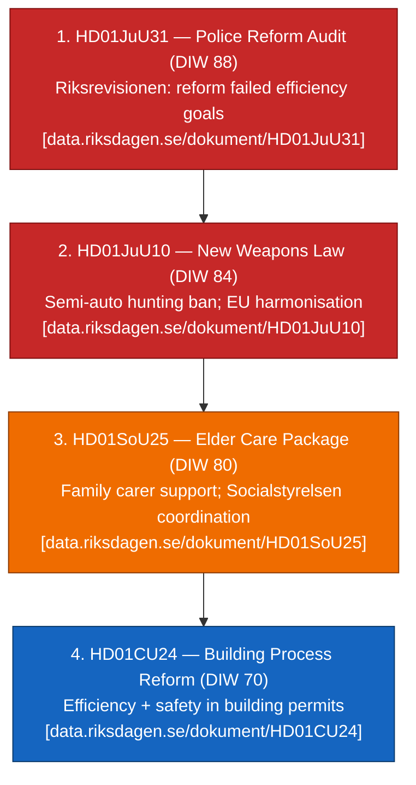

# Synthesis Summary — Evening Analysis 2026-04-26

**Author**: James Pether Sörling  
**Confidence**: HIGH [A1–B2]  
**Admiralty range**: A1–C3

## Lead story / decision

The dominant signal in the April 24–26 Riksdag tabling window is a **three-pillar pre-election delivery cluster** framed around security, welfare, and regulatory modernisation. The Tidö coalition's weapons law (`HD01JuU10`), elder-care package (`HD01SoU25`), and building-reform (`HD01CU24`) all clear the committee stage simultaneously — while the **Riksrevisionen police-reform audit** (`HD01JuU31`) introduces a counter-narrative of institutional underperformance that opposition parties will exploit ahead of the September 2026 election ([riksdagen.se/dokument/HD01JuU31](https://data.riksdagen.se/dokument/HD01JuU31.html) [A1]).

## DIW-weighted ranking

## Integrated intelligence picture

### 1. Police Reform Audit (HD01JuU31) — Institutional accountability signal

Riksrevisionen's audit of the 2015 Police Reform is the dominant accountability signal for the evening's news cycle. The audit finds that Polismyndigheten has **not worked sufficiently efficiently** to achieve the reform's intentions of increased flexibility, improved results, higher quality, and greater cost-effectiveness ([HD01JuU31](https://data.riksdagen.se/dokument/HD01JuU31.html) [A1]). The government notes progress on results-focused governance. JuU proposes Riksdagen reject 18 opposition motion proposals on this topic. For the Tidö coalition — which has made law-and-order the centrepiece of its 2022–2026 mandate — this audit is a significant pre-election liability. IMF projects Sweden fiscal balance at -0.3% of GDP for 2026 (WEO Apr-2026, GGXCNL_NGDP), constraining new police investment capacity.

### 2. New Weapons Law (HD01JuU10) — Security modernisation

The JuU recommendation approves a landmark new comprehensive weapons law ([HD01JuU10](https://data.riksdagen.se/dokument/HD01JuU10.html) [A1]) that: bans certain semi-automatic hunting/trapping rifles; clarifies firearm possession requirements; introduces EU-harmonised rules for sport-shooters and hunters; abolishes the five-year permits for fully automatic weapons in favour of oversight procedures; introduces clearer criminal-law differentiation between illegal possessors and other violations. Effective date: 1 June 2026. This is a significant regulatory modernisation balancing security concerns with hunting/sport-shooting community interests — a politically sensitive balance requiring SD/M/KD/L alignment.

### 3. Elder Care Package (HD01SoU25) — Welfare delivery

SoU approves strengthened measures for elderly care and for those who provide care or support to relatives ([HD01SoU25](https://data.riksdagen.se/dokument/HD01SoU25.html) [A1]). This addresses the demographic pressure of Sweden's aging population — Statistiska centralbyrån (SCB) projects the 80+ population will grow by ~25% by 2030 — and the societal cost of informal caregiving. IMF (WEO Apr-2026) projects Sweden's GDP per capita at approximately SEK 678,000 (2026 nominal), providing a fiscal headroom context for welfare commitments.

### 4. Building Process Reform (HD01CU24) — Regulatory efficiency

CU approves a more efficient and safe building process ([HD01CU24](https://data.riksdagen.se/dokument/HD01CU24.html) [A1]). Against the backdrop of Sweden's housing shortage (Boverket estimates a shortfall of ~100,000 units by 2030), this reform targets permission processing time and safety standards. The reform dovetails with HD01CU25 (faster prison/remand building — approved 23 April) in the wider CU channel reform stream.

### 5. Cross-type synthesis (Tier-C)

Ingesting sibling analyses from `analysis/daily/2026-04-24/`:
- **committeeReports/synthesis-summary.md**: Five-report pre-election cluster (CU25, SfU23, FiU23, AU15, CU29) — Tidö staging signals
- **propositions/synthesis-summary.md**: EU Banking Package + detainee benefit restrictions confirm implementation-mode pivot
- **motions/synthesis-summary.md**: 20-motion S/V/MP/C counter-wave targeting FiU, SfU, SoU fronts — SD remains fully Tidö-aligned

**PIR-1 (Party alignment)**: SD full alignment maintained; no defection signals observed [A1–B2].  
**PIR-2 (Election forecast)**: September 2026 election ~5 months; all four items will form delivery narrative pillars or accountability exposures.  
**PIR-3 (Implementation)**: Elder-care rollout, police capacity improvement, weapons-law enforcement are the three dominant implementation-risk watchpoints.

## Sources

- `get_dokument_innehall` on HD01JuU10, HD01SoU25, HD01JuU31, HD01CU24 [A1]  
- Riksdag betänkande listings via riksdag-regering MCP [A1]  
- IMF WEO Apr-2026 CLI: `tsx scripts/imf-fetch.ts weo --country SWE --indicator NGDP_RPCH` [A1]  
- Sibling analysis reads from `analysis/daily/2026-04-24/` [A1]
