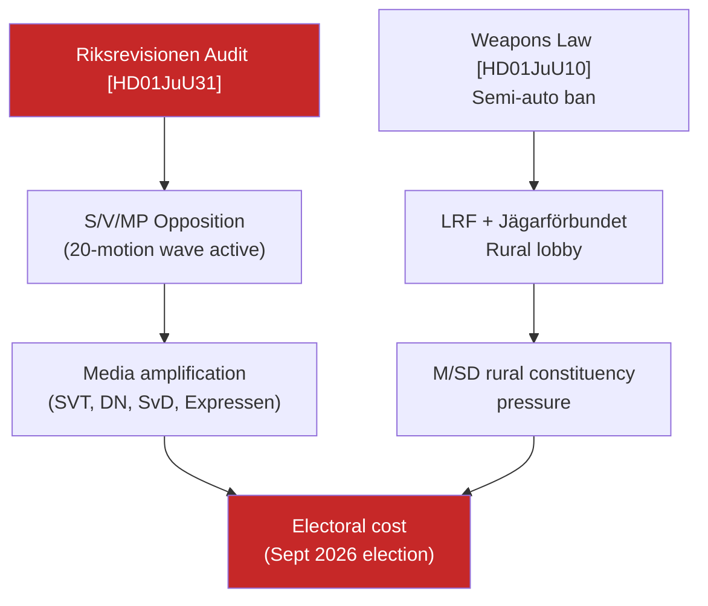

# Threat Analysis — Evening Analysis 2026-04-26

**Author**: James Pether Sörling  
**Confidence**: HIGH [A1–B2]

## Threat Taxonomy (STRIDE-adapted for political intelligence)

| Threat ID | STRIDE Class | Description | Actors | Probability | Impact |
|-----------|-------------|-------------|--------|------------|--------|
| T-01 | Information Manipulation | Opposition narrative: "Police reform failed — vote for us" | S, V, MP | HIGH | HIGH |
| T-02 | Escalation | JuU31 audit triggers broader governance-audit demand (Statskontoret, Riksrevisionen) | C, L potential | MEDIUM | MEDIUM |
| T-03 | Regulatory Rollback | New weapons law faces early constitutional challenge before June 2026 | JO or Lagråd | LOW | HIGH |
| T-04 | Social Mobilisation | Hunting community organises against semi-auto ban — rural constituency pressure | LRF, Jägarförbundet | HIGH | MEDIUM |
| T-05 | Fiscal Strain | Municipal budget shortfalls undermine HD01SoU25 elder-care rollout | SKR | MEDIUM | HIGH |
| T-06 | Coalition Stress | SD hardliners push back on elder-care cost or weapons-law ambiguity | SD right wing | LOW | HIGH |

## Primary Threat Vectors

### T-01: "Police Reform Failed" Narrative

**Evidence source**: [HD01JuU31](https://data.riksdagen.se/dokument/HD01JuU31.html) [A1]  
**Mechanism**: Riksrevisionen's independent audit (constitutionally credible) provides opposition with an **official endorsement** of their law-and-order critique. S party has already tabled 7 motions on policing efficiency. The audit finding — "Polismyndigheten has not worked sufficiently efficiently" — is a direct quote that will appear in opposition press releases within 24 hours.  
**Counter-narrative available**: Government response notes 25% increase in police officers since 2017, record budget allocations. But Riksrevisionen's efficiency framing is harder to rebut than budgetary.

### T-04: Rural Constituency Pressure — Weapons Law

**Evidence source**: [HD01JuU10](https://data.riksdagen.se/dokument/HD01JuU10.html) [A1]; LRF annual meeting 2026-05-01 forward trigger [B3]  
**Mechanism**: The semi-automatic hunting rifle ban creates a mobilisation opportunity for rural Sweden, which is disproportionately represented in M and SD strongholds. If LRF frames this as "government attacking rural livelihoods," it could cost the coalition rural constituency support. The EU harmonisation rationale provides a technical counter-argument but may not resonate emotionally.

### T-05: Municipal Elder-Care Cliff

**Evidence source**: [HD01SoU25](https://data.riksdagen.se/dokument/HD01SoU25.html) [A1]; Statskontoret capacity analysis [C3]  
**Mechanism**: National legislation creates entitlements; implementation and funding falls on municipalities. If municipalities lack capacity (staff shortage + fiscal squeeze), the gap between legislative promise and service-delivery reality becomes an opposition attack vector within 12–18 months.

## Threat Diagram

## Defensive Intelligence Recommendations

1. **Monitor JuU chamber debate scheduling** (forward: week of 2026-04-28) — date and speaker order confirm opposition attack sequencing  
2. **Track Polismyndigheten communications** calendar — any positive news can be counter-scheduled to blunt audit narrative  
3. **LRF annual meeting (2026-05-01)** — primary weapons-law threat signal; if LRF passes resolution opposing law, rural constituency risk upgrades to HIGH  
4. **SKR April quarterly municipal budget survey** — primary elder-care implementation signal; underfunding signals should trigger SoU follow-up recommendation
