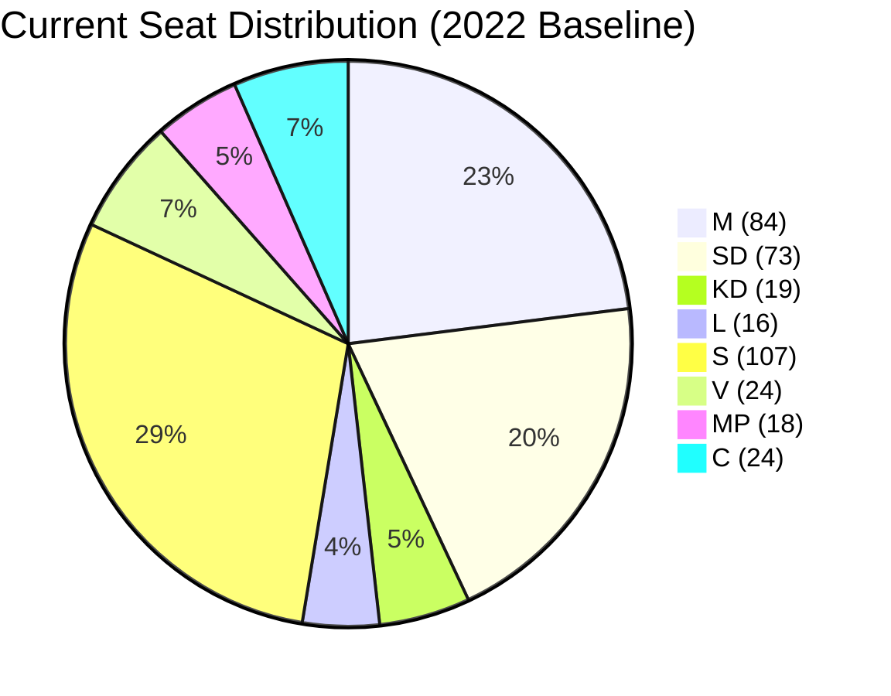

# Coalition Mathematics — Month-Ahead 2026-04-26

**Author**: James Pether Sörling | **Date**: 2026-04-26  

## Current Seat Distribution (2022 Election)

| Party | Seats | Bloc | Vote Share |
|-------|-------|------|-----------|
| M | 84 | Tidö Coalition | 19.1% |
| SD | 73 | Tidö Coalition | 20.5% |
| KD | 19 | Tidö Coalition | 5.3% |
| L | 16 | Tidö Coalition | 4.7% |
| **Coalition Total** | **192** | | **49.6%** |
| S | 107 | Opposition | 30.3% |
| V | 24 | Opposition | 6.7% |
| MP | 18 | Opposition | 5.1% |
| C | 24 | Opposition | 6.7% |
| **Opposition Total** | **173** | | **48.8%** |
| **Riksdag Total** | **349** | | 100% |

**Governing majority**: 175 seats required (simple majority).  
**Current coalition**: 192 seats — comfortable majority of 17 seats.

Note: Coalition structure is M+KD+L as formal government, with SD as passive support party (cooperation agreement, not formal coalition).

## Pivotal Vote Analysis

| Vote Scenario | Coalition Ja | Opposition Nej | Outcome |
|--------------|-------------|---------------|---------|
| Fuel tax budget (prop. 2025/26:236) | 192 (if full coalition) | 173 | Passes |
| Fuel tax — if 5 coalition defectors | 187 | 173 | Still passes |
| Fuel tax — if 20 coalition defectors | 172 | 173 | FAILS — minority |
| HD01JuU10 weapons law | 192 | 157 (+16 C partial) | Passes |
| HD03252 prisoner benefits | 192 | 173 | Passes |

## Sainte-Laguë Scenarios — September 2026

**Scenario A**: Coalition holds 176+ seats → forms government without C/MP support  
**Scenario B**: Opposition wins 176+ seats (requires S+V+MP≥158 + C≥18) → S forms government  
**Scenario C**: Near-tie (170–175 each) → C kingmaker → C-supported S government or C joins coalition  
**Scenario D**: Coalition wins <175, opposition <175 → SD offers support to SD+M+KD+L+C government (broad right) if C crosses floor  

## Post-Riksdag Session Vote Monitor

Key upcoming votes:
- Extra budget (prop. 2025/26:236) — May 2026 chamber session
- HD01JuU10 new weapons law — vote pending after JuU report
- HD03246 juvenile crime — vote pending

Monitoring: Ja/Nej/Avstår/Frånvarande breakdown needed for coalition discipline assessment.

