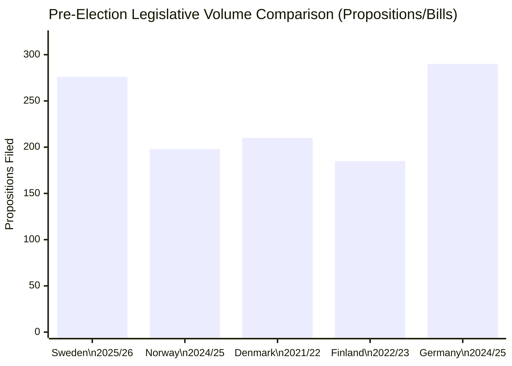

# Comparative International Analysis — Month-Ahead 2026-04-26

**Author**: James Pether Sörling | **Date**: 2026-04-26  

## Comparator Set

**Comparator set**: Norway, Denmark, Finland, Germany, Netherlands — Nordic peers + major EU member states with comparable parliamentary legislative patterns.

## Comparative Dimension 1: Pre-Election Legislative Sprints

| Jurisdiction | Pattern | Comparison to Sweden |
|-------------|---------|---------------------|
| **Norway** | Stortinget pre-election sprint (2025) produced ~200 bills in final session | Sweden's 276 propositions is higher per capita; consistent with Swedish tradition of dense legislative filing |
| **Denmark** | Folketing 2022 pre-election: major welfare and energy legislation; similar opposition interpellation volume | Danish model comparable; S-counterpart (A) deployed similar interpellation-cascade strategy |
| **Finland** | Eduskunnan 2023 pre-election: Orpo coalition formed after moderate-right campaign; security narrative central | Parallel with Swedish coalition trajectory; Finnish election showed security + immigration dominated |
| **Germany** | Bundestag 2025 CDU/CSU victory built on security and fiscal competence narrative | Germany's experience suggests Swedish coalition security narrative viable if implementation record holds |
| **Netherlands** | PVV/VVD coalition 2023 built on security-immigration platform | Parallels with SD's continued electoral rise; but Dutch coalition durability issues caution against assuming stability |

## Comparative Dimension 2: Weapons Law Reform

| Jurisdiction | Approach | Comparison |
|-------------|---------|-----------|
| **EU Firearms Directive** | Semi-auto ban for civilian hunting — implementation deadline | Sweden's HD01JuU10 is EU compliance + domestic policy choice — broader than minimum EU requirement |
| **Germany** | Stricter weapons law 2023 post-Hamburg shooting | German parallel: legislative response to incidents; Swedish reform pre-emptive + EU-driven |
| **Denmark** | Similar weapons registry reforms | Nordic convergence on weapons control — politically less contested in Denmark |

## Comparative Dimension 3: Pre-Election Welfare Policy Framing

| Country | Opposition Strategy | Parallel |
|---------|-------------------|---------|
| **Norway** | Labour (Ap) deployed welfare retrenchment narrative against Høyre in 2021 | Successful — regained government. Direct parallel to S strategy (HD10446, HD10447) |
| **Denmark** | Socialdemokratiet maintained welfare defense as identity anchor 2022 | S similarly using welfare defense; Danish model suggests effective if S presents credible alternative |

## Outside-In Analysis

From an international observer perspective, Sweden's pre-election dynamics follow a recognizable Nordic pattern: right-leaning coalition with strong legislative record faces credible centre-left alternative with welfare narrative. The unusual feature is the weapons law — semi-automatic hunting rifle restrictions are atypical for a Swedish conservative government and reflect EU compliance pressure rather than ideological choice, creating a politically awkward position for the coalition.

The Ukraine accountability accessions (HD03231, HD03232) place Sweden in a strong international leadership position — consistent with post-NATO accession foreign policy trajectory and likely to earn positive EU/NATO reactions regardless of domestic election outcome.

