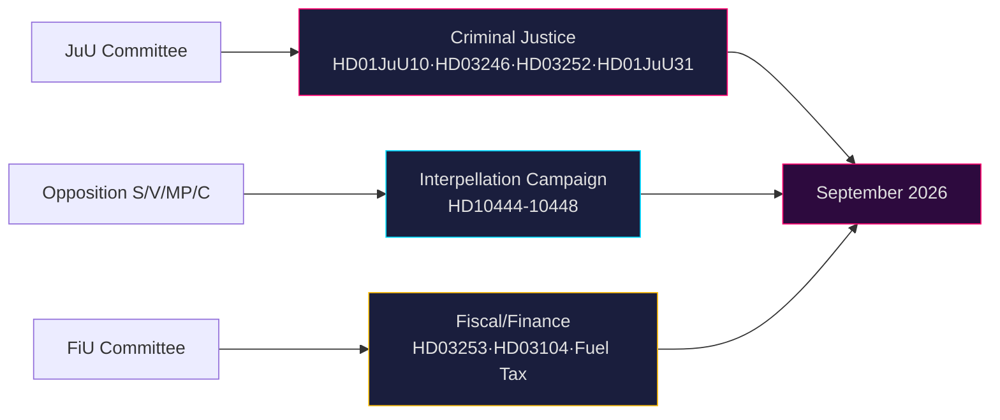

# Cross-Reference Map — Month-Ahead 2026-04-26

**Author**: James Pether Sörling | **Date**: 2026-04-26  

## Policy Clusters

### Cluster 1: Criminal Justice Reform Package
- **HD01JuU10** — New weapons law (JuU) [A2]
- **HD03246** — Juvenile crime reform (JuU) [A2]
- **HD03252** — Prisoner social benefits restriction (JuU) [A2]
- **HD01JuU31** — Police Reform 2015 evaluation (JuU) [A1]
- **Link**: All pass through JuU committee; Justice Minister Strömmer's legislative agenda

### Cluster 2: Fiscal & Financial Package
- **HD03253** — EU banking package (FiU) [A2]
- **HD03104** — State debt management evaluation (FiU) [A1]
- **prop. 2025/26:236** — Extra budget, fuel tax reduction (FiU) [A2]
- **HD01FiU23** — Riksbank annual report (FiU) [A1]
- **Link**: Finance Minister Svantesson's accountability cluster; FiU committee nexus

### Cluster 3: Opposition Interpellation Campaign
- **HD10444** — Employer fee reduction misuse (S vs Svantesson) [B2]
- **HD10445** — Municipal property pre-emption (S vs Carlson) [B2]
- **HD10446** — Incorrect death declarations (S vs Svantesson) [B2]
- **HD10447** — Sick-leave cost removal (S vs Busch) [B2]
- **HD10448** — Wind power disinformation (SD Josef Fransson vs Busch) [B2]
- **Link**: Multi-party interpellation pressure — pre-election accountability offensive

### Cluster 4: Ukraine/Security International
- **HD03231** — Sweden joins Ukraine aggression tribunal [A2]
- **HD03232** — Sweden joins Ukraine compensation commission [A2]
- **Link**: Swedish foreign policy alignment with Ukraine accountability regime

### Cluster 5: Social & Welfare
- **HD01SoU25** — Elderly care (SoU) [A2]
- **HD01AU15** — ILO violence/harassment conventions (AU) [A2]
- **HD01SfU23** — Researcher migration rules (SfU) [A2]
- **Link**: Social safety net + labour market — S+V election terrain

## Legislative Chains

| Proposition | Triggered By | Follow-on |
|------------|-------------|---------|
| HD03252 (prisoner benefits) | Coalition crime policy | Further welfare restriction packages likely Q3 2026 |
| HD03246 (juvenile crime) | Coalition crime policy | Sentencing reform review expected 2027 |
| HD01JuU10 (weapons) | EU Firearms Directive + coalition security | Hunting sector regulatory follow-up |
| HD03253 (EU banking) | EU CRR3/CRD6 deadline | Swedish bank capital adjustment 2026–2027 |

## Sibling Folders (Tier-C Ingestion)

- **analysis/daily/2026-04-26/monthly-review/** — present; reviewed for PIR continuity
- analysis/daily/2026-04-25/ — checked; limited content
- analysis/daily/2026-04-24/ — primary data date for this run (lookback active)
- analysis/daily/2026-04-23/ — propositions, interpellations from that date referenced above

## Coordinated-Activity Patterns

S opposition pattern: simultaneous interpellations targeting three different ministers within 48 hours (HD10444 April 22, HD10446 April 22, HD10447 April 23) indicates a coordinated pre-election communications strategy, not reactive individual oversight.

