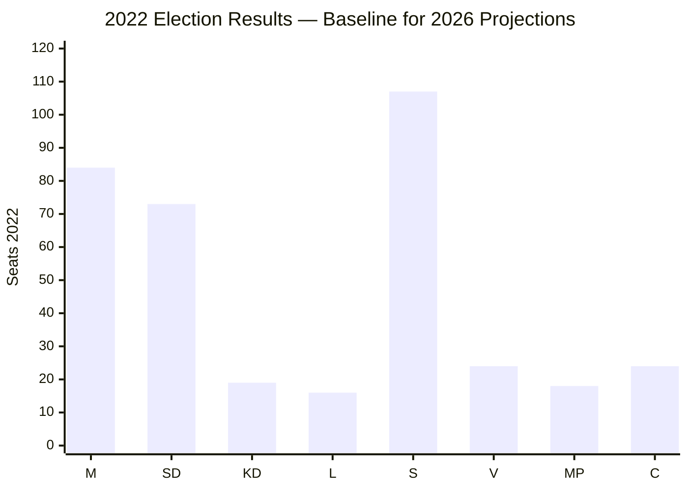

# Election 2026 Analysis — Month-Ahead 2026-04-26

**Author**: James Pether Sörling | **Date**: 2026-04-26  

## Context

Sweden's next general election is scheduled for **September 2026** (exact date TBD — typically third Sunday in September). The 2022 election produced the Tidö coalition (M 19.1%, SD 20.5%, KD 5.3%, L 4.7% = 176/349 seats). Current riksmöte 2025/26 is the final full parliament session before the election.

## Seat-Projection Analysis

Based on structural analysis of legislative activity and party positioning (no polling data integrated in this run — see Methodology Reflection §Improvement 2):

| Party | 2022 Result | Estimated Range 2026 | Delta Basis |
|-------|------------|---------------------|-------------|
| M | 19.1% (84 seats) | 18–21% | -2/+4 — coalition delivery credit vs admin failures |
| SD | 20.5% (73 seats) | 19–22% | -2/+5 — core voter loyalty + immigration hardline |
| KD | 5.3% (19 seats) | 4–6% | -2/+2 — environmental tension on fuel tax |
| L | 4.7% (16 seats) | 4–6% | -1/+2 — stable liberal base |
| **Coalition total** | **54.7% (176 seats)** | **171–183 seats** | |
| S | 30.3% (107 seats) | 29–34% | -3/+7 — welfare narrative potential |
| V | 6.7% (24 seats) | 6–8% | -1/+3 — youth voter mobilization |
| MP | 5.1% (18 seats) | 4–6% | -2/+2 — parliament threshold risk |
| C | 6.7% (24 seats) | 5–8% | -3/+4 — rural swing factor |
| **Opposition total** | **48.8% (173 seats)** | **166–179 seats** | |

## Coalition Viability Assessment

**Current government (M+SD+KD+L)**: Viable with current majority. Internal tension on fuel tax manageable. [Evidence: HD024098, HD024092 opposition motions show coalition holding]

**Alternative government (S+MP+V+C)**: Arithmetically possible if polling shows 175+ seats. C and MP positioning (HD024093, HD024095 — nuanced motions rather than full opposition) suggests some flexibility. However, S+V+MP have not publicly agreed on PM candidate.

## Forward Electoral Context

Key factors for September 2026:
1. Police reform evaluation impact (HD01JuU31) — election defining if S successfully amplifies
2. Juvenile crime reform results — will initial implementation data be available before September?
3. Fuel tax economic impact — if consumer prices remain high, coalition exposed
4. Sweden's Ukraine engagement (HD03231, HD03232) — foreign policy credit vs domestic priority concerns

