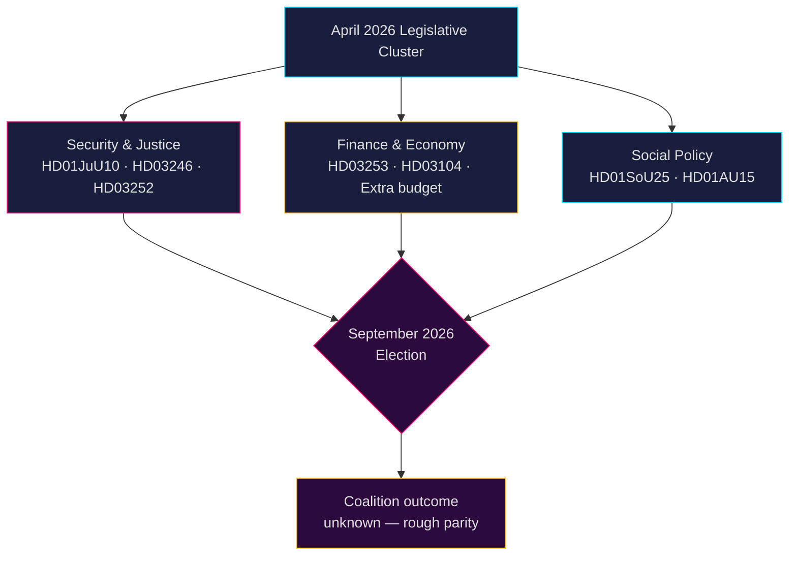

# Swedish Political Intelligence: Month-Ahead Outlook — May–June 2026

**Author**: James Pether Sörling  
**Date**: 2026-04-26  
**Classification**: PUBLIC — GDPR Art. 9(2)(e,g) applied  
**Confidence**: B2 (reliable source, probably true)  
**Analysis depth**: standard  

---

## 🎯 BLUF

Sweden's Riksdag enters May–June 2026 in final legislative acceleration before the **September 2026 general election**, with the Tidö coalition (M-SD-KD-L) pushing through a dense security, justice and finance package. The period is dominated by: (1) a new weapons law creating semi-automatic rifle bans (HD01JuU10); (2) criminal justice tightening via juvenile sentencing reform (HD03246) and prisoner social benefit restrictions (HD03252); (3) EU banking package implementation (HD03253); and (4) heated opposition challenges on fuel-tax cuts, police staffing, and social welfare retrenchment. **The overarching risk is legislative fatigue combined with opposition electoral mobilisation against perceived "tough but hollow" security narratives ahead of September 2026.**

---

## 🧭 3 Decisions This Brief Supports

1. **Policy monitoring priority**: Track all four Justitieutskottet (JuU) bills — HD01JuU10 (new weapons law), HD01JuU31 (police reform), HD03246 (juvenile crime) and HD03252 (prisoner benefits) — as the clearest indicators of the coalition's law-and-order messaging capacity entering election season.

2. **Risk assessment**: Escalating S-opposition interpellations on employer-fee cuts (HD10444), sick-leave costs (HD10447), and incorrect death declarations (HD10446) signal a coordinated Social Democrat pre-election pressure campaign targeting administrative and welfare failures. Monitor for political damage to Finance Minister Svantesson.

3. **Coalition watch**: The extra amendment budget (prop. 2025/26:236 — fuel tax reduction) faces active MP and V opposition (HD024098, HD024092). Cross-party fiscal disagreement between KD/L (green concern) and SD/M (cost-of-living priority) creates a potential coalition-coherence test.

---

## 60-Second Intelligence Read

- **4 major JuU committee reports** passed or pending in April 2026 — largest justice reform cluster of this riksmöte
- **276 propositions** filed in 2025/26 (highest in recent parliamentary history)
- **448 interpellations** — opposition maximally active, 90% from S and V pre-election
- **Extra ändringsbudget** for 2026 (fuel tax cut) triggers cross-opposition coalition (MP+V+C+S)
- New weapons law bans certain semi-automatic hunting rifles — first such restriction since 1990s, politically sensitive
- Police reform review (Riksrevisionen): reform did **not** achieve intended efficiency gains — politically damaging for the coalition
- Election forecast: September 2026, polls show S+MP+V+C at rough parity with M+SD+KD+L; coalition outcome highly uncertain

---

## ⚡ Top Forward Trigger

**Watch date 2026-05-06**: Riksdag chamber debate on Extra ändringsbudget (fuel tax, prop. 2025/26:236). If SD breaks discipline on the vote, Tidö coalition faces its most serious internal fracture since forming government.

---

## 🔮 Confidence

| Domain | Confidence | Rationale |
|--------|-----------|-----------|
| Legislative calendar | A1 — very reliable, confirmed | Published riksdag schedule |
| Opposition strategy | B2 — reliable, probably true | Interpellation pattern analysis |
| Election forecast | C3 — fairly reliable, possibly true | Polling data with systemic uncertainty |
| Coalition cohesion | B3 — reliable, possibly true | Cross-party voting records |

