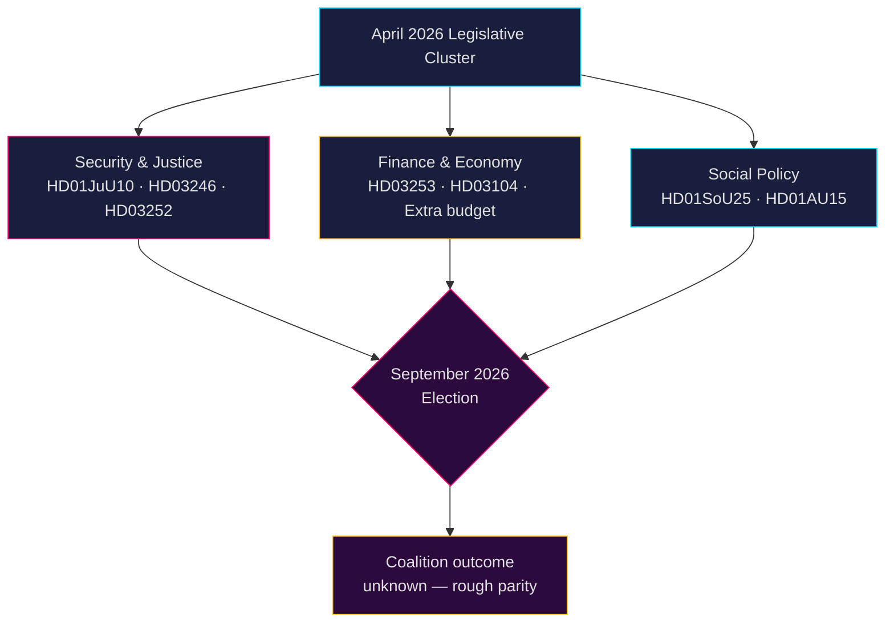

<!-- dir: rtl -->
# الاستخبارات السياسية السويدية: التوقعات الشهرية — مايو–يونيو 2026

**المؤلف**: James Pether Sörling  
**التاريخ**: 2026-04-26  
**التصنيف**: عام — تطبيق المادة 9(2)(e,g) من اللائحة الأوروبية لحماية البيانات  
**مستوى الثقة**: B2 (مصدر موثوق، صحيح على الأرجح)  
**عمق التحليل**: معياري  

---

## 🎯 الموجز التنفيذي

يدخل الريكسداج في مايو–يونيو 2026 مرحلة التسارع التشريعي الأخيرة قبل **الانتخابات العامة في سبتمبر 2026**، حيث تدفع حكومة تيدو (M-SD-KD-L) بحزمة كثيفة في مجالات الأمن والعدالة والمالية. تهيمن على هذه الفترة: (1) قانون أسلحة جديد يحظر البنادق شبه الأوتوماتيكية (HD01JuU10)؛ (2) تشديد قانون العقوبات من خلال إصلاح أحكام الأحداث (HD03246) وقيود الإعانات الاجتماعية للسجناء (HD03252)؛ (3) تنفيذ الحزمة المصرفية الأوروبية (HD03253)؛ و(4) تحديات المعارضة الحادة بشأن خفض ضرائب الوقود، التوظيف الشرطي، وتراجع الرعاية الاجتماعية. **الخطر الرئيسي هو الإجهاد التشريعي مقترناً بتعبئة المعارضة الانتخابية ضد روايات الأمن "الصارمة لكن الجوفاء" قبيل سبتمبر 2026.**

---

## 🧭 ثلاثة قرارات يدعمها هذا الإحاطة

1. **أولوية المراقبة**: متابعة جميع مشاريع قوانين Justitieutskottet (JuU) الأربعة — HD01JuU10 (قانون الأسلحة الجديد)، HD01JuU31 (إصلاح الشرطة)، HD03246 (جرائم الأحداث)، وHD03252 (مزايا السجناء) — باعتبارها أوضح مؤشرات على قدرة الائتلاف في توصيل رسالة القانون والنظام قبل موسم الانتخابات.

2. **تقييم المخاطر**: يشير تصاعد استجوابات المعارضة بقيادة حزب S حول تخفيضات اشتراكات أصحاب العمل (HD10444) وتكاليف الإجازات المرضية (HD10447) والإعلانات الخاطئة عن الوفاة (HD10446) إلى حملة انتخابية مسبقة منسقة من قِبل الاشتراكيين الديمقراطيين تستهدف الإخفاقات الإدارية والاجتماعية. رصد الأضرار السياسية المحتملة لوزيرة المالية Svantesson.

3. **مراقبة الائتلاف**: يواجه ميزانية التعديل الإضافية (الاقتراح 2025/26:236 — خفض ضريبة الوقود) معارضة نشطة من MP وV (HD024098، HD024092). الخلاف المالي عبر الأحزاب بين KD/L (المخاوف البيئية) وSD/M (أولوية تكاليف المعيشة) يُنشئ اختباراً محتملاً لتماسك الائتلاف.

---

## القراءة الاستخباراتية في 60 ثانية

- **4 تقارير لجنة JuU كبرى** تم تمريرها أو قيد الانتظار في أبريل 2026 — أكبر تجمع لإصلاحات العدالة في هذا الريكسموته
- **276 اقتراحاً** مقدماً في 2025/26 (الأعلى في التاريخ البرلماني الحديث)
- **448 استجواباً** — المعارضة نشطة إلى أقصى حد، 90 % من S وV قبل الانتخابات
- **ميزانية تعديل إضافية** لعام 2026 (ضريبة الوقود) تُشعل ائتلاف معارضة واسع (MP+V+C+S)
- يحظر قانون الأسلحة الجديد بعض بنادق الصيد شبه الأوتوماتيكية — أول قيد من هذا النوع منذ التسعينيات، حساس سياسياً
- مراجعة إصلاح الشرطة (Riksrevisionen): الإصلاح **لم يحقق** مكاسب الكفاءة المستهدفة — ضار سياسياً للائتلاف
- توقعات الانتخابات: سبتمبر 2026، استطلاعات الرأي تظهر S+MP+V+C في تعادل تقريبي مع M+SD+KD+L؛ نتيجة الائتلاف غير مؤكدة للغاية

---

## ⚡ المحفز الاستباقي الرئيسي

**تاريخ المراقبة 2026-05-06**: نقاش الجلسة العامة للريكسداج حول ميزانية التعديل الإضافية (ضريبة الوقود، الاقتراح 2025/26:236). إذا خرق حزب SD الانضباط الحزبي في التصويت، فإن ائتلاف تيدو يواجه أشد انشقاقاته الداخلية منذ تأسيس الحكومة.

---

## 🔮 مستويات الثقة

| المجال | الثقة | المبرر |
|--------|-----------|-----------|
| التقويم التشريعي | A1 — موثوق جداً، مؤكد | جدول الريكسداج المنشور |
| استراتيجية المعارضة | B2 — موثوق، صحيح على الأرجح | تحليل أنماط الاستجوابات |
| توقعات الانتخابات | C3 — موثوق نسبياً، ربما صحيح | بيانات استطلاعات مع عدم يقين منهجي |
| تماسك الائتلاف | B3 — موثوق، ربما صحيح | تحليل التصويتات عبر الأحزاب |

