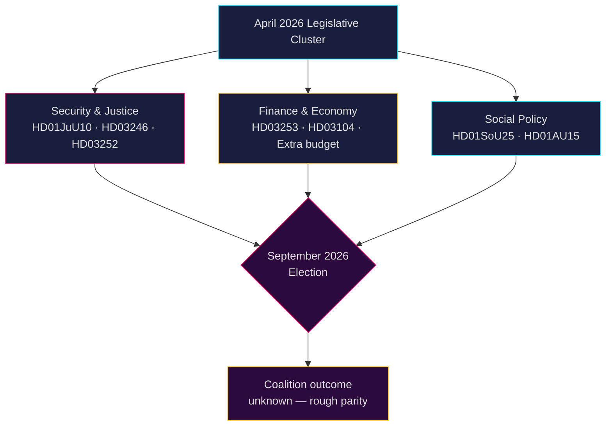

# Svensk politisk efterretning: Månedspreview — Maj–Juni 2026

**Forfatter**: James Pether Sörling  
**Dato**: 2026-04-26  
**Klassificering**: OFFENTLIG — GDPR Art. 9(2)(e,g) anvendt  
**Konfidensniveau**: B2 (pålidelig kilde, sandsynligvis sandt)  
**Analysedybde**: standard  

---

## 🎯 BLUF

Sveriges Riksdag træder ind i maj–juni 2026 i den endelige lovgivningsaccelerationsfase inden **valget i september 2026**, hvor Tidö-koalitionen (M-SD-KD-L) presser en tæt sikkerheds-, retsvæsens- og finanspakke igennem. Perioden domineres af: (1) en ny våbenlov med forbud mod halvautomatiske rifler (HD01JuU10); (2) strafferskærpelse via reform af ungdomsdomme (HD03246) og begrænsning af sociale ydelser til fanger (HD03252); (3) implementering af EU's bankpakke (HD03253); og (4) heftig oppositionskritik om brændstofafgiftslettelser, politibemanding og velfærdsnedskæringer. **Den overordnede risiko er lovgivningstæthed kombineret med oppositionens valgmobilisering mod opfattede "hårde men hule" sikkerhedsfortællinger frem mod september 2026.**

---

## 🧭 3 Beslutninger dette notat understøtter

1. **Overvågningsprioritet**: Følg alle fire Justitieutskottet (JuU) lovforslag — HD01JuU10 (ny våbenlov), HD01JuU31 (politireform), HD03246 (ungdomskriminalitet) og HD03252 (fangers ydelser) — som de klareste indikatorer for koalitionens kommunikationsevne vedrørende lov og orden inden valgsæsonen.

2. **Risikovurdering**: Eskalerende S-oppositions interpellationer om arbejdsgiverbidragslettelser (HD10444), sygedagpengeomkostninger (HD10447) og fejlagtige dødserklæringer (HD10446) signalerer en koordineret socialdemokratisk forvalgskampagne mod administrative fejl og velfærdsmangler. Hold øje med politiske skader for finansminister Svantesson.

3. **Koalitionsovervågning**: Den ekstra ændringsbudget (prop. 2025/26:236 — brændstofafgiftssænkning) møder aktiv opposition fra MP og V (HD024098, HD024092). Tværpolitisk finansiel uenighed mellem KD/L (miljøhensyn) og SD/M (leveomkostningsprioritet) skaber en potentiel koalitionskohærenstest.

---

## 60-sekunders efterretningslæsning

- **4 store JuU-betænkninger** vedtaget eller verserende i april 2026 — det største retsreformcluster i dette riksmöte
- **276 propositioner** indgivet i 2025/26 (højeste i nyere parlamentshistorie)
- **448 interpellationer** — oppositionen maksimalt aktiv, 90 % fra S og V forud for valget
- **Ekstra ændringsbudget** for 2026 (brændstofafgift) udløser tværoppositionel koalition (MP+V+C+S)
- Ny våbenlov forbyder visse halvautomatiske jagtrifler — første sådanne begrænsning siden 1990'erne, politisk følsom
- Politireformgennemgang (Riksrevisionen): reformen opnåede **ikke** de tilsigtede effektivitetsforbedringer — politisk skadeligt for koalitionen
- Valgprognose: september 2026, meningsmålinger viser S+MP+V+C i grov paritet med M+SD+KD+L; koalitionsresultat meget usikkert

---

## ⚡ Ledende fremadrettede trigger

**Overvågningsdato 2026-05-06**: Riksdag-kammersdebat om ekstra ændringsbudget (brændstofafgift, prop. 2025/26:236). Hvis SD bryder partidisciplinen i afstemningen, står Tidö-koalitionen over for sin mest alvorlige interne brud siden regeringsdannelsen.

---

## 🔮 Konfidensniveauer

| Domæne | Konfidens | Begrundelse |
|--------|-----------|-----------|
| Lovgivningskalender | A1 — meget pålidelig, bekræftet | Offentliggjort Riksdag-program |
| Oppositionsstrategi | B2 — pålidelig, sandsynligvis sandt | Interpellationsmønsteranalyse |
| Valgprognose | C3 — rimeligt pålidelig, muligvis sandt | Meningsmålingsdata med systematisk usikkerhed |
| Koalitionskohæsion | B3 — pålidelig, muligvis sandt | Tværpartiafstemningsanalyse |

