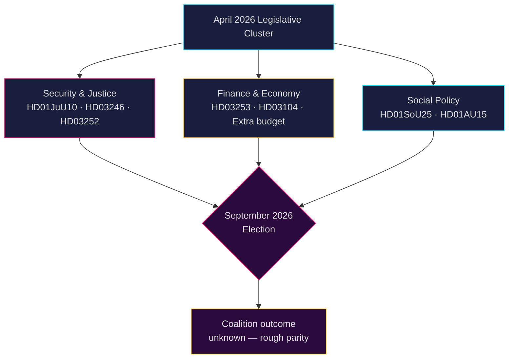

# Schwedische politische Nachrichtenlage: Monatsvorschau — Mai–Juni 2026

**Autor**: James Pether Sörling  
**Datum**: 2026-04-26  
**Klassifizierung**: ÖFFENTLICH — DSGVO Art. 9(2)(e,g) angewandt  
**Vertrauensgrad**: B2 (zuverlässige Quelle, wahrscheinlich wahr)  
**Analysetiefe**: Standard  

---

## 🎯 BLUF

Der Riksdag tritt im Mai–Juni 2026 in die abschließende Gesetzgebungsbeschleunigung vor der **Reichstagswahl im September 2026** ein, wobei die Tidö-Koalition (M-SD-KD-L) ein dichtes Sicherheits-, Justiz- und Finanzpaket durchsetzt. Die Periode wird dominiert von: (1) einem neuen Waffengesetz mit Verbot halbautomatischer Gewehre (HD01JuU10); (2) strafrechtlicher Verschärfung durch Jugendstrafenreform (HD03246) und Einschränkung von Sozialleistungen für Inhaftierte (HD03252); (3) Umsetzung des EU-Bankpakets (HD03253); und (4) heftigen Oppositionsherausforderungen zu Kraftstoffsteuersenkungen, Polizeipersonalbesetzung und Sozialabbau. **Das übergreifende Risiko ist gesetzgeberische Erschöpfung kombiniert mit der Wahlmobilisierung der Opposition gegen vermeintlich "harte aber hohle" Sicherheitsnarrative vor dem September 2026.**

---

## 🧭 3 Entscheidungen, die dieses Briefing unterstützt

1. **Überwachungspriorität**: Verfolgen Sie alle vier Justitieutskottet (JuU) Gesetzentwürfe — HD01JuU10 (neues Waffengesetz), HD01JuU31 (Polizeireform), HD03246 (Jugendkriminalität) und HD03252 (Gefangenenleistungen) — als deutlichste Indikatoren für die Botschaftskapazität der Koalition zu Recht und Ordnung vor der Wahlsaison.

2. **Risikobewertung**: Eskalierende S-Oppositionsinterpellationen zu Arbeitgeberbeitragssenkungen (HD10444), Krankheitskosten (HD10447) und fehlerhaften Todeserklärungen (HD10446) signalisieren eine koordinierte sozialdemokratische Vorwahlkampagne gegen administrative und wohlfahrtsbezogene Versäumnisse. Überwachen Sie mögliche politische Schäden für Finanzministerin Svantesson.

3. **Koalitionsbeobachtung**: Der Zusatz-Änderungshaushalt (Prop. 2025/26:236 — Kraftstoffsteuersenkung) trifft auf aktiven MP- und V-Widerstand (HD024098, HD024092). Parteienübergreifende fiskalpolitische Meinungsverschiedenheiten zwischen KD/L (Umweltbedenken) und SD/M (Lebenshaltungskostenprioritäten) schaffen einen potenziellen Koalitionskohärenztest.

---

## 60-Sekunden-Nachrichtenlage

- **4 wichtige JuU-Ausschussberichte** verabschiedet oder ausstehend im April 2026 — das größte Justizreformcluster dieser Riksmöte
- **276 Regierungsvorlagen** eingereicht 2025/26 (höchste in neuerer Parlamentsgeschichte)
- **448 Interpellationen** — Opposition maximal aktiv, 90 % von S und V vor der Wahl
- **Zusatz-Änderungshaushalt** für 2026 (Kraftstoffsteuer) löst eine breit aufgestellte Oppositionskoalition aus (MP+V+C+S)
- Neues Waffengesetz verbietet bestimmte halbautomatische Jagdgewehre — erste derartige Beschränkung seit den 1990er Jahren, politisch heikel
- Polizeireform-Überprüfung (Riksrevisionen): Reform erzielte **keine** beabsichtigten Effizienzgewinne — politisch schädlich für die Koalition
- Wahlprognose: September 2026, Umfragen zeigen S+MP+V+C in etwa gleichauf mit M+SD+KD+L; Koalitionsergebnis höchst ungewiss

---

## ⚡ Wichtigster Zukunfts-Auslöser

**Beobachtungsdatum 2026-05-06**: Reichstagsplenum zur Debatte über den Zusatz-Änderungshaushalt (Kraftstoffsteuer, Prop. 2025/26:236). Wenn SD bei der Abstimmung die Fraktionsdisziplin bricht, steht die Tidö-Koalition vor ihrer schwersten internen Spaltung seit der Regierungsbildung.

---

## 🔮 Vertrauensgrade

| Bereich | Vertrauen | Begründung |
|--------|-----------|-----------|
| Gesetzgebungskalender | A1 — sehr zuverlässig, bestätigt | Veröffentlichter Reichstagsplan |
| Oppositionsstrategie | B2 — zuverlässig, wahrscheinlich wahr | Interpellationsmusteranalyse |
| Wahlprognose | C3 — ziemlich zuverlässig, möglicherweise wahr | Umfragedaten mit systematischer Unsicherheit |
| Koalitionskohäsion | B3 — zuverlässig, möglicherweise wahr | Parteiübergreifende Abstimmungsanalyse |

