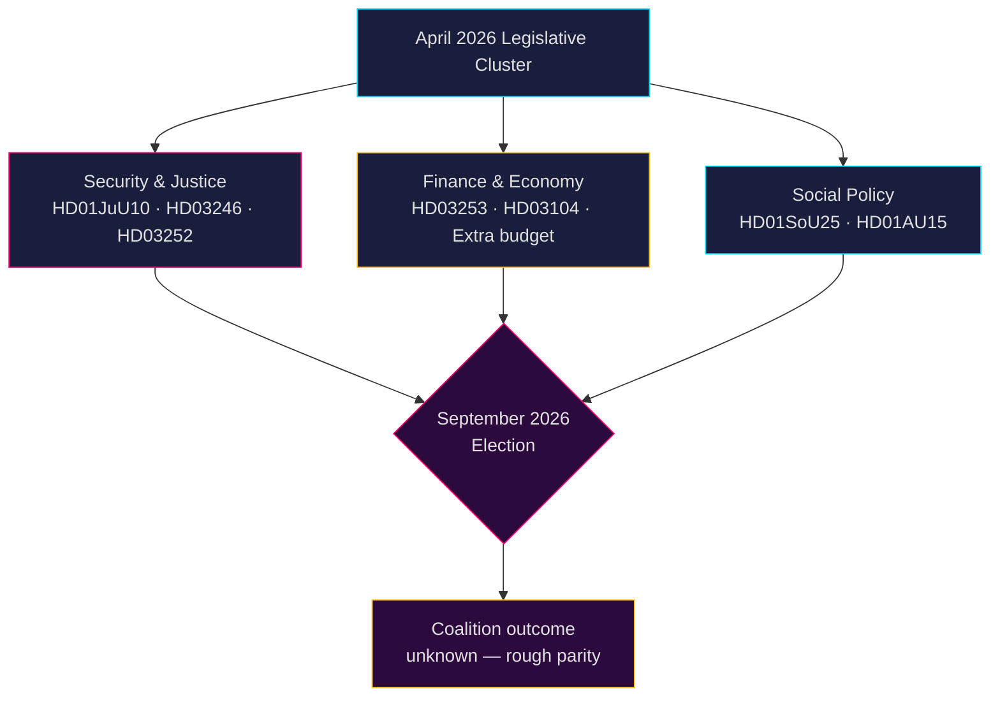

# Inteligencia política sueca: Perspectiva mensual — Mayo–Junio 2026

**Autor**: James Pether Sörling  
**Fecha**: 2026-04-26  
**Clasificación**: PÚBLICO — RGPD Art. 9(2)(e,g) aplicado  
**Nivel de confianza**: B2 (fuente fiable, probablemente cierto)  
**Profundidad de análisis**: estándar  

---

## 🎯 BLUF

El Riksdag entra en mayo–junio de 2026 en la aceleración legislativa final antes de las **elecciones generales de septiembre de 2026**, con la coalición Tidö (M-SD-KD-L) impulsando un denso paquete de seguridad, justicia y finanzas. El período está dominado por: (1) una nueva ley de armas que crea prohibiciones de rifles semiautomáticos (HD01JuU10); (2) endurecimiento de la justicia penal mediante la reforma de sentencias juveniles (HD03246) y restricciones de beneficios sociales para presos (HD03252); (3) implementación del paquete bancario de la UE (HD03253); y (4) acalorados desafíos de la oposición sobre recortes de impuestos al combustible, dotación policial y retrocesos en el bienestar social. **El riesgo principal es el agotamiento legislativo combinado con la movilización electoral de la oposición contra narrativas de seguridad percibidas como "duras pero huecas" de cara a septiembre de 2026.**

---

## 🧭 3 Decisiones que apoya este informe

1. **Prioridad de seguimiento**: Rastrear los cuatro proyectos de ley del Justitieutskottet (JuU) — HD01JuU10 (nueva ley de armas), HD01JuU31 (reforma policial), HD03246 (criminalidad juvenil) y HD03252 (beneficios de presos) — como los indicadores más claros de la capacidad de mensajería de la coalición sobre ley y orden antes de la temporada electoral.

2. **Evaluación de riesgos**: Las interpelaciones escaladas de la oposición S sobre recortes en las cotizaciones empresariales (HD10444), costes de bajas por enfermedad (HD10447) y declaraciones de defunción erróneas (HD10446) señalan una campaña preelectoral coordinada socialdemócrata que apunta a fallos administrativos y de bienestar. Supervisar posibles daños políticos para la ministra de Finanzas Svantesson.

3. **Vigilancia de la coalición**: El presupuesto suplementario de modificación (prop. 2025/26:236 — reducción del impuesto al combustible) enfrenta oposición activa de MP y V (HD024098, HD024092). El desacuerdo fiscal transpartidista entre KD/L (preocupación medioambiental) y SD/M (prioridad coste de vida) crea una prueba potencial de cohesión de la coalición.

---

## Informe de inteligencia en 60 segundos

- **4 grandes informes de la comisión JuU** aprobados o pendientes en abril de 2026 — el mayor grupo de reformas judiciales de este riksmöte
- **276 proposiciones** presentadas en 2025/26 (la más alta en la historia parlamentaria reciente)
- **448 interpelaciones** — oposición maximamente activa, 90 % de S y V antes de las elecciones
- **Presupuesto suplementario** para 2026 (impuesto al combustible) desencadena una coalición opositora amplia (MP+V+C+S)
- La nueva ley de armas prohíbe ciertos rifles de caza semiautomáticos — primera restricción de este tipo desde los años 90, políticamente delicada
- Revisión de la reforma policial (Riksrevisionen): la reforma **no** logró las ganancias de eficiencia previstas — políticamente dañino para la coalición
- Pronóstico electoral: septiembre de 2026, las encuestas muestran S+MP+V+C en paridad aproximada con M+SD+KD+L; resultado de coalición muy incierto

---

## ⚡ Detonante anticipatorio principal

**Fecha de vigilancia 2026-05-06**: Debate en el pleno del Riksdag sobre el presupuesto suplementario (impuesto al combustible, prop. 2025/26:236). Si SD rompe la disciplina de partido en la votación, la coalición Tidö se enfrenta a su fractura interna más grave desde la formación del gobierno.

---

## 🔮 Niveles de confianza

| Dominio | Confianza | Justificación |
|--------|-----------|-----------|
| Calendario legislativo | A1 — muy fiable, confirmado | Programa publicado del Riksdag |
| Estrategia de la oposición | B2 — fiable, probablemente cierto | Análisis de patrones de interpelaciones |
| Pronóstico electoral | C3 — bastante fiable, posiblemente cierto | Datos de encuestas con incertidumbre sistémica |
| Cohesión de la coalición | B3 — fiable, posiblemente cierto | Análisis de votaciones transpartidistas |

