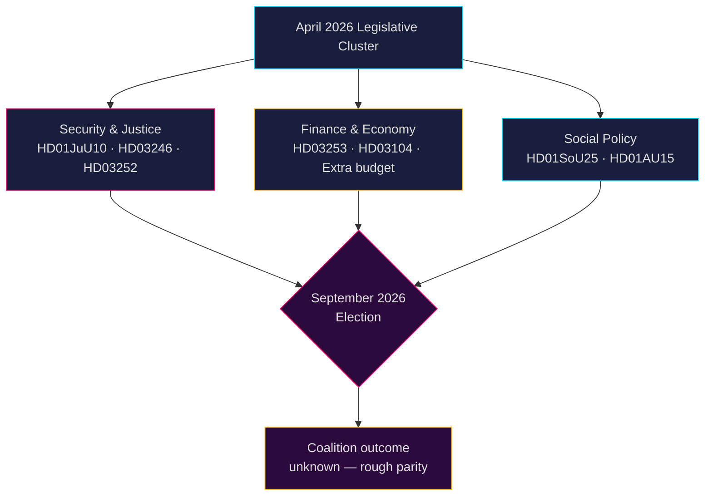

# Ruotsin poliittinen tiedustelutieto: Kuukauden ennuste — Toukokuu–Kesäkuu 2026

**Tekijä**: James Pether Sörling  
**Päivämäärä**: 2026-04-26  
**Luokitus**: JULKINEN — GDPR Art. 9(2)(e,g) sovellettu  
**Luotettavuus**: B2 (luotettava lähde, todennäköisesti totta)  
**Analyysin syvyys**: standardi  

---

## 🎯 BLUF

Ruotsin Riksdag siirtyy touko–kesäkuussa 2026 **syyskuun 2026 parlamenttivaalit** edeltävään lakiasäätämisen loppuvauhditusvaiheeseen, jossa Tidö-koalitio (M-SD-KD-L) ajaa läpi tiivistä turvallisuus-, oikeus- ja rahoituspakettia. Kausi hallitsevat: (1) uusi aselelaki, joka kieltää puoliautomaattiset kiväärit (HD01JuU10); (2) rikosoikeuden tiukennus nuorisoseuraamusuudistuksen (HD03246) ja vankilassa olevien sosiaaliturvan leikkausten (HD03252) kautta; (3) EU:n pankkipaketin toimeenpano (HD03253); ja (4) kiivaat oppositiohaasteet polttoaineveron leikkauksista, poliisin miehityksestä ja hyvinvoinnin supistuksista. **Suurin riski on lainsäädäntöväsymys yhdistettynä opposition vaaliaktivoitumiseen koalitiota vastaan, jonka turvallisuuskertomukset nähdään "kovana mutta onttoina" syyskuun 2026 edellä.**

---

## 🧭 3 Päätöstä, joita tämä tiedote tukee

1. **Seurantaprioriteetti**: Seuraa kaikkia neljää Justitieutskottet (JuU) lakiesitystä — HD01JuU10 (uusi aselelaki), HD01JuU31 (poliisiuudistus), HD03246 (nuorisorikollisuus) ja HD03252 (vankien etuudet) — selvimpinä indikaattoreina koalition lakijärjestysviestintäkyvystä ennen vaalikautta.

2. **Riskiarvio**: S-opposition kiihtyvät interpellaatiot työnantajamaksujen leikkauksista (HD10444), sairauspoissaolokustannuksista (HD10447) ja virheellisistä kuolinilmoituksista (HD10446) viestivät koordinoidusta sosiaalidemokraattisesta ennakkokampanjasta hallinnollisia hyvinvointivikoja vastaan. Seuraa mahdollisia poliittisia vahinkoja valtiovarainministeri Svantessonille.

3. **Koalitiomonitorointi**: Lisämuutosbudjetti (prop. 2025/26:236 — polttoaineveron alennus) kohtaa aktiivisen MP- ja V-opposition (HD024098, HD024092). Puolueiden välinen finanssipoliittinen erimielisyys KD/L:n (ympäristöhuoli) ja SD/M:n (elinkustannusprioriteetti) välillä luo potentiaalisen koalition yhteenkuuluvuustestin.

---

## 60 sekunnin tiedusteluraportti

- **4 suurta JuU-mietintöä** hyväksytty tai vireillä huhtikuussa 2026 — suurin oikeusreformiklusteri tässä riksmötessä
- **276 hallituksen esitystä** jätetty 2025/26 (korkein uudemman parlamentaarisen historian aikana)
- **448 interpellaatiota** — oppositio maksimaalisen aktiivinen, 90 % S:ltä ja V:ltä ennen vaaleja
- **Lisämuutosbudjetti** vuodelle 2026 (polttoainevero) laukaisee monioppositiokokouksen (MP+V+C+S)
- Uusi aselelaki kieltää tiettyjä puoliautomaattisia metsästyskiväärejä — ensimmäinen tällainen rajoitus sitten 1990-luvun, poliittisesti herkkä
- Poliisiuudistuksen arviointi (Riksrevisionen): uudistus **ei** saavuttanut tavoiteltuja tehokkuushyötyjä — poliittisesti vahingollinen koalitiolle
- Vaaliennuste: syyskuu 2026, mielipidemittaukset osoittavat S+MP+V+C suunnilleen tasavertaisessa asemassa M+SD+KD+L:n kanssa; koalition tulos erittäin epävarma

---

## ⚡ Johtava tulevaisuuslaukaisin

**Seurantapäivämäärä 2026-05-06**: Riksdagin täysistuntokeskustelu lisämuutosbudjetista (polttoainevero, prop. 2025/26:236). Jos SD rikkoo puoluedisipliinikurin äänestyksessä, Tidö-koalitio kohtaa vakavimman sisäisen halkeamansa hallituksen muodostamisen jälkeen.

---

## 🔮 Luotettavuus

| Alue | Luotettavuus | Perustelu |
|--------|-----------|-----------|
| Lainsäädäntökalenteri | A1 — erittäin luotettava, vahvistettu | Julkaistu Riksdag-ohjelma |
| Opposition strategia | B2 — luotettava, todennäköisesti totta | Interpellaatiomallien analyysi |
| Vaaliennuste | C3 — kohtuullisen luotettava, mahdollisesti totta | Mielipidemittausdata systemaattisella epävarmuudella |
| Koalition yhteenkuuluvuus | B3 — luotettava, mahdollisesti totta | Puolueiden välisten äänestystulosten analyysi |

