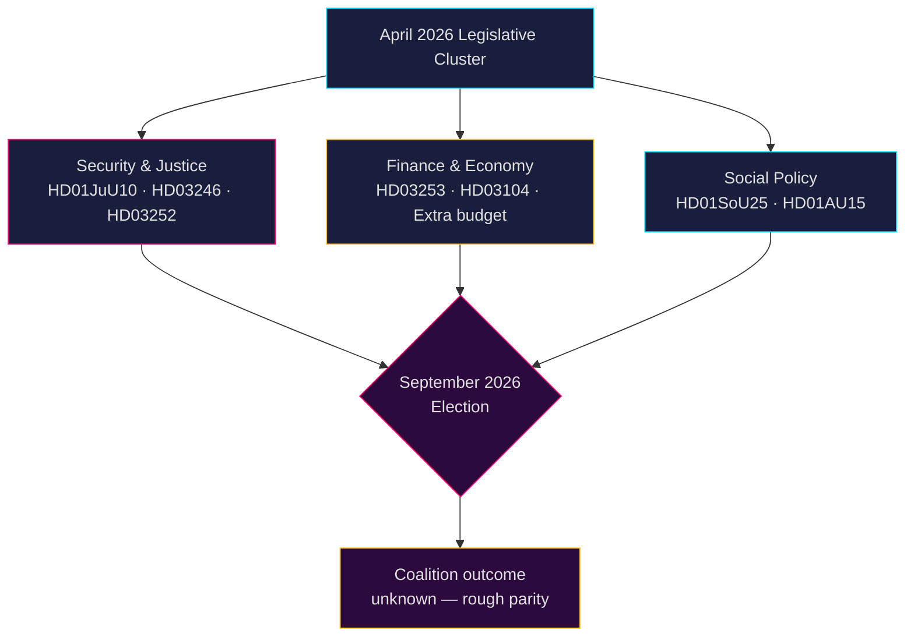

# Renseignement politique suédois : Prévisions mensuelles — Mai–Juin 2026

**Auteur** : James Pether Sörling  
**Date** : 2026-04-26  
**Classification** : PUBLIC — RGPD Art. 9(2)(e,g) appliqué  
**Niveau de confiance** : B2 (source fiable, probablement vrai)  
**Profondeur d'analyse** : standard  

---

## 🎯 BLUF

Le Riksdag entre en mai–juin 2026 dans la phase finale d'accélération législative avant les **élections générales de septembre 2026**, la coalition Tidö (M-SD-KD-L) faisant adopter un dense paquet sécuritaire, judiciaire et financier. La période est dominée par : (1) une nouvelle loi sur les armes instaurant l'interdiction des fusils semi-automatiques (HD01JuU10) ; (2) un durcissement de la justice pénale via la réforme des peines pour mineurs (HD03246) et la restriction des aides sociales aux détenus (HD03252) ; (3) la mise en œuvre du paquet bancaire européen (HD03253) ; et (4) de vives contestations de l'opposition sur les baisses de taxe carburant, les effectifs policiers et les coupes dans les aides sociales. **Le risque principal est la fatigue législative combinée à la mobilisation électorale de l'opposition contre des narratifs sécuritaires perçus comme "durs mais creux" à l'approche de septembre 2026.**

---

## 🧭 3 Décisions soutenues par ce briefing

1. **Priorité de surveillance** : Suivre les quatre propositions du Justitieutskottet (JuU) — HD01JuU10 (nouvelle loi sur les armes), HD01JuU31 (réforme policière), HD03246 (criminalité juvénile) et HD03252 (aides aux détenus) — comme indicateurs les plus clairs de la capacité de la coalition à porter un message loi-et-ordre avant la saison électorale.

2. **Évaluation des risques** : L'escalade des interpellations de l'opposition S sur les cotisations patronales (HD10444), les coûts des arrêts maladie (HD10447) et les déclarations de décès erronées (HD10446) signale une campagne présélectorale coordonnée des sociaux-démocrates ciblant les défaillances administratives et sociales. Surveiller les dommages politiques potentiels pour la ministre des Finances Svantesson.

3. **Surveillance de la coalition** : Le budget rectificatif supplémentaire (prop. 2025/26:236 — réduction de la taxe carburant) fait face à une opposition active des partis MP et V (HD024098, HD024092). Le désaccord fiscal transpartisan entre KD/L (préoccupations environnementales) et SD/M (priorité coût de la vie) crée un test potentiel de cohésion de la coalition.

---

## Lecture de renseignement en 60 secondes

- **4 grands rapports de commission JuU** adoptés ou en attente en avril 2026 — plus grand cluster de réformes judiciaires de cette session parlementaire
- **276 propositions gouvernementales** déposées en 2025/26 (le plus élevé de l'histoire parlementaire récente)
- **448 interpellations** — opposition au maximum de son activité, 90 % de S et V avant les élections
- **Budget rectificatif supplémentaire** pour 2026 (taxe carburant) déclenche une coalition d'opposition élargie (MP+V+C+S)
- La nouvelle loi sur les armes interdit certains fusils de chasse semi-automatiques — première restriction de ce type depuis les années 1990, politiquement sensible
- Examen de la réforme policière (Riksrevisionen) : la réforme **n'a pas** atteint les gains d'efficacité prévus — politiquement dommageable pour la coalition
- Prévision électorale : septembre 2026, les sondages montrent S+MP+V+C à quasi-parité avec M+SD+KD+L ; résultat de la coalition très incertain

---

## ⚡ Principal déclencheur prévisionnel

**Date de surveillance 2026-05-06** : Débat en séance plénière du Riksdag sur le budget rectificatif supplémentaire (taxe carburant, prop. 2025/26:236). Si SD rompt la discipline de vote, la coalition Tidö sera confrontée à sa plus grave fracture interne depuis la formation du gouvernement.

---

## 🔮 Niveaux de confiance

| Domaine | Confiance | Justification |
|--------|-----------|-----------|
| Calendrier législatif | A1 — très fiable, confirmé | Programme du Riksdag publié |
| Stratégie de l'opposition | B2 — fiable, probablement vrai | Analyse des schémas d'interpellations |
| Prévision électorale | C3 — assez fiable, possiblement vrai | Données de sondage avec incertitude systémique |
| Cohésion de la coalition | B3 — fiable, possiblement vrai | Analyse des votes transpartisans |

