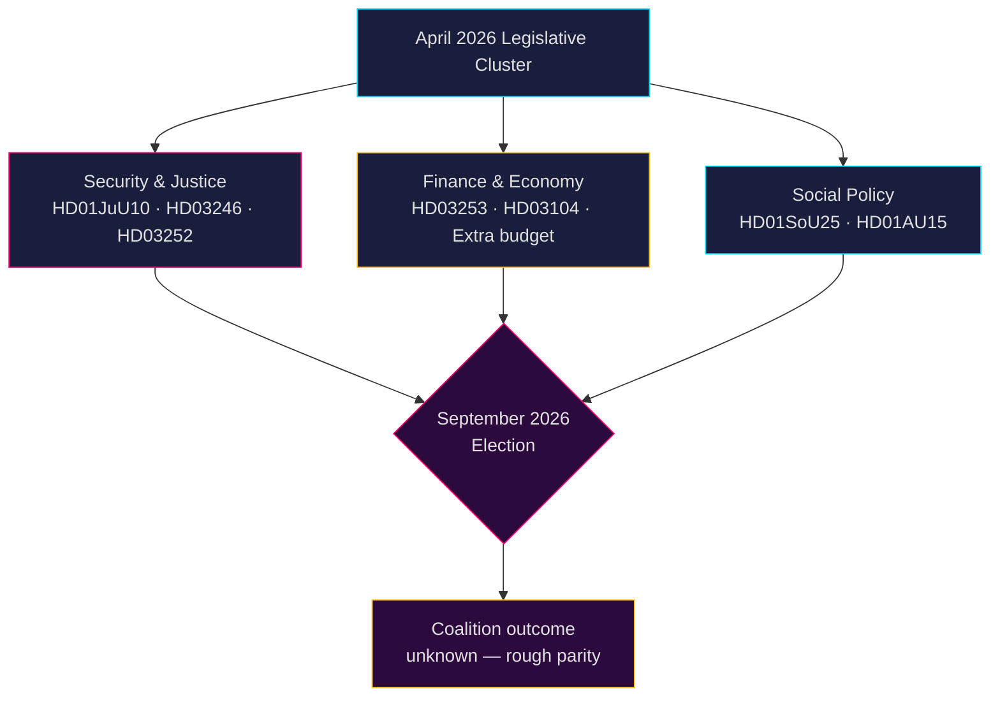

<!-- dir: rtl -->
# מודיעין פוליטי שוודי: תחזית חודשית — מאי–יוני 2026

**מחבר**: James Pether Sörling  
**תאריך**: 2026-04-26  
**סיווג**: ציבורי — GDPR סעיף 9(2)(e,g) מיושם  
**רמת אמינות**: B2 (מקור אמין, סביר שנכון)  
**עומק הניתוח**: סטנדרטי  

---

## 🎯 תמצית מנהלים

הריקסדאג נכנס במאי–יוני 2026 לשלב ההאצה החקיקתית האחרונה לפני **הבחירות הכלליות בספטמבר 2026**, כשקואליציית טידו (M-SD-KD-L) מקדמת חבילה צפופה בתחומי הביטחון, המשפט והכלכלה. התקופה מאופיינת על ידי: (1) חוק נשק חדש האוסר רובים חצי-אוטומטיים (HD01JuU10); (2) הקשחת דיני הפלילים באמצעות רפורמת עונשי הקטינים (HD03246) והגבלת קצבאות חברתיות לאסירים (HD03252); (3) יישום חבילת הבנקאות האירופית (HD03253); ו-(4) אתגרים חריפים מהאופוזיציה בנושא קיצוצי מס דלק, כוח אדם במשטרה ורסטרוקטורציה של הרווחה. **הסיכון המרכזי הוא עייפות חקיקתית בשילוב גיוס בחירות של האופוזיציה כנגד נרטיבים ביטחוניים הנתפסים כ"קשים אך חלולים" לקראת ספטמבר 2026.**

---

## 🧭 3 החלטות שתדריך זה תומך בהן

1. **עדיפות מעקב**: מעקב אחר ארבעת הצעות החוק של Justitieutskottet (JuU) — HD01JuU10 (חוק נשק חדש), HD01JuU31 (רפורמת המשטרה), HD03246 (עבריינות נוער), ו-HD03252 (קצבאות אסירים) — כמדדים הברורים ביותר לכושר הקואליציה להעביר מסרי חוק וסדר לקראת עונת הבחירות.

2. **הערכת סיכונים**: שאלות הבהרה מתגברות מהאופוזיציה S בנושא הורדת דמי ביטוח לאומי (HD10444), עלויות חופשת מחלה (HD10447) והצהרות פטירה שגויות (HD10446) מסמלות מסע קמפיין ספטמבר מתואם מצד הסוציאל-דמוקרטים המכוון לכשלים מינהליים ורווחתיים. מעקב אחר נזקים פוליטיים אפשריים לשרת האוצר סוואנטסון.

3. **מעקב אחר הקואליציה**: תקציב השינוי הנוסף (הצעה 2025/26:236 — הפחתת מס דלק) נתקל בהתנגדות פעילה מMP ו-V (HD024098, HD024092). חוסר הסכמה פיסקלית בין-מפלגתי בין KD/L (חששות סביבתיים) ל-SD/M (עדיפות יוקר המחיה) יוצרת מבחן פוטנציאלי לאחדות הקואליציה.

---

## קריאת מודיעין של 60 שניות

- **4 דוחות ועדה גדולים של JuU** אושרו או ממתינים באפריל 2026 — האשכול הגדול ביותר של רפורמות משפטיות בריקסמוטה הזה
- **276 הצעות חוק** הוגשו ב-2025/26 (גבוה ביותר בהיסטוריה הפרלמנטרית האחרונה)
- **448 שאלות הבהרה** — האופוזיציה פעילה ברמה מקסימלית, 90% מS ו-V לפני הבחירות
- **תקציב שינוי נוסף** ל-2026 (מס דלק) מעורר קואליציה רחבה של אופוזיציה (MP+V+C+S)
- חוק הנשק החדש אוסר ציידי רובים חצי-אוטומטיים מסוימים — ההגבלה הראשונה מסוג זה מאז שנות ה-90, רגישה פוליטית
- סקירת רפורמת המשטרה (Riksrevisionen): הרפורמה **לא** השיגה רווחי יעילות מכוונים — מזיק פוליטית לקואליציה
- תחזית בחירות: ספטמבר 2026, סקרים מראים S+MP+V+C בשוויון גס עם M+SD+KD+L; תוצאת קואליציה אינה ודאית ביותר

---

## ⚡ הטריגר המוביל לעתיד

**תאריך מעקב 2026-05-06**: דיון המליאה בריקסדאג על תקציב השינוי הנוסף (מס דלק, הצעה 2025/26:236). אם SD תשבור את המשמעת המפלגתית בהצבעה, קואליציית טידו תתמודד עם השסע הפנימי החמור ביותר שלה מאז הרכבת הממשלה.

---

## 🔮 רמות אמינות

| תחום | אמינות | הסבר |
|--------|-----------|-----------|
| לוח זמנים חקיקתי | A1 — אמין מאוד, מאושר | לוח זמנים מפורסם של הריקסדאג |
| אסטרטגיית האופוזיציה | B2 — אמין, סביר שנכון | ניתוח דפוסי שאלות ההבהרה |
| תחזית בחירות | C3 — סביר לאמינות, אפשרי שנכון | נתוני סקרים עם אי-ודאות שיטתית |
| אחדות הקואליציה | B3 — אמין, אפשרי שנכון | ניתוח הצבעות בין-מפלגתיות |

