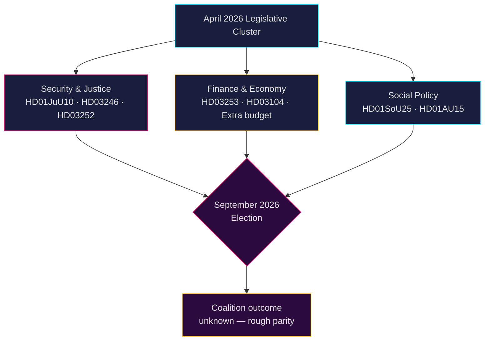

# スウェーデン政治インテリジェンス：月次展望 — 2026年5月〜6月

**著者**：James Pether Sörling  
**日付**：2026-04-26  
**分類**：公開 — GDPR第9条(2)(e,g)適用  
**信頼度**：B2（信頼できる情報源、おそらく真実）  
**分析の深さ**：標準  

---

## 🎯 要旨（BLUF）

リクスダーグ（スウェーデン国会）は2026年5月〜6月、**2026年9月の総選挙**を前に最終的な立法加速段階に入る。ティドー連立政権（M-SD-KD-L）は安全保障・司法・財政に関する密度の高いパッケージを推し進めている。この時期の主な焦点は：(1) 半自動小銃禁止を含む新武器法（HD01JuU10）；(2) 少年犯罪判決改革（HD03246）と受刑者の社会的給付制限（HD03252）による刑事司法の強化；(3) EU銀行規制パッケージの実施（HD03253）；(4) 燃料税減税・警察人員配置・社会保障縮小に関する激しい野党の挑戦。**最大のリスクは、2026年9月を前に「厳しいが中身の薄い」安全保障ナラティブに対する野党の選挙動員と組み合わさった立法疲弊である。**

---

## 🧭 このブリーフィングが支援する3つの意思決定

1. **優先監視事項**：Justitieutskottet（JuU）の4つの法案 — HD01JuU10（新武器法）、HD01JuU31（警察改革）、HD03246（少年犯罪）、HD03252（受刑者給付）— を、選挙シーズンに向けた連立政権の治安メッセージ力を示す最も明確な指標として追跡する。

2. **リスク評価**：雇用者拠出金減税（HD10444）・病欠費用（HD10447）・誤った死亡宣告（HD10446）に関するS党野党の質問状の増加は、行政と福祉の欠陥を標的にした社会民主党の組織的な選挙前キャンペーンを示唆している。財務大臣スヴァンテッソンへの政治的損害を注視すること。

3. **連立監視**：追加補正予算（提案2025/26:236 — 燃料税引き下げ）はMP・Vから積極的な反対に直面している（HD024098、HD024092）。KD/L（環境懸念）とSD/M（生活費優先）の財政的意見対立は連立結束の試練となりうる。

---

## 60秒インテリジェンス要約

- **JuU委員会報告4件**が2026年4月に採択または審査中 — 本議会会期最大の司法改革クラスター
- **276件の政府提案**が2025/26会期に提出（近代議会史上最多）
- **448件の質問状** — 野党は最大限活動的、選挙前のS・Vからが90%
- 2026年補正予算（燃料税）が広範な野党連合（MP+V+C+S）を引き起こす
- 新武器法は特定の半自動ハンティングライフルを禁止 — 1990年代以来初の規制、政治的に敏感
- 警察改革の評価（Riksrevisionen）：改革は意図した効率化を**達成しなかった** — 連立政権に政治的打撃
- 選挙予測：2026年9月、世論調査ではS+MP+V+CとM+SD+KD+Lがほぼ拮抗；連立の結果は非常に不確実

---

## ⚡ 主要な先行トリガー

**監視日2026-05-06**：リクスダーグ本会議での補正予算（燃料税、提案2025/26:236）審議。SDが投票で党規律を破れば、ティドー連立は政権発足以来最も深刻な内部亀裂に直面する。

---

## 🔮 信頼度評価

| 分野 | 信頼度 | 根拠 |
|--------|-----------|-----------|
| 立法日程 | A1 — 非常に信頼性が高い、確認済み | リクスダーグの公式スケジュール |
| 野党戦略 | B2 — 信頼性が高い、おそらく真実 | 質問状パターン分析 |
| 選挙予測 | C3 — ある程度信頼性が高い、おそらく真実 | 体系的不確実性を含む世論調査データ |
| 連立結束 | B3 — 信頼性が高い、おそらく真実 | 政党横断投票分析 |

