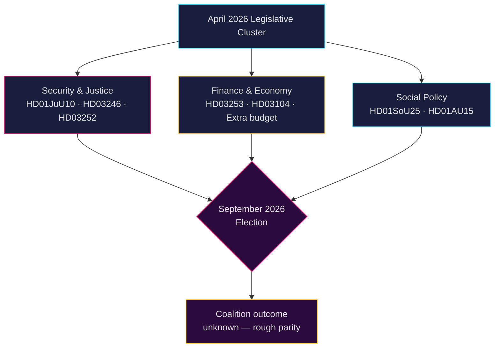

# 스웨덴 정치 인텔리전스: 월간 전망 — 2026년 5월–6월

**저자**: James Pether Sörling  
**날짜**: 2026-04-26  
**분류**: 공개 — GDPR 제9조(2)(e,g) 적용  
**신뢰도**: B2 (신뢰할 수 있는 출처, 아마도 사실)  
**분석 깊이**: 표준  

---

## 🎯 핵심 요약(BLUF)

릭스다그(스웨덴 국회)는 2026년 5월–6월 **2026년 9월 총선** 전 최종 입법 가속 단계에 들어선다. 티도 연립정부(M-SD-KD-L)는 안보, 사법, 재정 분야의 조밀한 패키지를 밀어붙이고 있다. 이 기간은 다음으로 지배된다: (1) 반자동 소총 금지를 도입하는 새로운 무기법(HD01JuU10); (2) 청소년 형량 개혁(HD03246)과 수감자 사회급여 제한(HD03252)을 통한 형사사법 강화; (3) EU 은행 패키지 시행(HD03253); (4) 연료세 감면, 경찰 인력 배치, 복지 축소에 대한 격렬한 야당 도전. **핵심 리스크는 2026년 9월을 앞두고 "강경하지만 공허한" 안보 내러티브에 대한 야당의 선거 동원과 결합된 입법 피로감이다.**

---

## 🧭 이 브리핑이 지원하는 3가지 결정

1. **감시 우선순위**: Justitieutskottet(JuU)의 4개 법안 — HD01JuU10(새 무기법), HD01JuU31(경찰 개혁), HD03246(청소년 범죄), HD03252(수감자 급여) — 을 선거 시즌을 앞두고 연립의 법질서 메시징 역량의 가장 명확한 지표로 추적한다.

2. **위험 평가**: 고용주 분담금 삭감(HD10444), 병가 비용(HD10447), 잘못된 사망 신고(HD10446)에 관한 S당 야당 질문의 증가는 행정 및 복지 실패를 표적으로 한 사민당의 조직적인 선거 전 캠페인을 시사한다. 재무장관 스반테손에 대한 정치적 피해를 모니터링할 것.

3. **연립 감시**: 추가 변경 예산안(제안 2025/26:236 — 연료세 인하)이 MP와 V의 적극적인 반대에 직면해 있다(HD024098, HD024092). KD/L(환경 우려)과 SD/M(생활비 우선순위) 간의 교차 정당 재정 불일치는 연립 결속의 잠재적 시험이다.

---

## 60초 인텔리전스 브리핑

- 2026년 4월 **JuU 위원회 보고서 4건** 채택 또는 심사 중 — 이번 릭스모테 최대 사법 개혁 클러스터
- 2025/26 회기 **276건의 정부 제안** 제출(근대 의회 역사상 최다)
- **448건의 질문** — 야당 최대한 활발, 선거 전 S와 V가 90%
- 2026년 보충 예산(연료세)이 광범위한 야당 연합 촉발(MP+V+C+S)
- 새로운 무기법은 특정 반자동 사냥 소총 금지 — 1990년대 이후 첫 규제, 정치적으로 민감
- 경찰 개혁 검토(Riksrevisionen): 개혁이 의도한 효율성 향상 **달성하지 못함** — 연립에 정치적으로 불리
- 선거 전망: 2026년 9월, 여론조사에서 S+MP+V+C가 M+SD+KD+L과 대략 동등; 연립 결과 매우 불확실

---

## ⚡ 주요 선행 트리거

**감시일 2026-05-06**: 보충 예산(연료세, 제안 2025/26:236)에 대한 릭스다그 본회의 토론. SD가 투표에서 당 규율을 어기면 티도 연립은 정부 출범 이후 가장 심각한 내부 균열에 직면한다.

---

## 🔮 신뢰도 수준

| 영역 | 신뢰도 | 근거 |
|--------|-----------|-----------|
| 입법 일정 | A1 — 매우 신뢰, 확인됨 | 공개된 릭스다그 일정 |
| 야당 전략 | B2 — 신뢰, 아마도 사실 | 질의 패턴 분석 |
| 선거 전망 | C3 — 상당히 신뢰, 가능성 있음 | 체계적 불확실성이 있는 여론조사 데이터 |
| 연립 결속 | B3 — 신뢰, 가능성 있음 | 교차 정당 투표 분석 |

