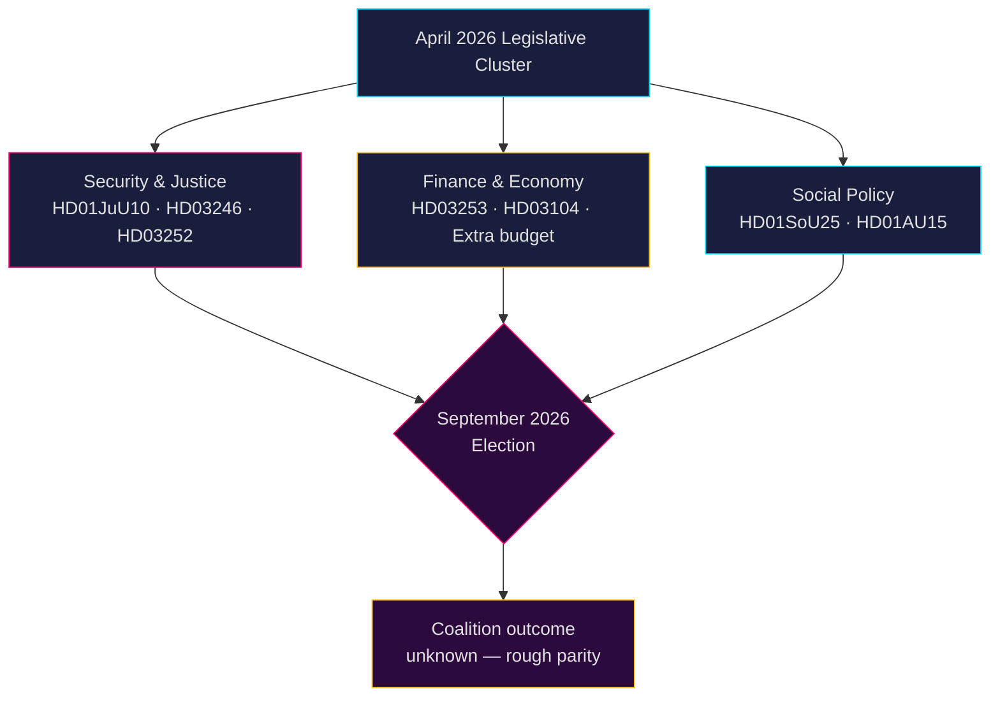

# Zweeds politiek inlichtingenrapport: Maandelijkse vooruitblik — Mei–Juni 2026

**Auteur**: James Pether Sörling  
**Datum**: 2026-04-26  
**Classificatie**: OPENBAAR — AVG Art. 9(2)(e,g) toegepast  
**Betrouwbaarheidsniveau**: B2 (betrouwbare bron, waarschijnlijk waar)  
**Analysediepte**: standaard  

---

## 🎯 BLUF

De Riksdag treedt in mei–juni 2026 de laatste wetgevingsversnelling in voor de **Zweedse verkiezingen in september 2026**, waarbij de Tidö-coalitie (M-SD-KD-L) een dicht pakket op het gebied van veiligheid, justitie en financiën doordruk. De periode wordt gedomineerd door: (1) een nieuwe wapenwet die halffabricatische geweerverboden creëert (HD01JuU10); (2) aanscherping van het strafrecht via hervorming van jeugdstraffen (HD03246) en beperking van sociale uitkeringen aan gevangenen (HD03252); (3) implementatie van het EU-bankenpakket (HD03253); en (4) verhitte oppositie-uitdagingen over bezuinigingen op brandstofheffingen, politiebezetting en welzijnsafbouw. **Het overkoepelende risico is wetgevingsmoeheid gecombineerd met electorale mobilisatie van de oppositie tegen vermeend "hard maar hol" veiligheidsnarratief richting september 2026.**

---

## 🧭 3 Beslissingen die dit briefing ondersteunt

1. **Monitoringsprioriteit**: Volg alle vier Justitieutskottet (JuU) wetsvoorstellen — HD01JuU10 (nieuwe wapenwet), HD01JuU31 (politiehervorming), HD03246 (jeugdcriminaliteit) en HD03252 (gevangenisuitkeringen) — als duidelijkste indicatoren voor de berichtgevingscapaciteit van de coalitie inzake wet en orde vóór het electorale seizoen.

2. **Risicobeoordeling**: Escalerende S-oppositie-interpellaties over werkgeverslasten (HD10444), ziekteverzuimkosten (HD10447) en onjuiste overlijdensverklaringen (HD10446) duiden op een gecoördineerde socialdemocratische voorverkiezingscampagne gericht op administratieve en welzijnsfouten. Monitor mogelijke politieke schade voor minister van Financiën Svantesson.

3. **Coalitietoezicht**: De aanvullende begroting (prop. 2025/26:236 — brandstofbelastingverlaging) krijgt actieve weerstand van MP en V (HD024098, HD024092). Partijoverschrijdende fiscale onenigheid tussen KD/L (milieuzorgen) en SD/M (levenshoudingkostenpriorititeit) creëert een potentiële coalitiecohesietest.

---

## 60 seconden inlichtingenlezing

- **4 grote JuU-commissierapporten** aangenomen of in behandeling in april 2026 — grootste justitiehervormingscluster in deze riksmöte
- **276 regeeringsvoorstellen** ingediend in 2025/26 (hoogste in recente parlementaire geschiedenis)
- **448 interpellaties** — oppositie maximaal actief, 90 % van S en V vóór de verkiezingen
- **Aanvullende begroting** voor 2026 (brandstofheffing) veroorzaakt brede oppositiecoalitie (MP+V+C+S)
- Nieuwe wapenwet verbiedt bepaalde halffabricatische jachtgeweren — eerste dergelijke beperking sinds de jaren '90, politiek gevoelig
- Beoordeling politiehervorming (Riksrevisionen): hervorming bereikte **niet** de beoogde efficiëntiewinsten — politiek schadelijk voor de coalitie
- Verkiezingsprognose: september 2026, peilingen tonen S+MP+V+C in globale pariteit met M+SD+KD+L; coalitieresultaat hoogst onzeker

---

## ⚡ Leidende toekomstige trigger

**Toezichtdatum 2026-05-06**: Plenair debat Riksdag over de aanvullende begroting (brandstofheffing, prop. 2025/26:236). Als SD de fractiediscipline bij de stemming breekt, staat de Tidö-coalitie voor zijn meest ernstige interne breuk seit de regeringsvorming.

---

## 🔮 Betrouwbaarheidsniveaus

| Domein | Betrouwbaarheid | Onderbouwing |
|--------|-----------|-----------|
| Wetgevingskalender | A1 — zeer betrouwbaar, bevestigd | Gepubliceerd Riksdag-programma |
| Oppositiestrategie | B2 — betrouwbaar, waarschijnlijk waar | Analyse van interpellatiepatronen |
| Verkiezingsprognose | C3 — redelijk betrouwbaar, mogelijk waar | Peillingsdata met systemische onzekerheid |
| Coalitiecohesie | B3 — betrouwbaar, mogelijk waar | Analyse van partijoverschrijdende stemmingen |

