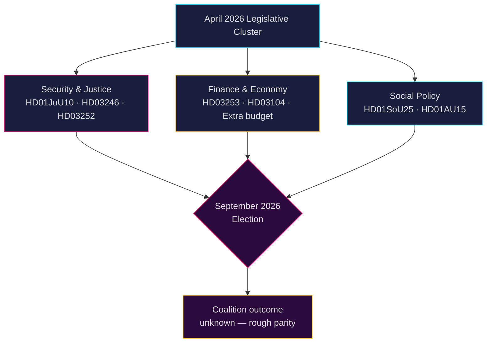

# Svensk politisk etterretning: Månedsoversikt — Mai–Juni 2026

**Forfatter**: James Pether Sörling  
**Dato**: 2026-04-26  
**Klassifisering**: OFFENTLIG — GDPR Art. 9(2)(e,g) anvendt  
**Konfidensnivå**: B2 (pålitelig kilde, sannsynligvis sant)  
**Analysedybde**: standard  

---

## 🎯 BLUF

Sveriges Riksdag går inn i mai–juni 2026 i en endelig lovgivningsakselerasjon før **stortingsvalget i september 2026**, der Tidö-koalisjonen (M-SD-KD-L) presser gjennom en tett sikkerhets-, justis- og finanspakke. Perioden domineres av: (1) en ny våpenlov som innfører forbud mot halvautomatiske rifler (HD01JuU10); (2) strafferettslig innstramming via reform av ungdomsstraff (HD03246) og begrensning av trygdeytelser til innsatte (HD03252); (3) implementering av EUs bankpakke (HD03253); og (4) heftig opposisjonskritikk om drivstoffavgiftkutt, politibemanning og velferdsnedskjæringer. **Den overordnede risikoen er lovgivningstretthet kombinert med opposisjonens valgmobilisering mot oppfattede "tøffe men hule" sikkerhetsfortellinger foran september 2026.**

---

## 🧭 3 Beslutninger dette notatet støtter

1. **Overvåkingsprioritet**: Følg alle fire Justitieutskottet (JuU) lovforslag — HD01JuU10 (ny våpenlov), HD01JuU31 (politireform), HD03246 (ungdomskriminalitet) og HD03252 (innsattes ytelser) — som de tydeligste indikatorene på koalisjonens kommunikasjonskapasitet om lov og orden inn mot valgsesongen.

2. **Risikovurdering**: Eskalerende S-opposisjonens interpellasjoner om arbeidsgiveravgiftslettelser (HD10444), sykelønnskostnader (HD10447) og feilaktige dødserklæringer (HD10446) signalerer en koordinert sosialdemokratisk forvalgskampanje mot administrative velferdssvikt. Overvåk mulig politisk skade for finansminister Svantesson.

3. **Koalisjonsovervåking**: Den ekstra endringsbudsjettet (prop. 2025/26:236 — drivstoffavgiftskutt) møter aktiv opposisjon fra MP og V (HD024098, HD024092). Tverrpolitisk finansiell uenighet mellom KD/L (miljøhensyn) og SD/M (levekostnadsprioritet) skaper en potensiell koalisjonskohesjonstest.

---

## 60-sekunders etterretningslesning

- **4 store JuU-innstillinger** vedtatt eller under behandling i april 2026 — det største justisreformklyngen i dette riksmöte
- **276 proposisjoner** levert 2025/26 (høyeste i nyere parlamentshistorie)
- **448 interpellasjoner** — opposisjonen maksimalt aktiv, 90 % fra S og V foran valget
- **Ekstra endringsbudsjett** for 2026 (drivstoffavgift) utløser tverroppossionel koalisjon (MP+V+C+S)
- Ny våpenlov forbyr visse halvautomatiske jaktvåpen — første slik begrensning siden 1990-tallet, politisk følsom
- Gjennomgang av politireformen (Riksrevisionen): reformen oppnådde **ikke** de tiltenkte effektivitetsgevinstene — politisk skadelig for koalisjonen
- Valgprognose: september 2026, meningsmålinger viser S+MP+V+C i grovt paritet med M+SD+KD+L; koalisjonsutfall meget usikkert

---

## ⚡ Ledende fremtidsrettet trigger

**Overvåkingsdato 2026-05-06**: Riksdag-kammerdebatt om ekstra endringsbudsjett (drivstoffavgift, prop. 2025/26:236). Hvis SD bryter partidisiplinen i avstemningen, står Tidö-koalisjonen overfor sin mest alvorlige interne sprekk siden regjeringsdannelsen.

---

## 🔮 Konfidensnivåer

| Domene | Konfidens | Begrunnelse |
|--------|-----------|-----------|
| Lovgivningskalender | A1 — svært pålitelig, bekreftet | Publisert Riksdag-program |
| Opposisjonsstrategi | B2 — pålitelig, sannsynligvis sant | Interpellasjonsmønsteranalyse |
| Valgprognose | C3 — rimelig pålitelig, muligens sant | Meningsmålingsdata med systematisk usikkerhet |
| Koalisjonskohesjons | B3 — pålitelig, muligens sant | Tverrpartiavstemningsanalyse |

